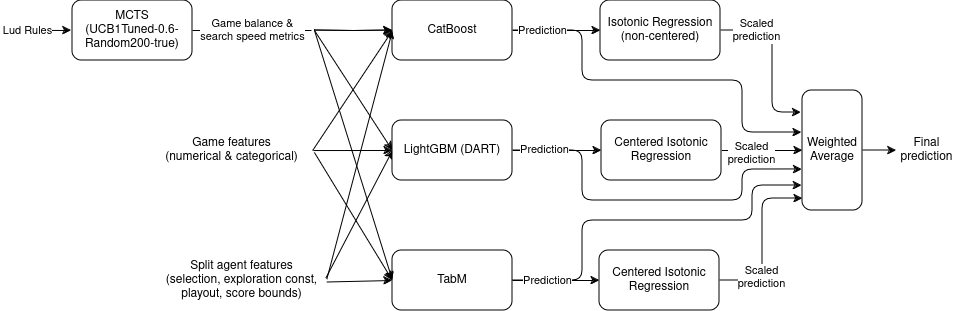
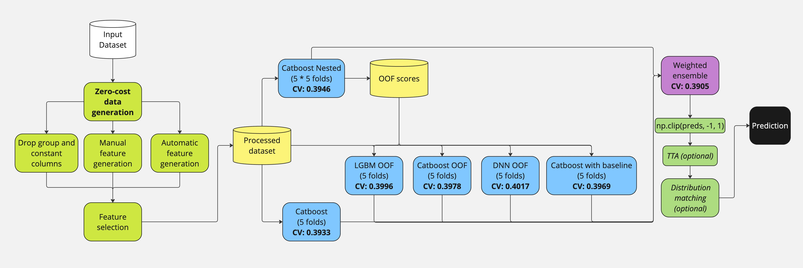

# UM - Game-Playing Strength of MCTS Variants 轻量深读（Tier B）

> 赛事：Research（Maastricht University，5 万 USD）｜ 主题 tabular ｜ 1608 队 ｜ 代码赛 ｜ 指标：MSE（选手普遍报 RMSE ≈0.41）
> 材料基础：`digests/um-game-playing-strength-of-mcts-variants.md`（6 篇正文：1st 549801 / 6th 549582 / 7th 549617 / 3rd 549588 / 5th 549585 / 洞察帖 534634；80 条主题索引）+ 9 张图
> 轻读时间：2026-10（Tier B B04）

## 1. 一句话重述与数字账

用表格特征预测"某 MCTS 变体在某棋类游戏中的对局强度"（RMSE）。真正的考点是**双向对称性数据增强（flip）+ 分组 CV + GBDT 集成 + 预测分布后处理**；1st 靠"起始局面树搜索特征"另辟蹊径。

| 关键数字 | 值 | 来源 |
| --- | --- | --- |
| 1st（95 票） | **起始局面 MCTS 树搜索（UCB1Tuned-0.6-Random200-true）**生成平衡度/搜索速度特征：+0.045 CV、+0.012 LB（早期直接登顶公榜）；额外训练数据 14,365 行/484 规则集（GAVEL 391 + LLM 93，LLM 约 95% 被丢弃）：+0.004 CV / +0.001–0.002 LB；增强（树搜索特征×10、非确定特征×5）：+0.002；剔除 43 个版本不一致特征：+0.001–0.002；**等渗回归后处理：+0.002**；TabM 为 CV 最强单模；LGB 设 dart：+0.004 CV / +0.003 LB；每块=10 折×2 seed=20 模型。**"Trust CV" (0.3442/0.4137/0.4178) 双榜击败 "Trust LB" (0.3554/0.4142/0.4190)**；自认漏掉 flip 增强，混合方案或可达私榜 ~0.407 | 1st |
| 6th（53 票） | **零成本数据生成**：交换 agent1/agent2 + 反转 target + 反转 AdvantageP1（并反转 Balance 才把 OOF 误差缺口补平，见图 3）；CV = GroupKFold(GameRulesetName) + 按目标分层 + agent1 分层；手工特征（agent 串拆分 + top 特征比值/乘积）；两阶段模型 + 加权集成；TTA 可选 +0.001–0.002（未用于最终） | 6th |
| 3rd（68 票） | flip 增强 + **StratifiedGroupKFold(GameRulesetName) + 少数类邻接修正**；EnglishRules 的 TF-IDF-SVD；null importance 特征选择；**两阶段：一阶段在翻转数据上训练 → 对原始训练集出 OOF 作为二阶段特征**；LGB+CatBoost ×3 seed；**后处理乘 1.12：+0.002** | 3rd |
| 7th | flip 增强 +0.01 LB；top-20 数值特征手工交叉（乘/除）持续增益、超过 20 组反而伤 LB；target encode +0.001 LB；深树 + 高正则；**LGB dart 提 CV 却伤 LB**；LGB 单模 LB 0.419/PB 0.425；LGB+NN(1:0.75) → LB 0.416/PB 0.423 | 7th |
| 5th（56 票） | CatBoost SGK 10 折 + flip 增强 + 推理端翻转均值 TTA（OOF 0.4059→0.4030；LB 0.421/0.427）；只用"调整后的 advantage"派生特征；另一人 DeepTables NN + LGB/CatBoost 堆叠 + TF-IDF | 5th |
| 洞察（94 票） | 换 seed 就能让 LB 动 0.002；10 折 vs 5 折无明显收益；700 特征 vs 200 特征 CV 几乎相同 → 有效信号只在一小部分列 | 534634 |

## 2. 逐方案对照矩阵

| 维度 | 1st | 6th | 3rd | 5th | 7th |
| --- | --- | --- | --- | --- | --- |
| 核心增益 | **树搜索元特征** | **零成本数据生成（含 Balance 反转）** | flip + 两阶段堆叠 | flip + TTA | flip + 交叉特征 |
| CV | GroupKFoldShuffle（规则集） | GKF + 目标/agent1 分层 | StratifiedGKF + 类邻接 | GKF 10 折 | GKF(Game) + 分层 |
| 模型 | CatBoost/LGB/TabM + 等渗 | 5 种 GBDT/NN 加权集成 | LGB+CatBoost 两阶段 | CatBoost / DeepTables+GBDT | LGB+NN |
| 文本列 | 放弃 | 放弃 | TF-IDF-SVD | TF-IDF（队友） | 放弃 |
| 后处理 | 等渗回归 (+0.002) | clip + 分布匹配（可选） | ×1.12 (+0.002) | clip | a·x+b |
| 私榜 RMSE | 0.4178 | ~0.39x（CV 0.3905） | — | 0.427 | 0.423 |

## 3. 共识、分歧与裁决

### 共识一：flip 对称增强是本赛的公共增量（4/5 队）

交换 agent1↔agent2、目标取反、AdvantageP1 取反；6th 进一步发现**必须同时反转 Balance** 才能把"原始/翻转 OOF 分数缺口"补平（图 3：0.397 vs 0.404 → 0.397 vs 0.398）。7th 测得 +0.01 LB；3rd/5th 把它做成两阶段/ TTA。**裁决**：任务本身具有 agent 对称性，把对称性编码进数据是零成本最大杠杆；且"缺口检测"（原/逆 OOF 差）是验证增强是否自洽的实用诊断。置信度：高（多队 + 6th 图证）。

### 共识二：CV 必须按游戏分组（全员），但分层细节各有做法

测试集由未见过的游戏组成（534634 明说），所以 GroupKFold(GameRulesetName) 是底线；6th 再加目标分层 + agent1 分层，3rd 加类邻接修正，7th 在 GKF(Game) 与 GKF(Ruleset) 间摇摆。**裁决**：分组维度的选择比折数更重要；CV 不稳时先审计"分组是否与评测一致"。置信度：高。

### 分歧一：Trust CV vs Trust LB

1st 的对照实验很罕见：**"Trust CV" 在公榜与私榜都击败 "Trust LB"**（0.4137/0.4178 vs 0.4142/0.4190）；而 7th 发现 dart 提 CV 伤 LB、最终按 LB 选模型。**裁决**：单点 LB 波动（换 seed ±0.002）意味着"按 LB 选模型"噪声极大；系统性 CV + 多 seed 复核更可复制。置信度：中高（两队结论相反，但 1st 做了双策略并行对照）。

### 分歧二：额外数据生成值不值得

1st 用 GAVEL+LLM 造 484 规则集（+0.004 CV、边际递减、标签噪声上升）；6th 用零成本翻转就补平缺口、认为自对弈"价值更低"；534634 观察更多数据（10 折）并不保证更好。**裁决**：先榨干零成本增强（flip/TTA），再考虑昂贵生成；生成数据的收益随规模递减且需降权。置信度：中高。

### 分歧三：文本列（LudRules/EnglishRules）

3rd/5th 用 TF-IDF(-SVD) 有小增益；1st/6th 尝试嵌入/语言模型均失败并列为"无效项"。**裁决**：规则文本的信号可被表格特征大部分覆盖，文本侧只留低成本 TF-IDF 即可。置信度：中。

### 共识三：后处理校准是稳定小增益（3/5 队）

1st 等渗回归 +0.002（centered 更好）；3rd ×1.12 +0.002；5th clip。**裁决**：预测分布与标签分布的偏移（公榜均值偏低）可用单调校准修正；OOF 拟合参数、clip 兜底。置信度：中高。

## 4. 证据分级

| 断言 | 等级 | 说明 |
| --- | --- | --- |
| 1st 的树搜索特征增益与 Trust CV/LB 对照 | 自述 + 图表 + 公开 notebook/代码 | 高 |
| 6th 的 Balance 反转补平缺口 | 自述 + 前后对照图（图 3） | 高 |
| flip 增强的 LB 增益量级 | 多队自述（0.002–0.01 不等） | 中高（口径不一致） |
| 3rd 的 ×1.12 后处理 +0.002 | 自述 + 公开 notebook | 中高 |
| 7th 的 cross-feature 与 dart 结论 | 自述（单队） | 中 |
| 文本列无效 | 1st/6th 自述失败 vs 3rd/5th 小增益 | 中（结论依赖实现） |

## 5. 悬案与缺口（登记）

- 2nd 与 4th 的方案未入库；1st 自称"混合 flip + 树搜索可达 ~0.407"只是估算，无人验证；
- "Best Single Model CV LB thread"（532617，68 票）与"Generating Additional Training Data Offline"（533088，59 票）两条高票线未细读；
- 主办公开代码（Ludii）版本差异导致的 43 列不一致无法从材料中进一步核实；
- 树搜索特征的复现成本（30GB RAM 中 18GB 用于搜索）在普通机器上不可行——可复现性受限。

## 6. 图表证据

**图 1**（topic 549801）：1st 全管线——Lud Rules → MCTS(UCB1Tuned-0.6-Random200-true) 产出"game balance + search speed"特征 → CatBoost / LightGBM(DART) / TabM 三路基模型 → 各自等渗回归（CatBoost 用非 centered 版）→ 加权平均。

**图 2**（topic 549582）：6th 管线与逐块 CV——零成本数据生成/手工+自动特征/特征选择 → 5 折各类基模型（CatBoost 嵌套 5×5 = 0.3946、LGBM 0.3996、CatBoost 0.3978、DNN 0.4017、CatBoost+baseline 0.3969）→ 加权集成 CV 0.3905 → clip → TTA/分布匹配（可选）。

**图 3**（topic 549582）：关键诊断图——左：只反转 agent/Advantage 时，原始数据 RMSE 0.397 vs 翻转数据 0.404（有缺口）；右：**再反转 Balance 后变为 0.397 vs 0.398（缺口几乎闭合）**。这是"增强必须与任务对称性一致"的直接证据。

## 7. 出处

- 1st（95 票）：https://www.kaggle.com/competitions/um-game-playing-strength-of-mcts-variants/discussion/549801
- 6th（53 票）：https://www.kaggle.com/competitions/um-game-playing-strength-of-mcts-variants/discussion/549582
- 3rd（68 票）：https://www.kaggle.com/competitions/um-game-playing-strength-of-mcts-variants/discussion/549588
- 5th（56 票）：https://www.kaggle.com/competitions/um-game-playing-strength-of-mcts-variants/discussion/549585
- 7th（44 票）：https://www.kaggle.com/competitions/um-game-playing-strength-of-mcts-variants/discussion/549617
- 洞察（94 票）：https://www.kaggle.com/competitions/um-game-playing-strength-of-mcts-variants/discussion/534634
- 单模 CV/LB 线程（68 票）：https://www.kaggle.com/competitions/um-game-playing-strength-of-mcts-variants/discussion/532617
- 离线数据生成（59 票）：https://www.kaggle.com/competitions/um-game-playing-strength-of-mcts-variants/discussion/533088
