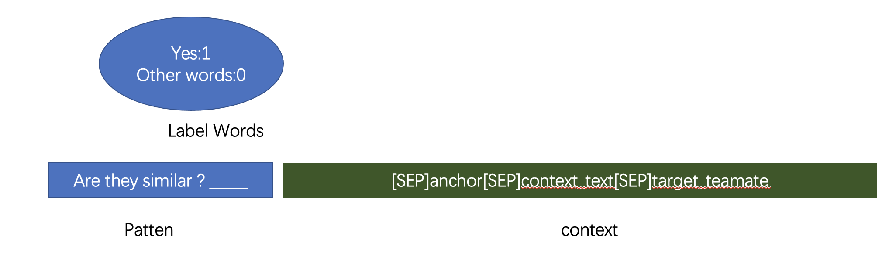

# US Patent Phrase to Phrase Matching 轻量深读（Tier B）

> 赛事：Featured ｜ 主题 nlp（短语相似度回归）｜ 1889 队 ｜ 代码赛 ｜ 指标：Pearson Correlation
> 材料基础：`digests/us-patent-phrase-to-phrase-matching.md`（8 篇正文：8th 332492 / 10th 332273 / 1st 332243 / 2nd 332234 / 5th prompt 332418 / 相关赛冠军 314320 / 代码被窃 337853 / context CSV 314306；80 条主题索引）+ 4 张图
> 轻读时间：2026-10（Tier B B03）

## 1. 一句话重述与数字账

判断专利短语对（anchor,target）的相似度（Pearson）。真正的考点是**"同一 anchor 下 targets 之间的相关性"这个结构性泄漏（magic）**：把同组 targets（甚至带 OOF 分数）拼进输入上下文，把 pairwise 任务变成"带近邻证据"的预测。

| 关键数字 | 值 | 来源 |
| --- | --- | --- |
| 1st（176 票） | CV：groupby anchor + 按分数分层（同词同折）；**targets groupby (anchor,context) 拼进输入（排除自身）**=金magic；再加 (anchor,sector=context[0]) 变体造多样性；Pearson loss；5 epochs + 第 2 轮起 AWP；冻结 BERT embedding；BI-LSTM + linear attention pooling；BERT 2e-5/其他 1e-3 双 LR；deberta-v3-large 单模 CV **0.8627**；集成 4×6 模型 → CV 0.8651/公 0.8618/私 **0.8745**；+LSTM 0.8775；+sector 模型 0.8782 | 1st |
| 2nd（154 票） | 同一 magic：stage1 拼同 anchor/同(a,c) targets；**stage2 把 OOF 分数（×100）拼进上下文**（训练用折内、推理 concat train+test）；FGM +0.002~0.005、EMA +0.001~0.003、KD 蒸馏；**BCE/MLM/后处理无效**；StratifiedGroupKFold(group=anchor, seed 42)；模型够多时 CV-LB 完全相关；线性回归定权 | 2nd |
| 5th（"prompt is all you need"） | PET 式 cloze：pattern "Are they similar? ___" + [SEP]anchor[SEP]context[SEP]target；以 YES 词 logits 当相似度、BCE 训练；比常规模型 **+0.005** | 5th |
| 8th | "Predicting Targets at Once Led Us to Gold"：一次预测同组所有 target（token 分类式） | 8th |
| 治理 | "有人偷我的代码拿了金牌"（337853，反作弊移除） | 主题索引 |

## 2. 逐方案对照矩阵

| 维度 | 1st | 2nd | 5th |
| --- | --- | --- | --- |
| 核心 | targets 上下文 + LSTM/attention | targets 上下文 + OOF 分数（两阶段） | prompt（YES logits） |
| 损失 | Pearson | （未明，BCE 无效） | BCE |
| 正则/训练 | AWP（第 2 轮起）、冻结 embedding、双 LR | FGM、EMA、KD | — |
| 多样性 | (anchor,sector) 变体、弱模型加宽 | OOF 分数、多骨干 | prompt vs 常规 |
| 集成 | 5 折+全量（×2）、minmax、加权 | 线性回归权重 | — |
| 结果 | 1st（私 0.8782 集成） | 2nd | 5th |

## 3. 共识、分歧与裁决

### 共识一："同组 targets 上下文"是本场的结构性 magic（1st/2nd/8th）

同一 anchor 的 targets 之间存在强相关（可类比标签间的相互解释）；1st/2nd 把同组 targets 拼进输入，8th 直接一次预测全部 target。**裁决**：pairwise 数据若存在"组内互证"，把它显式作为上下文能大幅超越纯 pair 建模；注意**排除当前 target**避免泄漏。置信度：高。

### 共识二：验证必须按 anchor 分组（1st/2nd）

1st 用 GroupKFold(anchor)+分层；2nd 用 StratifiedGroupKFold(anchor, seed 42) 并强调"groupkfold 与 kfold 的差距"就是 magic 的存在证据。**裁决**：不分组会让同 anchor 的 targets 跨折互证，CV 虚高。置信度：高。

### 共识三：AWP/FGM + EMA 是 NLP 赛的稳定小增益（1st/2nd）

1st：AWP 全赛有效；2nd：FGM +0.002~0.005、EMA +0.001~0.003。**裁决**：对抗权重扰动类方法在小数据 NLP 微调里性价比高。置信度：中高。

### 分歧一：损失与输出结构

1st：Pearson loss；5th：BCE on YES logits（prompt）；2nd：BCE 无效；8th：一次输出全 targets。**裁决**：回归指标优先用相关损失/有序输出（Pearson），BCE 非普适；prompt 法是等价重构（+0.005）。置信度：中高。

### 分歧二：多样性的来源

1st 用 (anchor,sector) 新分组与弱模型加宽；2nd 用 OOF 分数与 KD。**裁决**：同一 magic 的不同"信息粒度"（context→sector→带分数）能产生互补模型；多样性 > 单模精度。置信度：中高。

### 事件：代码被窃与反作弊

337853 帖：代码被窃并获金、疑似被 Kaggle 反作弊移除。**裁决**：公开 notebook 的许可/署名与团队诚信仍是生态问题；登记为治理事件。置信度：中（单帖）。

## 4. 证据分级

| 断言 | 等级 | 说明 |
| --- | --- | --- |
| 1st 的 magic/集成/分数 | 自述 + 代码 + 数据链接 | 中高 |
| 2nd 的 stage2/OOF 分数与增益 | 自述 + notebook | 中高 |
| prompt +0.005 | 自述 + 公开 notebook | 中 |
| context CSV/实验帖等 | 社区资源 | 中 |
| 代码被窃事件 | 单帖 | 中 |

## 5. 悬案与缺口（登记）

- 10th/相关赛冠军方案未细读；"Closing the CV-LB gap"（138 票）与超参帖（115 票）未入库。
- 2nd 的 OOF 分数拼接在推理期的泄漏边界（train+test concat）需更严格的合规分析。
- 8th 的 token 分类实现细节未读。

## 6. 图表证据

**图 1**（topic 332418）：pattern "Are they similar ? ___" + context "[SEP]anchor[SEP]context_text[SEP]target"；标签词 YES=1/其他=0，取 YES logits 作相似度。**把相似度回归重构为 cloze 的实例**。

## 7. 出处

- 8th（332492）：https://www.kaggle.com/competitions/us-patent-phrase-to-phrase-matching/discussion/332492
- 10th（332273）：https://www.kaggle.com/competitions/us-patent-phrase-to-phrase-matching/discussion/332273
- 1st（332243）：https://www.kaggle.com/competitions/us-patent-phrase-to-phrase-matching/discussion/332243
- 2nd（332234）：https://www.kaggle.com/competitions/us-patent-phrase-to-phrase-matching/discussion/332234
- 5th prompt（332418）：https://www.kaggle.com/competitions/us-patent-phrase-to-phrase-matching/discussion/332418
- 代码被窃（337853）：https://www.kaggle.com/competitions/us-patent-phrase-to-phrase-matching/discussion/337853
