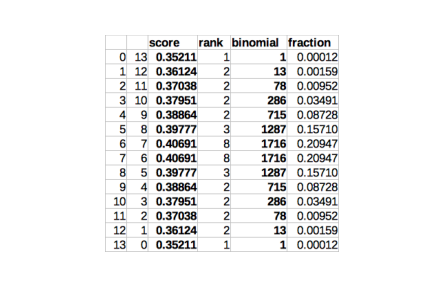

# Women's March Mania 2022 轻量深读（Tier B）

> 赛事：Featured ｜ 主题 tabular（体育预测，NCAA 女篮锦标赛）｜ 651 队 ｜ 标准赛（两阶段）｜ 指标：Log Loss
> 材料基础：`digests/womens-march-mania-2022.md`（6 篇正文：1st 317817 / 2nd 316966 / 4th 317183 / 6th 317105 / 40th 316863 / 538 外部数据 309917；75 条主题索引）+ 2 张图
> 轻读时间：2026-10（Tier B B07）

## 1. 一句话重述与数字账

预测 NCAA 女篮锦标赛每场胜负概率（log loss）。真正的考点是**"女篮的强弱差距远大于男篮"**：这使**概率覆盖（override/赌博）**成为比建模更有效的策略——冠亚军的方案都不是"更准的模型"，而是"把预测推得更极端 + 用两个提交覆盖两种结果"。

| 关键数字 | 值 | 来源 |
| --- | --- | --- |
| 1st（317817） | 只做两件事：**passive 提交** = 纯 LightGBM（基础特征：种子/球队信息 + 计数/标签/目标编码），无后处理，**0.43574（铜牌）**；**aggressive 提交** = 对三支球队（Stanford、UConn、South Carolina）override，三队全部进 Final Four → **0.35438（第 1）**；自述"这种比赛运气成分很大，明年多半不适用" | 317817 |
| 2nd（316966） | 基底 = 直接近似 Five38 概率（`1/(1+10^(rdiff*30.464/400))`，首轮用 five38.rd2_win）：**0.42217（≈31 名）**；再做 **Madtown 赌博**：把预测落在 0.34–0.66 的比赛（T=0.16）在一个提交里设为 0.36、另一个设为 0.64（P=0.36）——13 场"接近对半"的比赛被计分，按组合模拟：**最差第 8 名、42% 概率第 8、58% 概率前三**，实际 9:4 命中 → **0.38864（第 2）**；猜测其他队对 Baylor（2 号种子，第二轮出局）做了 0.99+ override 是排名虚高的部分原因；同样的做法在男篮只排 542（0.6728） | 316966 |
| 6th（317105） | XGBoost 回归"分差"（MAE 为目标），再用历史分差→胜率映射；三条 override：≥92.5% 的胜率映射到 99%；首轮 1/2 号种子设 99.9%、3 号种子 99%；第二轮 1 号对 8/9 设 99%（最后时刻放弃对 2 号的同类操作，恰逢 Iowa/Baylor 出局）；自述"UConn 进决赛"是未能进前 5 的主因 | 317105 |
| 4th（317183） | 沿用 raddar 2018 夺冠方案（本系列的老牌公共基线）并做增量 | 317183 |
| 40th（316863） | 3 模型集成（R+Python，LGBM/XGB/Stacking）；一份提交用"加权移动靶"（按验证结果把预测从最差往最好方向平移），另一份基本不干预；经验：**下一届连中间段概率也要一起抬**，不只抬两端 | 316863 |
| 社区 | 外部 538 评分数据帖（与男篮共享）；"Let's share CV"（21 票）等 | 社区 |

## 2. 逐方案对照矩阵

| 维度 | 1st | 2nd | 6th | 40th |
| --- | --- | --- | --- | --- |
| 基础模型 | 单 LightGBM | Five38 概率近似 | XGBoost 回归分差 | 3 模型集成 |
| 赌博方式 | 3 队 override | **13 场近 0.5 → 0.36/0.64**（两个提交互补） | 高胜率段整体抬高 | 加权移动靶（一个提交） |
| 被动提交 | 0.43574（铜） | 0.42217（≈31） | — | 一份基本不动 |
| 结果 | 0.35438（1st） | 0.38864（2nd） | 6th | 40th |

## 3. 共识、分歧与裁决

### 共识一：女篮的"低方差"让概率极端化划算（1st/2nd/6th/40th）

6th 明说"女篮强弱差距比男篮大，激进三年都赢"；1st 的 passive 只有铜牌、aggressive 夺冠；2nd 的同一思路在男篮 542 名。**裁决**：在 log-loss 型指标下，当模型弱于真实差距时，**把高置信预测推得更极端**能系统性降低期望损失；但该策略与赛事"竞争平衡度"强绑定，不能跨赛事照搬。置信度：高（多队 + 跨赛对照）。

### 共识二：两个提交要"互补覆盖"而不是"两个都好"（2nd/1st/40th）

2nd 用 0.36/0.64 分裂同一批比赛（数学上保证 13 场里至少一半命中）；1st 用 passive+aggressive 两条线；40th 用"移动靶 vs 不动"两份。**裁决**：最终选择的两份提交应设计成"覆盖不同的结果分支"——这是本场最可迁移的赛制级策略。置信度：高。

### 分歧一：override 的对象（队伍 vs 比赛）

1st 押三支强队走到最后；6th 按种子段整体抬升；2nd 只动"接近 0.5"的比赛。**裁决**：本质相同（把概率质量从"不确定"搬到"确定"），但按"接近 0.5 的比赛"操作有组合层面的对冲性质（2nd 的模拟表证明最差名次有界）。置信度：中高。

### 事件：结果的运气成分与"不可复现性"

1st 自述"运气很大概率明年不适用"；6th 的遗憾（未把 2 号种子也抬到 99.999%）纯属事后视角；Baylor 出局让无数 0.99 override 崩盘。**裁决**：锦标赛预测赛要区分"策略设计"（可复用）与"具体比赛结果"（不可复用）；写复盘时应把"若换一种分组会怎样"作为稳健性检验（2nd 做了）。置信度：高。

## 4. 证据分级

| 断言 | 等级 | 说明 |
| --- | --- | --- |
| 2nd 的 0.36/0.64 分裂与全组合模拟表 | 自述 + 模拟表 + 公开 notebook | 高 |
| 1st 的 passive/aggressive 双提交与分数 | 自述 + 公开代码 | 高 |
| 6th 的三条 override 与最终名次 | 自述 | 中高 |
| 40th 的移动靶与经验 | 自述 | 中 |
| "女篮比男篮更缺竞争平衡" | 多队共识 + 跨赛分数对照 | 中高 |

## 5. 悬案与缺口（登记）

- 3rd/5th 的方案未入库；"Let's Share CV"（21 票）与"Scoring discrepancy around game 11"（14 票）未细读；
- 1st 的 LightGBM 具体特征与 override 概率值未给出（只给了三队名单）；
- 归档仅 2 图（均来自 2nd：预测/得分图与全组合模拟表）。

## 6. 图表证据

**图 1**（topic 316966）：13 场近 0.5 比赛的命中数 k（0…13）对应的分数、名次、组合数与概率——最差名次也只有第 8（k=6/7 各 20.9%），k=13 可得 0.35211（第 1），k=9（他的实际结果）为 0.38864（第 2）。这是"用两个互补提交把结果分布压缩到有界区间"的直接证据。

## 7. 出处

- 1st（317817）：https://www.kaggle.com/competitions/womens-march-mania-2022/discussion/317817
- 2nd（33 票）：https://www.kaggle.com/competitions/womens-march-mania-2022/discussion/316966
- 4th（17 票）：https://www.kaggle.com/competitions/womens-march-mania-2022/discussion/317183
- 6th（18 票）：https://www.kaggle.com/competitions/womens-march-mania-2022/discussion/317105
- 40th（17 票）：https://www.kaggle.com/competitions/womens-march-mania-2022/discussion/316863
- 538 外部数据：https://www.kaggle.com/competitions/womens-march-mania-2022/discussion/309917
