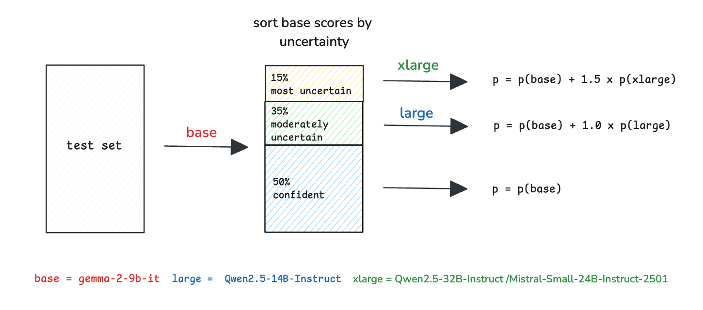

# WSDM Cup - Multilingual Chatbot Arena 轻量深读（Tier B）

> 赛事：Featured ｜ 主题 nlp（人类偏好预测，多语言）｜ 950 队 ｜ 代码赛 ｜ 指标：Accuracy
> 材料基础：`digests/wsdm-cup-multilingual-chatbot-arena.md`（6 篇正文：3rd 567584 / 2nd 567948 / 7th 567589 / 6th、13k 样本帖、LMSYS 往届方案帖；80 条主题索引）+ 2 张图
> 轻读时间：2026-10（Tier B B10）

## 1. 一句话重述与数字账

预测用户在两条 LLM 回复中更偏好哪一条（多语言）。真正的考点是**"在推理时延约束下，怎么把有限算力花在最不确定的样本上"**：前列方案都是"小模型全量打分 + 大模型只复查不确定样本"的级联结构，训练侧则围绕**只算 A/B 两个 token 的损失、软标签蒸馏/自蒸馏、伪标签**展开。

| 关键数字 | 值 | 来源 |
| --- | --- | --- |
| 3rd（567584） | 重实现了 Eedi Rerank 的训练管线；**用 AutoModelForCausalLM（而非 SequenceClassification）+ vLLM 加速推理**；模型 = Qwen2.5-14B-Instruct（做过 post-pretrain）+ Phi4（未做）；不同 seed 的模型合并；**蒸馏**：用 72B（LMSYS 冠军）当教师，但发现"用 14B 自己的 logits 做**自蒸馏**可达相同 CV" → 推断真正的增益来自**软 logits 带来的标签清洗**；量化用 auto-round；集成：**先按 token 长度排序**，前 25% 时间用 Qwen2.5-14B 做 TTA，其余用 Phi4；预处理用 fasttext 判语言；训练时**重写 SFTTrainer 的 compute_loss，只在 "A"/"B" 两个 token 上算交叉熵** | 567584 |
| 2nd（567948，LB 0.709 / 私榜 0.708） | 基于 @tascj0 的高效框架；**prompt/response_a/response_b 按长度比例做"中部截断"**；基座 gemma2-9b 与 ArmoRM-Llama3-8B **用上一届比赛的模型初始化**（分类头 3→2）；用 WSDM 数据微调后用 v1（8.5k）+v2（13k）开源模型样本做**软标签伪标注**（v3 因模型能力差距太小、会引入噪声而弃用）→ hf-21k；再在 hf-21k+WSDM 上微调；**TTA：gemma 预测 PAB、llama 预测 PBA（交换）**，以 3.3:1 加权 | 567948 |
| 7th（567589） | **按不确定性级联**（图 1）：先用 gemma-2-9b-it 给全部样本打分 → 不确定性 = 1−|p−0.5| → 按不确定性排序：**最不确定的 15% 用 xlarge（Qwen2.5-32B / Mistral-Small-24B）加权重打分（+1.5×）**、中间 35% 用 large（Qwen2.5-14B，+1.0×）、最确定的 50% 只用 base | 567589 |
| 社区侧 | "**8.5k 开源模型样本**"（54 票）、"**CV vs LB 讨论**"（31 票 / 105 评论）、"13k 更多开源模型样本"（29 票）、"EDA 与 OOF 的惊人结果"（29 票）、"上一届 LMSYS 的顶级方案"（31 票）、"LMSYS 1st 方案与代码"（1275 行处） | 社区 |

## 2. 逐方案对照矩阵

| 维度 | 3rd | 2nd | 7th |
| --- | --- | --- | --- |
| 训练 | 重实现 Eedi Rerank 管线；只在 A/B token 算 loss | 基于 tascj0 框架；中部截断 | 未详述 |
| 教师/标签 | 72B 蒸馏 → 自蒸馏等效（软标签清洗） | 开源模型样本的软标签（v1+v2） | — |
| 推理 | vLLM + auto-round 量化；长度排序分配 TTA | TTA：gemma PAB / llama PBA（3.3:1） | **不确定性级联（15%/35%/50%）** |
| 模型 | Qwen2.5-14B + Phi4（多 seed 合并） | gemma2-9b + ArmoRM-Llama3-8B（+gemma2-27b） | gemma-2-9b + Qwen2.5-14B/32B |

## 3. 共识、分歧与裁决

### 共识一：推理时延决定方案形态（全员）

本场是代码赛且模型巨大：3rd 先按 token 长度排序分配 TTA 预算并用 auto-round 量化；7th 用不确定性级联（只把大模型算力花在 15%+35% 样本）；2nd 用高效框架与 TTA。**裁决**：偏好预测赛的"性能"= 模型质量 × 算力分配策略；级联（小模型全量 + 大模型复查难例）是最通用的形状。置信度：高。

### 共识二：软标签/伪标签是主要增益来源（3rd/2nd + 社区样本帖）

3rd 发现"72B 蒸馏 ≡ 自蒸馏"，推断增益来自**软 logits 的标签清洗**；2nd 用开源模型样本的软标签构造 hf-21k（并因"能力差距太小"剔除 v3）；社区 8.5k/13k 样本帖（54/29 票）是公共基础设施。**裁决**：多语言偏好数据噪声大，软标签/伪标签的价值在于"洗标签"而非"教知识"；教师与学生的能力差距过小反而引入噪声。置信度：高。

### 共识三：多语言需要专门处理（3rd）

3rd 用 fasttext 判语言并作为预处理。**裁决**：多语言赛要按语言做采样/截断/阈值等差异化处理。置信度：中（单队做法，但机制合理）。

### 分歧一：生成式建模 vs 分类建模

3rd 用 AutoModelForCausalLM（只算 A/B token 的 loss）以便 vLLM 推理；2nd 用分类头（3→2）；7th 用打分概率。**裁决**：把"选择"退化到两个 token 的分类既保留生成模型的预训练能力，又获得 vLLM 的吞吐——是工程上的甜点。置信度：中高。

### 事件：CV vs LB 的长讨论（31 票 / 105 评论）

社区专帖讨论 CV 与公榜关系；3rd/2nd 都强调用软标签/伪标签后 CV 更可靠。**裁决**：偏好预测的 CV 要按"模型对/语言/主题"分层审计，并警惕用公榜调集成权重。置信度：中。

## 4. 证据分级

| 断言 | 等级 | 说明 |
| --- | --- | --- |
| 3rd 的"自蒸馏 ≡ 72B 蒸馏"与 A/B token loss | 自述 + 公开训练/推理代码 | 高 |
| 2nd 的软标签流程与 TTA 权重（0.708 私榜） | 自述 + 公开代码 | 中高 |
| 7th 的不确定性级联（图 1） | 自述 + 图 | 中高 |
| 8.5k/13k 开源模型样本 | 社区数据集帖 | 中高 |
| CV vs LB 讨论 | 长讨论帖 | 中 |

## 5. 悬案与缺口（登记）

- 1st/4th/5th/6th 的方案未细读；LMSYS 往届方案帖（31 票）与"EDA/OOF"（29 票）未细读；
- 3rd 的量化（auto-round）与 vLLM 细节未展开；
- 7th 的 base/large/xlarge 具体权重与阈值只给了一张图；
- 归档 2 图：7th 的不确定性级联图（图 1）为关键图证。

## 6. 图表证据

**图 1**（topic 567589）：先用 base（gemma-2-9b-it）给全部测试样本打分，按不确定性（1−|p−0.5|）排序——**最不确定的 15%** 交 xlarge（Qwen2.5-32B / Mistral-Small-24B）并以 `p = p(base) + 1.5×p(xlarge)` 融合；**中间 35%** 交 large（Qwen2.5-14B，+1.0×）；**最确定的 50%** 保持 base 结果。这是"用不确定性把算力花在刀刃上"的最清晰示例。

## 7. 出处

- 3rd（52 票）：https://www.kaggle.com/competitions/wsdm-cup-multilingual-chatbot-arena/discussion/567584
- 2nd（29 票）：https://www.kaggle.com/competitions/wsdm-cup-multilingual-chatbot-arena/discussion/567948
- 7th（32 票）：https://www.kaggle.com/competitions/wsdm-cup-multilingual-chatbot-arena/discussion/567589
- 8.5k 开源模型样本（54 票）：https://www.kaggle.com/competitions/wsdm-cup-multilingual-chatbot-arena/discussion/552166
- CV vs LB（31 票 / 105 评论）：https://www.kaggle.com/competitions/wsdm-cup-multilingual-chatbot-arena/discussion/552368
- LMSYS 往届方案（31 票）：https://www.kaggle.com/competitions/wsdm-cup-multilingual-chatbot-arena/discussion/547480
