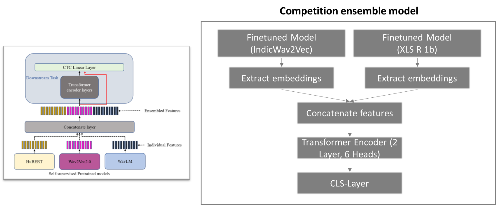

# Bengali.AI Speech Recognition（精简）

> 主题：audio（语音识别）｜ 子类：— ｜ 领域：低资源语音 ｜ 类别：Research ｜ 截止：2023-10-17 ｜ 队伍数：744 ｜ 指标：WER
> 出处：`intel/bengaliai-speech/`（80 条主题索引 + 6 篇 write-up 正文）

## 任务

孟加拉语语音转文本（低资源语言的 ASR），指标为词错误率（WER）。

## 关键要点

- 5th 的路径很典型：**从公开基线（YellowKing 流程）起步 → 换骨干为 IndicWav2Vec → 重置 CTC 层**，再叠加公开方案的集成——"**集成有效**"（标题即结论）。
- **低资源语言靠领域预训练模型**（IndicWav2Vec 是针对印度语系的语音模型）。
- CTC 解码头重置是换骨干后的标准动作。

## 可迁移要点

- **低资源语音/文本任务优先找领域预训练模型**（比通用模型强得多）。
- 换骨干后要重置任务头并重新训练。
- 集成是低资源任务的稳定增益来源。

## 轻读结论（2026-10 补）

**一句话**：低资源 ASR 的瓶颈是**标注噪声治理**（不是模型结构）：1st 靠"三轮 WER<15% 过滤自训练 + 合成/伪标数据 + 自训 tokenizer + 标点集成"把公榜从 0.380 打到 0.312；5th 用 MOS/WER 清洗解决"训练越久本地与公榜越脱钩"。

- 1st（447961）：Whisper-medium + 频谱抖动/遮蔽 + 16k→8k→16k 重采样 + libsonic；OpenSLR/MadASR/Shrutilipi/Macro/Kathbath + 42 万条 GoogleTTS + YouTube 伪标；三轮自训练（只留 WER<15%）→ 0.380；拼长音频 0.370；自训 12k 孟加拉 tokenizer（beam8+20.1s chunk）0.360；4 模型标点集成 0.325；更多伪标 0.312 pub / 0.372 priv。
- 2nd（447976）：indicwav2vec_v1_bengali；朗读重增强/自发轻增强 + concat 增强 + SpecAugment；剔除 WER 最高 10%；cosine warmup restarts（4e-5/3e-5/2e-5）；6-gram KenLM（IndicCorp）+ 标点。
- 5th（448006）：MOS>2.0 过滤 → 0.472；双向 WER>0.5 清洗后本地-公榜恢复相关，210k 步 → 0.452（无 LM）；**隐状态拼接 + 新 Transformer/CTC 头**集成，全管线 0.355→0.344。

**裁决**：低资源 ASR 的顺序 = 数据清洗（MOS/WER/重标注）→ 外部数据与 TTS/伪标扩容 → 强增强与长训练 → LM/标点后处理 → 表示层集成；"本地降、公榜升"是标注噪声的典型体检信号。

**悬案**：3rd 细节未读；1st 自训练逐轮数据量缺失；隐状态集成缺异构验证。

## 图表证据

**图 1**（topic 448006）：两个微调 ASR 各抽嵌入 → 拼接 → 2 层 6 头 Transformer → CTC/CLS 头；原模型冻结，只训新头。

## 出处

- 讨论区索引：`intel/bengaliai-speech/topics.md`
- 1st（107 票）：https://www.kaggle.com/competitions/bengaliai-speech/discussion/447961
- 2nd（41 票）：https://www.kaggle.com/competitions/bengaliai-speech/discussion/447976
- 3rd（43 票）：https://www.kaggle.com/competitions/bengaliai-speech/discussion/447957
- 5th（34 票）：https://www.kaggle.com/competitions/bengaliai-speech/discussion/448006
- 44th（31 票）：https://www.kaggle.com/competitions/bengaliai-speech/discussion/450635
- "微调是关键"（47 票）：https://www.kaggle.com/competitions/bengaliai-speech/discussion/433722
- 轻读全本：`analysis/deep/bengaliai-speech.md`（Tier B 轻读：对照矩阵/裁决/证据分级/悬案 + 1 图证）
