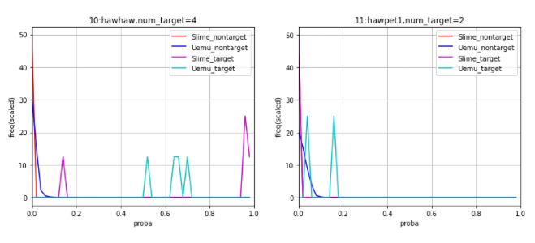
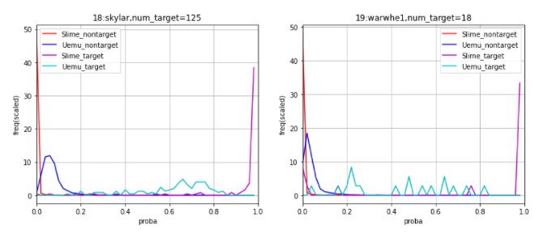
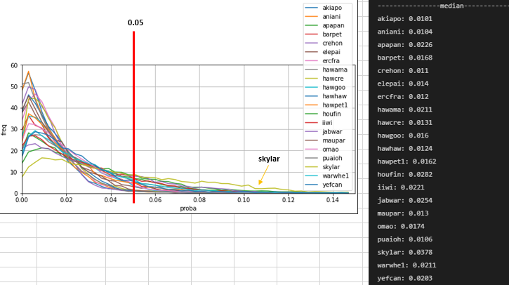

# BirdCLEF 2022

> 主题：audio（鸟类声音识别）｜ 子类：— ｜ 领域：生物声学 ｜ 类别：Research
> 截止：2022-05-24 ｜ 队伍数：801 ｜ 机制：代码赛 ｜ 指标：Weighted Categorization Accuracy（仅 21 个 scored birds）
> 数据来源：`intel/birdclef-2022/`（80 条主题索引 + 6 篇 write-up 正文；深读升级 2026-10-03，Tier A #51，Batch 6 首场）

## 1. 任务与数据

- 预测目标：从长声景中识别鸟鸣，但**只对 21 个 scored birds 计分**（多标签、切片级预测）。
- 数据形态：近场录音训练 + 声景测试；类别极端不平衡（7 种鸟样本 <10，`maupar` 仅 1 条）。
- 构造陷阱：
  - 稀有类需要专用损失/阈值；
  - 指标=clipwise 概率→阈值→准确率，**阈值是第二引擎**；
  - 训练/测试 SNR 与信道不同 → 背景噪声混入；
  - 外部强模型（BirdNET）存在公榜红利。

## 2. 验证方案

| 方案 | 使用者 | 说明 |
| --- | --- | --- |
| 5 折分层 + scored-bird 代理指标 | 1st | 切片→预测→取 max；只算 scored birds；阈值按 0.1 步长搜索 |
| 无可靠 CV，主要看公榜 | 3rd | 自述"找不到好 CV"；用多次提交探阈值 |
| maupar 拆 5 份 | 1st/3rd | 单样本类别的 OOF 一致性处理 |
| OOF 分布分析选阈值 | 3rd | 非目标分布 91 分位/逐鸟阈值 |

## 3. 方案谱系

| 方案 | 名次 | 关键点与数字 |
| --- | --- | --- |
| SED + 加权采样/两阶段 + 分位数阈值 | 1st models（63 票） | effnet_b3_ns Val .879/私 .78；eca_nfnet_l0 Val .886/私 .78；stride (2,2)→(1,1)；15s chunk；3 checkpoint 平均；分位数阈值 0.25；融合含 BirdNET |
| bird split + focal/BCE 分工 | 3rd（56 票） | Group1（14 种）BCE CNN+SED；Group2（7 种）focal SED；组合 0.8750 公/0.8126 私；**best private 0.8707/0.8274 未选**；阈值 0.05/skylar 0.35/G2 91 分位 |
| 自训方案（未选）+ BirdNET | public#1/private#2（59 票） | 自训私 0.79；BirdNET 20/21 类重合、公 **0.91**/私 **0.84**；CPU <2h vs GPU ~8h |
| BirdCLEF 2021 4th 复用 | 起点帖（51 票） | tattaka 的 SED 骨架；推理 ~2h；"音频赛集成有效" |
| 公共实验/数据 | kaerururu（156 票） | 4 分片 audio-to-numpy 数据集 + 训练/推理 notebook（被广泛复用） |
| 抄袭举报 | 社区（177 票） | 三个 copy-paste notebook；署名/举报规范 |

## 4. 关键技巧

- **稀有类分工**：按样本量分组（≥10 vs <10），Group1 用 BCE（CNN/SED）、Group2 用 focal SED；小类过采样/手工拆分。
- **阈值三策略**：逐类阈值（0.05、skylar 0.35）、分位数阈值（0.25，测试分布自适应）、非目标分布 91 分位（固定 FPR）。
- **SED + secondary labels**：tattaka 架构（clipwise/framewise/attention）；软权重 primary 0.9995/secondary 0.5/other 0.0025。
- **背景噪声混入**：freefield1010/aicrowd2020/2021 nocall 与训练片段混合，模拟测试声景。
- **增强**：mixup/OR-Mixup（最有影响）、cutmix、spec-augment、Gaussian/Pink 噪声。
- **训练技巧**：2 阶段（2021+2022 预训练→scored 过滤微调）；stride (2,2)→(1,1) 扩大输出；3 checkpoint 权重平均（naive SWA）。
- **推理**：居中 5s head + max(framewise, time)；±5s 邻域检出补 top5 类（时序后处理）。
- **提交对冲**：best-public 与低阈值安全版双提交（3rd）；不追 public 峰值。

## 5. 可迁移性评估

- 可直接迁移：类群级损失条件化；阈值校准三策略；弱标签软权重；背景噪声域适应；外部强模型的公榜红利审计；提交对冲。
- 需要前提：音频预处理链（SED/framewise）；可获得的背景噪声库；阈值可校准的验证/提交预算。
- 不建议照搬：全类统一损失与阈值；PCEN/加权 BCE 等无效改动；直接押注公榜峰值；复制粘贴他人 notebook。

## 6. 对新手的关键启示

1. 极端不平衡先做"类群分组"，不同组用不同损失——focal 保小类、BCE 保大类。
2. 多标签分类的阈值要逐类校准；分位数阈值能自动适配测试分布。
3. 训练与测试的 SNR/信道差异用背景噪声混入去对齐，胜过换模型。
4. 外部强模型（如主办方 BirdNET）有公榜红利：可以用，但要审计私榜。
5. 提交要留激进+保守两份；public 峰值不等于私榜最优。

## 7. 深读结论（2026-10 补）

**一句话**：这是一场"稀有类分组 + 阈值校准"的音频检测赛——骨架是 SED/CNN，胜负在损失与阈值的分组设计。

**跨方案裁决**：

- 稀有类分工：bird split（3rd）与加权/两阶段（1st）殊途同归；focal 保小类、BCE 保大类（有分布图与分数对照）。
- 阈值是第二引擎：逐类/分位数/非目标分位三种策略；"没有阈值看不出真实性能"。
- SED + secondary labels + 背景噪声混入是全员骨架。
- BirdNET 公榜红利实锤（0.91→0.84）；允许使用但不可依赖。
- 提交选择：public/private 翻转频繁，双提交对冲。
- 治理：最高票帖是抄袭举报——分享生态需要署名规范。

**数字账精选**：3rd 的 SED-BCE 私 .7563 vs focal .8135；bird split 后 best private .8274（未选）；1st 单模型 Val .879/.886；BirdNET 公 .91/私 .84；自训私 .79。

**失败学**：PCEN、加权 BCE、rating 数据、pitch-shift、coord-conv（3rd）；SED 上的 mixup/RandomLowpassFilter；只增强 scored birds/损失×10；复制粘贴；按 public 峰值选提交。

**悬案**：BirdNET 是否构成宿主红利未裁决；public→private 大跌机制未证实；7th 方案（326973）与指标解释帖未收录。

## 8. 图表证据

> 路径相对本文件（`notes/audio/`）：`../../intel/birdclef-2022/bodies/<topic>_img/NN.png`

**图 1：小类分布（topic 327193）**

- `hawhaw`（4 目标）/`hawpet1`（2 目标）：SED-focal 目标高峰、非目标压低位；BCE 模型对非目标给出中高概率；
- focal 保小类的直接图证。

**图 2：大类分布（topic 327193）**

- `skylar`（125 目标）/`warwhe1`（18 目标）：BCE 模型更可靠；
- 大类用 BCE + skylar 单独 0.35 阈值。

**图 3：逐鸟阈值选择（topic 327193）**

- 21 种鸟非目标分布中位 0.010–0.038；红线=Group1 阈值 0.05；skylar 中位偏高→0.35；Group2 用各自 91 分位；
- 阈值必须逐类校准的完整证据。

## 9. 出处

- 讨论区索引：`intel/birdclef-2022/topics.md`（80 条）
- 已收录 write-up（6 篇）：
  - 抄袭举报（177 票）：https://www.kaggle.com/competitions/birdclef-2022/discussion/321202
  - 实验分享（156 票）：https://www.kaggle.com/competitions/birdclef-2022/discussion/318081
  - 1st models（63 票）：https://www.kaggle.com/competitions/birdclef-2022/discussion/327047
  - public#1/private#2（59 票）：https://www.kaggle.com/competitions/birdclef-2022/discussion/326950
  - 3rd（56 票）：https://www.kaggle.com/competitions/birdclef-2022/discussion/327193
  - 起点帖（51 票）：https://www.kaggle.com/competitions/birdclef-2022/discussion/308004
- 深读全本：`analysis/deep/birdclef-2022.md`（11 组件 + 3 图证）
- 缺口登记：307824、324124、326973、314999、309213 未收录正文
