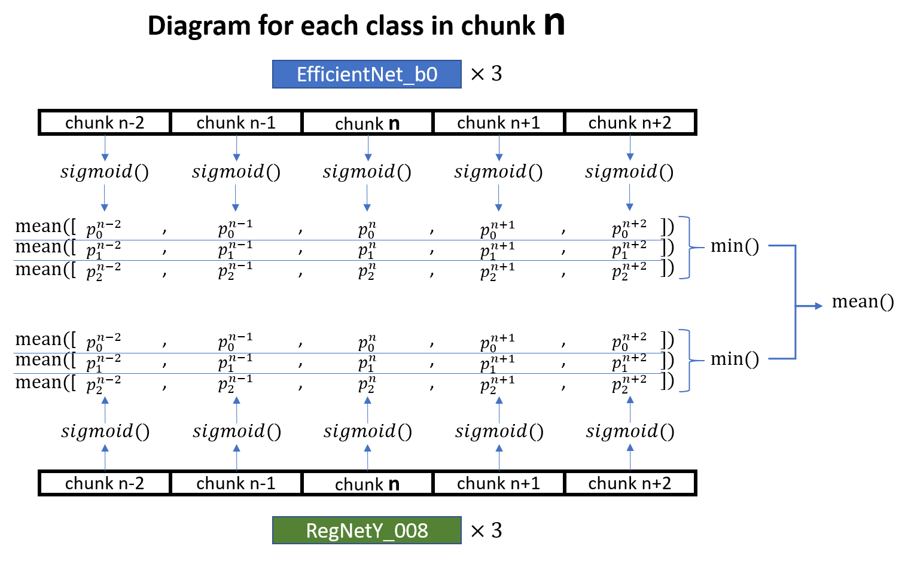

# BirdCLEF 2024

> 主题：audio ｜ 子类：— ｜ 领域：生物声学 ｜ 类别：Research
> 截止：2024-06-05 ｜ 队伍数：1000+ ｜ 机制：代码赛 ｜ 指标：物种识别（mAP 类）
> 数据来源：`intel/birdclef-2024/`（80 条主题索引 + 6 篇 write-up 正文）

## 1. 任务与数据

- 预测目标：由野外录音识别鸟种（多标签，长尾）。
- 数据形态：长录音 + 弱标签；训练与测试存在地域/设备差异。
- 构造陷阱：弱标签 + 类别极不平衡 + 跨域。

## 2. 方案谱系

| 方案 | 名次 | 关键点 |
| --- | --- | --- |
| Team Cerberus | 4th | 团队均等贡献；公开了推理 notebook 与训练代码（赛后更新）；方案属于"频谱图 + 半监督"的系列主流 |
| 其他方案 | 见讨论区 | |

## 3. 关键技巧（结合该系列四年脉络）

- **频谱图 + CNN/Transformer** 的标准表示。
- **切窗 + 多实例 + 伪标签**（2023 数据为王 → 2024 常规化 → 2025 多轮 Noisy Student → 2026 Noisy Student + 蒸馏）。
- **跨域泛化**（地域/设备）。
- **代码与 notebook 的赛后公开**（4th 特意更新发布）。

## 4. 可迁移性评估

- **可直接迁移**：弱标签音频的切窗与半监督流程；频谱图表示；跨域评估。
- 需要前提：音频处理与半监督训练经验。
- 不建议照搬：无跨域验证的单域调优。

## 5. 对新手的关键启示

1. **BirdCLEF 系列四年方法连续**（2023→2026），是"同一系列逐年演进"的完整样本。
2. 该系列的代码/notebook 公开度很高（4th 赛后补充训练代码）——**学习材料充足**。

## 6. 轻读结论（2026-10 补）

**一句话**：声景识别 = **log-mel CNN + soundscape 伪标 + CPU 推理预算 + 邻居平均/min 降噪**；额外数据与损失选择出现明显分歧。

- 1st（107 票）：仅 2024 数据；fold0 信号统计更低→更好，用 fold0+0.8 分位构造集成；Google 分类器清洗/重标/PL0.05；**CE 训练（BCE 差）→ sigmoid 推理 → 邻居 chunk mean → 跨模型 min()**（图 1）；OpenVINO 18 分钟/模型；183 nocall 类私榜 0.655→0.671。
- 3rd NVBird（78 票）：Xeno+往年数据封顶 500/物种取最近 + 低频上采样；两级伪标+蒸馏；EfficientViT/AVES。
- 4th（48 票）：melspec+raw signal 集成 + TTA + OpenVINO；公 0.731/私 0.667。

**裁决**：伪标核心；CPU 预算先行；长尾与 nocall 专治；折划分要审计响度/站点；额外数据受控可用、失控有害；CE/BCE 取决于标签结构。

**悬案**：2nd/5th 未细读；min() 的机制缺消融。

## 7. 图表证据

**图 1**（topic 512197）：模型×3 → 5 chunk sigmoid → mean → min() → mean()。

## 8. 出处

- 讨论区索引：`intel/birdclef-2024/topics.md`（80 条）
- 已收录 write-up（6 篇）：
  - 1st（107 票）：https://www.kaggle.com/competitions/birdclef-2024/discussion/512197
  - 3rd（78 票）：https://www.kaggle.com/competitions/birdclef-2024/discussion/511905
  - 4th Team Cerberus（48 票）：https://www.kaggle.com/competitions/birdclef-2024/discussion/511845
- 轻读全本：`analysis/deep/birdclef-2024.md`（Tier B 轻读：对照矩阵/裁决/证据分级/悬案 + 1 图证）
