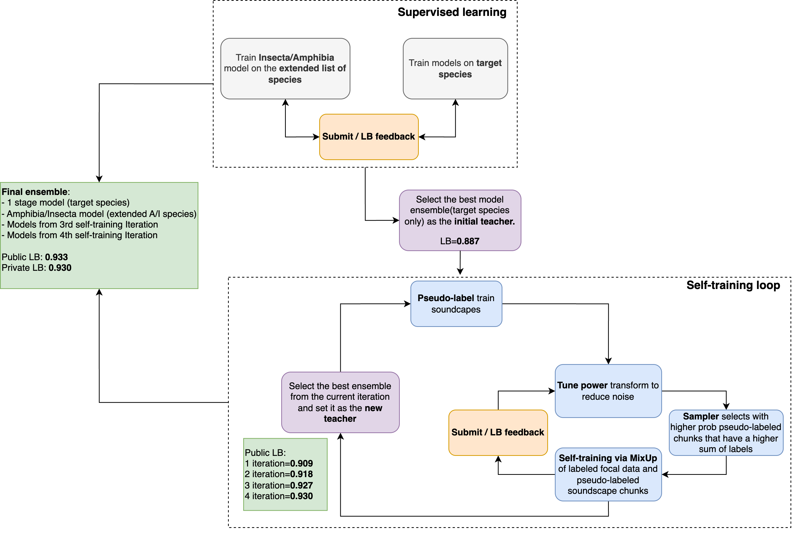
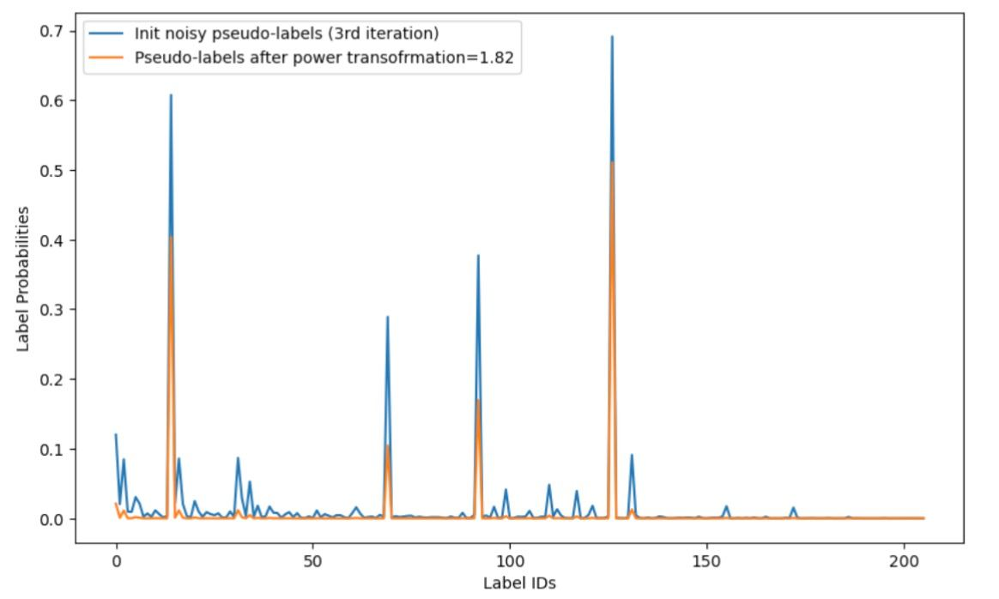
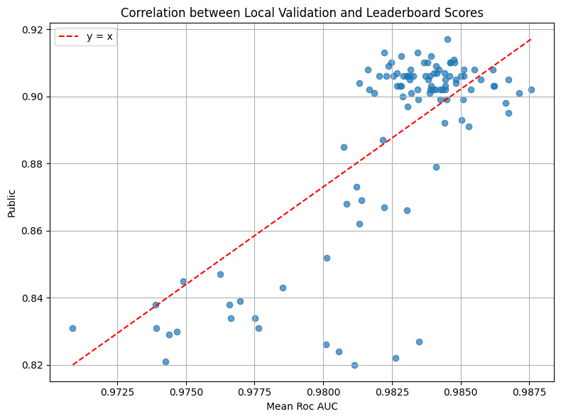
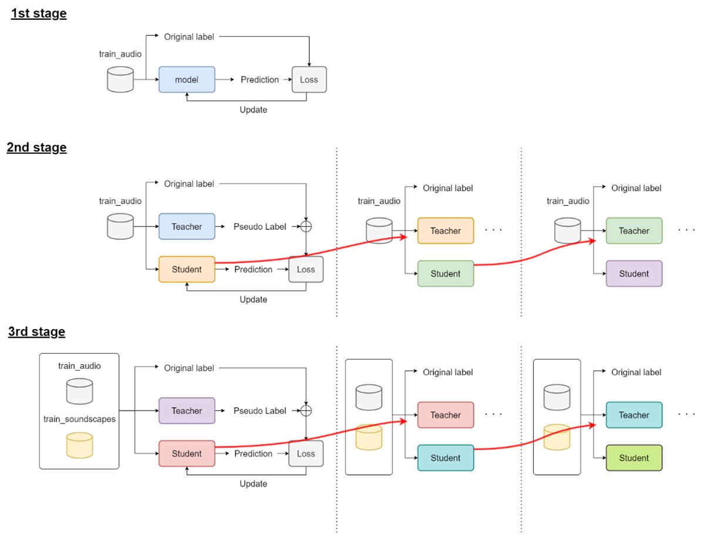
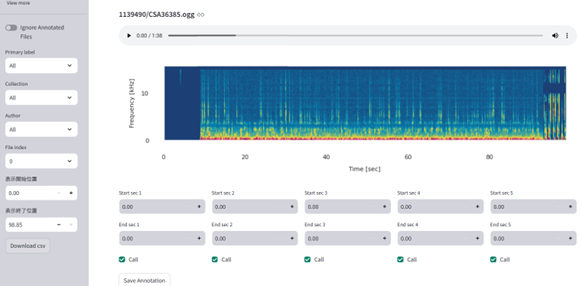

# BirdCLEF 2025

> 主题：audio（鸟类声景识别）｜ 子类：— ｜ 领域：生物声学 ｜ 类别：Research
> 截止：2025-06-05 ｜ 队伍数：2031 ｜ 机制：代码赛 ｜ 指标：BirdCLEF ROC AUC（206 类多标签）
> 数据来源：`intel/birdclef-2025/`（80 条主题索引 + 6 篇 write-up 正文；深读升级 2026-10-03，Tier A #52）

## 1. 任务与数据

- 预测目标：连续声景中 206 类（鸟/两栖/昆虫）多标签识别，ROC AUC。
- 数据形态：训练=train_audio（近场录音），测试=连续 soundscapes；CPU 推理时间限制。
- 构造陷阱：
  - 训练与测试域差异大（近场 vs 声景背景）→ 未标注 soundscapes 的自训练是主引擎；
  - 稀有类与家族级标签（Insecta 科级标签有区域语义）→ 专用模型 + 重标；
  - 高分段 CV 失效（<1% AUC 差异无相关）；
  - 人声/讲解（alien speech）污染录音。

## 2. 验证方案

| 方案 | 使用者 | 说明 |
| --- | --- | --- |
| 无好 CV，仅 public LB | 1st | host 明示公私同分布；多种子/多 fold 集成降 LB 噪声；事后验证诚实 |
| 分层 + 按作者分组 | 2nd | 稀有类三种处理策略；高分段 CV-LB 相关性消失（图） |
| 5 折 + 多 seed | 5th | 三阶段自蒸馏 |
| 无鸟段保留实验 | 2nd | 跳过无发声段反而降 LB → false positives 有正则作用 |

## 3. 方案谱系

| 方案 | 名次 | 关键点与数字 |
| --- | --- | --- |
| Multi-Iterative Noisy Student | 1st（263 票） | 20s chunk；SED+framewise 重叠平均；MixUp 混伪标（比例 0→1.0 对应 0.872→0.898）；power transform（1/0.65/0.55/0.6）；drop_path 0.15；4 迭代 **0.909→0.918→0.927→0.930**；Amphibia/Insecta 专用模型；7 模型等权私 **0.935**（选中 0.933/0.930） |
| 预训练 + 伪标 + 后处理 | 2nd（54 票） | Xeno-Canto 7400–7800 类预训练（0.83→0.86-0.87）；伪标 2–3 轮（阈值 0.5/<0.1）；TTA +0.005-0.008；后处理 +0.005-0.01；最终 0.922 公/0.918 私 |
| 三阶段自蒸馏 | 5th（69 票） | train_audio → 自蒸馏 ×4-5 → +soundscapes ×2；VAD+人工清理；13 模型；2.5s 重叠+平滑；公 0.928/私 0.924 |
| Recipe 0.872 | 社区（119 票） | mel 参数 0.810→0.859；FocalBCE；RandAug/掩码+MixUp(p=1)；中层特征池化；人声过滤；集成 0.854-0.859→0.872 |
| 2024 技法汇总 | 社区（73 票） | 上届 top10 技法表（伪标/SED/EfficientNet/集成/平滑/OpenVINO） |
| 系列索引 | 社区（55 票） | 2020–2024 竞赛与冠军链接 |

## 4. 关键技巧

- **Noisy Student 三旋钮**：伪标以 MixUp 混入（不要简单拼接）；概率幂变换降噪；drop_path=0.15（仅自训练有效）。
- **伪标采样**：WeightedRandomSampler 按"标签和"加权（教师置信度高的文件多采）；或按类分布采样+0.4 概率替换为软标签。
- **预训练**：大规模多样语料（Xeno-Canto 7400+ 类）有效；仅往届竞赛数据无效。
- **SED + framewise 重叠平均**：相邻 chunk 对同一时间帧平均（1D 滑窗 TTA，+0.002-0.003）；平滑 [0.1,0.2,0.4,0.2,0.1]/[0.1,0.8,0.1]；delta shift TTA。
- **输入工程**：20s chunk（5/10/15/20/30s = 0.842/0.864/0.87/0.872/0.872）；mel 224 bins、n_fft 4096、hop 1252；大 hop 控推理时间、大 n_mels 区分窄带物种。
- **稀有类/家族标签**：Insecta 科级标签按物种重打新标签 + 专用模型（+0.002-0.003）；min 1 样本/物种。
- **后处理**：每文件按 top 概率缩放 chunk 预测（+0.005-0.01）；低排名类 power 调整（风险高未用）。
- **工程**：OpenVINO/量化、多进程、频谱复用；推理 chunk 时长与 hop 联合调。

## 5. 可迁移性评估

- 可直接迁移：Noisy Student 自训练配方（mixup+幂变换+采样+drop path）；预训练语料规模条件；framewise 重叠平均；稀有类重标；LB 反馈的例外条款。
- 需要前提：大量未标注目标域数据；可下载的大规模外部语料；CPU 推理预算可优化。
- 不建议照搬：简单拼接伪标；多轮迭代不做置信压制；小语料预训练；删除"无目标段"；把家族标签直接混训。

## 6. 对新手的关键启示

1. 训练与测试域不同时，未标注目标域数据比更多标注数据更值钱——但必须"加噪地"用它（MixUp/drop path）。
2. 多轮伪标签的保险丝是置信压制（概率幂变换/阈值），否则越迭代越噪声。
3. 先做大规模多样预训练，再在目标数据微调；小语料预训练会拖后腿。
4. SED 的帧级预测要重叠平均，不要只取中心窗口 max。
5. 数据清理要区分"异质干扰"与"无目标段"——后者删除可能反而伤泛化。

## 7. 深读结论（2026-10 补）

**一句话**：这是一场"自训练工程"比赛——模型小、数据少，胜负在伪标签的混合方式、降噪变换与迭代停止点上。

**跨方案裁决**：

- 伪标自训练是主引擎（1st 0.872→0.930；2nd 阶梯 0.83→0.92；5th 0.84→0.92）。
- Noisy Student 三旋钮（mixup/幂变换/drop path）决定多轮迭代可行性。
- 预训练语料要"大而多样"（仅往届数据无效）。
- SED+framewise 重叠平均是稳定推理增益。
- 稀有类家族标签有区域语义，需按物种重标。
- 本场是 T18 的例外：host 明示公私同分布，LB 反馈可用（但需多 fold/seed 降噪）。

**数字账精选**：1st 0.872→0.930（4 迭代）、mix 1.0=0.898、等权私 0.935；2nd 预训练 +0.03、伪标 +0.03、TTA +0.005-0.008、后处理 +0.005-0.01；5th 0.839→0.884→0.921；Recipe mel 参数 +0.049。

**失败学**：简单拼接伪标/无幂变换（1st）；仅往届数据预训练、XC/iNat 数据、主数据软标签、time flip（2nd）；CNN/1D、过多增强（5th）；raw-wave 增强（Recipe）；删除无鸟段（2nd）。

**悬案**：1st 第 5 轮失效机制；2nd 第 3 轮无增益机制；人声处理帖(568886)、稀有类数据(570760)、Unstable Experiments(570402) 未收录。

## 8. 图表证据

> 路径相对本文件（`notes/audio/`）：`../../intel/birdclef-2025/bodies/<topic>_img/NN.ext`

**图 1：Noisy Student 循环（topic 583577）**

- 监督（目标物种+专用模型）→ 教师 0.887 → 伪标→幂变换→置信采样→MixUp 混训→新教师；
- 迭代 1–4 = 0.909/0.918/0.927/0.930；最终 7 模型跨阶段集成 0.933/0.930。

**图 2：幂变换（topic 583577）**

- 蓝=第 3 轮原始伪标；橙=取幂 1.82；
- 高峰保留、噪声地板压到 ~0——多轮迭代不崩的关键。

**图 3：高分段 CV 失效（topic 583699）**

- Mean ROC AUC 0.97–0.98 区间，0.90+ 公榜分数互不相关；
- LB 反馈成为主信号（本场 host 诚实 + 多 fold 集成降噪）。

**图 4：三阶段自蒸馏（topic 583312）**

- stage1 监督；stage2 teacher→伪标+原标签→student（重初始化，迭代 4-5 次）；stage3 加入 soundscapes（1:1）；
- 与 1st 的 noisy student 同族。

**图 5：人机协同数据清理（topic 583312）**

- VAD 筛出含人声文件 → 人工听音/标注鸟叫段；
- "清理什么"由人耳决定——与 2nd 的"无鸟段保留"共同界定清理边界。

## 9. 出处

- 讨论区索引：`intel/birdclef-2025/topics.md`（80 条）
- 已收录 write-up（6 篇）：
  - 1st（263 票）：https://www.kaggle.com/competitions/birdclef-2025/discussion/583577
  - Recipe（119 票）：https://www.kaggle.com/competitions/birdclef-2025/discussion/573066
  - 2024 技法汇总（73 票）：https://www.kaggle.com/competitions/birdclef-2025/discussion/572928
  - 5th（69 票）：https://www.kaggle.com/competitions/birdclef-2025/discussion/583312
  - 系列索引（55 票）：https://www.kaggle.com/competitions/birdclef-2025/discussion/567499
  - 2nd（54 票）：https://www.kaggle.com/competitions/birdclef-2025/discussion/583699
- 深读全本：`analysis/deep/birdclef-2025.md`（11 组件 + 5 图证）
- 缺口登记：568886、567495、570760、570402、570837、568303、567672 未收录正文
