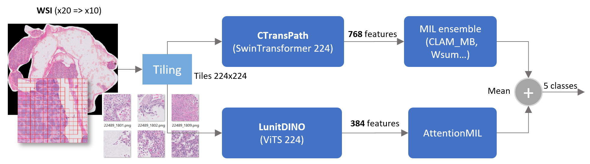

# UBC-OCEAN - Ovarian Cancer Subtype Classification

> 主题：cv ｜ 子类：— ｜ 领域：医疗影像（病理）｜ 类别：Research
> 截止：2024-01-03 ｜ 队伍数：1326 ｜ 机制：代码赛 ｜ 指标：多分类（卵巢癌亚型）
> 数据来源：`intel/UBC-OCEAN/`（80 条主题索引 + 6 篇 write-up 正文）

## 1. 任务与数据

- 预测目标：由**全切片病理图像（WSI）**判断卵巢癌亚型（多分类）。
- 数据形态：超大尺寸病理切片（数万×数万像素）+ 多中心数据（机构差异）。
- 构造陷阱：
  - **切片极大** → 必须切 patch + 多实例学习（MIL）；
  - **多中心差异**（不同医院染色/扫描仪）；
  - 类别不平衡。

## 2. 方案谱系

| 方案 | 名次 | 关键点 |
| --- | --- | --- |
| **病理基础模型 Phikon + Chowder（MIL 池化）** | 1st（Owkin） | 直接用领域基础模型提取 patch 特征，再用 Chowder 做多实例聚合；团队参赛目的就是展示该基础模型的鲁棒性 |

## 3. 关键技巧

- **领域基础模型（pathology FM）替代自训练编码器**：Phikon 这类在病理数据上预训练的模型显著降低数据需求。
- **MIL 池化**（Chowder 等）处理切片级分类。
- **多中心鲁棒性**是这类比赛的核心（跨机构泛化）。

## 4. 可迁移性评估

- **可直接迁移**：
  - WSI 任务的"**patch 特征 + MIL 聚合**"标准流程；
  - 领域基础模型优先（与 MedGemma/HAI-DEF 的结论一致）；
  - 多中心数据的稳健性评估。
- 需要前提：病理数据读取工具（openslide 等）与较大显存。
- 不建议照搬：从零训练 patch 编码器（领域基础模型更划算）。

## 5. 对新手的关键启示

1. **超大图像任务用"切块 + 聚合"**（MIL）而非端到端。
2. **领域基础模型正在成为默认起点**（病理 Phikon、医疗 MedGemma、分子 Uni-Mol/Polymer 等）。
3. 多中心数据的泛化能力比单机构分数更重要。

## 6. 图表证据：13th 方案双骨干 MIL 管线（图证）

*图：13th place solution 的管线（原帖 https://www.kaggle.com/competitions/UBC-OCEAN/discussion/465358 ；本地文件 `intel/UBC-OCEAN/bodies/465358_img/01.png`）*

图中给出的正文缺失细节：

- WSI 由 ×20 降采样到 ×10 后切 **224×224** patch；
- 双骨干并行：**CTransPath（SwinTransformer 224）→ 768 维 → MIL 集成（CLAM_MB、Wsum…）**；**LunitDINO（ViT-S 224）→ 384 维 → AttentionMIL**；
- 两路输出对 5 分类做**均值融合**；
- 启示：强队用"异构骨干 + 异构 MIL 池化器"制造多样性；768/384 特征维度与池化器名称是该方案可复现的关键参数。

## 7. 出处

- 讨论区索引：`intel/UBC-OCEAN/topics.md`（80 条）
- 已收录 write-up（6 篇）：
  - 1st Owkin（65 票）：https://www.kaggle.com/competitions/UBC-OCEAN/discussion/466455
  - 8th 数据理解优先（49 票）：https://www.kaggle.com/competitions/UBC-OCEAN/discussion/465382
  - 13th（48 票）：https://www.kaggle.com/competitions/UBC-OCEAN/discussion/465358
