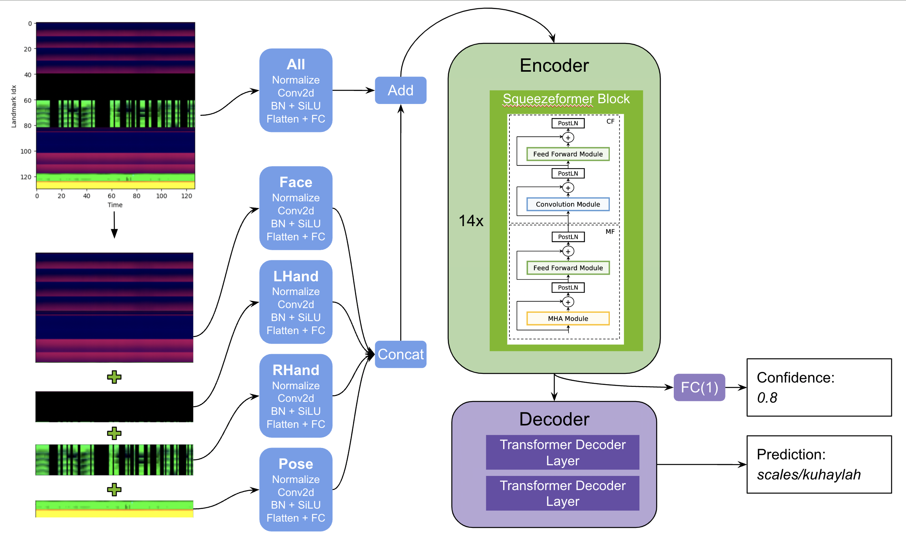

# Google - ASL Fingerspelling Recognition

> 主题：cv ｜ 子类：sign-language ｜ 领域：无障碍 ｜ 类别：Research
> 截止：2023-08-24 ｜ 队伍数：1314 ｜ 机制：代码赛 ｜ 指标：字符错误率（CER）
> 数据来源：`intel/asl-fingerspelling/`（80 条主题索引 + 6 篇 write-up 正文）

## 1. 任务与数据

- 预测目标：由手语视频识别**手指拼写**的字幕文本（视频 → 字符序列）。
- 数据形态：手部关键点/视频 + 文本标注；序列对齐、拼写速度差异大。
- 构造陷阱：
  - 是**序列到序列**问题（字符错误率指标），不是逐帧分类；
  - 手部关键点的质量与归一化影响大；
  - 训练数据有限（约 10 万条）。

## 2. 方案谱系

| 方案 | 名次 | 关键点 |
| --- | --- | --- |
| **改进的 Squeezeformer + Transformer 编解码器** | 1st | 单一编码器-解码器架构；作者明确指出"语音识别（ASR）的研究可以迁移到手指拼写"——**跨模态方法迁移** |

## 3. 关键技巧

- **把 ASR 的技术栈迁移过来**：Squeezeformer（语音领域的高效结构）+ Transformer 解码。
- **序列到序列 + CER 指标**：需要注意力/CTC 类对齐机制。
- **关键点归一化**（手部尺度/位置无关化）。

## 4. 可迁移性评估

- **可直接迁移**：
  - **语音识别技术迁移到手势/动作序列**（都是序列到序列）；
  - Squeezeformer/Conformer 类高效时序编码器；
  - 关键点归一化。
- 需要前提：序列建模与解码（CTC/注意力）经验。
- 不建议照搬：把序列任务当逐帧分类。

## 5. 对新手的关键启示

1. **跨模态迁移是捷径**：本场冠军直接借鉴 ASR（与"IR 方法迁移到单细胞"同一思路）。
2. 序列任务先确认指标（CER/WER）与对齐方式。
3. 关键点类输入的归一化决定上限。

## 6. 轻读结论（2026-10 补）

**一句话**：手语拼写的"ASR 迁移赛"——**多模态关键点 + 高效编码器（RoPE/Squeezeformer）+ 自回归解码 + 置信度后处理**，且每个效率改进都换成更深模型。

- 1st（242 票）：130 关键点；改进 Squeezeformer（Llama RoPE：训练 2×/tf-lite 3×/参数 -20%；去 time reduction）+ 2 层 Transformer 解码器 + 反转序列辅助损失；置信度头 + dummy 短语替换（+0.006）；CutMix/FingerDropout/FacePoseDropout 各 +0.005；tf-lite 39988KB、fp16、2 seed（图 1）。
- 3rd（53 票）：17 层 Squeezeformer + time reduce + RoPE；769 维输入；补充数据权重 0.1；AWP。
- 5th（51 票）：Vanilla Transformer + Data2vec 2.0 预训练；3D 关键点正确旋转（y 缩放 1.898）；姿态+嘴唇辅助；CTC 分割 + CutMix + KD。

**裁决**：ASR 工具箱直接迁移；效率=深度预算；时空增广四维度（丢手指/丢模态/时间/仿射）；辅助模态有效；补充数据多样性不足时收益有限。

**失败学**：编辑距离损失、CTC 辅助、label smoothing、AWP(fp16 NaN)、TTA、beam search。

**悬案**：2nd ASR 对比与上届冠军未细读；指标精确实现缺失。

## 7. 图表证据

**图 1**（topic 434485）：130 点 → 5 分支特征提取（All/Face/LHand/RHand/Pose）→ 14× Squeezeformer → 置信度 + 2 层 Transformer 解码器。

## 8. 出处

- 讨论区索引：`intel/asl-fingerspelling/topics.md`（80 条）
- 已收录 write-up（6 篇）：
  - 1st 改进 Squeezeformer（242 票）：https://www.kaggle.com/competitions/asl-fingerspelling/discussion/434485
  - 2nd ASR 算法对比（77 票）：https://www.kaggle.com/competitions/asl-fingerspelling/discussion/434588
  - 3rd 17 层 Squeezeformer（53 票）：https://www.kaggle.com/competitions/asl-fingerspelling/discussion/434393
- 轻读全本：`analysis/deep/asl-fingerspelling.md`（Tier B 轻读：对照矩阵/裁决/证据分级/悬案 + 1 图证）
