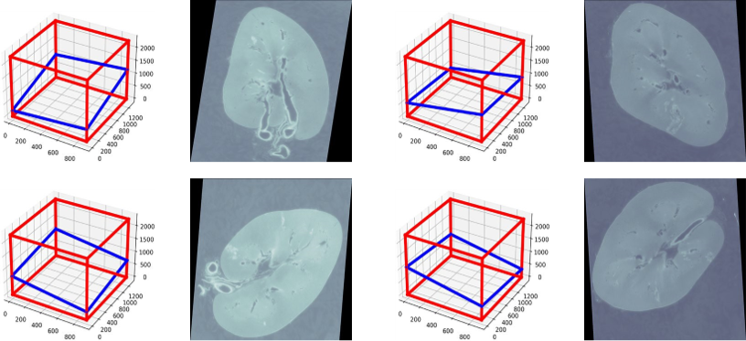
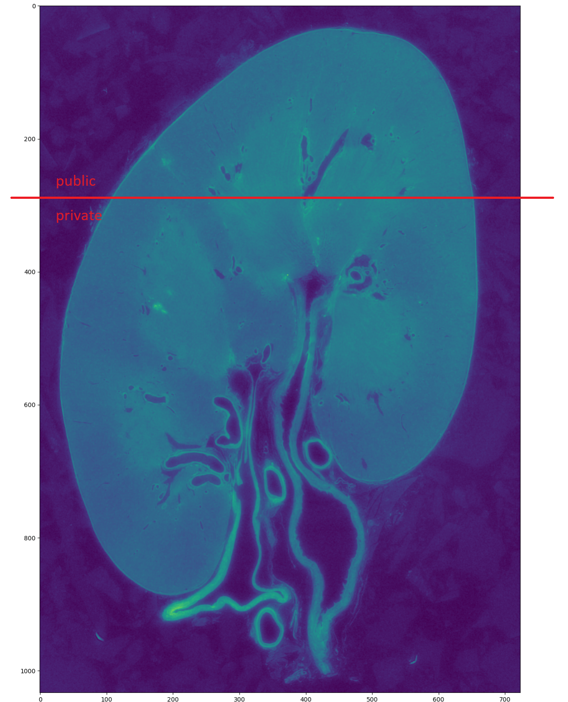
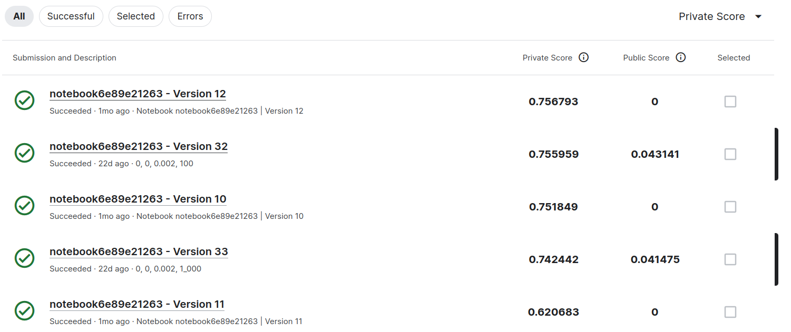

# Blood Vessel Segmentation

> 主题：cv ｜ 子类：— ｜ 领域：医疗影像 ｜ 类别：Research
> 截止：2024-02-06 ｜ 队伍数：1149 ｜ 机制：代码赛 ｜ 指标：Dice（细管状结构分割）
> 数据来源：`intel/blood-vessel-segmentation/`（80 条主题索引 + 6 篇 write-up 正文）

## 1. 任务与数据

- 预测目标：分割 3D 医学影像中的**血管树**（细管状结构，多分支）。
- 数据形态：3D 体数据 + 血管掩码；血管细、分支多、对比度低。
- 构造陷阱：
  - 细管状结构用常规 Dice 损失梯度稀疏；
  - 分支/末端易断；
  - 3D 体数据显存受限。

## 2. 方案谱系

| 方案 | 名次 | 关键点 |
| --- | --- | --- |
| **Boundary DoU Loss** | 4th | 标题即结论："**Boundary DoU Loss is all you need!**"——针对边界/细管结构的损失设计；作者同样致谢乌克兰武装力量（本批多支乌克兰团队） |

## 3. 关键技巧

- **面向细管状结构的损失设计**（Boundary DoU 类边界损失）——与 Vesuvius 的 SDF 回归同属"换损失/换表示"的思路。
- **3D 分块训练与推理**。
- **连通性后处理**（补断点）。

## 4. 可迁移性评估

- **可直接迁移**：
  - **细管/边界结构的专用损失**（血管、道路、裂缝、纤维分割通用）；
  - 分块推理 + 拼接；
  - 连通性后处理。
- 需要前提：3D 分割框架与显存预算。
- 不建议照搬：默认 Dice/BCE（对细结构梯度稀疏）。

## 5. 对新手的关键启示

1. **细结构分割的收益常在"损失函数"上**（Vesuvius 换表示、本场换损失）。
2. 与 RSNA、UWMGI、HuBMAP、Vesuvius 对照：**医学/科学分割的方法论已高度成熟**（分块 + 专用损失 + 后处理）。
3. 本批多次出现乌克兰团队的致谢——**Kaggle 的社区韧性**值得记录。

## 6. 轻读结论（2026-10 补）

**一句话**：本场的真正考点是**隐藏分辨率/成像域偏移**（训练+公测 50µm，私测 63µm，公私切片分布不同）——按公开榜优化 = 私榜赌博。

- 1st（100 票）：2.5D convnext-tiny；**随机 3D 旋转切片**让同一模型私榜 0.682→0.830/0.835（公榜几乎不变）；被选集成私仅 0.744/0.774。
- 2nd（33 票）：公榜 0.43（1052 名）→ 私榜 **0.7568（第 2）**；U-Net3D + 体积比阈值 + 去小连通块。
- 3rd（69 票）：消融 0.586→0.727（模拟放大倍率 + 稀疏→稠密标签精修）；最终单模=集成=私 0.727。
- 4th（68 票）：2D+3D 集成私 0.712；Canny 后处理公 0.892 → 私 **0.313**。

**裁决**：2.5D 多视角 > 3D；边界感知损失（BoundaryDOU/focal+dice+boundary）与阈值稳定性优先；外部伪标需剔重叠防泄漏。

**悬案**：5th+ 方案与隐藏集官方披露帖未收录；1st 的公榜导向选提交、4th 的 Canny 雪崩未复盘。

## 7. 图表证据

**图 1**（topic 475522）：任意 3D 旋转平面切片的增广示意（私 0.682→0.830 的关键）。

**图 2**（topic 475657）：同一肾脏切片以红线划分 public（上）/private（下）——公私分布不同的直观证据。

**图 3**（topic 475657）：提交截图——私 0.7568/公 0.0000 等极端反转。

## 8. 出处

- 讨论区索引：`intel/blood-vessel-segmentation/topics.md`（80 条）
- 已收录 write-up（6 篇）：
  - 1st（100 票）：https://www.kaggle.com/competitions/blood-vessel-segmentation/discussion/475522
  - 3rd 从稀疏到稠密精修（69 票）：https://www.kaggle.com/competitions/blood-vessel-segmentation/discussion/475074
  - 4th Boundary DoU Loss（68 票）：https://www.kaggle.com/competitions/blood-vessel-segmentation/discussion/475052
  - 2nd（33 票）：https://www.kaggle.com/competitions/blood-vessel-segmentation/discussion/475657
- 轻读全本：`analysis/deep/blood-vessel-segmentation.md`（Tier B 轻读：对照矩阵/裁决/证据分级/悬案 + 3 图证）
