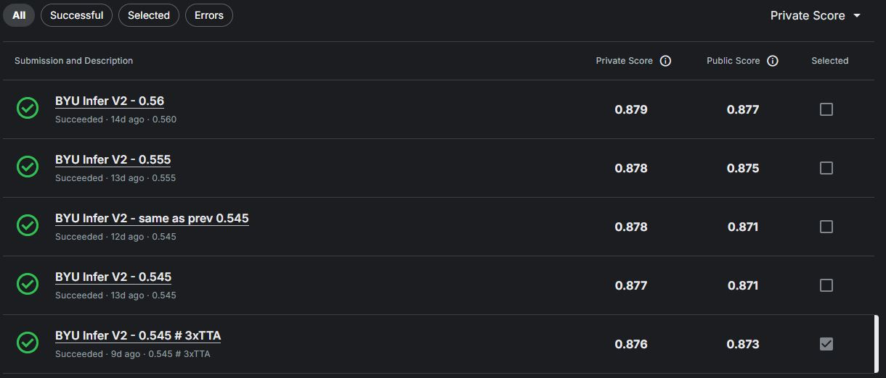

# BYU - Locating Bacterial Flagellar Motors 2025

> 主题：cv ｜ 子类：— ｜ 领域：结构生物学 ｜ 类别：Research
> 截止：2025-06-04 ｜ 队伍数：1136 ｜ 机制：代码赛 ｜ 指标：3D 定位（F1/距离阈值）
> 数据来源：`intel/byu-locating-bacterial-flagellar-motors-2025/`（80 条主题索引 + 6 篇 write-up 正文）

## 1. 任务与数据

- 预测目标：在**冷冻电子断层扫描（cryo-ET）3D 体数据**中定位细菌鞭毛马达（点状目标定位）。
- 数据形态：3D 体数据 + 坐标标注（稀疏点目标）。
- 构造陷阱：目标极小且稀疏；3D 显存受限；坐标系（体素/物理单位）转换需仔细。

## 2. 方案谱系

| 方案 | 名次 | 关键点 |
| --- | --- | --- |
| **3D/2D UNet + 高斯热图（Gaussian Heatmap）** | 3rd | 把点定位转为**热图回归**再取峰值——与中心回归/SDF 同属"改为连续表示"的思路；使用社区共享的外部数据集 |
| 其他方案 | 见讨论区 | |

## 3. 关键技巧

- **点目标 → 高斯热图回归**（避免稀疏点带来的梯度问题）。
- **3D/2D 混合架构**（在计算成本与精度间折中）。
- **社区外部数据集**（本场有选手共享标注，3rd 明确致谢）。
- **坐标转换与峰值提取后处理**。

## 4. 可迁移性评估

- **可直接迁移**：
  - 点目标定位用**热图回归**（关键点检测、细胞/颗粒定位通用）；
  - 3D/2D 混合处理体数据；
  - 峰值提取与坐标变换后处理。
- 需要前提：cryo-ET 数据读取与 3D 处理能力。
- 不建议照搬：直接回归坐标（稀疏目标训练不稳）。

## 5. 对新手的关键启示

1. **点定位用热图，而不是坐标回归**（本场与 Biohub、CZII 的做法一致）。
2. **社区共享的标注数据可以改变比赛格局**（3rd 专门致谢）。
3. 与 CZII cryo-ET、Biohub、Vesuvius、RSNA 并列：**3D 生物影像的方法论已高度统一**（分块 + 连续表示回归 + 后处理）。

## 6. 轻读结论（2026-10 补）

**一句话**：指标**对定位误差宽容、对"有无"敏感**——所以本场的核心策略是"输出粗、判存在狠"：热图降 8–16 倍、甚至删掉解码器只做 76 类分类；存在性用**分位数阈值**而不是固定阈值。

- 1st（146 票）：3D U-Net（ResNet200 编码器）+ 高斯热图降 8×；SmoothBCE 三项（主头/深监督/池化损失）；重增强训 400 epoch；沿深度滑窗 + 边缘权重 0.001；8 seed 集成；**分位数阈值（pub 0.565 / priv 0.560）**，提交记录 0.56→私榜 0.879。
- 3rd（42 票）：3D/2D UNet 集成（ResNeXt50/DenseNet121/X3D-M/MaxViT/CoaT）+ stride16 热图 + WBF；**只用 BCE 最好**；PB 0.866。
- 4th（42 票）：洞察"定位宽容"后删掉解码器——**3D ResNet18 输出 512×3×5×5 → 75 空间类 + 1 无马达 = 76 类分类**，argmax + 网格偏移定位；单模 pub 0.875；混 MixUp 限制每 patch ≤1 马达、正样本 12.5%；jit/TensorRT 加速。
- 20th（38 票）：YOLO11 C3K2 特征 + GNN，**RandomWalkPE 是缺失的关键成分**；半径+特征相似定义正标签。

**裁决**：先读指标的距离容忍度再定输出分辨率；存在性阈值用分位数；统一体素尺度 + 强增强 + 外部同域数据应对域移；外部数据与手工补标是常规动作。

**悬案**：2nd/5th–19th 方案缺失；1st 无逐项消融；GNN 细节未展开。

## 7. 图表证据

**图 1**（topic 583143）：提交描述中的数字即分位数（0.56/0.555/0.545…），私榜 0.879/0.878/0.877——"删掉最低分位"操作平滑、可按公开榜微调。

## 8. 出处

- 讨论区索引：`intel/byu-locating-bacterial-flagellar-motors-2025/topics.md`（80 条）
- 已收录 write-up（6 篇）：
  - 1st 3D U-Net + 分位数阈值（146 票）：https://www.kaggle.com/competitions/byu-locating-bacterial-flagellar-motors-2025/discussion/583143
  - 3rd 3D/2D UNet + 高斯热图（42 票）：https://www.kaggle.com/competitions/byu-locating-bacterial-flagellar-motors-2025/discussion/583380
  - 4th ResNet18 分类方案（42 票）：https://www.kaggle.com/competitions/byu-locating-bacterial-flagellar-motors-2025/discussion/583411
  - 20th 关键点+双图（38 票）：https://www.kaggle.com/competitions/byu-locating-bacterial-flagellar-motors-2025/discussion/583128
  - 数据理解（69 票）：https://www.kaggle.com/competitions/byu-locating-bacterial-flagellar-motors-2025/discussion/567360
- 轻读全本：`analysis/deep/byu-locating-bacterial-flagellar-motors-2025.md`（Tier B 轻读：对照矩阵/裁决/证据分级/悬案 + 1 图证）
