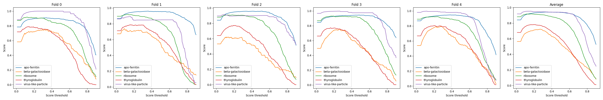

# CZII - CryoET Object Identification

> 主题：cv ｜ 子类：— ｜ 领域：结构生物学/3D 成像 ｜ 类别：Featured
> 截止：2025-XX-XX ｜ 队伍数：1000+ ｜ 机制：代码赛 ｜ 指标：颗粒识别（3D 检测）
> 数据来源：`intel/czii-cryo-et-object-identification/`（80 条主题索引 + 6 篇 write-up 正文）

## 1. 任务与数据

- 预测目标：在**冷冻电子断层扫描（cryo-ET）** 3D 体数据中识别并定位多种亚细胞颗粒/大分子。
- 数据形态：3D 体数据（Tomogram）+ 坐标标注；目标小、类别多、各向异性分辨率。
- 构造陷阱：
  - **3D 各向异性**（XY 与 Z 方向分辨率不同）→ 需要专门的重采样/网络设计；
  - 目标尺度小、数据量有限；
  - 体数据显存开销大。

## 2. 方案谱系

| 方案 | 名次 | 关键点 |
| --- | --- | --- |
| 目标检测路线（含训练代码） | 1st（检测部分） | 作者来自乌克兰敖德萨，write-up 开头记录了战争背景——**Kaggle 社区的人文一面** |
| 其他方案 | 见讨论区 | |

## 3. 关键技巧

- **各向异性处理**：对 Z 轴做插值/重采样，或设计各向异性卷积。
- **3D 检测框架**：把通用检测器（如 3D U-Net 系检测头）适配到体数据。
- **按体数据（tomogram）分组验证**。
- **内存管理**：体数据分块推理。

## 4. 可迁移性评估

- **可直接迁移**：
  - **各向异性数据的处理**（医学/材料/生物成像通用）；
  - 3D 检测的"分块 + 合并"推理范式；
  - 按扫描/患者/样本分组。
- 需要前提：3D 影像工具链与显存预算。
- 不建议照搬：直接按各向同性假设处理。

## 5. 对新手的关键启示

1. **先检查体数据的分辨率是否各向异性**——这决定预处理与网络设计。
2. 与 Vesuvius（3D CT 墨迹）、RSNA 系列（3D CT/MRI）对照：**3D 医学/科学影像的方法论高度共通**。

## 6. 轻读结论（2026-10 补）

**一句话**：这是一场"**3D 分割/点检测 + 推理时延工程**"的比赛——1st 是分割模型与点检测模型两条路线的合并（各自单独只到 Top-5）；限时 12 小时/500 扫描决定了 stride2 输出、TensorRT、双 GPU 并行这些工程是硬门槛。

- 1st-OD（561440）：anchor-free 点检测 + OKS 式点-点 IoU + PP-YOLO 风格损失；**stride2 输出（stride1 仅 +0.002 但慢一倍）**；TensorRT 200% 加速、2×T4；滑窗 1×9×9 + 边界降权；后处理 CenterNet NMS→top16K→逐类阈值→贪心 NMS；10 模型集成。
- 1st-分割（561510）：**倒数第二层特征图更准 → 部分 U-Net**；框回归无增益；低类权 + 单像素目标替代高斯热图；OOF 交叉重标定逐类阈值；6 检查点 <2h 即第 7。
- 2nd（561568）：轻量分割集成（873K–14.2M）；大模型更差；**InstanceNorm3d+PReLU 比 BN+ReLU 稳定**；CC3D + 小簇过滤。
- 3rd：3D UNet + CE + cc3d，res101 4 折；0.783（公私榜一致）。
- 4th：2.5D-UNet（深度池化 > strided 3D 卷积）；**坐标 +1.0**；σ=6/按尺寸；CV-LB 不相关 → 用 LB 决策。
- 9th：按类调掩码半径 → +0.02~0.04。

**裁决**：限时 3D 推理优先吞吐（降分辨率、TRT、并行）；小数据下损失/归一化 > 模型容量；跨范式（分割×点检测）集成收益最大；坐标约定要写测试。

**悬案**：5th–8th 方案缺失；1st 合并权重未量化；推理预算分配未给全。

## 7. 图表证据

**图 1**（topic 561440）：5 折逐类 F-beta–阈值曲线+平均——五类最优阈值差异大、折间形状不同，说明逐类阈值与 OOF 重标定是必要的。

## 8. 出处

- 讨论区索引：`intel/czii-cryo-et-object-identification/topics.md`（80 条）
- 已收录 write-up（6 篇）：
  - 1st 检测部分（117 票，含训练代码）：https://www.kaggle.com/competitions/czii-cryo-et-object-identification/discussion/561440
  - 1st 分割部分（103 票）：https://www.kaggle.com/competitions/czii-cryo-et-object-identification/discussion/561510
  - 4th（68 票，含源码与提交）：https://www.kaggle.com/competitions/czii-cryo-et-object-identification/discussion/561401
  - 2nd（44 票）：https://www.kaggle.com/competitions/czii-cryo-et-object-identification/discussion/561568
  - 3rd（53 票）：https://www.kaggle.com/competitions/czii-cryo-et-object-identification/discussion/561417
  - 9th（51 票）：https://www.kaggle.com/competitions/czii-cryo-et-object-identification/discussion/561431
  - "卡在 benchmark 下"（98 票）：https://www.kaggle.com/competitions/czii-cryo-et-object-identification/discussion/547350
- 轻读全本：`analysis/deep/czii-cryo-et-object-identification.md`（Tier B 轻读：对照矩阵/裁决/证据分级/悬案 + 1 图证）
