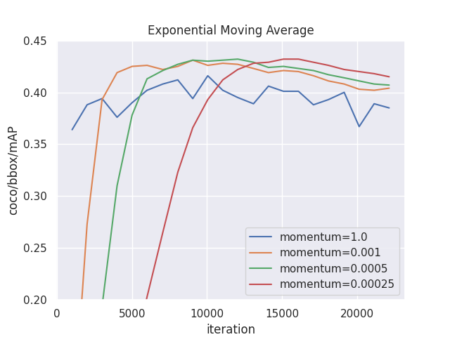
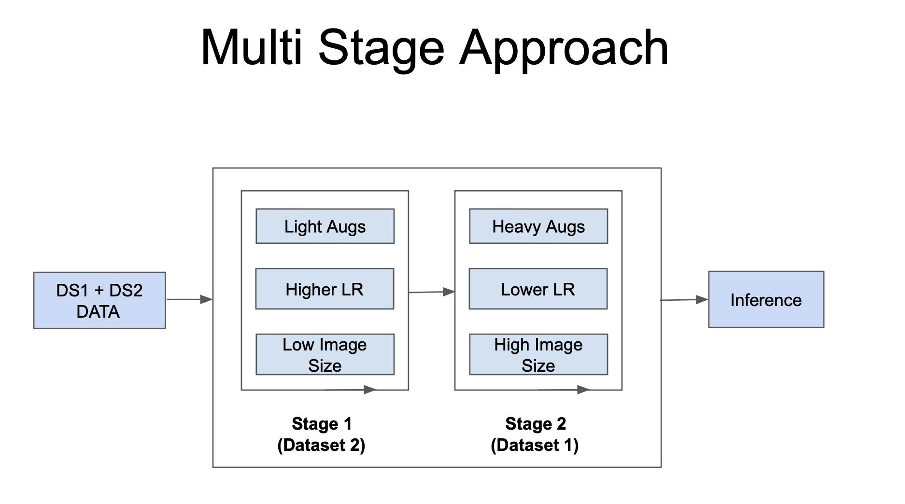
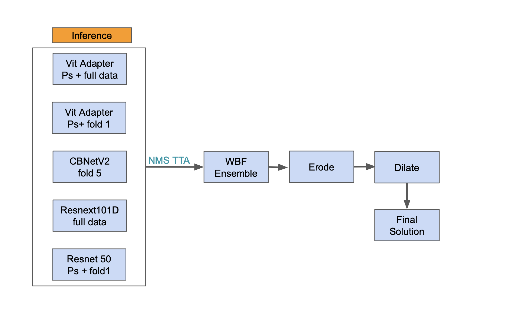
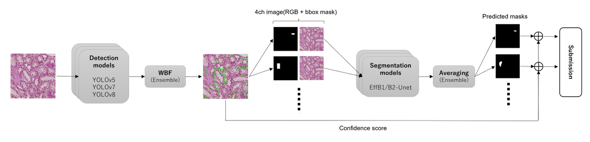
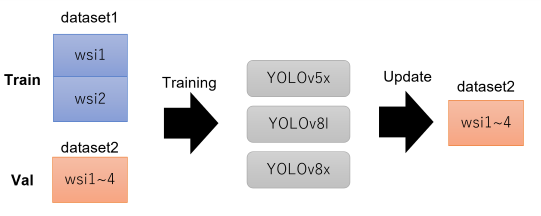
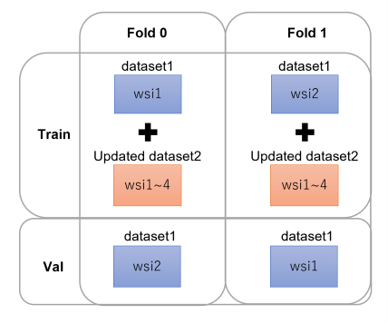

# HuBMAP - Hacking the Human Vasculature

> 主题：cv ｜ 子类：— ｜ 领域：医疗病理（WSI 实例分割）｜ 类别：Research
> 截止：2023-07-31 ｜ 队伍数：1021 ｜ 机制：代码赛 ｜ 指标：OpenImages AP（bbox+mask 实例分割，bbox 主导）
> 数据来源：`intel/hubmap-hacking-the-human-vasculature/`（80 条主题索引 + 6 篇 write-up 正文；深读升级 2026-10-03，Tier A #32）

## 1. 任务与数据

- 预测目标：肾活检 WSI 中检测并分割血管（blood_vessel / glomerulus / unsure 等类别）。
- 数据形态：**双数据集**——dataset1（wsi1/2，干净全标注） + dataset2（wsi3/4，**噪声标注：不全且系统性偏小**）；测试为未见 WSI。
- 构造陷阱：
  - dataset2 不可当等价监督使用 → 名次差距主要来自"如何用脏数据"（多阶段 / 重标 / 伪标签 / 混合 batch）；
  - **dilation 之谜**：mask/bbox 膨胀在公榜涨分，本质是补偿 dataset2 的标注尺度偏差；
  - 指标 bbox 主导 → 资源应优先保检测，mask 其次（且 mask 监督能反哺 bbox）；
  - 验证必须按 WSI/位置分组（i-split、wsi 交换），随机划分分数虚高。

## 2. 验证方案

| 方案 | 使用者 | 说明 |
| --- | --- | --- |
| i-split（按 location 划分） | 1st | 比随机划分难：bbox 0.43 vs 0.47、segm60 0.68 vs 0.72，但更接近测试分布 |
| 2 折 wsi 交换 | 9th | Fold0 训 wsi1+updated-ds2 / 验 wsi2，Fold1 交换 |
| 5 折（ds1 内） | 7th / 3rd | ds1 分折训伪标签/多阶段 |
| 训练集构成当验证 | 1st | 用 wsi1 与 wsi2 的留出表现决定 dilation 取舍（"信任 wsi1/wsi2"） |

## 3. 方案谱系

| 方案 | 名次 | 关键点与数字 |
| --- | --- | --- |
| RTMDet + EMA + WBF | 1st（82 票） | RTMDet-x 768；**EMA crucial**（小动量峰值 ~0.43）；i-split；mask 监督提升 bbox（0.424→0.434）；batch 3:5 混 ds1/ds2；集成私榜 0.589；dilation 最后一天靠运气 |
| 多阶段 + 5 MMdet 异构集成 | 3rd（61 票） | ds2 预训练（高 LR/轻增广）→ ds1 微调（低 LR/重增广）：LB **+4–6%**；ViT-Adapter-L/CBNetV2/DetectoRS/ResNet50；WBF + erode→dilate（+0.005）；最佳单模型 0.600/0.589 |
| Mask R-CNN 伪标签流水线 | 7th（63 票） | ds1 训 5 折 → 伪标 ds2/3 → ds1+ds2+ds3 重训；RPN+RoI 双层集成；**dilation 疑为 LB 过拟合**（ds1-only 时有害），伪标签+膨胀 ds2 把有/无差距 0.1→0.02 |
| 两阶段检测+分割 + ds2 重标 | 9th（43 票） | 10 检测模型 × 16 TTA = **160** WBF（NMS 0.6/WBF 0.7）；EffB1/B2-Unet 分割 4 模型；**用 ds1 模型重标 ds2 bbox**（IoU>0.4、FP 比>0.1）→ dilation 红利消失；3% bbox dilation +0.005；双提交 0.580/0.549 vs 0.572/0.560 |
| 上届冠军索引 | 社区（44 票） | HuBMAP 2022 organ、2021 kidney 冠军链接聚合——系列传承 |

## 4. 关键技巧

- **脏数据两段用法**：噪声大数据预训练（高 LR、轻增广、低分辨率、~10 epoch）→ 干净数据微调（低 LR 至 1e-7、重增广、高分辨率、15–25 epoch）——"脏数据学表示、净数据学决策"。
- **dilation 当试纸**：后处理增益方向随训练数据来源反转（ds1-only 有害 / 含 ds2 有益）→ 它是标注尺度偏差的补偿；重标 dataset2 后红利消失（9th 因果闭环）。
- **bbox-first**：实例分割 AP 先保检测；1st 把 mask 交给 Mask R-CNN 头，9th 分割不用 TTA；mask 监督反过来正则化 bbox（+0.006–0.010）。
- **EMA**：固定 LR + 小动量 EMA（0.00025–0.0005），单次训练保留多个动量快照 = 免费集成；EMA 同时提升 train 与 val 精度（权重轨迹降噪）。
- **集成工程**：NMS 管 TTA 内部去重、WBF 管跨模型融合（3rd）；异构（CNN+Transformer、YOLO 多版本）比同构有效；9th 的 160 检测结果 WBF。
- **数据集重标**：用干净数据训练的模型修正脏数据标注（满足 IoU/FP 条件的框才替换；框变大、数量不变）。
- **验证纪律**：i-split / wsi 交换等"难而真"划分；随机划分的高分是虚高；无法解释的后处理必须"带/不带"双提交（1st 明示）。

## 5. 可迁移性评估

- 可直接迁移：噪声数据的预训练-微调两段法；标注尺度偏差的后处理诊断法；bbox-first 资源分配；EMA 多快照；WBF/NMS 分工；重标注流程；难划分验证。
- 需要前提：双数据集结构（干净小 + 脏大）；足够的实例分割框架经验（MMdet/Swin/HTC）；计算资源支持多模型集成。
- 不建议照搬：直接把 ds2 混入监督训练；把 dilation 当无条件增益；伪标签/半监督（本场无增益）；只优化 mask。

## 6. 对新手的关键启示

1. 拿到"两个训练集"时，先问"它们的标注质量等价吗"——不等价就要设计不同的使用阶段。
2. 一个后处理在公榜涨分但说不清原因时，先做**来源诊断**（换训练子集看方向是否反转），再决定是否保留，并留对照提交。
3. 实例分割任务先看指标公式：本场 bbox 主导 → 检测资源优先；mask 监督仍有正则化价值。
4. EMA 是高性价比的稳定器：小动量 + 固定 LR + 多快照，几乎无额外成本。

## 7. 深读结论（2026-10 补）

**一句话**：这是一场"噪声标注利用 + 检测优先 + 后处理辨伪"的比赛——名次差距来自对 dataset2 的用法，而非 backbone。

**跨方案裁决**：

- dataset2 必须异于 ds1 使用（4/4）：多阶段（3rd）、重标（9th）、伪标签（7th）、混合 batch+EMA（1st）。
- bbox 主导、mask 次要且能反哺 bbox（1st 数字 + 9th 结构 + 3rd mask 权重）。
- WBF + 异构集成是共识；NMS/WBF 分工明确（3rd）。
- dilation 之争的裁决：它是标注尺度偏差的补偿而非真实增益；9th 的重标实验让红利消失，7th 的怀疑被证实；纪律 = 对照提交（1st）。
- 验证要"难而真"：i-split / wsi 交换；随机划分虚高。
- 伪标签/半监督非主杠杆（3rd/9th）。

**数字账精选**：多阶段 +4–6% LB；mask 监督 bbox 0.424→0.434；i-split/random 0.43/0.47；9th 160 WBF（带/不带 dilation 0.580/0.549 vs 0.572/0.560）；7th 差距 0.1→0.02；EMA 峰值 ~0.43。

**失败学**：ds3 半监督/伪标签（3rd/9th）、Mendeley 外部数据（7th）、YOLOv8（7th）、test 伪标签（7th）、ds1-only + dilation（7th/9th）。

**悬案**：2nd/4th 方案与 dilation 讨论帖（416901）未收录；428392（public 9th/private 295th）未收录；1st 的公榜 0.317 反差疑为笔误。

## 8. 图表证据

> 路径相对本文件（`notes/cv/`）：`../../intel/hubmap-hacking-the-human-vasculature/bodies/<topic>_img/NN.png`

**图 1：1st 的 EMA 动量对照曲线**（topic 429060）

- 无 EMA 波动 0.36–0.42；0.001 快升后衰减；0.0005 峰值 ~0.425；0.00025 慢升峰值 ~0.43 且后期稳定；
- 动量越小（记忆越长）越稳越高；单次训练可留多个 EMA 快照（免费集成）。

**图 2：3rd 的多阶段训练流程**（topic 430242）

- Stage 1 用 dataset2（轻增广、高 LR、低分辨率）；Stage 2 用 dataset1（重增广、低 LR、高分辨率）；
- "脏数据学表示、净数据学决策"；正文 +4–6% LB 即来自此切换。

**图 3：3rd 的集成与 erode→dilate**（topic 430242）

- 5 架构 → NMS TTA → WBF → Erode → Dilate → Final；
- NMS 管 TTA 去重、WBF 管跨模型融合；开运算修复集成后 mask 毛刺（+0.005）。

**图 4：9th 的两阶段检测→分割管线**（topic 428447）

- 检测（YOLO 系）→ WBF → 框 → 4ch 图像（RGB+框 mask）→ UNet 分割 → 平均 → 合并提交；
- 分割用原始标注框训练（不用检测结果当框）；检测 160 结果 vs 分割 4 模型的算力分配。

**图 5：9th 用 ds1 模型重标 ds2**（topic 428447）

- train=ds1（wsi1/2）、val=ds2（wsi1–4）→ 训 YOLOv5x/v8l/v8x → 更新 ds2 bbox（IoU>0.4、FP 比>0.1，框变大、数量不变）；
- 重标后 dilation 红利消失——"dilation=标注偏差补偿"的因果链关键图证。

**图 6：9th 的 2 折 wsi 交换 CV**（topic 428447）

- Fold0 训 wsi1+updated-ds2 / 验 wsi2；Fold1 交换；
- 按 WSI 分组直接模拟"新切片"泛化（与 1st 的 i-split 同思想：难而真）。

## 9. 出处

- 讨论区索引：`intel/hubmap-hacking-the-human-vasculature/topics.md`（80 条）
- 已收录 write-up（6 篇）：
  - 3rd（61 票）：https://www.kaggle.com/competitions/hubmap-hacking-the-human-vasculature/discussion/430242
  - 1st（82 票）：https://www.kaggle.com/competitions/hubmap-hacking-the-human-vasculature/discussion/429060
  - 7th（63 票）：https://www.kaggle.com/competitions/hubmap-hacking-the-human-vasculature/discussion/428295
  - 9th（43 票）：https://www.kaggle.com/competitions/hubmap-hacking-the-human-vasculature/discussion/428447
  - 上届冠军索引（44 票）：https://www.kaggle.com/competitions/hubmap-hacking-the-human-vasculature/discussion/412307
  - GM 心情帖（219 票）：https://www.kaggle.com/competitions/hubmap-hacking-the-human-vasculature/discussion/428296
- 深读全本：`analysis/deep/hubmap-hacking-the-human-vasculature.md`（11 组件 + 6 图证）
- 缺口登记：2nd(429240)、4th(428994)、419143、dilation 讨论(416901)、428392、412316 未收录正文
