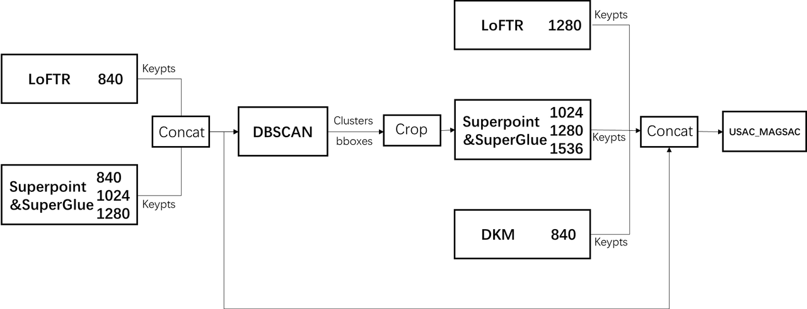

# Image Matching Challenge 2022（精简）

> 主题：cv ｜ 子类：— ｜ 领域：三维重建 ｜ 类别：Research ｜ 截止：2022-06-02 ｜ 队伍数：642 ｜ 指标：3D 重建精度
> 出处：`intel/image-matching-challenge-2022/`（80 条主题索引 + 6 篇 write-up 正文）

## 任务

多视角图像匹配与三维重建（该系列的早期届次，2022 → 2024 → 2025 逐年演进）。

## 关键要点

- 主办方提供 **LoFTR / DISK / DKM 的示例 notebook**（9th 特别致谢）——**官方基线材料把新手引入特征匹配领域**。
- 学习型特征匹配器（LoFTR/DISK/DKM）在当时已取代传统 SIFT 类方法，成为该系列的标准工具。
- 与 2024（ALIKED/LightGlue）、2025（场景聚类 + 重建）对照，可看到**工具链与任务设定的双重演进**。

## 可迁移要点

- **官方示例 notebook 是入门新领域的最短路径**。
- 特征匹配领域的技术更替很快（SIFT → SuperGlue/LoFTR → ALIKED/LightGlue），**关注当年主流工具**比记忆具体算法重要。

## 轻读结论（2026-10 补）

**一句话**：主办方明说本赛考"**后处理**"——前列队伍全用预训练匹配器 + 多分辨率集成 + 关键点筛选；特征匹配赛的 ROI 排序是 集成 > 筛选/裁剪 > 求解器调参 > 训练。

- 1st：两阶段 **mkpt_crop**（DBSCAN 保留 80~90% 匹配点簇 → 裁共视区 → 裁剪图上重匹配）→ 与阶段①关键点拼接 → RANSAC；7 个（模型×分辨率）组合。
- 2nd：自研 transformer 匹配器单模 **0.833/0.838（无 TTA）**；+QuadTree 0.854/0.848。
- 4th：多尺度（LoFTR 1000/1200/1400；SuperGlue 1200–2800；DKM 面积归一等）+ MAGSAC；**因 SuperGlue 许可证不能获奖，专门备"去 SuperGlue"路线**。
- 9th：后处理为王——MAGSAC 并行线程 + 预取让 TTA 翻倍；**SuperGlue 的正确 TTA = SuperPoint 跑 N 次、SuperGlue 做 N² 交叉配对**；公开 notebook 普遍存在的"关键点未回缩放"是公共 bug。

**裁决**：同模型多分辨率 ≈ 免费多样性；坐标回缩放要写成可测试的管线步骤；选型先核对许可证。

**悬案**：3rd/5th–8th 缺失；1st 无 mkpt_crop 单项消融；2nd 自研模型未开源。

## 图表证据

**图 1**（topic 329131）：关键点拼接 → DBSCAN → 共视区裁剪 → 多分辨率重匹配 → 拼接 → USAC_MAGSAC；阶段①关键点同时用于裁剪与最终集成。

## 出处

- 讨论区索引：`intel/image-matching-challenge-2022/topics.md`
- 1st（116 票）：https://www.kaggle.com/competitions/image-matching-challenge-2022/discussion/329131
- 2nd（45 票）：https://www.kaggle.com/competitions/image-matching-challenge-2022/discussion/329317
- 9th 详细报告（51 票）：https://www.kaggle.com/competitions/image-matching-challenge-2022/discussion/328796
- 4th（43 票，含许可证路线）：https://www.kaggle.com/competitions/image-matching-challenge-2022/discussion/328798
- 轻读全本：`analysis/deep/image-matching-challenge-2022.md`（Tier B 轻读：对照矩阵/裁决/证据分级/悬案 + 1 图证）
