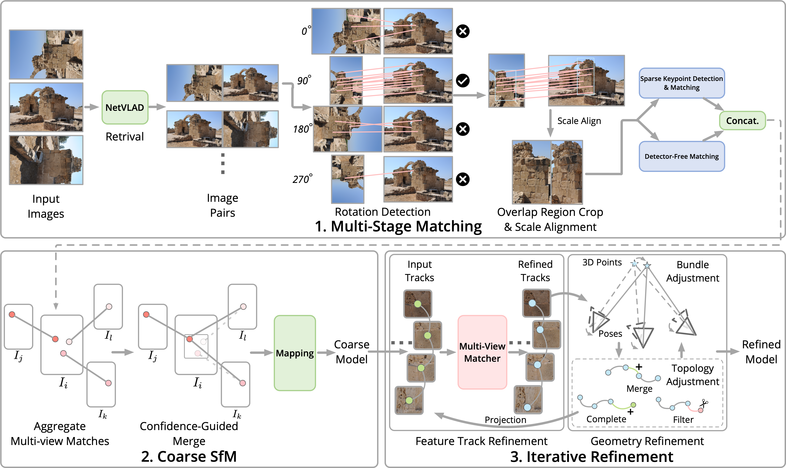

# Image Matching Challenge 2023（精简）

> 主题：cv ｜ 子类：— ｜ 领域：三维重建 ｜ 类别：Research ｜ 截止：2023-06-12 ｜ 队伍数：494 ｜ 指标：3D 重建精度
> 出处：`intel/image-matching-challenge-2023/`（80 条主题索引 + 6 篇 write-up 正文）

## 任务

多视角图像匹配与三维重建（IMC 系列 2022 → 2023 → 2024 → 2025 的中间届次）。

## 关键要点

- 1st 标题即方法骨架："**稀疏 + 稠密匹配组合**"（Sparse + Dense matching）。
- 2nd 的标题是"**赢过 COLMAP**"——说明该系列的参照系是**经典 SfM 流程 COLMAP**，目标是用学习型方法超越它（这正是本系列设立的初衷）。
- 5th 用 **kNN 短名单 + 旋转增强**。

## 可迁移要点

- **以经典流程为基准并试图超越它**，是该系列一贯的评测思路（与 G2Net 的"深度学习能走多远"、Smartphone GNSS 的经典方法对照同源）。
- 稀疏（关键点）+ 稠密（光流类）匹配的组合是 2023 年的主流。
- 检索（kNN 短名单）先行可大幅降低匹配成本。

## 轻读结论（2026-10 补）

**一句话**：IMC 2023 的战场从"匹配质量"转向 **SfM 系统本身**——1st 解决检测器无关匹配器的**多视角不一致**（置信度引导合并 + 粗到精精化，私榜 0.482→0.594）；2nd 与"**COLMAP 随机性**"搏斗（重复匹配取 8/10 稳定者 + 多阈值多次重建选优）；旋转图（cyprus）是公共坑（0.02→0.55）。

- 1st（ZJU/DFSfM）：多阶段匹配（检索→四方向旋转→重叠区裁剪→稀疏+稠密拼接）→ **置信度引导合并（NMS 窗口 5 + top-10k）** → COLMAP 粗建图（跳过几何验证、>40 图才启用 PBA）→ **迭代精化（Transformer 多视角匹配 + 几何 BA + 轨迹补全/合并/过滤）**；消融：SPSG 0.482 → +LoFTR 0.526 → +精化 0.570 → +DKMv3 0.594。
- 2nd：**穷举所有图像对**（丢弃检索模块）、SP/SG 无上限关键点 + 半精度 + 缓存、多尺度 TTA [1088/1280/1376]、旋转检测、显式选初始图像、**重复匹配取众数**、**多阈值多次重建选优**（<45 图），0.497/0.542→0.506/0.562。
- 5th：**kNN 短名单（按内点数）+ 补全**（代替全局描述子阈值）；4 旋转批量匹配（840×840）解决 cyprus。

**裁决**：IMC 系列的 ROI 排序 = SfM 一致性与随机性治理 > 更强匹配器；旋转图必须显式处理；图像对少时穷举最稳。

**悬案**：3rd/4th/6th/9th 未细读；1st 的精化训练细节未展开；大场景的多次重建替代方案缺失。

## 图表证据

**图 1**（topic 417407）：多阶段匹配 → 置信度引导合并 → 粗 SfM → 迭代精化（轨迹 + 几何）的完整闭环。

## 出处

- 讨论区索引：`intel/image-matching-challenge-2023/topics.md`
- 1st（84 票）：https://www.kaggle.com/competitions/image-matching-challenge-2023/discussion/417407
- 2nd 赢过 COLMAP（49 票）：https://www.kaggle.com/competitions/image-matching-challenge-2023/discussion/416873
- 5th kNN + 旋转（44 票）：https://www.kaggle.com/competitions/image-matching-challenge-2023/discussion/416816
- 3rd 降低随机性（29 票）：https://www.kaggle.com/competitions/image-matching-challenge-2023/discussion/417191
- 6th AffNetHardNet+AdaLAM（29 票）：https://www.kaggle.com/competitions/image-matching-challenge-2023/discussion/417045
- SfM 学习材料（75 票）：https://www.kaggle.com/competitions/image-matching-challenge-2023/discussion/401497
- 轻读全本：`analysis/deep/image-matching-challenge-2023.md`（Tier B 轻读：对照矩阵/裁决/证据分级/悬案 + 1 图证）
