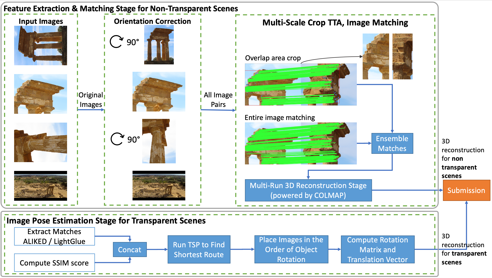

# Image Matching Challenge 2024

> 主题：cv ｜ 子类：— ｜ 领域：三维重建 ｜ 类别：Research
> 截止：2024-06-03 ｜ 队伍数：929 ｜ 机制：代码赛 ｜ 指标：3D 重建精度（mAA / 相机位姿）
> 数据来源：`intel/image-matching-challenge-2024/`（80 条主题索引 + 6 篇 write-up 正文）

## 1. 任务与数据

- 预测目标：由多视角图像重建**相机位姿与三维结构**（image matching → SfM）。
- 数据形态：多场景图像集（含离群图）；需要先聚类分组、再做特征匹配与位姿估计。
- 构造陷阱：
  - **离群图像**会破坏匹配；
  - 分辨率与纹理差异大；
  - 流程长（检索 → 匹配 → 几何验证 → 位姿求解），任一环失误都会传导。

## 2. 方案谱系

| 方案 | 名次 | 关键点 |
| --- | --- | --- |
| **高分辨率 ALIKED / LightGlue 流程** | 1st | 针对高分辨率图像优化特征提取与匹配；团队五人分工 |

## 3. 关键技巧

- **学习型局部特征 + 匹配器**（ALIKED/LightGlue 等）已成为该系列的主流工具。
- **几何验证**（RANSAC/基础矩阵）过滤误匹配。
- **离群图处理**（先聚类分场景）。
- 高分辨率下的预处理与内存管理。

## 4. 可迁移性评估

- **可直接迁移**：
  - 学习型特征 + 匹配器的组合（现代 SfM 标准件）；
  - 几何验证作为后处理（与伪造检测的几何验证同源）；
  - 长流程的分阶段调试策略。
- 需要前提：多视图几何与 SfM 工具链（COLMAP 等）。
- 不建议照搬：跳过几何验证（误匹配会直接毁掉重建）。

## 5. 对新手的关键启示

1. **几何验证是三维视觉任务的安全网**。
2. 该系列（IMC）连年举办，2024 → 2025 的问题设定与工具链可对比（见 2025 篇）。
3. 与 RECOD 伪造检测、Benetech 图表抽取对照：**"检索/匹配 + 几何验证"是通用范式**。

## 6. 轻读结论（2026-10 补）

**一句话**：IMC 2024 的新变量是**透明/反光场景 + 旋转图**——常规场景继续卷 ALIKED+LightGlue 与 SfM 工程，透明场景靠"**排序 + 圆周布相机**"的几何先验直接拿分（1st +0.03 LB）。

- 1st（510084）：匹配数阈值选图像对 + 逐图 DBSCAN 裁剪 + 4 向旋转取最优 + 缓存/双 GPU/多解 Horn 合并；透明场景用光流/像素差/SSIM/匹配数建距离矩阵 → TSP 排序 → 圆周摆位。
- 4th（510611）：**DINOv2 Segmenter 的 VOC2012 第 5 类 "bottle" 当前景掩码**，原尺度网格内匹配；穷举图像对；**使用 images 目录里全部图像（含 submission.csv 之外）** → 消融 priv 0.149→0.184→0.186→**0.197**。
- 2nd（510499）：MST 骨架 + 迭代加边的 SfM；自研全局描述子（ALIKED+DINO+VLAD）优于 NetVLAD（0.245/0.247 vs 0.241/0.230）。
- 3rd（510338）：VGGSfM 三条增量——补 2D 匹配（+3% 本地）、精化 SfM track（4096 条，重投影 0.64→0.55）、重定位未注册图（LB 0.17→0.20）。
- 8th（509902）：旋转找点 + Homography 校正后重匹配；simple-radial×2 + simple-pinhole 取最大模型。

**裁决**：新场景类别先找物理约束再调模型；工具换代跟社区验证走；数据目录与提交清单的差异要审计（白送的图像 +0.011）。

**悬案**：5th–7th 方案未细读；OmniGlue 的价值无进一步证据；透明场景评测细则未展开。

## 7. 图表证据

**图 1**（topic 510084）：非透明走 COLMAP I3DR、透明走 DIP（排序+圆周布相机）的双路管线；透明 trick +0.03 LB。

## 8. 出处

- 讨论区索引：`intel/image-matching-challenge-2024/topics.md`（80 条）
- 已收录 write-up（6 篇）：
  - 1st 高分辨率 ALIKED/LightGlue（96 票）：https://www.kaggle.com/competitions/image-matching-challenge-2024/discussion/510084
  - 4th "ALIKED+LightGlue is all you need"（46 票）：https://www.kaggle.com/competitions/image-matching-challenge-2024/discussion/510611
  - 8th（58 票）：https://www.kaggle.com/competitions/image-matching-challenge-2024/discussion/509902
  - 2nd（44 票）：https://www.kaggle.com/competitions/image-matching-challenge-2024/discussion/510499
  - 3rd（31 票）：https://www.kaggle.com/competitions/image-matching-challenge-2024/discussion/510338
- 轻读全本：`analysis/deep/image-matching-challenge-2024.md`（Tier B 轻读：对照矩阵/裁决/证据分级/悬案 + 2 图证）
