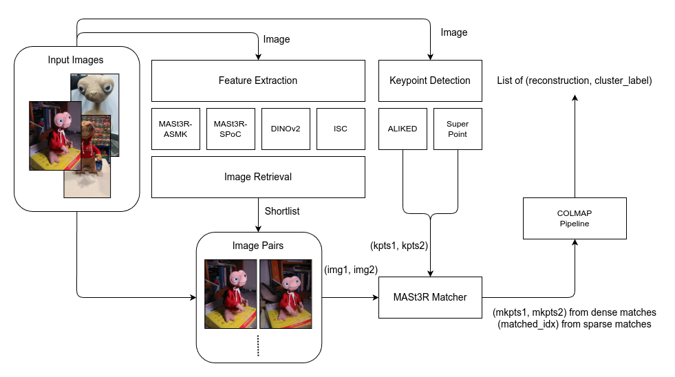

# Image Matching Challenge 2025

> 主题：cv ｜ 子类：— ｜ 领域：三维重建 ｜ 类别：Research
> 截止：2025-06-02 ｜ 队伍数：943 ｜ 机制：代码赛 ｜ 指标：场景聚类 + 位姿/结构精度
> 数据来源：`intel/image-matching-challenge-2025/`（80 条主题索引 + 6 篇 write-up 正文）

## 1. 任务与数据

- 预测目标：三件事的组合——① 把混在一起的图像**聚类为场景**；② 为每张图分配场景或判为离群；③ 完成匹配与三维重建。
- 数据形态：多场景混合图像（含故意插入的离群图）。
- 构造陷阱：
  - **离群图必须被识别并剔除**（否则污染聚类与重建）；
  - 聚类错误会连锁影响后续所有环节；
  - 指标同时考查聚类与几何精度。

## 2. 方案特征

| 类型 | 说明 |
| --- | --- |
| 领域入门帖（高价值） | 用最基础的语言讲清数据结构（scene / outlier）与任务定义——与 HMS、Waveform 的"领域解释帖"同一模式 |
| 主流流程 | 全局描述子检索聚类 → 学习型特征匹配（ALIKED/LightGlue）→ 几何验证 → 位姿求解 |

## 3. 关键技巧

- **两级结构**：先聚类（检索/图分割），再做几何。
- **离群检测**（相似度阈值 + 一致性检验）。
- **几何验证**过滤误匹配。
- 与 2024 届的工具链连续（该系列的方案可逐年迁移）。

## 4. 可迁移性评估

- **可直接迁移**：
  - **"先聚类分组、再做精细对齐"**的两级范式（实体匹配、文档聚类通用）；
  - 离群检测与剔除策略；
  - 系列赛工具链复用。
- 需要前提：检索 + 多视图几何能力。
- 不建议照搬：先做重建再聚类（顺序反了）。

## 5. 对新手的关键启示

1. **任务顺序很重要**：本场必须"先聚类、后重建"。
2. **离群样本处理是独立环节**，不能指望模型自动忽略。
3. 与 2024 届对照：**同一系列两年，问题从纯重建扩展到"聚类 + 重建"**——难度在演进。

## 6. 轻读结论（2026-10 补）

**一句话**：技术分水岭是 **3D 几何基础模型（MASt3R）**——1st 用它替换检测器系匹配器并把分数从 42–45 推到约 50（"配对越多分越高"）；其余队伍的主战场是**图像对选择**（同场景二分类剪枝、动态 top-k、多种检索并集）。

- 1st（583058）：短名单 = MASt3R-ASMK/SPoC + DINOv2 + ISC 并集；MASt3R 做半稠密 + 其他检测器关键点的统一匹配；接官方 COLMAP 管线；弃用预聚类。
- 4th（582959）：RDD（可变形 Transformer，CVPR25）+ 基准 DINOV2+ALIKED+LightGLUE；check_orientation 加 0.9 置信阈值；**同场景二分类器（MegaDepth 扩充，验证 99%）剪错对 → 直接剪会掉分 → NetVLAD 补偿（≥20 对，≤0.12n）**。
- 10th（582898）：全部精力在**动态 top-k 配对**（防视觉混淆场景跨簇污染），配对后用朴素 ALIKED-LightGlue+pycolmap。
- 社区：理论入门（57 票）、公榜与本地分数（52 票）、VGGT 跟踪 + 位姿精化（28 票）。

**裁决**：匹配器换代到几何基础模型后，瓶颈转移到"选对子"；配对剪枝必须有下限补偿；预聚类在强匹配器下冗余。

**悬案**：2nd/3rd/5th–9th/12th–15th 方案缺失；MASt3R 的量化对照缺失；RDD 消融未展开。

## 7. 图表证据

**图 1**（topic 583058）：四种检索并集 → 短名单；关键点检测 + MASt3R 匹配 → COLMAP 建图。

## 8. 出处

- 讨论区索引：`intel/image-matching-challenge-2025/topics.md`（80 条）
- 已收录 write-up（6 篇）：
  - 1st（66 票）：https://www.kaggle.com/competitions/image-matching-challenge-2025/discussion/583058
  - 入门理论帖（57 票）：https://www.kaggle.com/competitions/image-matching-challenge-2025/discussion/573183
  - 4th（35 票）：https://www.kaggle.com/competitions/image-matching-challenge-2025/discussion/582959
  - 10th（32 票，动态 top-k）：https://www.kaggle.com/competitions/image-matching-challenge-2025/discussion/582898
  - 11th（33 票）：https://www.kaggle.com/competitions/image-matching-challenge-2025/discussion/583097
  - 往届方案（42 票）：https://www.kaggle.com/competitions/image-matching-challenge-2025/discussion/571280
  - VGGT 跟踪（28 票）：https://www.kaggle.com/competitions/image-matching-challenge-2025/discussion/582968
- 轻读全本：`analysis/deep/image-matching-challenge-2025.md`（Tier B 轻读：对照矩阵/裁决/证据分级/悬案 + 1 图证）
