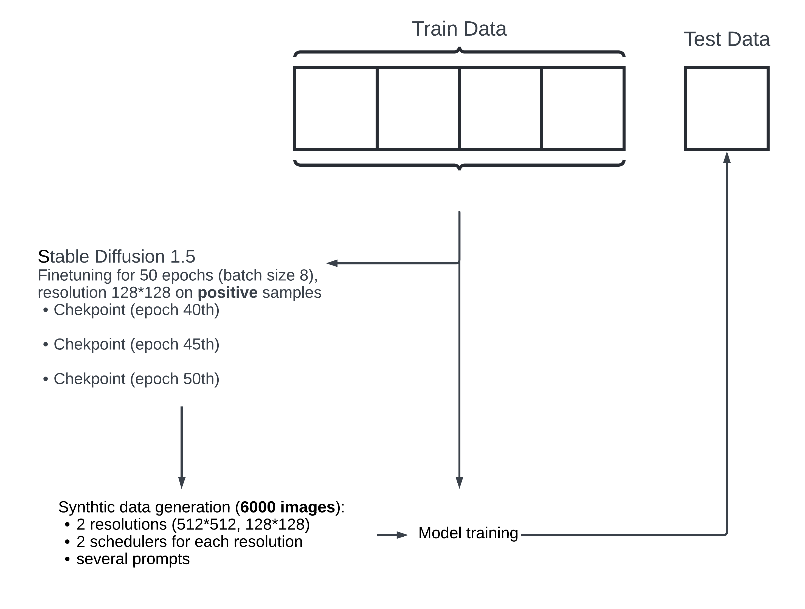
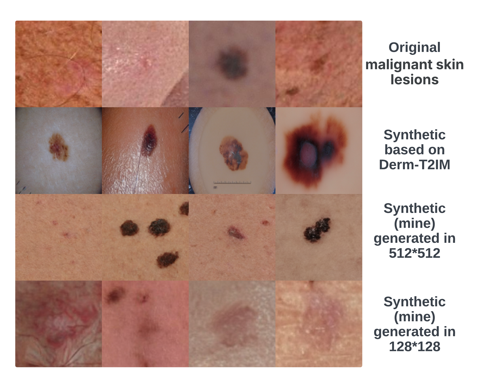
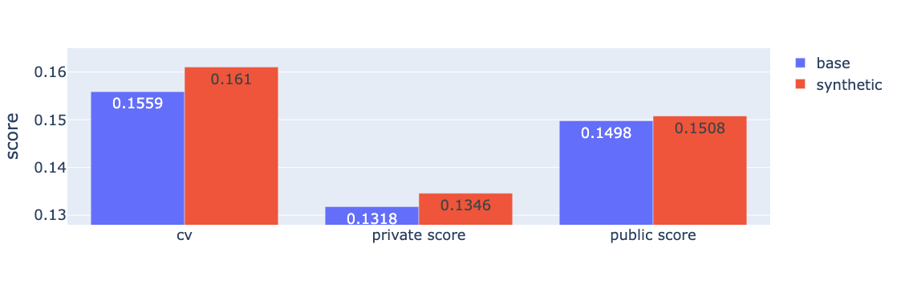
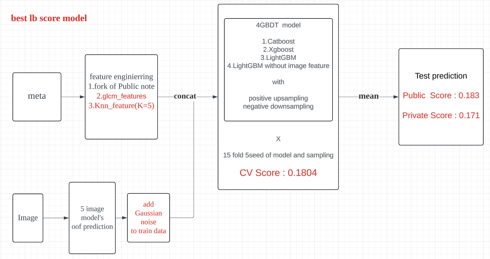
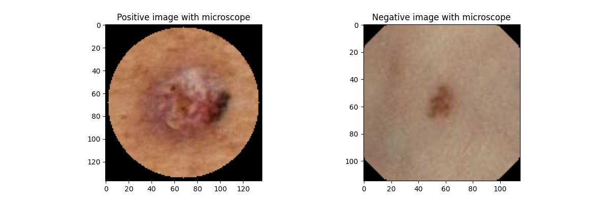

# ISIC 2024 - Skin Cancer Detection with 3D-TBP

> 主题：cv（医学影像 + 表格）｜ 子类：— ｜ 领域：医疗 ｜ 类别：Research
> 截止：2024-09-06 ｜ 队伍数：2739 ｜ 机制：代码赛 ｜ 指标：pAUC-aboveTPR（高 TPR 区间的部分 AUC）
> 数据来源：`intel/isic-2024-challenge/`（80 条主题索引 + 6 篇 write-up 正文；深读升级 2026-10-03，Tier A #31）

## 1. 任务与数据

- 预测目标：由皮肤病变的 **3D 全身摄影（3D-TBP）裁剪图** + 患者元数据判断恶性。
- 数据形态：**图像 + 丰富表格元数据**（tbp_* 系列）；正样本极稀少——**393 恶性 vs 40 万+ 良性（≈0.1%，1:1000）**。
- 构造陷阱：
  - pAUC-aboveTPR 只统计高 TPR 区间 → **头部排序**决定分数，阈值/校准无关，排名可比性（rank/标准化）关键；
  - 极端不平衡：采样比率与训练 epoch 强耦合（激进采样 3 epoch 够、温和采样要 50–200 epoch）；
  - 图像 OOF 当特征存在**早停乐观**回路（验证集选 epoch → OOF 偏乐观 → GBDT 过拟合 CV）；
  - 往届 ISIC 数据与本域分布差异巨大（域分类器 AUC 0.99），直接混训失败。

## 2. 验证方案

| 方案 | 使用者 | 说明 |
| --- | --- | --- |
| Triple Stratified Leak-Free KFold | 2nd / 12th | 患者隔离 + 每患者恶性比例分层 + 患者图像数分箱；5 折 |
| Stratified Group KFold + 10 seed 配对 t 检验 | 1st | scipy `ttest_rel` 的 p 值做特征准入；只测最重要改动（控多重比较）；后期降到 p<0.2 并靠公榜（代价见 §7） |
| 5 seed 预筛 + LB 确认 | 9th | 每个特征先用 5 种 seed 组合验证，改进后再上 LB 确认 |
| 图像 OOF + 高斯噪声 | 1st / 12th | 抵消早停乐观；1st 用 LB 探针在 σ=0.02–0.12 中选定 0.1 |

## 3. 方案谱系

| 方案 | 名次 | 关键点与数字 |
| --- | --- | --- |
| GBDT 集成 + 图像 OOF 特征 + 患者内 LOF | 1st（149 票） | CatBoost/LGBM/XGB × 5 折 × 10 seed = 150 模型（<20 分钟）rank 平均；LOF 特征 CV 0.18149→0.18185；EVA02-small + EdgeNeXt-base（1:1 batch）；OOF 标准化 + 相对患者均值比率 + 高斯噪声 σ=0.1；往届 3 类预训练私榜 0.163→0.165；SD1.5 合成 6000 张（个体更优、集成未用） |
| GBDT 集成 + 9 图像模型 / 5 训练设置 | 2nd（71 票） | 54 GBDT（18 变体 × 3 算法）seed 平均 n=5；患者内标准化 + Tabular Ugly Ducklings；图像 CV 0.1515–0.1612（resnext50 最佳）；外部数据放弃（域分类器 AUC 0.99） |
| 3 tabular pipeline × 3 backbone + hill-climb | 9th（81 票） | pipeline CV 0.177/0.175/0.175、LB 0.183/0.183/0.180；blend 0.186；最终 CV 0.182 / LB 0.187；5% 负样本 + 正样本 ×10、**3 epoch**；A.Resize 位置 bug 修复 0.148→0.154–0.155 |
| 4 GBDT + GLCM/KNN 特征 + 加噪 OOF | 12th（65 票） | KNN(k=5) ugly duckling + GLCM + age 差分；4 GBDT（含 1 个无图像特征）× 15 折 × 5 seed；best LB 0.183/0.171；FTTransformer 与伪标签失败 |
| 往届数据上采样数据集 | 社区（296 票） | ISIC 2017–2020 统一格式 JPEG（224/256）：2020 32542/584、2019 20809/4522、2018 8197/785 |

## 4. 关键技巧

- **GBDT 元模型 + 图像 OOF 当特征**：图像单模型 LB ~0.15，融合后 ~0.18（9th/12th）——表格是主信息源，图像是增量；GBDT 能条件化图像分数并学交互，直接加权做不到。
- **OOF 特征必须去乐观**：per-model 标准化/rank + 高斯噪声（1st σ=0.1、12th 加噪）；否则早停的验证集信息会让 CV 虚高。
- **患者内相对特征（ugly duckling）**：LOF（1st）、患者内 z-score + Tabular Ugly Ducklings（2nd）、KNN(k=5)（12th）——"对本人罕见的病变更可疑"是领域先验。
- **采样强度 ↔ epoch 预算**：9th 的 5% 负样本 + ×10 正样本配 3 epoch；2nd 的 1:3–1:5 配 50–200 epoch；两者是同一参数（正样本曝光量）的两种设置。
- **外部数据边界**：预训练式有效（1st 私榜 +0.002）；混训失败（2nd/12th）；**域分类器 AUC 0.99** 是量化"能不能混"的工具；往届阳性率先验 1.8%–18% vs 本届 0.1%，混训等于改任务。
- **合成数据两层评估**：SD1.5 合成 6000 张让单模型 CV/公/私榜全面略优（图证），但加入最终集成无增益——单模型增益 ≠ 集成增益。
- **排序指标集成**：先 rank 再平均（1st）；hill-climb 搜权重（9th）；反例：0.5 缩放/rank ensemble 反而无效（9th）。
- **增广顺序是检查项**：A.Resize 放错位置（列表开头）导致 LB 卡 0.148，移到归一化前 → 0.154–0.155（9th）。

## 5. 可迁移性评估

- 可直接迁移：图像 OOF 特征 + GBDT 元模型；患者内相对化特征；采样-epoch 耦合设计；域分类器量化外部数据可用性；合成数据"失败区覆盖/误差相关性"评估法；多 seed t 检验的改进入门标准。
- 需要前提：丰富表格元数据（本场 tbp_* 系列）；患者标识可分组（避免泄漏）；GPU 训练 + GPU GBDT 的工程能力。
- 不建议照搬：直接混入往届数据（先验与域双重漂移）；无元数据的纯图像赛套用本骨架；把 LB 当主要决策依据（1st 的教训）。

## 6. 对新手的关键启示

1. 图像 + 表格混合赛的默认骨架是"GBDT 主模型 + 图像 OOF 当特征"，不是"多模型加权平均"。
2. OOF 特征有回路风险：凡是用验证集选过 epoch 的预测，当训练特征前必须加噪或换独立划分。
3. 医学筛查的通用特征工程是"患者内相对化"——绝对值不如"对本人是否异常"。
4. 小提升（≤0.002）先过多 seed 配对检验；公榜可以确认结论，不能替代 CV。
5. 外部/合成数据的正确性问题要用**定量工具**回答：域分类器 AUC、误差相关性、失败区覆盖。

## 7. 深读结论（2026-10 补）

**一句话**：这是一场"元模型工程"比赛——树模型是主体，图像模型是特征源，患者是归一化单位，CV 纪律决定公私榜排名。

**跨方案裁决**：

- 图像 OOF 当特征是四队共识（4/4）；数字层级：图像线 ~0.15 vs 融合 ~0.18。
- 患者内相对特征三队独立采用（LOF / 患者标准化 / KNN），高置信。
- 外部数据：预训练有效、混训失败（AUC 0.99 + 先验差 1–2 个数量级）——T8 的又一强证据。
- 合成数据：个体全面更优（有图证）但集成无增益（未采用）——T4 的"合成要覆盖失败区"。
- CV/LB 张力：1st 自述后期降低检验阈值、转向公榜 → 公榜更好、私榜略差；未收录的 7th/8th/13th 标题（"Trust your CV"等）反向印证。

**数字账精选**：393 vs 40 万+；150/54 模型 GBDT；LOF +0.00036；往届预训练私榜 +0.002；合成个体 CV +0.005/私榜 +0.003；σ=0.1；9th 3 epoch / 5% 负样本；12th 15 折 × 5 seed；域分类器 AUC 0.99。

**失败学**：混训往届数据、伪标签、hard negative、focal loss、mixup 进集成、stacking、0.5 缩放/rank 集成、Dullrazor/发丝增广、scratch 训练、FTTransformer、聚类 z-score；工程坑 A.Resize 顺序。

**悬案**：3rd/4th/7th/8th/13th/11th/54th 方案未收录；Public 1st/Private 24th 极端案例（532564）未收录；LB probing 讨论（517139）未收录；合成"个体-集成"悖论缺误差相关性实证。

## 8. 图表证据

> 路径相对本文件（`notes/cv/`）：`../../intel/isic-2024-challenge/bodies/<topic>_img/NN.png`

**图 1：1st 的合成数据生成管线（SD1.5 → 6000 张 → 训练）**

*图：合成数据流程（原帖 https://www.kaggle.com/competitions/isic-2024-challenge/discussion/533196 ）*

- 在正样本上微调 SD1.5（50 epoch、batch 8、128×128），取 40/45/50 三个 checkpoint；
- 2 分辨率（512/128）× 2 scheduler × 多 prompt 生成 6000 张；
- 正文只写"生成合成数据"，**图给出完整配方与规模**——文字与图的信息差。

**图 2：真实恶性 vs Derm-T2IM 合成 vs 1st 自产合成**

*图：四行对比（原帖 topic 533196）*

- Derm-T2IM 产物带培养皿/标尺类伪影；1st 自产 512 图常出现多颗独立痣（偏离单病变输入分布）；128 图较接近真实但模糊；
- **合成缺陷肉眼可辨**——解释为何"个体更好、集成无用"且最终未采用。

**图 3：合成 vs 基线个体的 CV/公榜/私榜**

*图：base vs synthetic 柱状对比（原帖 topic 533196）*

- synthetic 全面更优：CV 0.1559→0.161、私榜 0.1318→0.1346、公榜 0.1498→0.1508；
- 与"最终集成未采用"合读，是"单模型增益 ≠ 集成增益"的直接图证。

**图 4：12th 的 best LB 模型结构（GLCM + KNN + 加噪 OOF + 4 GBDT）**

*图：best LB score model（原帖 https://www.kaggle.com/competitions/isic-2024-challenge/discussion/532642 ）*

- meta 线：公共 notebook + GLCM + KNN(k=5)；image 线：5 模型 OOF + 高斯噪声；
- concat → 4 GBDT（含 1 个不用图像特征）× 15 折 × 5 seed → mean；公榜 0.183 / 私榜 0.171 / CV 0.1804；
- **本场标准骨架的结构图**（正上采样/负下采样也在图中标注）。

**图 5：microscope 增广示例（正/负样本）**

*图：microscope augmentation（原帖 https://www.kaggle.com/competitions/isic-2024-challenge/discussion/517141 ）*

- 叠加圆形视场 + 黑色背景，模拟显微镜/皮肤镜拍摄风格；来自历届 ISIC 冠军配方；
- 与"域分类器 AUC 0.99"对照：设备风格增强是缩小域差异的低成本手段。

## 9. 出处

- 讨论区索引：`intel/isic-2024-challenge/topics.md`（80 条）
- 已收录 write-up（6 篇）：
  - 1st（149 票）：https://www.kaggle.com/competitions/isic-2024-challenge/discussion/533196
  - 2nd（71 票）：https://www.kaggle.com/competitions/isic-2024-challenge/discussion/532704
  - 9th（81 票）：https://www.kaggle.com/competitions/isic-2024-challenge/discussion/532577
  - 12th（65 票）：https://www.kaggle.com/competitions/isic-2024-challenge/discussion/532642
  - 数据帖（296 票）：https://www.kaggle.com/competitions/isic-2024-challenge/discussion/515356
  - 增广帖（67 票）：https://www.kaggle.com/competitions/isic-2024-challenge/discussion/517141
- 深读全本：`analysis/deep/isic-2024-challenge.md`（11 组件 + 5 图证）
- 缺口登记（未收录正文）：3rd/4th/7th/8th/11th/13th/54th 方案帖 + Benchmarking(527023) + LB probing(517139) + Public1st-Private24th(532564)
