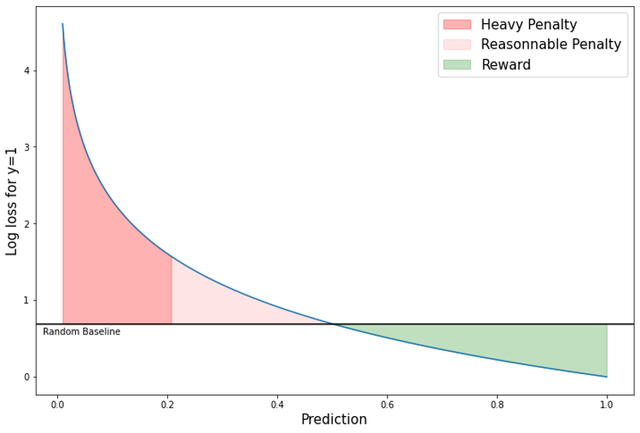

# Mayo Clinic - STRIP AI（卒中血栓起源分类）

> 主题：cv ｜ 子类：— ｜ 领域：医疗影像（病理）｜ 类别：Research
> 截止：2022-10-05 ｜ 队伍数：888 ｜ 机制：代码赛 ｜ 指标：多分类（血栓来源）
> 数据来源：`intel/mayo-clinic-strip-ai/`（80 条主题索引 + 6 篇 write-up 正文）

## 1. 任务与数据

- 预测目标：由取出的血栓**病理切片图像**判断其来源（心脏/大动脉等），指导卒中治疗。
- 数据形态：超大病理图像（WSI）+ 多类别标签；样本量小。
- 构造陷阱：WSI 需切块；类别不平衡；染色差异。

## 2. 方案特征

| 类型 | 说明 |
| --- | --- |
| **社区高价值材料：图像分类检查清单** | 本场最高票是一份**图像分类流程清单（cheat-sheet）**，汇集数据预处理/EDA/建模各环节的链接与论文——与"领域解释帖"同属**公共学习资产** |
| 主流方案 | WSI 切块 + CNN 分类 + 多模型集成 |

## 3. 关键技巧

- **流程清单优先于具体技巧**：本场的最高价值内容是一份系统化的检查清单（数据 → 预处理 → 模型 → 集成）。
- WSI 切块与染色归一化（与 HuBMAP/UBC-OCEAN 同源）。
- 类别不平衡的处理（重采样/重加权）。

## 4. 可迁移性评估

- **可直接迁移**：
  - **建立自己的"任务检查清单"**（比零散技巧更有效）；
  - WSI 的切块 + 特征聚合流程；
  - 类别不平衡的标准处理。
- 需要前提：病理图像处理能力。
- 不建议照搬：直接整图训练。

## 5. 对新手的关键启示

1. **社区检查清单（cheat-sheet）类材料的价值被低估**——本场最高票就是它。
2. 医学图像任务的通用流程已高度标准化（切块 → 归一化 → 分类/分割 → 后处理）。
3. 与 HuBMAP、UBC-OCEAN 对照：**病理 WSI 任务的三件套 = 切块、染色归一化、聚合**。

## 6. 轻读结论（2026-10 补）

**一句话**：信号极弱 + 公榜仅 20 样本的医学赛——**一切靠分组 CV + 分数尺度校准**；权重 log-loss 对"自信的错"惩罚极重，把输出压进 [0.25,0.75] 反而是最优策略之一。

- 1st（67 票）：最暗 16 块 + swin-large + attention pooling；MoCo-v3 预训练把五折方差 0.30→0.15；5 折 StratifiedGroupKFold(patient)。
- 2nd：**冻结 EffNet-B0 + 单 FC（513 参数）**；行间差筛血块 + 去重 + 随机 20 块；**按诊所分组 CV**；6 折集成。
- 5th（33 票）：背景色归一化 + 去白块/去重；小模型集成 + label smoothing（故意欠拟合）；**[0.15,0.85] 缩放 + [0.25,0.75] 截断** → CV 0.640/pub 0.733/priv 0.666。
- 25th：自研 MIL + 预计算 16×1024² 实例（JPEG q100、按像素和 top-16）。

**裁决**：低信号赛先验证"是否有信号"（AUC 是否显著高于 0.5），再用分组 CV + 欠拟合 + 指标校准拿稳定分；不要追公榜。

**悬案**：3rd/4th/6th 方案缺失；各队 CV 口径不可比；样本提交基线（≈0.69）的精确数值缺失。

## 7. 图表证据

**图 1**（topic 358029）：log-loss 随预测值变化的三个区（重罚 <0.2 / 合理 0.2–0.5 / 奖励 >0.5）+ 随机基线——低 AUC 模型压低置信度更安全的直接依据。

## 8. 出处

- 讨论区索引：`intel/mayo-clinic-strip-ai/topics.md`（80 条）
- 已收录 write-up（6 篇）：
  - 图像分类检查清单（107 票，本场最高票）：https://www.kaggle.com/competitions/mayo-clinic-strip-ai/discussion/335726
  - 1st（67 票）：https://www.kaggle.com/competitions/mayo-clinic-strip-ai/discussion/357892
  - Transformer MIL 方案（47 票）：https://www.kaggle.com/competitions/mayo-clinic-strip-ai/discussion/337902
  - 2nd（EffNet-B0+smart tiling）：https://www.kaggle.com/competitions/mayo-clinic-strip-ai/discussion/358089
  - 5th（33 票）：https://www.kaggle.com/competitions/mayo-clinic-strip-ai/discussion/358029
  - 5th 秘方（log-loss 尺度）：https://www.kaggle.com/competitions/mayo-clinic-strip-ai/discussion/357877
  - 25th 自研 MIL：https://www.kaggle.com/competitions/mayo-clinic-strip-ai/discussion/357898
- 轻读全本：`analysis/deep/mayo-clinic-strip-ai.md`（Tier B 轻读：对照矩阵/裁决/证据分级/悬案 + 1 图证）
