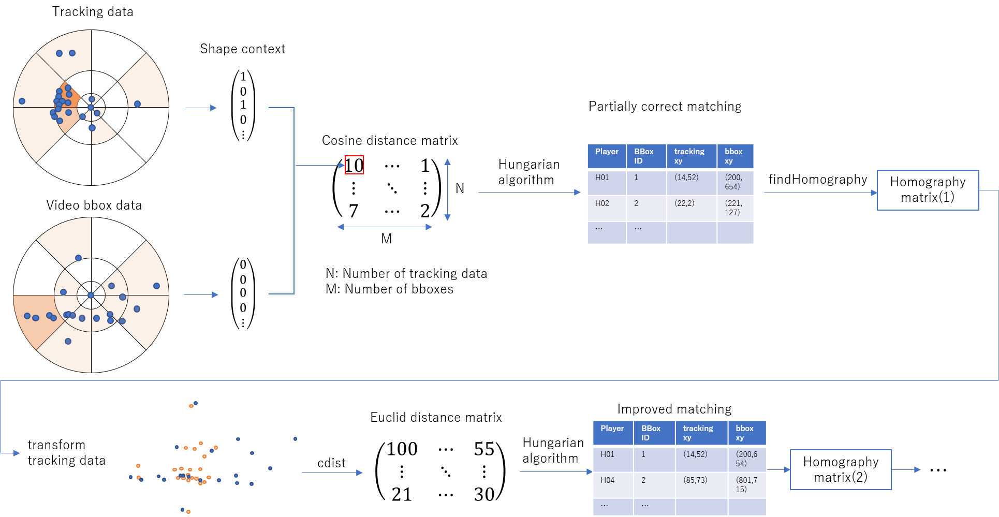
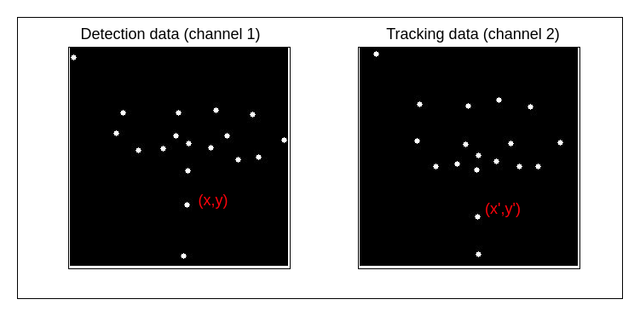
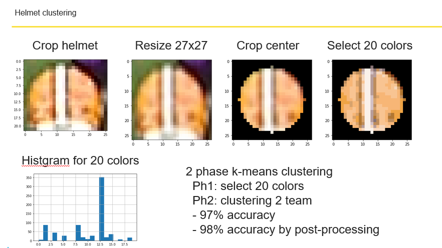
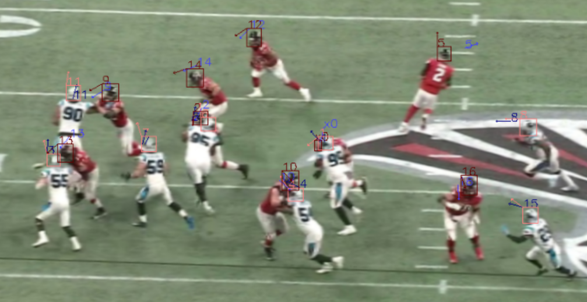
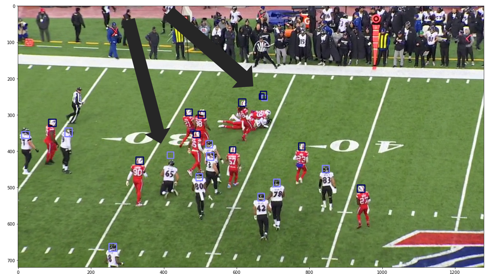

# NFL Health & Safety - Helmet Assignment

> 主题：cv（体育视频的多目标配准/跟踪）｜ 子类：tracking ｜ 领域：体育/安全 ｜ 类别：Featured
> 截止：2021-11-02 ｜ 队伍数：825 ｜ 机制：代码赛 ｜ 指标：NFL Helmet Identification（头盔-球员分配评分）
> 数据来源：`intel/nfl-health-and-safety-helmet-assignment/`（80 条主题索引 + 6 篇 write-up 正文；深读升级 2026-10-03，Tier A #53）

## 1. 任务与数据

- 预测目标：从比赛转播视频中检测头盔，并把它分配给官方追踪数据中的具体球员（帧级/身份级评分）。
- 数据形态：视频帧 + 官方追踪点集（GPS/传感器）；场边人员、遮挡、景深变化。
- 构造陷阱：
  - 检测漏检直接扣分（冲撞中的头盔）；
  - **注册（配准）难**：图像点集 ↔ 追踪点集，含外点（sideliner/假阳性）；
  - 头盔位置 ≠ 身体位置（站立/蹲/倒地）；
  - 代码赛运行时间约束（帧率）。

## 2. 验证方案

| 方案 | 使用者 | 说明 |
| --- | --- | --- |
| 逐帧分配一致性 + 轨迹投票 | 1st/9th/10th | 跟踪后再分配，降低单帧噪声 |
| 晚提交对照（YOLO vs baseline） | 9th | 用晚提交量化检测改动 +0.057 |
| 公共 baseline（Rob 的 notebook） | 9th/10th | 以公共管线为起点，聚焦配准/跟踪 |

## 3. 方案谱系

| 方案 | 名次 | 关键点与数字 |
| --- | --- | --- |
| 六模块：两阶段检测+鸟瞰图+ICP+球队分类+IoU 跟踪+分配矩阵 WBF | 1st（327 票） | 检测尺寸归一化；U-Net 鸟瞰（bottleneck 全局+decoder 残差+bbox attention）；**ICP 解 4 参数**；球队相似矩阵（ArcFace+伪标 ~97%）；频率/置信/帧距加权重分配；4 检测器集成；仅 helmets.csv 映射 ≈**0.8**、>10fps GPU |
| YOLOv5 + 聚类/朝向/gap + 地面线 + SORT | 2nd（76 票） | 1664 上采样小头盔；2 阶段 K-means 球队聚类 **97→98%**；CenterNet 朝向与头盔-传感器 gap；地面线解析变换（宽高比/梯形/旋转）；线性分配+候选裁剪；SORT+颜色阶跃特征 |
| YOLOv5x + shape context + homography + DeepSORT | 9th（64 票） | 修 impact 漏检（**+0.057**）；shape context 描述子→余弦距离→Hungarian→LMEDS→ICP 迭代；旋转/缩放暴力搜索；前 60 帧选优 homography；零行自适应处理假阳性；DeepSORT 票选分配 |
| YOLOv5 + 回归 mask + DeepSORT/SiamRPN | 10th（61 票） | EffNetB0+UNet；2 通道输入（检测点/追踪点）→2 通道 x/y 回归，L1 仅在追踪点；CV 0.7→**0.9**（跟踪），公 0.85/私 0.86 |
| 上届冠军索引 | 社区（59 票） | 2020 Impact Detection 前 10 链接；共性：两阶段（2D 检测→3D 分类）、EffDet/YOLO |

## 4. 关键技巧

- **检测尺寸归一化**：先预测平均头盔尺寸 → 重采样 → 高分辨固定尺度检测（1st）；小头盔上采样训练（2nd）；修漏检（9th）。
- **配准四路线**：学习型鸟瞰图+ICP（1st）、地面线解析几何（2nd）、shape context+homography（9th）、x/y 回归 mask（10th）。
- **外点鲁棒**：LMEDS/迭代修错配（9th）、零行+自适应 ignore（9th）、矩形候选裁剪（2nd）、前后处理剔场边（1st）。
- **辅助特征**：球队颜色聚类（K-means 或 ArcFace 相似矩阵）、球员朝向、头盔-传感器 gap。
- **跟踪再分配**：IoU/SORT/DeepSORT/SiamRPN；按频率+置信+帧距加权；DeepSORT 票选标签迭代。
- **身份层融合**：WBF 作用在球员-分配矩阵上（多模型/多帧加权 → Hungarian）。
- **速度约束**：映射+配准模块单独即强基线（~0.8、>10fps）；提前设计运行时间。

## 5. 可迁移性评估

- 可直接迁移：四段式（检测→映射→配准→跟踪）；点集配准与鲁棒外点处理；尺寸归一化检测；辅助特征修正几何距离；身份层融合；代码赛速度设计。
- 需要前提：官方追踪数据（已知点集）；视频帧与追踪时间戳对齐；GPU 推理预算。
- 不建议照搬：显式相机矩阵优化（局部极小）；忽略场边/假阳性；在检测层做多模型融合。

## 6. 对新手的关键启示

1. 检测与配准要分开优化：先跑通"映射+配准"基线（本场 ~0.8）。
2. 把问题看成"带外点的点集配准"：描述子+鲁棒估计（LMEDS/RANSAC）比显式相机模型稳。
3. 辅助特征（队伍颜色、朝向、身体-头盔 gap）能直接减少错误匹配。
4. 跟踪不是锦上添花：跨帧一致性把单帧 0.7 抬到 0.9。
5. 融合要放在身份/分配层（矩阵加权+Hungarian）。

## 7. 深读结论（2026-10 补）

**一句话**：这是一场"配准 + 跟踪"的转播视频追踪赛——检测决定下限，几何映射/配准与跨帧一致性决定名次。

**跨方案裁决**：

- 检测漏检必修（9th +0.057；2nd/1st 的尺寸策略）。
- 配准是主战场，四条路线（学习/解析/描述子/回归）都有效，关键是外点鲁棒。
- 辅助特征（队伍/朝向/gap）显著提升匹配。
- 跟踪再分配是第二大增益（10th 0.7→0.9）。
- 显式相机模型脆弱（9th 的失败）；融合在分配矩阵层（1st）。
- 速度是隐藏约束（>10fps、映射单模块 ~0.8）。

**数字账精选**：9th +0.057；10th CV 0.7→0.9；2nd 聚类 97→98%；1st 映射 ~0.8/>10fps；9th 搜索参数（π/500、60 帧、DeepSORT 参数表）。

**失败学**：9th 的 FairMOT/ByteTrack/Tracktor++、YOLOX、运动学数据、相机矩阵；其余队的失败清单未收录（缺口）。

**悬案**：3rd（YOLOv5+DeepSort+ICP+Hungarian）/4th/5th 未收录；1st 的 6 张图（消融）未入库；2020 前 10 方案链接未展开。

## 8. 图表证据

> 路径相对本文件（`notes/cv/`）：`../../intel/nfl-health-and-safety-helmet-assignment/bodies/<topic>_img/NN.ext`

**图 1：shape context 流程（topic 284940）**

- 追踪点集/bbox 点集各算 shape context → 余弦距离 → Hungarian → findHomography → 欧氏距离精配准 → 迭代；
- 带外点的点集配准完整流程。

**图 2：回归配准（topic 284945）**

- 通道 1=检测点、通道 2=追踪点；输出 x/y 回归 mask；L1 仅在追踪点；
- 把配准变成像素空间位移回归。

**图 3：球队聚类（topic 285112）**

- 裁剪→27×27→中心→20 代表色→直方图→2 阶段 K-means；
- 97%→98%（跟踪一致性后处理）。

**图 4：朝向预测（topic 285112）**

- 头盔框上叠加预测朝向（红主队/橙客队）；
- 朝向偏差作为匹配距离的惩罚项。

**图 5：gap 修正（topic 285112）**

- 倒地/蹲姿球员的头盔框按预测 gap 修正，使几何距离更接近身体位置。

*（1st 的 6 张图未入库，已在缺口登记。）*

## 9. 出处

- 讨论区索引：`intel/nfl-health-and-safety-helmet-assignment/topics.md`（80 条）
- 已收录 write-up（6 篇）：
  - 1st（327 票）：https://www.kaggle.com/competitions/nfl-health-and-safety-helmet-assignment/discussion/284975
  - 欢迎帖（86 票）：https://www.kaggle.com/competitions/nfl-health-and-safety-helmet-assignment/discussion/263939
  - 2nd（76 票）：https://www.kaggle.com/competitions/nfl-health-and-safety-helmet-assignment/discussion/285112
  - 9th（64 票）：https://www.kaggle.com/competitions/nfl-health-and-safety-helmet-assignment/discussion/284940
  - 10th（61 票）：https://www.kaggle.com/competitions/nfl-health-and-safety-helmet-assignment/discussion/284945
  - 上届冠军索引（59 票）：https://www.kaggle.com/competitions/nfl-health-and-safety-helmet-assignment/discussion/263991
- 深读全本：`analysis/deep/nfl-health-and-safety-helmet-assignment.md`（11 组件 + 5 图证）
- 缺口登记：3rd(285076)、4th(285007)、5th(285286) 未收录正文；1st 图未入库
