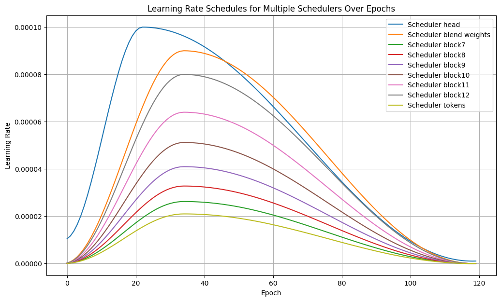

# PlantTraits2024（精简）

> 主题：cv ｜ 子类：— ｜ 领域：植物表型 ｜ 类别：Research ｜ 截止：2024-06-02 ｜ 队伍数：398 ｜ 指标：多性状回归
> 出处：`intel/planttraits2024/`（80 条主题索引 + 6 篇 write-up 正文）

## 任务

由植物照片 + 少量环境数据预测多种**植物性状**（多目标回归，植物表型分析）。

## 关键要点

- 本场高票材料是**分割技术/机器视觉方法综述**（"Machine Vision for Plant Phenotyping"）——与 Mayo 的图像分类检查清单同类：**方法综述类公共材料**。
- 多目标回归（多个性状）+ 图像输入 → 典型"图像 + 表格"混合任务（与 CSIRO 生物量、ISIC 同类）。
- 数据规模较小（398 队）→ 迁移学习与强增强为主。

## 可迁移要点

- 多性状回归可共享主干 + 多头（与 TLVMIC、Equity 的多任务思路一致）。
- 植物表型/农业视觉是 Kaggle 的稳定细分方向（CSIRO、PlantTraits 等）。
- **方法综述帖是快速补领域的捷径**。

## 轻读结论（2026-10 补）

- **1st PlantHydra（29 票）**：三头 = 回归（归一化性状）+ 分类（**17,396 个"物种"**）+ 软分类（按 softmax 对物种性状加权求和），权重可训练；DINOv2 ViT-b/l + PlantCLEF 2024 植物域预训练；元数据用 Structured Self-Attention（PCA 失败）；损失 = R²+cosine / focal / 未归一化 R²；头与骨干用不同 LR schedule（见下图）；MoE 混合不同模型。CutMix 与 SD 目标无效（510393）。
- **9th**：DINOv2 giant embedding + 表格 → CatBoost（原生处理 embedding），private **0.51238**；2 阶多项式小增益；不同 embedding 的融合无效（510188）。
- **6th AutoGluon**：TIMM 图像特征 + 表格 → Transformer 融合；标签链；EVA large 336 = 0.483、eva02_448 = 0.486、vit_large 0.43、swin_large 0.419；再 stacking → **0.526**；多图/物种未提升（510143）。
- **赛事事故**：有选手用 `sample_submission.csv` 刷榜 → 官方更新测试集并重置 LB（486503）；**提交列顺序必须与 sample_submission 完全一致**（487985）。

## 图表证据

**图**（topic 510393）：head 峰值 1e-4 最早 warmup，blend weights 次之，backbone block7–12 逐层降低（8e-5→2e-5），tokens 最低——"头高 LR、骨干低 LR"的直接证据。

## 出处

- 讨论区索引：`intel/planttraits2024/topics.md`
- 1st PlantHydra（29 票）：https://www.kaggle.com/competitions/planttraits2024/discussion/510393
- 6th AutoML 方案（9 票）：https://www.kaggle.com/competitions/planttraits2024/discussion/510143
- 9th DINOv2+CatBoost（9 票）：https://www.kaggle.com/competitions/planttraits2024/discussion/510188
- 测试集更新与重算（13 票）：https://www.kaggle.com/competitions/planttraits2024/discussion/486503
- 提交列顺序（13 票）：https://www.kaggle.com/competitions/planttraits2024/discussion/487985
- 植物表型综述（37 票）：https://www.kaggle.com/competitions/planttraits2024/discussion/473745
