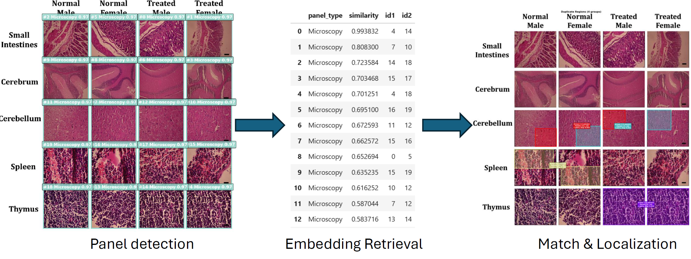
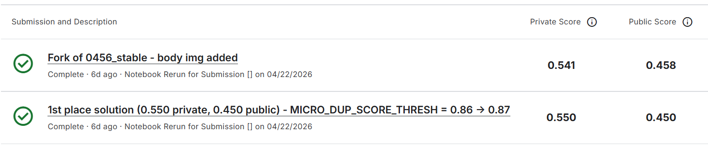
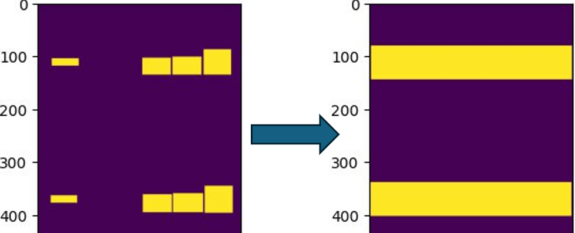

# RECOD.ai LUC - Scientific Image Forgery Detection

> 主题：cv ｜ 子类：— ｜ 领域：科研诚信 ｜ 类别：Research
> 截止：2026-04-22 ｜ 队伍数：1564 ｜ 机制：代码赛 ｜ 指标：伪造检测（混合指标）
> 数据来源：`intel/recodai-luc-scientific-image-forgery-detection/`（80 条主题索引 + 6 篇 write-up 正文）

## 1. 任务与数据

- 预测目标：检测科研论文图像中的伪造/重复使用（如 Western blot 条带复制、显微图像重叠）。
- 数据形态：论文图像（多面板拼图）+ 伪造标注。
- 构造陷阱：
  - 伪造往往是局部复制/镜像/旋转，需要细粒度几何比对；
  - 面板结构复杂（一张图含多个子图）；
  - 正样本稀少（多数图是干净的）。

## 2. 方案谱系

| 方案 | 名次 | 关键点 |
| --- | --- | --- |
| 四段式流水线：YOLO 面板检测 → 分数据类型的嵌入检索候选对 → 关键点匹配 + 几何验证 → 兜底策略 | 1st | 把"检测伪造"重构为"检索可疑配对 + 几何验证"，与实体匹配/查重思路同构 |

## 3. 关键技巧

- 面板检测（panel detection）先做版面拆分，不同数据类型分别处理（Western blot / 显微）。
- 嵌入检索找候选对，再做关键点匹配与几何验证（复制/旋转/镜像都能抓到）。
- 分层兜底：检索不到匹配时退回基础模型判定。

## 4. 可迁移性评估

- 可直接迁移：检索候选 + 几何验证的重复检测范式（图像查重、文档抄袭、实体匹配通用）；分层流水线 + 兜底策略；按子类型分别建模。
- 需要前提：目标检测 + 图像检索（嵌入/关键点）技术栈。
- 不建议照搬：端到端分类（难以捕捉局部复制）。

## 5. 对新手的关键启示

1. "找相似 → 验证几何关系"比直接分类更适合伪造/重复检测。
2. 按数据类型分支建模（本场 Western blot 与显微图像分开处理）。
3. 科研诚信类比赛（RECOD.ai 系列）是 Kaggle 的新方向，社会价值明确。

## 7. 轻读结论（2026-10 补）

**一句话**：本场的正确形态是"**把伪造检测重构成检索**"——前三名都是"面板切分 + 相似检索/关键点匹配 + 几何验证"：1st 用嵌入检索 + **条带级 blot 匹配**（0.375→0.431）拿到私榜 0.550；2nd/私榜 3rd 甚至用纯经典 SIFT、SAM3 无训练拿到 2/3；纯分割路线（65th、29th 的 DINOv2 segmenter）只到 65/29 名。

- 1st（695702）：公榜推进 0.327→0.458（250+ 提交）；自建 14TB PubMed Central 数据（660 万 blot + 1630 万显微图）；YOLO 面板检测 + SupCon 嵌入检索 + SIFT/ALIKED 匹配；条带级匹配是主引擎；最终选私榜 0.550 的版本（公榜 0.450），放弃公榜 0.458/私榜 0.541 的版本。
- 2nd（694397）：YOLOv8-m 面板+文本检测、SIFT `contrast_threshold=0.001`、G2NN（α=0.7）+ FLANN KDTree、RANSAC+HDBSCAN、两阶段聚类合并（H 相似 <0.02、IoMin≥0.3）；深度 CMFD 方案全部失败。
- 65th（694442）：DINOv2-base + 微型卷积解码器，两阶段训练（解码器 1e-5 → 末 12 层 5e-7）；梯度增强掩码（α=0.45）+ 阈值网格搜索；核心洞察 = copy-move 是自相似问题。
- 29th（694168）：RSIID 反事实重构扩展数据（51,489 样本）；q999≥0.95 门控 + 单合并掩码 + 每个 split 正 lift 的保守阈值（指标感知后处理范本）。
- 私榜 3rd（674890）：SAM3 两轮提示切分 + 文本/箭头遮除 + SIFT 匹配，零训练。

**裁决**：检索+几何验证是主轴，分割是兜底；面板/文本预处理必需；指标感知的后处理（authentic 代价、超额惩罚、per-split lift）与提交选择决定名次。

**悬案**：官方 metric 文档未归档；社区"指标不公平"诉求未细读；2nd/3rd 开源实现未运行核对。

## 8. 图表证据

**图 1**（topic 695702）：面板检测 → 嵌入检索 → 匹配定位（显微图示例）。

**图 2**（topic 695702）：公榜 0.458/私榜 0.541 与公榜 0.450/私榜 0.550 的两版对照。

**图 3**（topic 695702）：>50% 条带命中时用整条带替代碎片框（0.416→0.431）。

## 9. 出处

- 讨论区索引：`intel/recodai-luc-scientific-image-forgery-detection/topics.md`（80 条）
- 已收录 write-up（6 篇）：
  - 1st（37 票）：https://www.kaggle.com/competitions/recodai-luc-scientific-image-forgery-detection/discussion/695702
  - 2nd（15 票）：https://www.kaggle.com/competitions/recodai-luc-scientific-image-forgery-detection/discussion/694397
  - 65th DINOv2 方案（8 票）：https://www.kaggle.com/competitions/recodai-luc-scientific-image-forgery-detection/discussion/694442
  - 29th 分割+指标工程（7 票）：https://www.kaggle.com/competitions/recodai-luc-scientific-image-forgery-detection/discussion/694168
  - 私榜 3rd / 公榜 8th（7 票）：https://www.kaggle.com/competitions/recodai-luc-scientific-image-forgery-detection/discussion/674890
  - DCT copy-move 文献（38 票）：https://www.kaggle.com/competitions/recodai-luc-scientific-image-forgery-detection/discussion/613066
