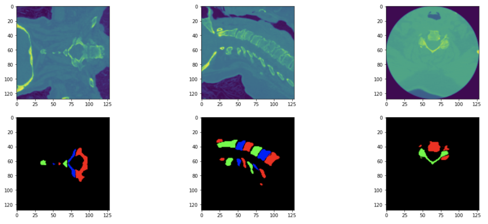
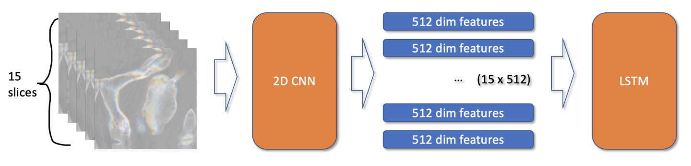
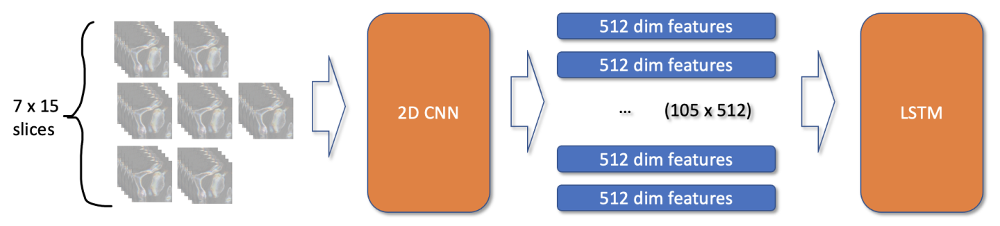
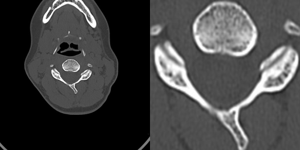
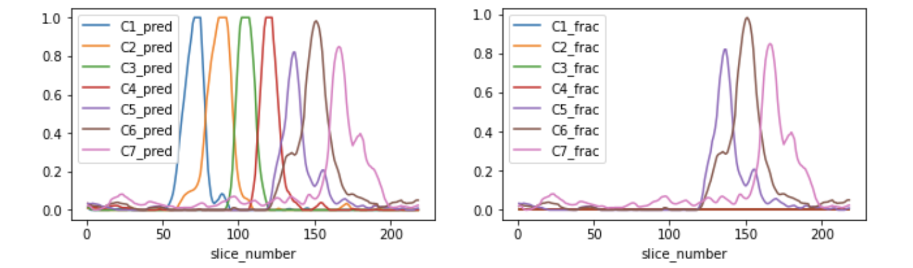
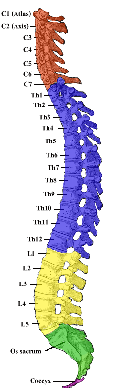

# RSNA 2022 - Cervical Spine Fracture Detection

> 主题：cv ｜ 子类：— ｜ 领域：医疗影像（CT 3D）｜ 类别：Featured
> 截止：2022-10-27 ｜ 队伍数：883 ｜ 机制：代码赛 ｜ 指标：Weighted Mean Columnwise Log Loss（C1–C7 + patient_overall 共 8 列）
> 数据来源：`intel/rsna-2022-cervical-spine-fracture-detection/`（80 条主题索引 + 6 篇 write-up 正文；深读升级 2026-10-03，Tier A #34）

## 1. 任务与数据

- 预测目标：颈椎 CT 逐椎骨 C1–C7 骨折二分类 + patient_overall（任意椎骨骨折），共 8 列。
- 数据形态：2019+ 例 study（每例一组轴位 DICOM）；**仅 87 例有 3D 分割掩码**；其余只有 study 级骨折标签。
- 构造陷阱：
  - 粗标签无法直接训练：必须先把 study 标签归因到椎骨/切片（定位→传播）；
  - 分割 nifti 与 DICOM 方向不一致（需 `[:, ::-1, ::-1].transpose(2,1,0)`），错向会导致 z 翻转/x 镜像；
  - 骨折 bbox 覆盖/质量不足——四强均未使用；
  - patient_overall 不能用 max 简单导出，需要专门建模/校准。

## 2. 验证方案

| 方案 | 使用者 | 说明 |
| --- | --- | --- |
| study 级 5 折 | 1st / 3rd / 6th | 同一 study 不跨折；各阶段（分割/分类/聚合）分别报 CV |
| 分阶段 CV | 全部 | 分割、逐椎骨分类、study 聚合各自验证（6th 报 0.3205/0.3369/0.2962） |
| study 级微调用竞赛指标 | 3rd / 5th | model3/stage3 直接以加权列 log loss 为损失 |

## 3. 方案谱系

| 方案 | 名次 | 关键点与数字 |
| --- | --- | --- |
| 3D 分割 → 椎骨裁剪 → 2.5D CNN+LSTM（type1/type2） | 1st（222 票） | 128³ r18d/effv2s+UNet 7ch → 2k 掩码；2k×7=14k 样本；15 切片×5ch+掩码；type1 逐椎骨 effv2s/convnext-tiny；type2 105 图学 overall（convnext nano/pico/tiny、nfnet-l0）；3D CNN 失败；提交 7.5h |
| 框回归 + 2.5D CNN+1D RNN + attention（3 段） | 3rd（59 票） | **不用骨折 bbox**；体积比标签传播；EffNetV2 预测框/have_bbox；512² study 裁剪；batch 48（accum 16）；attention 有效/Transformer 无效；10 权重集成；~9h/折、推理 4.5h |
| 2D 可见性+分割 → 伪标 → 2.5D+3D 混合 + stage3 FFN | 5th（51 票） | **11 天速通**；0.05/0.95 分位框；(3,3,H,W) 混合堆叠；stage3 直接优化竞赛指标；30-70 融合 **+2–3 LB** |
| 3D DeepLabV3+ → X3D-L/TD-CNN 特征 → Transformer | 6th（59 票） | 192³ 分割伪标全量；X3D-L 64×288×288（**z-stride=1**）→ 7×432；CAS 伪标训 TD-CNN → 7×256；三路融合 CV 0.2962（权重 .25/.25/.5） |
| 数据与提交详解 | 社区（179 票） | DICOM z 轴语义、nifti 转置、椎骨 unique 值、8 行提交格式；作者自纠"其实有矢状位" |

## 4. 关键技巧

- **三阶段标签工程**：小掩码子集训分割 → 伪标签全量 2k 例 → 用掩码/可见性/体积比把 study 标签传播到切片或椎骨级 → 序列模型聚合成 8 列。
- **中间监督的选择函数**：覆盖率 × 可伪标性 × 相关性——分割胜出，骨折 bbox 被全员弃用（3rd 明说）。
- **标签传播**：study 骨折标签 × 逐切片椎骨体积比（3rd）或可见性（5th）→ 切片级标签；预测掩码当通道（1st）或 RMSE 软回归（3rd）抑制传播噪声。
- **patient_overall 专门建模**：type2 联合 105 图（1st）、stage3 FFN 用 mean/min/max 直接优化指标（5th，+2–3 LB）、study 级 Transformer（6th）。
- **3D vs 2.5D 的采样判据**：6th 保 z 分辨率（z-stride=1）+ 64 深 + 高 xy → 3D 可行；1st 的小 cube 3D CNN 失败；5th 用"3 近邻帧+±5 间隔帧"混合堆叠。
- **序列模型分层**：切片/椎骨级用 RNN+attention（3rd：attention 增益大、Transformer 无效）；study 级 7 步序列用 Transformer（6th）。
- **伪标签全量化**：分割伪标（1st/6th）、可见性×overall（5th）、class activation sequence（6th）。
- **复用与速通**：5th 11 天完成，依赖往届 RSNA 的模块化骨架（2D 分割 + 2.5D/3D + metric 后段 + 集成模板）；3rd 直接沿用两年前冠军的 2.5D+RNN 结构。

## 5. 可迁移性评估

- 可直接迁移：粗标签+小掩码的标签工程三段式；中间监督选择函数；聚合列的专门校准；3D/2.5D 的采样设计判据；系列赛复用清单。
- 需要前提：小规模但高质量的分割子集（87 例即可）；3D 医学影像工具链（pydicom/nibabel/monai 等）；充足的推理时间预算（4.5–7.5h）。
- 不建议照搬：直接把 study 标签当切片/椎骨标签训练；用 max 导出 overall；在小 cube 上硬训 3D CNN。

## 6. 对新手的关键启示

1. 粗标签赛的第一步不是选模型，而是"发明中间监督"：找到能把粗标签拆到可训练粒度的代理任务。
2. 中间标签要选覆盖面能通过伪标签扩展到全量的那种（分割 87 例→全量），而不是语义最接近但覆盖不足的（骨折 bbox）。
3. 聚合列（overall/最大类）需要独立模型与指标对齐的损失，不能靠 max 推导。
4. 3D 与 2.5D 之争多数时候是采样设计之争：先检查 z-stride 与 z 分辨率，再下结论。

## 7. 深读结论（2026-10 补）

**一句话**：这是一场"用 87 例掩码撬动 2k 例粗标签"的标签工程比赛——三阶段（分割→传播→聚合）是主骨架，模型差异其次。

**跨方案裁决**：

- 三阶段骨架 4/4；骨折 bbox 全员弃用（3rd 明示）。
- patient_overall 必须专门建模（1st type2 / 3rd metric 损失 / 5th stage3 / 6th Transformer 融合）——5th 量化 +2–3 LB。
- 3D vs 2.5D：1st 失败 vs 6th 成功（z-stride=1）vs 4th 标题（未收录）→ 裁决变量是采样设计，不是维度本身。
- 序列模型分层：结构级 RNN+attention、study 级 Transformer；"Transformer 无效"（3rd）是层级混淆。
- 伪标签全量化是共识（1st/5th/6th 明说）。

**数字账精选**：87 掩码 / 2k studies；14k 椎骨样本；15×5ch+掩码；7.5h 提交；3rd 10 权重/4.5h；5th 11 天/+2–3 LB；6th CV 0.3205/0.3369/0.2962。

**失败学**：椎骨 cube 3D CNN（1st）、Transformer 替代 RNN（3rd）、undersampling（3rd）、mask 当通道/遮非分割区/切片级特征+2D CNN（6th 三项无效——注意 1st 的经验相反，配置依赖）、骨折 bbox（弃用）。

**悬案**：4th "CSN is all you need for 3D"（364837）与 1st 的 3D 失败直接冲突；2nd（365115）未收录；metric weights（340392）未收录；8th/32nd 未收录。

## 8. 图表证据

> 路径相对本文件（`notes/cv/`）：`../../intel/rsna-2022-cervical-spine-fracture-detection/bodies/<topic>_img/NN.png`

**图 1：1st 的 3D 分割预测（topic 362607）**

- 上排 x/y/z 三视角原始 CT，下排 C1–C7 彩色掩码；
- **87 例训练出稳定 7 类分割**——"87 例足够"的图证，整条标签传播链的源头。

**图 2：1st type1 模型（topic 362607）**

- 15 切片（每片 5ch+掩码）→ 2D CNN → 15×512 特征 → LSTM；
- "2D 骨干共享 + 序列头聚合"的 2.5D 范式。

**图 3：1st type2 模型（topic 362607）**

- 7×15=105 图（图上 "105 x 512"）→ 2D CNN → 105×512 → LSTM → 8 列；
- 联合输入学椎骨间关系与 overall；显存限制只能用 nano/pico 级 backbone。

**图 4：3rd 的裁剪预处理（topic 362643）**

- 左=原始轴位 CT，右=按 study 外接框裁剪放大；
- 单框裁剪整卷把分辨率留给椎骨细节（512²）。

**图 5：3rd 的标签传播（topic 362643）**

- 左图 C1–C7 逐切片体积比曲线；右图 = 比值 × study 骨折标签（C2 无骨折峰被过滤）；
- 标签传播机制的完整图证。

**图 6：颈椎解剖图（topic 340612）**

- C1–C7 与 Th/L/S 分段着色；分割 unique 值 >7 属胸椎区段；
- **椎骨编号=标签对齐的领域基础**：定位错一节，8 列全错位。

## 9. 出处

- 讨论区索引：`intel/rsna-2022-cervical-spine-fracture-detection/topics.md`（80 条）
- 已收录 write-up（6 篇）：
  - 1st（222 票）：https://www.kaggle.com/competitions/rsna-2022-cervical-spine-fracture-detection/discussion/362607
  - 数据详解（179 票）：https://www.kaggle.com/competitions/rsna-2022-cervical-spine-fracture-detection/discussion/340612
  - 1st code（147 票）：https://www.kaggle.com/competitions/rsna-2022-cervical-spine-fracture-detection/discussion/362787
  - 3rd（59 票）：https://www.kaggle.com/competitions/rsna-2022-cervical-spine-fracture-detection/discussion/362643
  - 6th（59 票）：https://www.kaggle.com/competitions/rsna-2022-cervical-spine-fracture-detection/discussion/362651
  - 5th（51 票）：https://www.kaggle.com/competitions/rsna-2022-cervical-spine-fracture-detection/discussion/363232
- 深读全本：`analysis/deep/rsna-2022-cervical-spine-fracture-detection.md`（11 组件 + 6 图证）
- 缺口登记：2nd(365115)、4th(364837)、8th(362669)、32nd(362593)、metric weights(340392)、350244、340439、348241 未收录正文
