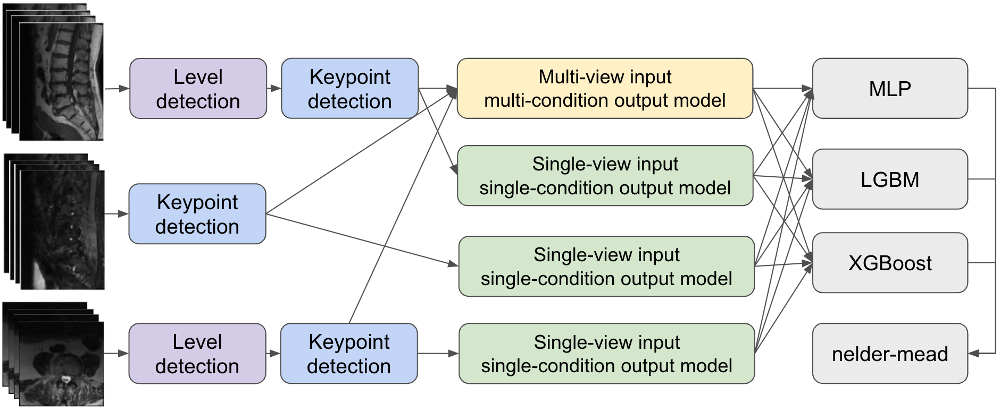
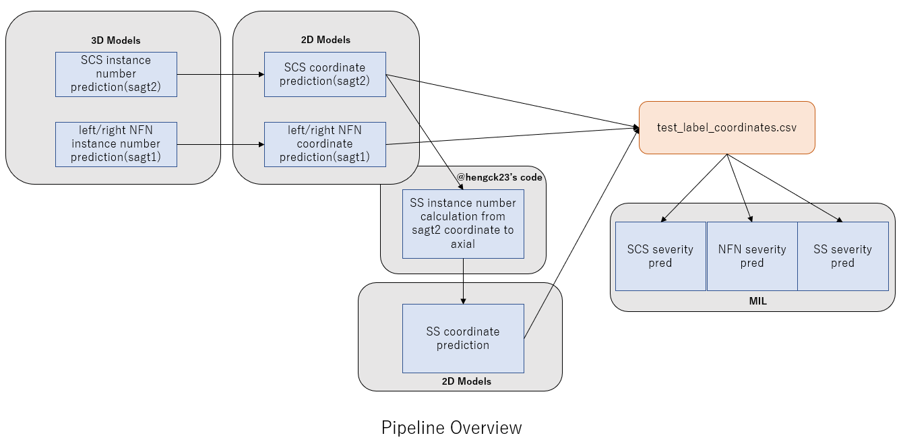
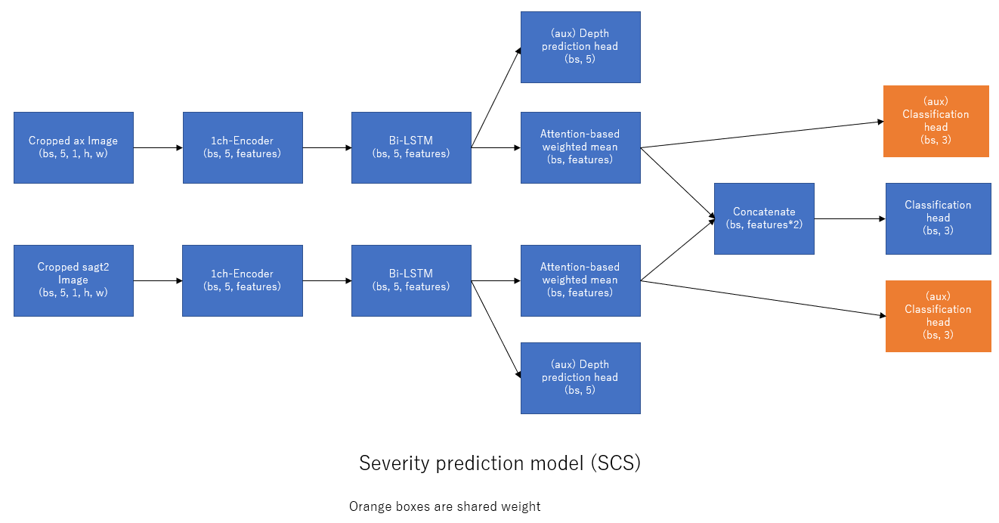
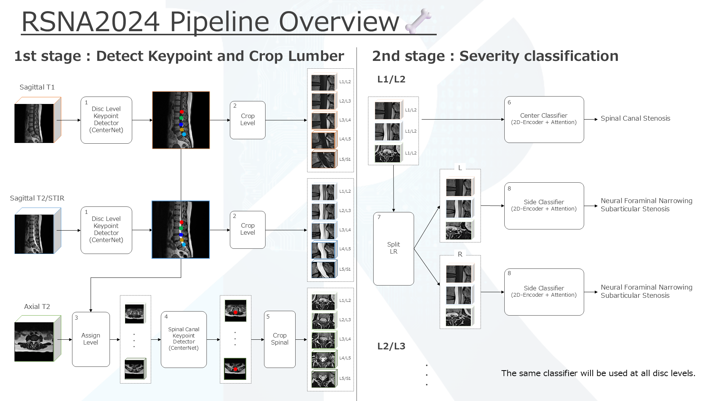
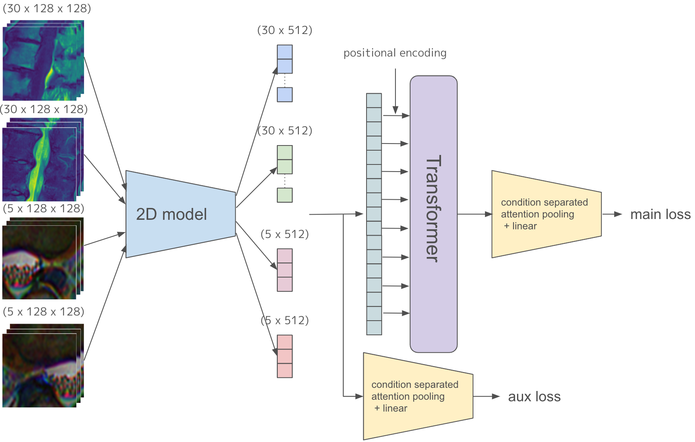

# RSNA 2024 - Lumbar Spine Degenerative Classification

> 主题：cv ｜ 子类：— ｜ 领域：医疗影像 ｜ 类别：Featured
> 截止：2024-10-08 ｜ 队伍数：1874 ｜ 机制：代码赛 ｜ 指标：RSNA Lumbar 加权对数损失（5 层面 × 5 条件列 × 3 类 = 25 列）
> 数据来源：`intel/rsna-2024-lumbar-spine-degenerative-classification/`（80 条主题索引 + 6 篇 write-up 正文；深读升级 2026-10-03，Tier A #33）

## 1. 任务与数据

- 预测目标：对腰椎 MRI 每例的 5 个椎间盘层面（L1/L2…L5/S1），分别判断三类退行性病变的严重程度——椎管狭窄（scs）/ 神经根管狭窄（nfn，分左右）/ 关节下狭窄（ss，分左右），共 25 列、每列 3 类（normal_mild / moderate / severe）。
- 数据形态：每例包含矢状面（T1、T2/STIR）与轴状面多个 MRI 序列；必须先定位"哪一层面、哪一侧、椎管在哪"，再做分级。
- 构造陷阱：
  - 定位与分级耦合：层面归属错一层，后续 25 列里该层面相关列全部受累，是典型两阶段问题；
  - 序列数量与方向不固定（矢状切片数可变），需要统一处理流程（4th：不足 30 片 padding、超出插值到 20；3rd：等间隔采样 15/15/10 片）；
  - 标注噪声真实存在（2nd 用 OOF 剔除、3rd 人工全审修正）；
  - 加权损失对类别权重敏感（3rd：CE 权重 [1.0, 2.0, 4.0]，突出 severe）。

## 2. 验证方案

| 方案 | 使用者 | 说明 |
| --- | --- | --- |
| 分层 K 折（按病例） | 1st / 2nd / 3rd / 4th | 3rd：y=每个 study 中 moderate 及以上病例数、groups=study_id，避免同病例跨折 |
| 分阶段验证 | 1st / 3rd / 4th | 定位与分级分开评估（1st 给出 instance_number 误差分桶表） |
| 社区坐标数据集 | 1st / 3rd / 4th | brendanartley 数据集 / Coordinate Pretraining Dataset / Lumbar Coordinate Dataset |
| 强集成 OOF 查噪 | 2nd | CV 0.3687 的 OOF 预测与标签差 ≥0.8 视为可疑样本，剔除后重训 |

## 3. 方案谱系

| 方案 | 名次 | 关键点与数字 |
| --- | --- | --- |
| 2 阶段 3 模型：instance_number → coordinate → severity | 1st（105 票） | 3D ConvNeXt 双任务（cls ±0 71.08% / reg ±0 67.48%）+ 2D 坐标回归（brendanartley 预训练）；裁剪配方表；**instance_number 位移 ±2 是鲁棒关键**；attention MIL 0.37→0.35，+bi-LSTM+aux+集成 → 0.33 |
| 轴/矢分离 + 逐目标独立小模型（YOLOX + MIL） | 2nd（98 票） | hengck23 slice 分类 + YOLOX 区域；sag 5 切片 MIL（ConvNeXt-S）；**噪声剔除 +1%（公/私榜）**；spinal severe ×1.25 |
| CenterNet 双关键点 + Center/Side 双分类器 | 3rd（65 票） | 层面 EffNetB6+FPN、椎管 EffNetB4+FPN；世界坐标推 L1/S1 伪坐标；**Split LR 右翻转（2×/10× 数据）**；30 模型集成 CV 0.3643（单模型 0.3858）；SCS 温度 0.91 |
| 关键点检测 → 裁剪 → 4 分级子模型 → stacking | 4th（76 票） | 轴向 2.5D+LSTM 分层面→UNet 关键点；多视角 Transformer + condition-separated attention pooling + aux loss；Nelder-Mead MLP + 每层 LGBM/XGB |
| 入门材料与阅读清单（社区） | 通用 | 往届 RSNA 2022 资源 + 解剖视频 + 论文 8 篇；124 票占位帖给两篇参考论文 + SpineAI 代码 |

## 4. 关键技巧

- **"定位 → 裁剪 → 分级"是医学影像多实例任务的通用骨架**：定位（层面/椎管/关键点）→ 坐标归一化裁剪 → 条件分类；中间产物落盘（1st 的 `test_label_coordinates.csv`）便于断点与集成。
- **级联误差要"吸收"而不只是"压低"**：1st 按第一阶段误差分布做 instance_number ±2 随机位移（作者称 crucial）；3rd 用伪标签覆盖全数据 + 人工校标；4th 用关键点距离归一化裁剪消除尺度差。
- **视角-条件匹配**：scs→sagT2/STIR + axial；nfn→sagT1（+axial 侧向裁剪）；ss→axial。1st 验证过错误组合（如 sagt1 给 scs）无效。
- **按解剖结构拆分类头**：3rd 的 Center Classifier（中央型 SCS）/ Side Classifier（侧方型 NFN/SS）；Split LR 把右侧翻转统一到左侧，数据翻倍（再弃层面/侧别依赖共 10×）。
- **MIL/attention + 辅助监督**：5 张切片→attention 聚合（1st 再叠 bi-LSTM 建顺序 + aux depth/aux class 深监督）；4th 在 Transformer 前做 per-condition attention pooling 并接 aux loss。
- **标注噪声处理**：2nd 用强集成 OOF 剔除 |Δ|≥0.8 样本（公/私榜各 +1%）；3rd 人工复查全部标注。自动阈值有"误删难样本"风险，需双侧榜单验证。
- **小模型 + 大集成**：1st 结论 convnext-large < base < small、ViT 弱于卷积、7 epoch 足够；3rd 用 10–20 epoch 小模型集成 30 个。
- **借力社区**：hengck23 的 slice 分类基线、brendanartley 坐标数据集与预训练权重（1st 说优于 ImageNet 初始化）、Coordinate Pretraining Dataset。

## 5. 可迁移性评估

- 可直接迁移：两阶段（定位+分类）范式；按标注语义拆头；级联误差的数据增强；关键点距离归一化；强集成 OOF 查噪；Split LR 左右统一。
- 需要前提：医学影像处理经验（DICOM、序列方向、层面解剖）；坐标型中间标签可用（官方坐标列/社区数据集）；MRI 训练需要较大显存（1st 用 Colab T4 + high memory）。
- 不建议照搬：端到端单阶段（1st/3rd 失败清单）；大模型/长 epoch（负结果）；把 |Δ|≥0.8 直接当"标错"（会混入难样本）。

## 6. 对新手的关键启示

1. 多实例医学任务先解决"在哪"，再解决"是什么"；把定位产物落盘，流水线才可调试、可集成。
2. 第一阶段的误差不会消失——要么在训练分布里模拟它（位移增强），要么在输入上消除它（归一化），要么用伪标签覆盖它。
3. 分类头的设计要贴合标注语义（中央 vs 侧方），并让每个视角能单独预测（辅助深监督）后再融合。
4. 榜单提升要拆开看：1st 承认 MIL 的 CV 增益小于 LB 增益——先证明 CV 无泄漏，再信公榜。

## 7. 深读结论（2026-10 补）

**一句话**：这是一场"先修坐标、再修分级"的级联系统工程——四强的分类器都只是流水线最后一环，分差来自定位鲁棒性、噪声处理与集成结构。

**跨方案裁决**：

- 两阶段是硬共识（4/4）；唯一反例是未收录正文的 7th 标题 "Single Stage Model Wins!"（登记悬案与 T13 候选张力）。
- 第一阶段误差吸收三族解：位移增强（1st，±2 关键）/ 伪标签+人工校标（3rd）/ 坐标归一化（4th）；2nd 用 YOLOX 区域兜底。
- 按条件拆模型是硬共识（4/4）；"多层面多病种统一模型"在 3rd 失败清单里。
- MIL vs 2.5D 之争的真相：成败绑定"切片集合 → attention 聚合 → aux 监督"配置（同结构名在 3rd/1st 结果相反）；且 1st 存在 CV/LB 背离。

**数字账精选**：instance_number ±0 71.08%（cls）/67.48%（reg）→ 1st LB 0.37→0.35→0.33；3rd 单模型 CV 0.3858 → 30 模型 0.3643；2nd 噪声剔除 +1%、OOF CV 0.3687；3rd CE [1,2,4]、温度 0.91；4th 每片 512 维 + Nelder-Mead stacking。

**失败学（配置级）**：一阶段、多层面多病种、按层面/按侧专用、3D-CNN、2.5D+Attention、2D+LSTM、Focal、长 epoch（3rd）；Mamba/自注意力、aux 权重共享、错视角、大模型、ViT（1st）。注意"2.5D+Attention 在 3rd 失败、在 1st/4th 变体成功"——失败原因要记到实现配置而非结构名。

**悬案**：7th 单阶段（未收录）；1st 的 CV/LB 背离无解释；2nd 清洗细节未公开；4th stacking 无消融。

## 8. 图表证据

> 路径相对本文件（`notes/cv/`）：`../../intel/rsna-2024-lumbar-spine-degenerative-classification/bodies/<topic>_img/NN.png`

**图 1：4th 方案完整管线（三路输入 → 定位 → 四个分级子模型 → 融合）**

*图：4th place solution 的完整管线（原帖 https://www.kaggle.com/competitions/rsna-2024-lumbar-spine-degenerative-classification/discussion/539443 ）*

- 三路输入：矢状面两路 + 轴状面一路，各自独立进入定位分支；
- 定位阶段不对称：两路矢状面走"层级检测 → 关键点检测"两级，轴状面只做关键点检测（不需要层级定位）；
- 分级阶段四个子模型：1 个"多视角输入-多条件输出" + 3 个"单视角输入-单条件输出"；
- 融合：MLP + LGBM + XGBoost 三个元模型之上，再用 **Nelder-Mead** 搜权重——比正文的"元分类器融合"更具体；
- 启示：把"多部位多类别"拆成"每条件独立子模型 + 条件特异融合"。

**图 2：1st 的 3 模型 2 阶段总管线**

*图：1st place 的 Pipeline Overview（原帖 https://www.kaggle.com/competitions/rsna-2024-lumbar-spine-degenerative-classification/discussion/540091 ）*

- 3D 模型（instance_number：SCS 用 sagt2、NFN 左右用 sagt1）→ 2D 模型（coordinate）→ `test_label_coordinates.csv`；
- SS 的 instance_number 由 sagt2 坐标经 hengck23 方法转到 axial，再单独预测 SS 坐标——**轴向层面归属继承自矢状面**；
- CSV 统一喂养三类 severity（MIL）模型；这是"中间产物落盘 + 多模型并行"的标准两阶段施工图。

**图 3：1st 的 SCS 分级模型（bi-LSTM + Attention MIL + 双流 aux）**

*图：Severity prediction model (SCS)；橙框为共享权重（原帖 topic 540091）*

- axial 与 sagt2 两条流各自 encoder→bi-LSTM→attention 加权平均；
- 每流在 LSTM 后挂 aux depth 头（bs,5），在加权后接共享权重 aux 分类头（bs,3）——**每个视角先单独学会预测，再做跨流融合**；
- concat 双流特征 → 主分类头；这正是 1st 所说"aux loss 有效"的结构原因（深监督 + 层间上下文）。

**图 4：3rd 的完整两阶段管线（CenterNet 定位 + Center/Side 分类）**

*图：RSNA2024 Pipeline Overview（原帖 https://www.kaggle.com/competitions/rsna-2024-lumbar-spine-degenerative-classification/discussion/539453 ）*

- Stage 1：矢状 T1、T2/STIR 各自 CenterNet 层面关键点 → crop 5 层；axial 经"世界坐标层面分配"→ 第二个 CenterNet 找椎管 → crop；
- Stage 2：Center Classifier 出 SCS；Split LR 后 Side Classifier 出 NFN/SS（左右两路共享分类器）；
- 关键标注："同分类器用于所有层面"——层面无关的共享分类器 + 层面特异的输入裁剪。

**图 5：4th 的多视角多条件模型（Transformer + condition-separated attention pooling）**

*图：tattaka 的多视角多条件模型（原帖 topic 539443）*

- 4 组输入（30 片×2 序列 + 5 片×2）共享 2D backbone → 每片 512 维特征 → 位置编码 → Transformer；
- 每条件独立 attention pooling + linear 出主损失；另有从预 Transformer 特征直接接出的 aux loss 分支；
- **同一 backbone 上"每条件一套 attention head"**：比"每条件一个模型"更省算力的条件分离实现。

## 9. 出处

- 讨论区索引：`intel/rsna-2024-lumbar-spine-degenerative-classification/topics.md`（80 条）
- 已收录 write-up（6 篇）：
  - 1st（105 票，评论区署名 NANACHI）：https://www.kaggle.com/competitions/rsna-2024-lumbar-spine-degenerative-classification/discussion/540091
  - 2nd（98 票）：https://www.kaggle.com/competitions/rsna-2024-lumbar-spine-degenerative-classification/discussion/539452
  - 4th（76 票，tattaka + yu4u）：https://www.kaggle.com/competitions/rsna-2024-lumbar-spine-degenerative-classification/discussion/539443
  - 3rd（65 票，代码库 Moyasii）：https://www.kaggle.com/competitions/rsna-2024-lumbar-spine-degenerative-classification/discussion/539453
  - 入门材料（137 票）：https://www.kaggle.com/competitions/rsna-2024-lumbar-spine-degenerative-classification/discussion/503433
  - [placeholder] 参考论文（124 票）：https://www.kaggle.com/competitions/rsna-2024-lumbar-spine-degenerative-classification/discussion/519628
- 深读全本：`analysis/deep/rsna-2024-lumbar-spine-degenerative-classification.md`（11 组件 + 6 图证）
- 缺口登记（未收录正文，受"不扩采"约束）：5th/7th×2/8th/9th/14th/Summary 共 7 条方案帖；其中 7th "Single Stage Model Wins!" 与两阶段共识冲突，待后续裁决
