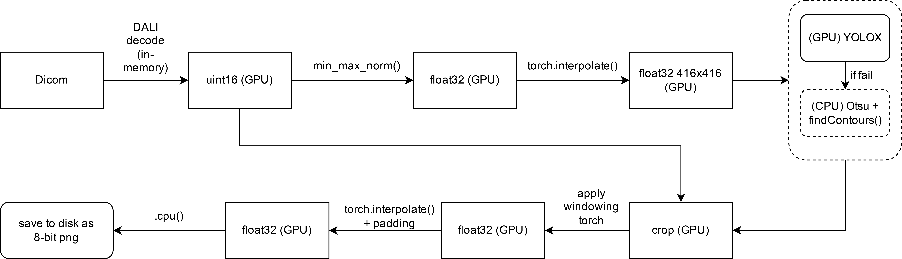
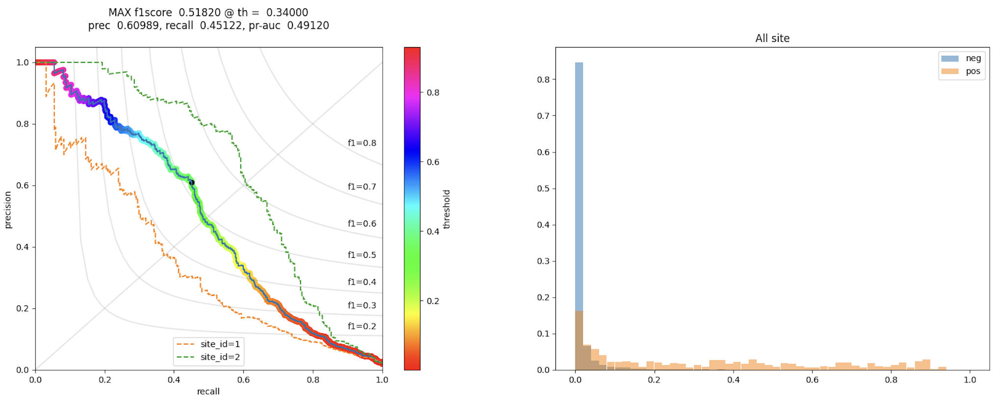
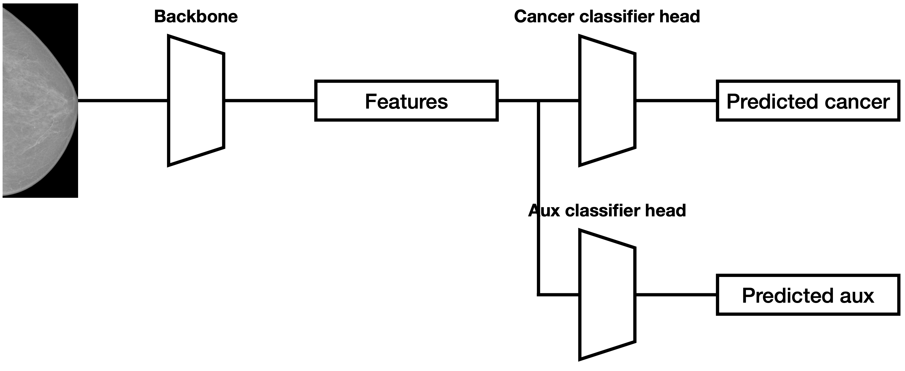
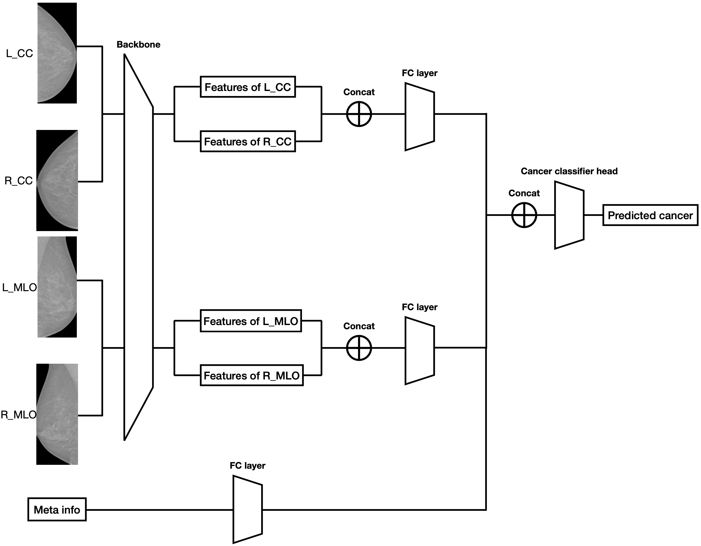
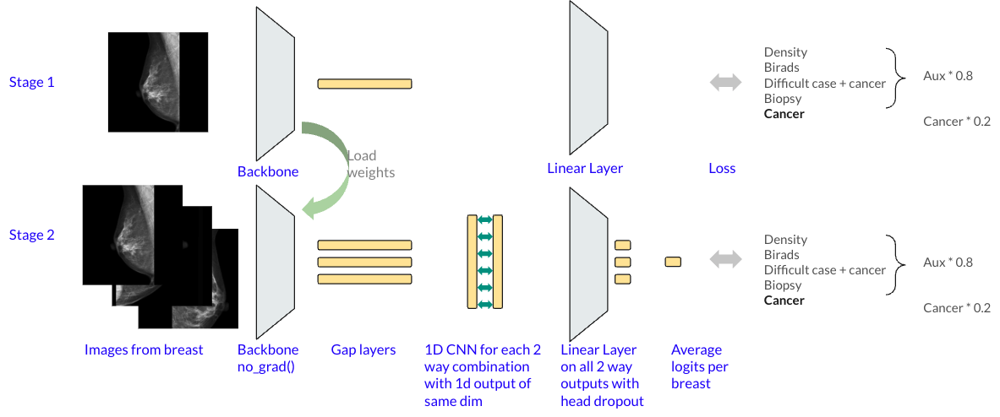
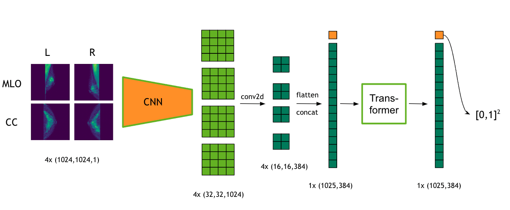

# RSNA - Screening Mammography Breast Cancer Detection

> 主题：cv ｜ 子类：— ｜ 领域：医疗影像 ｜ 类别：Featured
> 截止：2023-02-27 ｜ 队伍数：1687 ｜ 机制：代码赛 ｜ 指标：Probabilistic F-Score Beta (micro)
> 数据来源：`intel/rsna-breast-cancer-detection/`（120 条主题索引 + 8 节正文：1st/2nd/4th/6th/9th + 乳腺入门 + 往届 RSNA 索引 + 硬件帖；3rd/5th/7th/8th 等未收录）

## 1. 任务与数据

- **预测目标**：由乳腺 X 光（mammography）图像预测是否患癌（按患者聚合，多视角多侧位）。
- **数据形态**：**超高分辨率医学影像**（原始约 3000×5000 像素）+ DICOM 元数据 + 患者级标签；阳性率极低（典型医学影像赛）。
- **构造陷阱**：
  - 高分辨率必须降采样或分块，**分辨率选择直接影响成绩**。
  - 每患者有多个视角（CC/MLO × 左右），需要**多视角聚合**。
  - 指标是概率化的 F-beta，**阈值与概率校准影响大**。
  - 阳性样本稀少 → 外部正样本数据价值高。
- **任务口径**（入门帖）：筛查乳腺 X 光只有 BI-RADS 0/1/2（0=需复查）；"0 不等于癌"，最终标签来自诊断与活检——标签噪声是任务的一部分。

## 2. 验证方案

| 方案 | 使用者 | 说明 |
| --- | --- | --- |
| 按患者分组 CV | 多数 | 避免同一患者多视角跨折泄漏 |
| 消融验证外部数据收益 | 1st | 同一流水线、同一超参，仅切换外部数据，量化 +0.02 F1 |
| 公开榜与 OOF 双轨对照 | 1st | 消融表同时给出 OOF / 公开 / 私榜 |
| 多代理指标 | 1st/6th/9th | PR_AUC（稳定但对先验敏感）、ROC_AUC（稳定但乐观）、AUCPR、best_pF1、最佳阈值、MCC |
| 单折实验（fold 0） | 2nd | 发现 fold 0 与 CV/LB 强相关后只跑 fold 0 节省算力 |
| 阈值网格提交 | 1st | 同模型 0.27–0.40 五个阈值；OOF 峰（0.34）≠ LB 峰（0.31） |

## 3. 方案谱系

| 方案 | 名次 | 关键点 |
| --- | --- | --- |
| 5 外部库混训 + YOLOX ROI + 4×ConvNeXt-small | 1st | 外部数据 **+0.02**（OOF/私榜）；4 折+外部（阳性率 7.38%）；阈值 0.31 命中（LB 0.61/私榜 0.55） |
| 分阶段分辨率 + EQL + 多视角 | 2nd | 1280 外部预训练→1536 无外部微调→双视角/多侧位；**押分辨率弃集成**（单视角私榜 0.53） |
| 乳腺级 1D-CNN + 患者级 Transformer | 4th | PIL-Lanczos 重采样；7 模型集成；"最后几天才融合，未被公开榜带偏" |
| MV/MVF/MVL 多视角族 + AUCPRLoss | 6th | AUCPR 代理指标；**最佳私榜 0.53 方案未被选**（CV/公开偏低） |
| 3×ConvNeXt + cv2 ROI + 投票集成 | 9th | 无外部数据；TTA hflip +0.03；投票版换稳定（0.62/**0.50**）；~20 项负面清单 |

## 4. 关键技巧

- **数据侧流水线**：DICOM 窗宽窗位 → ROI（YOLOX/Faster R-CNN/cv2）→ PIL-Lanczos 重采样 → 2048×1024/1536×768；GPU 化推理（DALI）。
- **极端不平衡配方**：正样本上采样 1/7~1/8 + **保证每批≥1 正样本**；EQL/AUCPR 损失；drop 0.5~0.9；EMA。
- **外部数据有条件有效**：1st 混训 +0.02（5 库 4,691 阳性）；4th/6th 单库预训练无效——用法与标签口径决定成败。
- **pF1 用代理指标管理**：PR_AUC/AUCPR/ROC/阈值曲线并行；AUCPRLoss 可直接优化。
- **选择纪律**：阈值网格（OOF 峰≠LB 峰）；CV/公开双高才选（但 6th 因此弃掉私榜最优）；稳 vs 高的取舍（9th 投票版）。
- **域内先验**：BI-RADS 语义入门 + 往届 RSNA 冠军索引。

## 5. 深读结论（2026-10 补）

- **这是一场"数据清洗 + 阈值选择"的比赛**：冠军自述"简单流水线 + 简单决策 + 运气"；四大分差来源——外部数据（+0.02）、ROI/分辨率工程、代理指标管理、最终选择。
- **外部数据是唯一被严格消融确认的增益**（同流水线同超参 +0.02），但用法敏感（混训 vs 预训练、库标签口径 BIRADS-4 的争议）。
- **pF1 的选择敏感性被量化**：同模型 OOF 最优阈值 0.34 → LB 0.58；LB 峰值在 0.31 → 0.61；私榜 0.55；525 组合的 OOF 选择带 0.4951–0.5187（0.024）。
- **"更好的方案没被选"出现三次**：6th（私榜 0.53 未选）、2nd（弃集成押单模但成功）、9th（弃高 LB 押稳定版）——在这个指标下选择决策≈模型能力。
- **9th 的 ~20 项负面清单**是医学影像的"技术止痛药"：SWA/EMA/多种优化器/冻结/损失/模型族/元模型/伪标签……大部分无效；简单 CNN + TTA + 集成到 0.63。

## 6. 图表证据

**图 1：1st 的 ROI 与预处理全流程**（topic 392449）——`../../intel/rsna-breast-cancer-detection/bodies/392449_img/01.jpg`

*读图*：原始 → YOLOX-nano 416 检测框 → 裁剪 → 窗宽窗位 → 各向同性缩放+padding → 1024×2048 → 4×ConvNeXt-small。

**图 2：1st 的 GPU 推理流水线**（topic 392449）——`../../intel/rsna-breast-cancer-detection/bodies/392449_img/02.png`

*读图*：DALI 解码 → GPU 归一化 → interpolate 416 → GPU YOLOX（CPU Otsu 兜底）→ GPU crop/windowing → PNG。大数组计算全程 GPU。

**图 3：阈值选择证据（PR 曲线 + 分布）**（topic 392449）——`../../intel/rsna-breast-cancer-detection/bodies/392449_img/07.png`

*读图*：MAX f1=0.5182 @ th=0.34（prec 0.6099/recall 0.4512/pr-auc 0.4912）；site_id=1 与 2 的 PR 形态不同；阴性分布集中 0 附近、阳性长尾。

**图 4：2nd 单视角（辅助头）**（topic 391676）——`../../intel/rsna-breast-cancer-detection/bodies/391676_img/01.png`

*读图*：backbone → features → 癌症头 + 辅助头（BIRADS/Density/困难负例/View/Invasive）。

**图 5：2nd 多侧位双视角**（topic 391676）——`../../intel/rsna-breast-cancer-detection/bodies/391676_img/03.png`

*读图*：L_CC/R_CC、L_MLO/R_MLO 分别拼接→FC，Meta info→FC，再拼接→癌症头；同侧位两乳一致性 + 双视角关系建模。

**图 6：4th 的 1D-CNN 两阶段**（topic 391208）——`../../intel/rsna-breast-cancer-detection/bodies/391208_img/02.png`

*读图*：Stage1 单图+辅助头；Stage2 冻结 backbone → 对每对视图做 1D-CNN（核 2）→ 线性层 → 每侧乳腺平均。

**图 7：4th 的患者级多视角 Transformer**（topic 391208）——`../../intel/rsna-breast-cancer-detection/bodies/391208_img/04.png`

*读图*：4 视图 → CNN → 4×(16,16,384) → flatten+concat 1×(1025,384) → Transformer → 左右各一预测。

**图 8/9：6th 的模型结构与集成（SVG）**（topic 390974）——`../../intel/rsna-breast-cancer-detection/bodies/390974_img/03.svg`、`.../04.svg`

*读图*：03 为模型结构示意（帖内共三张，对应 MV/MVF/MVL 系列；SVG 无文字层）；04 为集成流程（其私榜 0.53 的方案未被选中）。

## 7. 可迁移性评估

- **可直接迁移**：
  - **按实体（患者/病例）分组切分**是医学影像的底线要求。
  - 分阶段分辨率训练（低 → 高）在超高分辨率影像任务中通用。
  - 先单视角再聚合的结构。
  - 概率化指标必须单独做阈值/校准。
- **需要前提**：
  - 高分辨率训练需要大显存或分块推理（DALI 等加速工具很关键）。
  - 外部医学数据的获取与合规。
- **不建议照搬**：
  - 直接全分辨率端到端训练（算力代价过高）。

## 8. 对新手的关键启示

1. **医学影像先解决三件事**：分辨率策略、多视角聚合、按患者分组验证。
2. **外部数据的价值可以被量化**（+0.02 F1），值得花时间找。
3. **标签技巧的收益常被高估**（1st 的消融显示两种标签技巧差别不大）。
4. **概率化指标 = 模型 + 阈值**，二者都要调。

## 9. 出处

- 讨论区索引：`intel/rsna-breast-cancer-detection/topics.md`（120 条）
- 已收录正文（8 节）：
  - 1st（Đăng Nguyễn Hồng）：https://www.kaggle.com/competitions/rsna-breast-cancer-detection/discussion/392449
  - 2nd（sakaku）：https://www.kaggle.com/competitions/rsna-breast-cancer-detection/discussion/391676
  - 4th（Dieter）：https://www.kaggle.com/competitions/rsna-breast-cancer-detection/discussion/391208
  - 6th（RabotniKuma 队）：https://www.kaggle.com/competitions/rsna-breast-cancer-detection/discussion/390974
  - 9th（Remek & Andrij）：https://www.kaggle.com/competitions/rsna-breast-cancer-detection/discussion/390966
  - 乳腺影像入门：https://www.kaggle.com/competitions/rsna-breast-cancer-detection/discussion/369262
  - 往届 RSNA 冠军索引（Radek Osmulski）：https://www.kaggle.com/competitions/rsna-breast-cancer-detection/discussion/369103
  - 硬件实验帖：https://www.kaggle.com/competitions/rsna-breast-cancer-detection/discussion/370333
- 未收录缺口（登记备查）：3rd/5th/7th/8th 等方案
- 深读全文：`analysis/deep/rsna-breast-cancer-detection.md`
