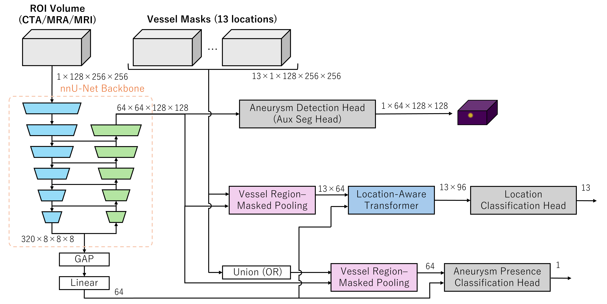

# RSNA Intracranial Aneurysm Detection

> 主题：cv ｜ 子类：— ｜ 领域：医疗影像 ｜ 类别：Featured
> 截止：2025-XX-XX ｜ 队伍数：1100+ ｜ 机制：代码赛 ｜ 指标：位置感知的检测评分
> 数据来源：`intel/rsna-intracranial-aneurysm-detection/`（80 条主题索引 + 6 篇 write-up 正文）

## 1. 任务与数据

- 预测目标：在脑部 MRA（磁共振血管成像）中检测动脉瘤，**要求给出位置信息**。
- 数据形态：3D 体数据（DICOM 序列），目标小而稀疏。
- 构造陷阱：
  - 病灶小、正样本比例极低；
  - **评分含位置项** → 只判"有无"不够，必须定位准确；
  - 3D 数据直接训练代价高，需要 2.5D/ROI 等折中方案。

## 2. 方案谱系

| 方案 | 名次 | 关键点 |
| --- | --- | --- |
| **由血管分割引导的粗到细 ROI 分类器** | 1st | DICOM → NIfTI 标准化；nnU-Net 粗到细先找血管（低分辨率快速定位 → 高分辨率精修），再在 ROI 上做**位置感知**分类 |
| 三路互补集成：YOLO 2.5D（多骨干）+ 3D CenterNet + 元分类器（LGBM/XGB/CatBoost） | 9th | 检测器集成 + 用元分类器融合各检测器输出 |

## 3. 关键技巧

- **用解剖结构引导注意力**（血管分割 → ROI）：把"在整幅图找小目标"变成"在血管附近找"，大幅降低搜索空间。
- **粗到细（coarse-to-fine）**：先低分辨率定位、再高分辨率判定。
- **2.5D 检测**：把 3D 问题拆成多切片 2D 检测，兼顾效果与成本。
- **检测器 + 元分类器集成**：不同检测器输出用 GBDT 融合。
- **位置感知输出**：评分含位置项时，必须显式建模位置。

## 4. 可迁移性评估

- **可直接迁移**：
  - **用先验结构缩小搜索空间**（血管/器官/道路分割 → ROI）是医学与工业检测的通用范式（与 RSNA 2024 腰椎的"定位→分类"同源）；
  - 粗到细两阶段；
  - 2.5D 折中方案；
  - 检测器集成的元分类器融合。
- 需要前提：3D 医学影像处理与分割工具链（nnU-Net）。
- 不建议照搬：直接 3D 端到端检测（成本高、样本不足）。

## 5. 对新手的关键启示

1. **小目标检测先想办法缩小搜索空间**（先验结构是关键）。
2. **评分含位置时，输出必须带位置**——先读清指标。
3. 与 RSNA 2024 腰椎、RSNA 乳腺对照：RSNA 系列赛事的"两阶段 + 领域先验"模式非常稳定。

## 6. 轻读结论（2026-10 补）

**一句话**：3D 医学影像的"先定位再分类"范式——**血管分割提供结构先验，位置感知分类头提供上限**；正例极稀时用"重建动脉瘤球"这类辅助任务压住过拟合。

- 1st（611846）：nnU-Net 三级分割（粗定位 1mm + 两套细分割 Dice/Tversky + SkeletonRecall）→ 140³mm ROI → **用分割预训练 nnU-Net 当分类骨干** + Vessel Region-Masked Pooling + Location-Aware Transformer；辅助球重建损失权重 1.0 > 分类 0.1/0.05；EMA + 4 折 + 左右翻转 TTA；失败回退 OOF 均值。
- 3rd（611856）：YOLOv8 检测血管区（MIP 框，mAP@0.5>0.95）→ 3D ResNet-18 逐特征图 14 类分类；把部分 stride 2→1 放大特征图。
- 4th（611893）：**DINOv3 直接回归 ROI 框坐标**（48 切片输入）；54.5 万样本仅 2.2k 正例（1:250）。
- 9th（611908）：YOLO 2.5D + 3D CenterNet + 三个元分类器平均；**2.5D 不做 Z 重采样反而 +0.02 CV**；13 位置当 13 个检测类。

**裁决**：位置型标签必须保留空间对应（掩码池化/特征图分类/检测类）；辅助定位任务权重高于分类；各向异性数据的 Z 对齐要靠实验而非直觉；预留数据清洗与失败兜底。

**悬案**：2nd/6th–8th 方案缺失；1st 的 Transformer 超参与消融未给。

## 7. 图表证据

**图 1**（topic 611846）：nnU-Net 骨干 + 13 掩码池化 + Location-Aware Transformer + 存在性头 + 辅助球重建（紫色体）的整体结构。

## 8. 出处

- 讨论区索引：`intel/rsna-intracranial-aneurysm-detection/topics.md`（80 条）
- 已收录 write-up（6 篇）：
  - 1st（158 票）：https://www.kaggle.com/competitions/rsna-intracranial-aneurysm-detection/discussion/611846
  - 5th（54 票）：https://www.kaggle.com/competitions/rsna-intracranial-aneurysm-detection/discussion/611849
  - 9th（47 票）：https://www.kaggle.com/competitions/rsna-intracranial-aneurysm-detection/discussion/611908
  - 3rd（46 票）：https://www.kaggle.com/competitions/rsna-intracranial-aneurysm-detection/discussion/611856
  - 4th（44 票）：https://www.kaggle.com/competitions/rsna-intracranial-aneurysm-detection/discussion/611893
  - 临床背景（90 票）：https://www.kaggle.com/competitions/rsna-intracranial-aneurysm-detection/discussion/591648
- 轻读全本：`analysis/deep/rsna-intracranial-aneurysm-detection.md`（Tier B 轻读：对照矩阵/裁决/证据分级/悬案 + 1 图证）
