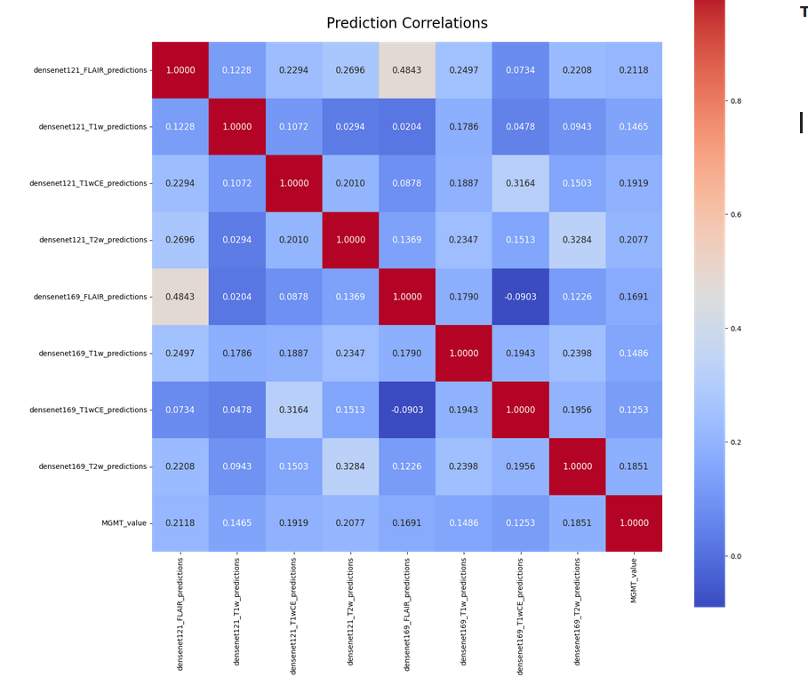

# RSNA-MICCAI Brain Tumor Radiogenomic Classification

> 主题：cv ｜ 子类：— ｜ 领域：医疗影像 ｜ 类别：Featured
> 截止：2021-10-15 ｜ 队伍数：1555 ｜ 机制：代码赛 ｜ 指标：AUC（二分类）
> 数据来源：`intel/rsna-miccai-brain-tumor-radiogenomic-classification/`（80 条主题索引 + 6 篇 write-up 正文）

## 1. 任务与数据

- 预测目标：由脑部 MRI 预测 MGMT 启动子甲基化状态（二分类）。
- 数据形态：每例 4 个 MRI 序列（FLAIR / T1w / T1wCE / T2w），**样本量极小（数百例）**。
- 构造陷阱：
  - **小样本导致 CV 极不稳定**：冠军原话"早期模型的 CV 分数几乎是随机的，没有任何策略能可靠验证"。
  - 不同中心的 MRI 拍摄方法存在差异（社区专门开了对照帖）。
  - 比赛期间出现**假账号作弊**（社区有"Fake Accounts In Competition"与"The real winner..."讨论）。

## 2. 验证方案

| 方案 | 使用者 | 说明 |
| --- | --- | --- |
| 多策略对比后放弃细调 | 1st | 尝试多种验证策略均无法稳定反映性能 |
| 固定折 + 观察方差 | 1st | 换折后分数完全变化，说明方差主导 |
| 以公开榜为参考 | 12th | 承认共享内容质量参差，靠自行实验 |

## 3. 方案谱系

| 方案 | 名次 | 关键点 |
| --- | --- | --- |
| **极简基线**（resnet10–50 / EfficientNet b0–b3） | 1st | 无集成、无复杂训练技巧；大模型（ResNet/DenseNet/EfficientNet 大档）全部失败；因 BatchNorm 与 3 通道空间输入冲突而切换到 MONAI |
| DICOM 预处理 + 常规 CNN | 12th | 强调预处理质量；对社区共享内容的评价是"质量很差" |
| DICOM→PNG 数据集（128GB → 5.2GB） | 社区 | 大幅降低读取成本，是重要的公共基础设施 |

## 4. 关键技巧

- **小样本医学影像的残酷现实**：CV 不稳定时，**集成与调参的收益可能完全被方差淹没**（冠军明确报告集成没有提升）。
- **预处理是主要工程量**：DICOM 解析、序列对齐、尺寸统一。
- **选择稳定可训的骨干**：大模型在小数据上失败，小骨干反而更稳。
- **框架细节会埋雷**：某个 EfficientNet 实现在 3 通道空间输入下 BatchNorm 输出异常（换 MONAI 解决）。
- **警惕作弊**：本场出现假账号，需关注主办方清理与最终排名。

## 5. 可迁移性评估

- **可直接迁移**：
  - **先评估 CV 稳定性**：换折后分数是否剧烈变化；若剧烈，先解决验证而非加模型。
  - 小数据任务优先小骨干 + 强预处理。
  - 借助社区数据转换产物（如 DICOM→PNG）。
- 需要前提：医学影像预处理经验；对框架实现的调试能力。
- 不建议照搬：在小样本上堆大模型与复杂集成（本场已证否）。

## 6. 对新手的关键启示

1. **CV 不稳时，先怀疑验证设计，而不是模型不够强**。
2. **小样本比赛接受"简单方案"**：冠军就是自己的第一个基线。
3. **工程细节（框架实现、预处理）会直接决定成败**。

## 7. 轻读结论（2026-10 补）

**一句话**：小数据弱信号医学分类——**验证/提交噪声是第一敌人**；1st 用"简单单模 + 数百次重复平均"夺冠，公榜高分多为随机或作弊。

- 1st（103 票）：3D ResNet10+BCE、无集成；同设置重训 100 次 CV 0.53–0.62；两阶段筛选（100 模型 → 250 模型/想法）；"最佳中心图"（最大脑截面为中心）+0.01~0.02；>50% 模型去掉 T2w；**靠忘记选提交、自动选公榜最佳而夺冠**（运气极端例证）。
- 12th：SegResNet 分割→分类无帮助；DenseNet121/169 每模态 5 折；val loss 0.66–0.67 的"幸运跑"才 >0.6 AUC。
- 事件：DICOM→PNG 资源（369 票）；作弊/假账号（269396，107 票）；MRI 拍摄差异（252843，99 票）。

**裁决**：小数据下用重复实验的均值/方差做决策；公榜不可信、防 shakeup 优先；集成收益被方差吞掉。

**悬案**：2nd–11th 未收录；作弊处置与最终 shakeup 幅度未量化。

## 8. 图表证据

**图 1**（topic 279832）：各模态/骨干预测相关性（多 0.0–0.48），与 MGMT 相关最高约 0.33——弱信号可视化。

## 9. 出处

- 讨论区索引：`intel/rsna-miccai-brain-tumor-radiogenomic-classification/topics.md`（80 条）
- 已收录 write-up（6 篇）：
  - 1st（103 票）：https://www.kaggle.com/competitions/rsna-miccai-brain-tumor-radiogenomic-classification/discussion/281347
  - 12th：见讨论区 12th Place Solution
  - DICOM→PNG 数据集（369 票）：https://www.kaggle.com/competitions/rsna-miccai-brain-tumor-radiogenomic-classification/discussion/253000
  - 作弊账号讨论（107 票）：https://www.kaggle.com/competitions/rsna-miccai-brain-tumor-radiogenomic-classification/discussion/269396
  - MRI 拍摄方法差异（99 票）：https://www.kaggle.com/competitions/rsna-miccai-brain-tumor-radiogenomic-classification/discussion/252843
- 轻读全本：`analysis/deep/rsna-miccai-brain-tumor-radiogenomic-classification.md`（Tier B 轻读：对照矩阵/裁决/证据分级/悬案 + 1 图证）
