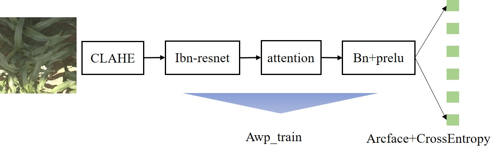
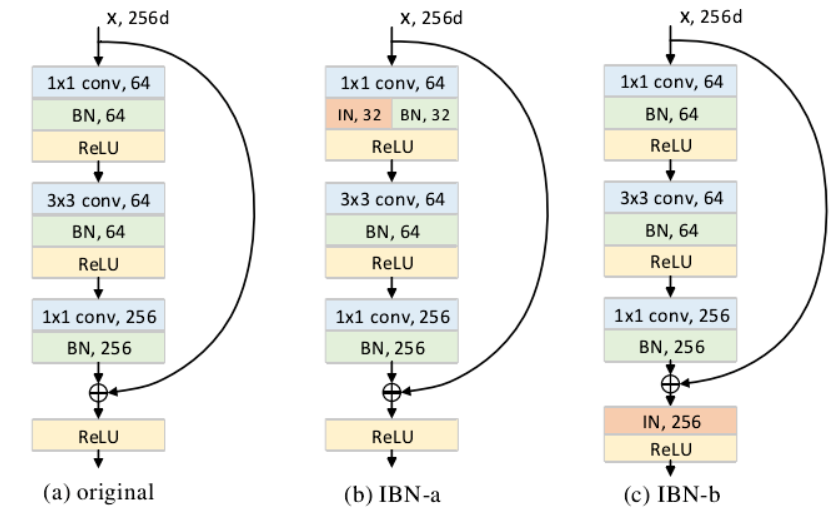

# Sorghum ID - FGVC 9（精简）

> 主题：cv ｜ 子类：— ｜ 领域：农业视觉 ｜ 类别：Research ｜ 截止：2022-05-30 ｜ 队伍数：252 ｜ 指标：细粒度多分类
> 出处：`intel/sorghum-id-fgvc-9/`（80 条主题索引 + 6 篇 write-up 正文）

## 任务

高粱（sorghum）品种的**细粒度图像分类**（FGVC 系列，与 Herbarium 2022 同届）。

## 关键要点

- 3rd 明确总结了本场的两类难点：
  1. **类间视觉相似度高**（细粒度分类的本质困难）；
  2. 数据层面的其他分类难点（需要针对性增强与采样策略）。
- 与 Herbarium 2022 同属 FGVC9 大会赛道：**细粒度分类 + 长尾**是共同主题。

## 可迁移要点

- **细粒度分类先做"类间相似度"分析**（找出最易混淆的类别对），再针对性设计增强/损失（如 triplet、arcface 类度量损失）。
- FGVC 系列（Herbarium、Sorghum、iNaturalist 等）方案可互相借用。

## 轻读结论（2026-10 补）

- **三大难点（3rd 总结）**：类间相似度高、光照/曝光差异大、**train/test 来自两块不同田块（域适应）**、植株随生长期变化（328593）。
- **增益排序（3rd 消融表）**：base 0.73 → 直方图均衡 +0.03 → **IBN-ResNet +0.05** → ArcFace +0.015 → 512→1024 **+0.04** → FGVC8 +0.03 → TTA +0.02 → 伪标签 +0.01 ≈ 0.957（328593）。
- **分辨率最高杠杆**：2nd 512→960 私榜 84.1→91.9，伪标签再 +3.2，集成 95.9；1st 5 折 + 223 类私榜 0.965（329414 / 329049）。
- **数据工程**：PNG 71GB → JPEG 14GB；测试图缺失/CSV 不匹配/API 拉取问题频发（313266 / 313438 / 313543 / 313691）。

## 图表证据

**图**（topic 328593）：CLAHE → IBN-ResNet → attention → BN+PReLU（AWP 对抗训练），ArcFace+CE 输出。

**图**（topic 328593）：original / IBN-a / IBN-b 三种结构——用 IN 层吸收田块风格差异（+0.05）。

## 出处

- 讨论区索引：`intel/sorghum-id-fgvc-9/topics.md`
- 3rd（12 票）：https://www.kaggle.com/competitions/sorghum-id-fgvc-9/discussion/328593
- 1st（6 票）：https://www.kaggle.com/competitions/sorghum-id-fgvc-9/discussion/329049
- 2nd（5 票）：https://www.kaggle.com/competitions/sorghum-id-fgvc-9/discussion/329414
- 71GB→14GB JPEG：https://www.kaggle.com/competitions/sorghum-id-fgvc-9/discussion/313266
- 测试图缺失：https://www.kaggle.com/competitions/sorghum-id-fgvc-9/discussion/313438
- PhD/研究机会：https://www.kaggle.com/competitions/sorghum-id-fgvc-9/discussion/320481
