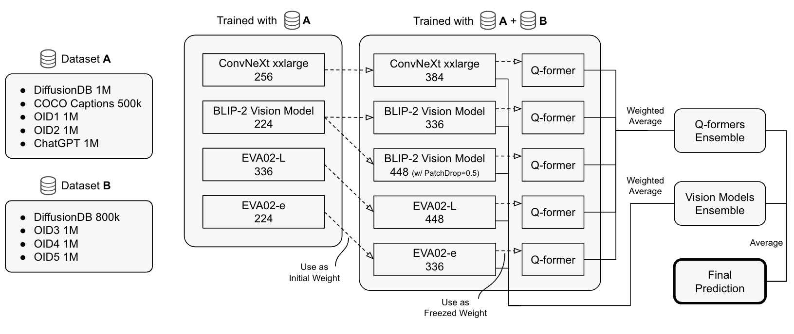

# Stable Diffusion - Image to Prompts

> 主题：cv ｜ 子类：— ｜ 领域：生成式 AI ｜ 类别：Featured
> 截止：2023-XX-XX ｜ 队伍数：1200+ ｜ 机制：代码赛 ｜ 指标：CLIP 嵌入相似度
> 数据来源：`intel/stable-diffusion-image-to-prompts/`（80 条主题索引 + 6 篇 write-up 正文）

## 1. 任务与数据

- 预测目标：给定由 Stable Diffusion 生成的图像，**反推其提示词**（按 CLIP 句向量相似度评分）。
- 数据形态：官方训练集很小；**社区大量自建合成数据**——这是本场的主要竞争点。
- 构造陷阱：指标是嵌入相似度（对目标文本的"语义方向"敏感，而非逐词匹配）。

## 2. 方案谱系

| 方案 | 名次 | 关键点 |
| --- | --- | --- |
| 自建 **1060 万图像 / 860 万提示词**数据集 + ViT 回归 CLIP 嵌入 | 1st | 用多种加速手段批量生成；再做消融验证各机制贡献 |
| 自建数据集 + 监督学习预测句向量 | 2nd | 明确"与公开 notebook 的 ViT 方法基本一致"，差异在数据规模与训练细节 |
| 其他方案 | 3rd / 11th | 见讨论区 |

## 3. 关键技巧

- **数据规模是主要杠杆**：千万级自生成图像-提示词对，其它技巧都是次要的。
- **回归到嵌入空间**（而非生成文本）：直接把指标空间当作学习目标。
- **生成加速**：批量推理/并行生成决定你能造多大的数据集。
- **消融验证**：冠军专门做消融说明各机制的贡献（可复用的工程纪律）。

## 4. 可迁移性评估

- **可直接迁移**：
  - **当指标是嵌入相似度时，直接回归嵌入**而不是生成文本。
  - 自建合成数据集（用生成模型造训练数据）——与 LLM Prompt Recovery、Deep Past、ARC Prize 的结论一致。
  - 生成吞吐 = 数据规模 = 竞争上限。
- 需要前提：GPU 资源用于批量生成；CLIP 类模型可离线使用。
- 不建议照搬：只在小数据集上调模型结构。

## 5. 对新手的关键启示

1. **能造数据就造数据**：本场冠亚军都把预算花在造数据上。
2. **对齐指标空间**（回归嵌入）比"看起来自然"的输出更有效。
3. **算力换数据规模**是本类比赛的通用公式。

## 6. 轻读结论（2026-10 补）

**一句话**：指标只比"句子嵌入余弦"→ 任务是**跨模态回归**而非文本生成；胜负在**自造"提示词-图像"数据的规模/多样性与生成加速**（1st：860 万提示词 → 1060 万图，2 秒/图）。

- 1st（411237）：xFormers→FP16→512×512/25 步（15s→2s/图）；PROMPTS_HQ（~200 万提示词，每条 2 个 seed）+ PROMPTS_LQ（COYO 筛 660 万）两阶段预训练（+0.008~0.01）；ViT-L/ConvNeXt-XXL/**BLIP-2（去掉 LLM）**；LoRA；**输出层前加一个大 FC（Linear→BN→ReLU→Linear）显著提升**；更大输入尺寸更好（≤336）。
- 2nd（410606）：**DDIM→DPMSolver++（50→16 步）**+fp16+xFormers（4×）；**每条提示词必须换 seed**（固定 seed 是大错）；OID 自然图经 BLIP-2 **链式 caption** 造长句提示；两阶段训练 + 放大分辨率 + 冻结 + Q-former 头 + 双路集成。
- 3rd（410686）：CLIP→384 维；**VizWiz caption 是关键**（加：本地 0.5415/LB 0.5309；不加：本地 0.5528/LB 0.48765）——本地更高但 LB 大跌，说明描述性数据提升泛化；DiffusionDB 30 万（含 8 万难例采样）。
- 社区：DiffusionDB-2M（138 票）、30K 对（102 票）、SD2 图像（81 票）、"如何到 0.58+"（398529）。

**裁决**：先读指标（嵌入相似 → 回归句向量）；自造数据的 seed/guidance/步数多样性是显式设计项；数据质量（长句、描述性）比 backbone 规模更重要；无数据赛的公共数据帖是半条赛道。

**悬案**：4th–10th 方案缺失；1st 消融表未展开；SD 版本差异影响未整理。

## 7. 图表证据

**图 1**（topic 410606）：A/B 两组数据 → A 训 4 模型 → A+B 放大分辨率续训并冻结 → Q-former 头 → 双路加权平均 → 最终预测。

## 8. 出处

- 讨论区索引：`intel/stable-diffusion-image-to-prompts/topics.md`（80 条）
- 已收录 write-up（6 篇）：
  - 1st（121 票）：https://www.kaggle.com/competitions/stable-diffusion-image-to-prompts/discussion/411237
  - 2nd（96 票）：https://www.kaggle.com/competitions/stable-diffusion-image-to-prompts/discussion/410606
  - 3rd（38 票）：https://www.kaggle.com/competitions/stable-diffusion-image-to-prompts/discussion/410686
  - 11th（33 票）：https://www.kaggle.com/competitions/stable-diffusion-image-to-prompts/discussion/410611
  - 1st（121 票）：https://www.kaggle.com/competitions/stable-diffusion-image-to-prompts/discussion/411237
  - DiffusionDB-2M（138 票）：https://www.kaggle.com/competitions/stable-diffusion-image-to-prompts/discussion/388080
  - 30K 图像-提示词对（102 票）：https://www.kaggle.com/competitions/stable-diffusion-image-to-prompts/discussion/391500
  - 如何到 0.58+：https://www.kaggle.com/competitions/stable-diffusion-image-to-prompts/discussion/398529
- 轻读全本：`analysis/deep/stable-diffusion-image-to-prompts.md`（Tier B 轻读：对照矩阵/裁决/证据分级/悬案 + 1 图证）
