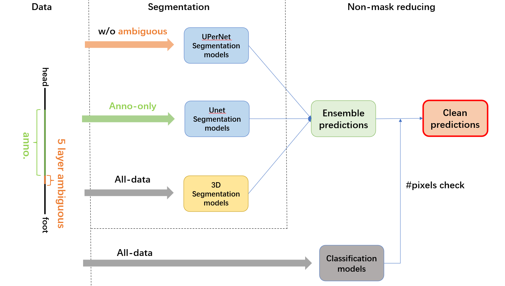
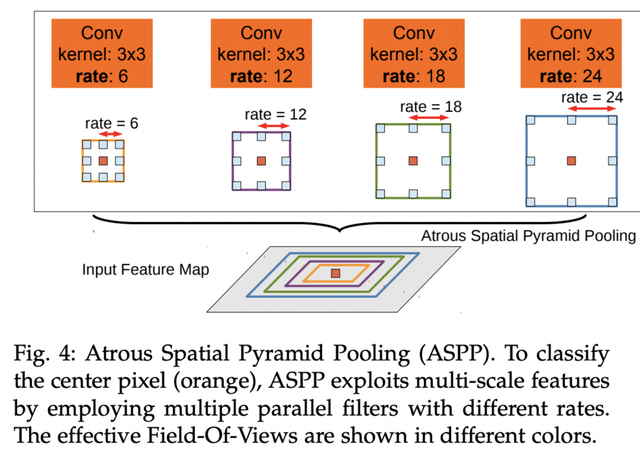
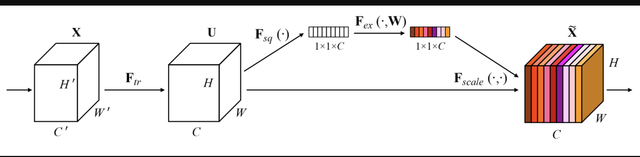

# UW-Madison - GI Tract Image Segmentation

> 主题：cv ｜ 子类：— ｜ 领域：医疗影像（MRI 多类分割）｜ 类别：Research
> 截止：2022-07-14 ｜ 队伍数：1548 ｜ 机制：代码赛 ｜ 指标：Dice + 3D Hausdorff（赛事中途引入 Hausdorff）
> 数据来源：`intel/uw-madison-gi-tract-image-segmentation/`（80 条主题索引 + 6 篇 write-up 正文；深读升级 2026-10-03，Tier A #35）

## 1. 任务与数据

- 预测目标：MRI 逐切片分割胃（stomach）/ 小肠（small_bowel）/ 大肠（large_bowel），3 类语义分割。
- 数据形态：每扫描 144（常见）或 80（少）切片；case = 患者 1–5 天 → 144–720 图；4 种图像尺寸；首 1/末 ~8 切片无 mask。
- 构造陷阱：
  - **部分标注 + 错误标注**（未标注≠空；社区"incorrect masks"高楼）→ 数据必须分层使用；
  - 空切片占比高 → 需要 CLS 门控或后过滤；
  - **指标中途加 3D Hausdorff** → 旧 Dice 选模会系统高估（MONAI：old 0.9108 vs new 0.8933）；
  - 类别可重叠 → 应做 multilabel（sigmoid）而非 multiclass（资源帖明确）。

## 2. 验证方案

| 方案 | 使用者 | 说明 |
| --- | --- | --- |
| 5 折按 case 分组 | 1st / 3rd / 5th | 同一患者不跨折；1st 还用"去除错误标注 case"的变体 |
| 分阶段选模 | 3rd | CLS 用 TP/(TP+FP+FN)+Dice；SEG 用 Dice |
| 新指标选模 | MONAI | v4 起以 Dice+Hausdorff 的局部实现做选模/微调（LB 0.860→0.872） |
| 局部/榜单对照 | 资源帖/MONAI | 局部 Dice 与 LB 可对照（3D 与 2D 模型可比） |

## 3. 方案谱系

| 方案 | 名次 | 关键点与数字 |
| --- | --- | --- |
| CLS + 三分层 SEG + 3D 融合 | 1st（127 票） | CLS 4×UNet(b4–b7)，阈值 0.6 + >12 正像素；SEG 5×UNet + 2×UPerNet（w/o ambiguous / anno-only / all-data 三分层）；3D 3×SegResNet(12/20/32)；3D/2.5D logits 0.4/0.6，阈值 0.4 |
| 9×2.5D(x/y/z) + 3×3D 全平均 | 5th（46 票） | 单模型最高 0.875 → 平均+阈值 0.3 = 0.889 → <50px 丢弃 = **0.890**；几何视角多样性 |
| 纯 3D MONAI 单系 | 3D 帖（162 票） | 160×160×80 → 224×224×80；v1 LB 0.817 → v3 0.857 → v6 0.872 → 5 折 0.877；全流程公开 |
| 检测裁剪 + CLS/SEG 双分支 UNet | 3rd（45 票） | EffDet-D0 裁剪；35 epoch/7 cycle + EMA/SWA；post 去 25px + 连续 3 正/负切片定起止；5 折 0.877/0.886；Hausdorff loss 失败 |
| 资源汇总 + 基线 | 社区（140 票） | DeepLabV3+ 0.810 → +ASPP+SE 0.817 → EffNetB0 UNet 0.828；数据事实与"smart baseline" |

## 4. 关键技巧

- **数据分层**：把"缺失标注（≠空）/ 错误标注 / 语义模糊区"分开处理——anno-only 训精细模型（UNet）、去 ambiguous 训 UPerNet、全量训 3D；1st 还排除错误 case。
- **CLS 门控**：先二分类判该切片有无目标（阈值 0.6 + 正像素 >12），负层直接零 mask；省算力 + 抑制假阳性。
- **2.5D/3D 融合**：3D 保 z 向一致性（对 Hausdorff 友好），2.5D 供多样性与效率；logits 加权 0.4/0.6、阈值 0.4（1st）；纯 3D 单系 5 折也能到 0.877（MONAI）。
- **几何视角多样性**：沿 x/y/z 三轴切 2.5D → 误差去相关 → 简单平均即 +0.014（5th）。
- **指标切换应对**：改选模协议与后处理，别直接改损失（Hausdorff loss 在 3rd 失败）。
- **后处理套餐**：小面积过滤（25/50px）、连续切片起止规则、阈值重扫（与集成耦合）。
- **训练技巧**：fp16 省 ~50% 显存（1st 2.5D）；弹性/网格/光学畸变；flip TTA +0.001–0.002；EMA/SWA（3rd）。

## 5. 可迁移性评估

- 可直接迁移：部分标注分层；CLS 门控 + 像素规则；2.5D/3D logits 融合；x/y/z 轴多样性；指标切换时先改选模；后处理套餐。
- 需要前提：3D 训练显存（224×224×80 体积；5th 提到 48G 单卡）；分割框架（mmsegmentation/SMP/MONAI）。
- 不建议照搬：把未标注切片当负样本；用旧指标选模；把 Hausdorff 直接当损失；随机切片划分。

## 6. 对新手的关键启示

1. 医学分割的分数差常来自"数据分层 + 空切片处理"，而不是换 backbone。
2. 指标中途变化时，第一动作是把**选模指标**换成竞赛指标，而不是换损失函数。
3. 2.5D 与 3D 不是二选一：3D 管 z 一致性，2.5D 管多样性与算力；融合上限最高。
4. 同一批 2.5D 数据换一个切割轴（x/y/z）就是免费的多样性。

## 7. 深读结论（2026-10 补）

**一句话**：这是一场"部分标注 + 空切片 + 指标切换"下的 2.5D/3D 融合工程赛——冠军结构 = 分类门控 + 三分层分割 + 3D/2.5D logits 融合。

**跨方案裁决**：

- 部分标注分层是共识（1st 最精细三分层；3rd 只用正样本；5th 后过滤兜底）。
- 空切片必须处理：CLS 门控（1st/3rd）或后过滤（5th），前者省算力抑假阳性。
- 2.5D vs 3D：3D 对 Hausdorff/边界有利，2.5D 供多样性；融合最优，预算受限时 2.5D 亦可（3rd 0.877）。
- 指标切换：选模协议优先（MONAI 高估 0.018 → 改新指标后 LB +0.032）；Hausdorff 不可直接当损失（3rd 失败）。
- 集成：大集成简单平均+阈值重扫足够（5th 0.890）；阈值与模型集耦合。

**数字账精选**：数据 144/80 片、144–720 图/病例；基线 0.810→0.828；1st 2.5D 单 0.883/融 0.889；5th 单 0.875→0.890；MONAI 0.817→0.877（5 折）；old/new 选模 0.9108/0.8933。

**失败学**：Hausdorff loss、亮度调整、外部 CT、正负平衡（3rd）；CenterCrop 去边无效果（1st 2.5D）；无 3D 的资源遗憾（3rd）。

**悬案**：2nd（337400）未收录；Incorrect masks（319963/321979）未收录；LB could be wrong（324934）与 Hausdorff usage（319215）未收录；2.5D/MMseg 模板帖（322549/323921）未收录。

## 8. 图表证据

> 路径相对本文件（`notes/cv/`）：`../../intel/uw-madison-gi-tract-image-segmentation/bodies/<topic>_img/NN.png`

**图 1：1st 的完整管线（topic 337197）**

- 分割三路：w/o ambiguous → UPerNet；Anno-only → UNet；All-data → 3D 模型；
- CLS（All-data）→ #pixels check → Clean predictions；
- 左侧竖条标出 head / anno / 5-layer ambiguous / foot——**"数据子集×模型角色"配对的直接图证**。

**图 2：ASPP（topic 320060）**

- rate 6/12/18/24 并行空洞卷积 → 多尺度感受野；
- 资源帖基线：DeepLabV3+ 0.810 → +ASPP+SE 0.817（器官尺度差异大，多尺度有效）。

**图 3：Squeeze-Excitation（topic 320060）**

- 通道挤压 → FC+sigmoid → 通道重加权；
- 加入 DeepLabV3+ 后 LB +0.007，小数据分割的低成本增益（后续 convnext/segformer 内置同类机制）。

## 9. 出处

- 讨论区索引：`intel/uw-madison-gi-tract-image-segmentation/topics.md`（80 条）
- 已收录 write-up（6 篇）：
  - 3D MONAI（162 票）：https://www.kaggle.com/competitions/uw-madison-gi-tract-image-segmentation/discussion/325646
  - 资源汇总（140 票）：https://www.kaggle.com/competitions/uw-madison-gi-tract-image-segmentation/discussion/320060
  - 1st（127 票）：https://www.kaggle.com/competitions/uw-madison-gi-tract-image-segmentation/discussion/337197
  - 1st 2.5D 部分（56 票）：https://www.kaggle.com/competitions/uw-madison-gi-tract-image-segmentation/discussion/337217
  - 5th（46 票）：https://www.kaggle.com/competitions/uw-madison-gi-tract-image-segmentation/discussion/337268
  - 3rd（45 票）：https://www.kaggle.com/competitions/uw-madison-gi-tract-image-segmentation/discussion/337468
- 深读全本：`analysis/deep/uw-madison-gi-tract-image-segmentation.md`（11 组件 + 3 图证）
- 缺口登记：2nd(337400)、322549、323921、320692、329396、326035、Incorrect masks(319963/321979)、LB could be wrong(324934)、Hausdorff usage(319215)、330336 未收录正文
