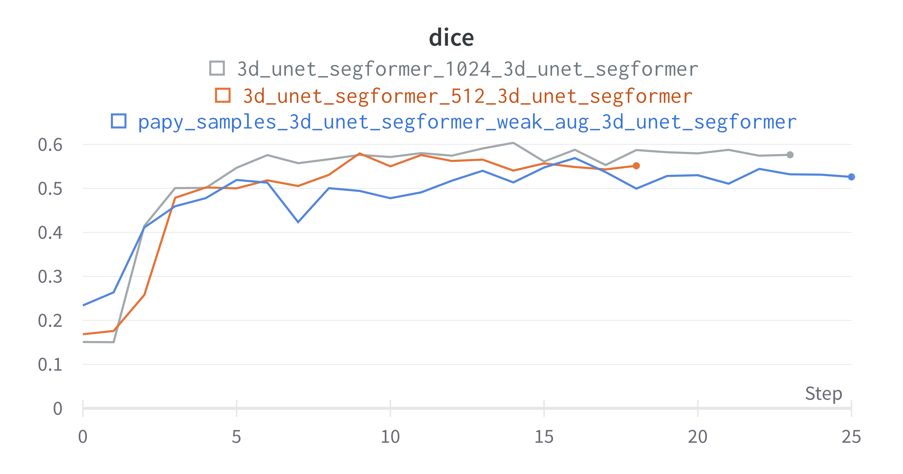
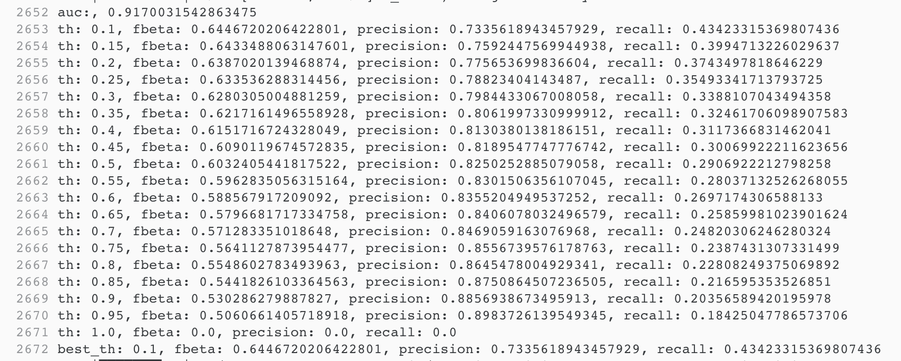
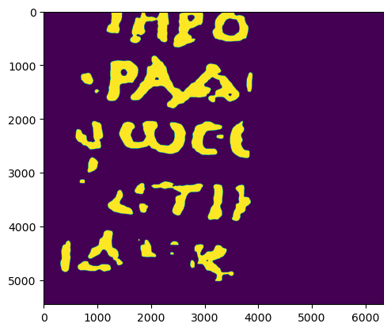
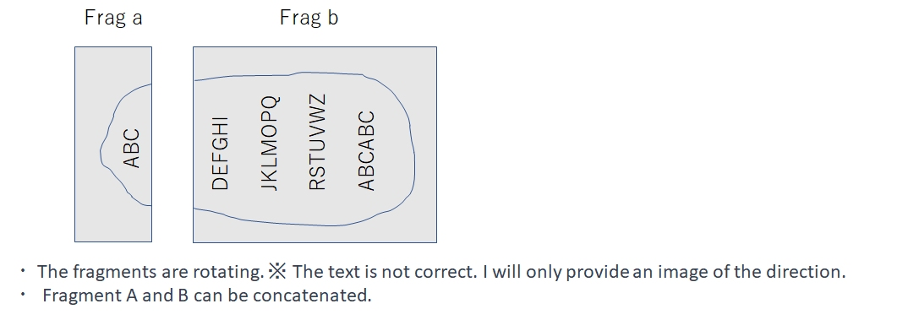
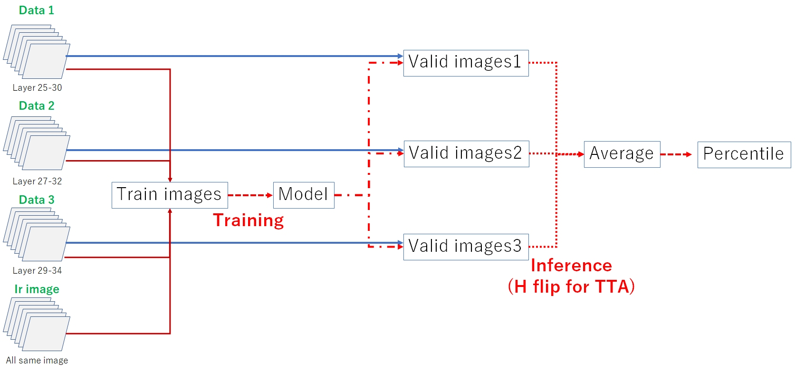
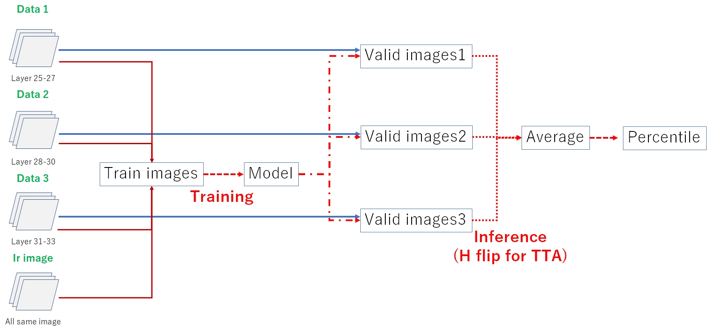
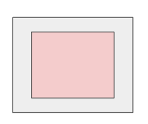

# Vesuvius Challenge - Ink Detection

> 主题：cv ｜ 子类：— ｜ 领域：文化遗产/3D 成像 ｜ 类别：Featured
> 截止：2023-06-14 ｜ 队伍数：1249 ｜ 机制：代码赛 ｜ 指标：F0.5（像素级）
> 数据来源：`intel/vesuvius-challenge-ink-detection/`（80 条主题索引 + 6 节正文：1st/2nd/6th/9th/11th + 自制纸莎草帖；7th/3rd/4th/5th 等 14 条未收录）

## 1. 任务与数据

- 预测目标：在**碳化卷轴的 3D X 射线 CT 扫描**中检测墨迹（像素级分割）。
- 数据形态：大体积 3D 体数据 + 表面纹理；正样本极稀疏。
- 构造陷阱：
  - 数据量大、显存受限 → 必须切块（crop）训练；
  - **测试集存在旋转等几何差异**（6th 明确提到），需要对应增强；
  - 公开榜样本少 → 榜分波动大，1st 明确表示"全程打得很保守，避免过拟合榜单"。
- **核心矛盾**：墨迹所在的 CT 层深在残篇间漂移 → "固定层当通道"（2.5D）会学到片段特异捷径；需要**深度不变聚合**（3D→沿 z max/pool→2D）。
- **任务结构**：测试残篇可 A/B 拼接且被旋转（6th 的推断，1st 未证实但做了旋转不变性）。

## 2. 方案谱系

| 方案 | 名次 | 关键点 |
| --- | --- | --- |
| 大切块（1024）+ 3D→max→2D SegFormer + 9 模型集成 | 1st | 四大归因；最佳单模 UNETR→b5 公开 0.82/私榜 0.67；平均后阈值居中 0.5；连通域清理 |
| A/B 拼接 + 旋转推理 + 百分位阈值 + IR 图 | 6th | 旋转修复公开 0.58→0.74；IR +0.01；EfficientNet+SegFormer 对照表；终提交 0.8116/0.6613 |
| 2.5D/3D 混合 + **1/32 分辨率输出** + percentile 阈值 | 2nd | "1/32 分辨率足够"；资源全给编码器；bce+global fbeta；重增强/EMA |
| 2.5D + 1D pool + 6 UNet 集成 | 11th | 按 3 分组（z_len=img_num/3）；RandomRotate90；阈值 0.5 |
| 2 折 × 2 模型（UNet/Daformer） | 9th | resnet34d-unet(256/32 层) + pvtv2-b3-daformer(384/16 层) |

## 3. 关键技巧

- **大 crop 训练**：128<512<1024（dice 曲线）；总像素近似不变 → 训练时间几乎不变（免费上下文）。
- **深度不变聚合**：3D（CNN/UNet/UNETR）→ 沿 z max 成多通道 → 2D 分割；2.5D 固定层会过拟合片段。
- **低分辨率输出**：1/32 标签 + 1/32 输出 + 双线性上采样（1st 猜测、2nd 实证）。
- **几何对齐**：90° 旋转增强/4× 旋转 TTA；A/B 拼接后旋转推理（6th）；窗口边缘忽略（2nd 红色区）。
- **校准三路线**：多模型平均（阈值居中 0.5）/ 百分位阈值（固定正例比例）/ 固定 0.5。
- **验证后全量训练**：fragment 1 验证通过 → 全残篇训练（+0.04）。
- **后处理**：连通域清理（<10k 剔除，本地最优 25k）；mask=0 跳过。

## 4. 深读结论（2026-10 补）

- **三个几何/统计问题决定成败**：深度不变性（三家独立收敛到"沿 z 池化"）、旋转对齐（6th 的 0.58→0.74 是全场最大单步）、阈值校准（单模型 best_th 可低至 0.1）。
- **大切块是分割任务的免费午餐**：1024² 覆盖是 128² 的 64 倍、切块数 1/64 → 训练时间不变而上下文翻倍；1st 的曲线显示三个尺寸严格排序。
- **低分辨率输出是"降维打击"**：F0.5 不需要像素级边界；1/32 输出 + 上采样同时省算力、强正则（2nd 独立验证 1st 的猜测）。
- **校准是集成的一部分**：多模型平均把宽阈值范围压回 0.5；百分位阈值用分布假设换稳定性（1st 认为风险太大而未用）。
- **小公开榜 → 防守策略常态**：1st 的 0.55 阈值实验公开更差/私榜略好未选；2nd 的 0.9/0.93 预期反转——选择风险双向存在。

## 5. 图表证据

**图 1：切块尺寸曲线（128<512<1024）**（1st，topic 417496）——`../../intel/vesuvius-challenge-ink-detection/bodies/417496_img/01.png`

*读图*：dice 收敛值 1024 ~0.58 / 512 ~0.55 / 1024+弱增强 ~0.52；大 crop 曲线更高更稳。

**图 2：单模型阈值扫描日志**（1st）——`../../intel/vesuvius-challenge-ink-detection/bodies/417496_img/05.png`

*读图*：该模型 best_th=**0.1**（fbeta 0.6447），th=0.5 时掉到 0.6032——单模型校准差异的原始证据。

**图 3/4：后处理前后（连通域清理）**（1st）——`../../intel/vesuvius-challenge-ink-detection/bodies/417496_img/06.png`、`.../07.png`

*读图*：差异为细小斑粒的剔除（视觉近似、MD5 不同）——后处理是去噪不是改形。

**图 5：测试数据理解（A/B 拼接 + 旋转）**（6th，topic 417274）——`../../intel/vesuvius-challenge-ink-detection/bodies/417274_img/01.jpg`

*读图*：Frag a/b 可拼接、文字纵向排布 → 拼接+旋转推理+还原。

**图 6/7：6th 的 CNN+Unet 与 SegFormer 管线**（topic 417274）——`../../intel/vesuvius-challenge-ink-detection/bodies/417274_img/02.jpg`、`.../03.jpg`

*读图*：层段 25-30/27-32/29-34 + IR（CNN 版 6 层/组；SegFormer 版 3 层/组凑 3 通道）→ 训练 → Average → Percentile。

**图 8：2nd 的红色有效区（忽略窗口边缘）**（topic 417255）——`../../intel/vesuvius-challenge-ink-detection/bodies/417255_img/01.png`

*读图*：滑窗推理只取每窗内部红色区域拼接输出，避开边缘伪影。

## 6. 可迁移性评估

- **可直接迁移**：
  - 大体积数据用**大切块 + 充分上下文**；
  - 几何增强要与测试集的形变对齐（旋转/翻转）；
  - 多模型平均的价值之一是**校准**（对稀疏正样本的阈值任务尤其重要）；
  - "验证通过后全量重训"是标准收尾。
- 需要前提：3D 数据处理与显存管理能力。
- 不建议照搬：直接整卷训练（显存不够）。

## 7. 对新手的关键启示

1. **切块尺寸是被低估的超参**。
2. **测试集有几何差异时，先做几何增强**。
3. 稀疏任务里，**校准比排序更重要**。

## 8. 出处

- 讨论区索引：`intel/vesuvius-challenge-ink-detection/topics.md`（80 条）
- 已收录正文（6 节）：
  - 1st（ryches，112 票）：https://www.kaggle.com/competitions/vesuvius-challenge-ink-detection/discussion/417496
  - 6th（chumajin，84 票）：https://www.kaggle.com/competitions/vesuvius-challenge-ink-detection/discussion/417274
  - 2nd（tattaka 队，76 票）：https://www.kaggle.com/competitions/vesuvius-challenge-ink-detection/discussion/417255
  - 9th（hengck23，43 票）：https://www.kaggle.com/competitions/vesuvius-challenge-ink-detection/discussion/417361
  - 11th（tk，33 票）：https://www.kaggle.com/competitions/vesuvius-challenge-ink-detection/discussion/417281
  - 自制碳化纸莎草（136 票）：https://www.kaggle.com/competitions/vesuvius-challenge-ink-detection/discussion/407545
- 未收录缺口（登记备查）：417430（7th）、417536（3rd）、417779（4th）、417642（5th）、417448（top 讨论）
- 深读全文：`analysis/deep/vesuvius-challenge-ink-detection.md`
