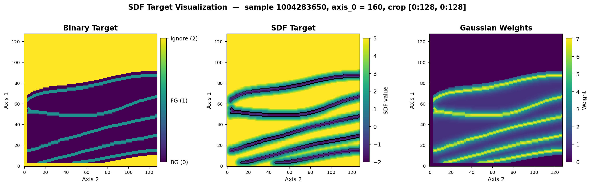
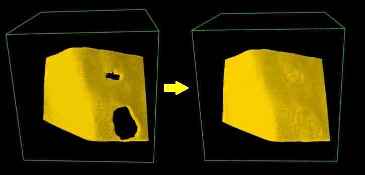

# Vesuvius Challenge - Surface Detection

> 主题：cv ｜ 子类：— ｜ 领域：文化遗产 3D 成像 ｜ 类别：Research
> 截止：2026-02-27 ｜ 队伍数：1391 ｜ 机制：代码赛 ｜ 指标：表面/层位分割（3D）
> 数据来源：`intel/vesuvius-challenge-surface-detection/`（80 条主题索引 + 6 篇 write-up 正文）

## 1. 任务与数据

- 预测目标：在碳化卷轴的 3D X 射线 CT 体数据中**检测纸面层（surface）**——墨迹检测的前置任务。
- 数据形态：大体积 3D 扫描；层间极薄、结构细。
- 构造陷阱：显存受限需切块；层与层间距小，二值分割边界模糊（**连续的层位更适合回归**）。

## 2. 方案谱系

| 方案 | 名次 | 关键点 |
| --- | --- | --- |
| **UNet 集成 + 回归有符号距离场（SDF）** | 5th | 核心创新：不预测二值掩码，而是**回归 SDF**，并用等价的 "SDF L1 + SDF mass" 损失（对应 BCE + Dice）；多检查点平均 |
| 其他方案 | 见讨论区 | |

## 3. 关键技巧

- **把二值分割改成距离场回归**：边界模糊/层薄时，SDF 提供更平滑的学习信号（与实例分割中的中心回归同源）。
- **损失的类比替换**（BCE+Dice → SDF L1 + mass）。
- **多检查点平均**（checkpoint ensembling）稳定结果。
- 大体积的切块训练与推理。

## 4. 可迁移性评估

- **可直接迁移**：
  - **SDF 回归替代二值分割**（薄结构、模糊边界任务通用：血管、裂缝、层位）；
  - 损失的类比映射（把分类损失改写成回归版）；
  - 检查点集成。
- 需要前提：3D 分割框架与显存预算。
- 不建议照搬：对细薄结构直接用二值交叉熵（梯度稀疏）。

## 5. 对新手的关键启示

1. **细薄结构用距离场，而不是二值掩码**（本场 5th 的核心）。
2. 与 Vesuvius 2023（墨迹检测）对照：同一系列从"检测墨迹"演进到"检测纸面层"，**方法从分类转向几何回归**。
3. 与 CZII cryo-ET、Biohub、RSNA 系列并列：**3D 科学影像的方法论已趋统一**。

## 6. 轻读结论（2026-10 补）

**一句话**：含拓扑项的 3D 表面分割——**SDF/概率软表示 + 全卷推理 + 拓扑后处理**决定分数；公私榜脱钩使提交选择成为运气环节。

- 1st（66 票）：nnU-Net 4 模型集成（patch 128/192/256）；私 0.627；后处理链私 0.596→0.627（去小连通→补小洞→高度图补大洞→closing→fill_holes）。
- 5th（51 票）：SDF 回归（高斯加权 L1 + mass Dice）；160³ 训练/320³ 全卷推理；**迭代 H1 隧道填充 0→13 轮 = 拓扑 +0.08**（持久同调 + 桥检测 + 组件数保护）。
- 教训：融合用 logits 优于概率、阈值偏大私榜更好（1st）；CV/公榜/私榜均不相关（5th）。

**失败学**：BCE 二值在拓扑项更差；滑窗推理产生拓扑伪影；"touching sheets" 全场未解决。

**悬案**：2nd/3rd 方案与指标精确定义未收录；C++ 持久同调实现细节缺失。

## 7. 图表证据

**图 1**（topic 679360）：二值目标 / SDF 目标 / 高斯权重三联图——距离回归表示的动机。

**图 2**（topic 679238）：sheet 高度图线性插值补洞 before→after。

## 8. 出处

- 讨论区索引：`intel/vesuvius-challenge-surface-detection/topics.md`（80 条）
- 已收录 write-up（6 篇）：
  - 1st（66 票）：https://www.kaggle.com/competitions/vesuvius-challenge-surface-detection/discussion/679238
  - 4th（31 票）：https://www.kaggle.com/competitions/vesuvius-challenge-surface-detection/discussion/679222
  - 5th SDF 回归（51 票）：https://www.kaggle.com/competitions/vesuvius-challenge-surface-detection/discussion/679360
  - 方案讨论（58 票）：https://www.kaggle.com/competitions/vesuvius-challenge-surface-detection/discussion/651532
- 轻读全本：`analysis/deep/vesuvius-challenge-surface-detection.md`（Tier B 轻读：对照矩阵/裁决/证据分级/悬案 + 2 图证）
