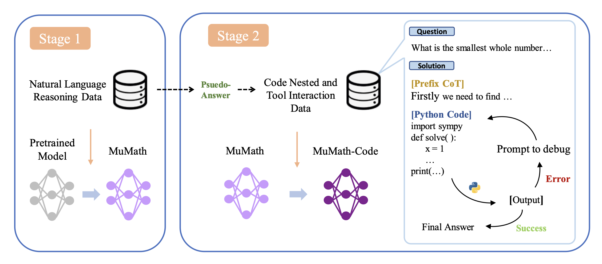

# AI Mathematical Olympiad Prize（AIMO 首届）

> 主题：nlp ｜ 子类：reasoning ｜ 领域：数学推理 ｜ 类别：Featured
> 截止：2024-06-27 ｜ 队伍数：1161 ｜ 机制：代码赛 ｜ 指标：正确率（50 题）
> 数据来源：`intel/ai-mathematical-olympiad-prize/`（80 条主题索引 + 6 篇 write-up 正文）

## 1. 任务与数据

- 预测目标：在 Kaggle Notebook 的算力约束下，用开源 LLM 解 50 道 IMO 级数学题。
- 数据形态：题目只有答案（多为整数）；**可用外部数学数据集训练**（本题允许）。
- 构造陷阱：
  - **算力与时限** 是最硬的约束（要在有限 GPU 内完成训练与推理）；
  - 答案格式与题型需与测试对齐（整数答案）；
  - 需自建训练/验证语料。

## 2. 方案谱系

| 方案 | 名次 | 关键点 |
| --- | --- | --- |
| Numina 方案（数据配方 + 训练 + 推理三件套，含 TIR 模型） | 1st | 开源 7B 工具集成推理模型（NuminaMath-7B-TIR）与推理 notebook |
| **SFT + ORM（结果奖励模型）** | 2nd | 用两份 DeepSeek-Math-7B-RL：一个作策略生成解答，一个作**奖励模型给候选打分**，再做**加权多数投票**；训练数据来自 AMC/AIME/Odyssey-Math，且**只保留整数答案题**（与测试格式对齐） |
| 3rd / 4th / 41st | 其他 | 见讨论区 |

## 3. 关键技巧

- **结果奖励模型（ORM）+ 加权多数投票**：用奖励模型为多条候选解答打分，再按分数加权投票——无需强化学习即可提升正确率。
- **数据与测试格式对齐**：只选整数答案题目、去掉选择题选项（2nd 的明确做法）。
- **工具集成推理（TIR）**：让模型调用代码计算/验证（1st 的模型即 TIR 版本）。
- **算力预算管理**：训练与推理都在 Notebook 约束内完成。
- **开源复用**：1st 明确说自己的决策受公开 notebook 启发。

## 4. 可迁移性评估

- **可直接迁移**：
  - **ORM + 加权多数投票**：推理期无需再训练即可提分，适用于一切可自动校验的任务。
  - 训练数据与测试格式的**严格对齐**（答案类型、题型）。
  - TIR（用代码验证）。
- 需要前提：可训练/可部署的开源 LLM；奖励模型需要标注或自举数据。
- 不建议照搬：直接用未筛选的通用数学语料。

## 5. 对新手的关键启示

1. **"多候选 + 奖励模型打分 + 加权投票"是最实用的推理增强套路**。
2. **数据与测试格式对齐**是被忽视的细节（本场：只要整数答案题）。
3. 把 AIMO 三届连起来看：**首届比训练（SFT+ORM）→ 第二届比数据规模（1.7M/540K 筛选）→ 第三届纯推理工程**，是同一赛事三年演进的最好教材。

## 6. 轻读结论（2026-10 补）

**一句话**：50 道奥数题的算力受限赛——**工具集成推理（TIR）是核心**（模型只规划、Python/SymPy 负责计算），**解码/投票策略与模型同等重要**，而**方差极大**（社区专帖："洗牌不可避免"）。

- 1st（Numina/AI-MO，191 票）：DeepSeekMath-Base-7B 按 **MuMath-Code 两阶段**全参微调（Stage1 CoT → Stage2 ToRA 格式 TIR 数据，GPT-4 生成 + 执行反馈）；带执行反馈的 TIR 解码；TRL packing/ZeRO-3/8×H100 10h；验证=AMC12 83 题（解出 60–65%，5–10 种子波动 1–3%）+ AIME + MATH L4&5；**on-policy KTO 比 SFT 好几个百分点（公榜 27/50）**但未用于终版；RLOO 无效。
- 2nd（CMU_MATH）：**SFT + ORM**——两个 DeepSeekMath-7B-RL（策略 + 奖励），奖励模型做**加权多数投票**；数据=AMC/AIME/Odyssey 整数题 + GPT-4 代码解筛选；全开源。
- 3rd（72 票）：**不微调**，DeepSeek-Math-7B-RL + vLLM（FP16 KV cache）+ **120–160 候选** + 自研打分规则（惩罚 <10 的数字与**抄题面的数字**）+ "The final answer is \boxed{" 强制作答。
- 社区：SymPy（86 票）、20 分不用 probing（63 票）、外部数据 21k/8.8k（68–75 票）、方差帖（70 票）、$10k 早分享奖（84 票）。

**裁决**：先接工具（TIR），再优化解码与投票，最后才考虑微调/RL；模型选择用多种子内部验证；在线 RL（RLOO）不如采样+KTO。

**悬案**：4th–10th 方案缺失；probing 的规模与影响未整理；提交关闭/身份验证事件无结论。

## 7. 图表证据

**图 1**（topic 519303）：CoT 数据 → MuMath → ToRA 格式 TIR 数据（含执行失败→调试→成功循环）→ MuMath-Code。

## 8. 出处

- 讨论区索引：`intel/ai-mathematical-olympiad-prize/topics.md`（80 条）
- 已收录 write-up（6 篇）：
  - 1st Numina（191 票）：https://www.kaggle.com/competitions/ai-mathematical-olympiad-prize/discussion/519303
  - 2nd CMU_MATH（62 票）：https://www.kaggle.com/competitions/ai-mathematical-olympiad-prize/discussion/518964
  - 3rd（72 票）：https://www.kaggle.com/competitions/ai-mathematical-olympiad-prize/discussion/517206
  - 4th（36 票）：https://www.kaggle.com/competitions/ai-mathematical-olympiad-prize/discussion/518960
  - 41st（23 票）：https://www.kaggle.com/competitions/ai-mathematical-olympiad-prize/discussion/516868
  - 2nd CMU_MATH：https://www.kaggle.com/competitions/ai-mathematical-olympiad-prize/discussion/518964
  - 分数方差（70 票）：https://www.kaggle.com/competitions/ai-mathematical-olympiad-prize/discussion/509388
  - SymPy（86 票）：https://www.kaggle.com/competitions/ai-mathematical-olympiad-prize/discussion/494713
  - 入门资源（177 票）：https://www.kaggle.com/competitions/ai-mathematical-olympiad-prize/discussion/488264
- 轻读全本：`analysis/deep/ai-mathematical-olympiad-prize.md`（Tier B 轻读：对照矩阵/裁决/证据分级/悬案 + 1 图证）
