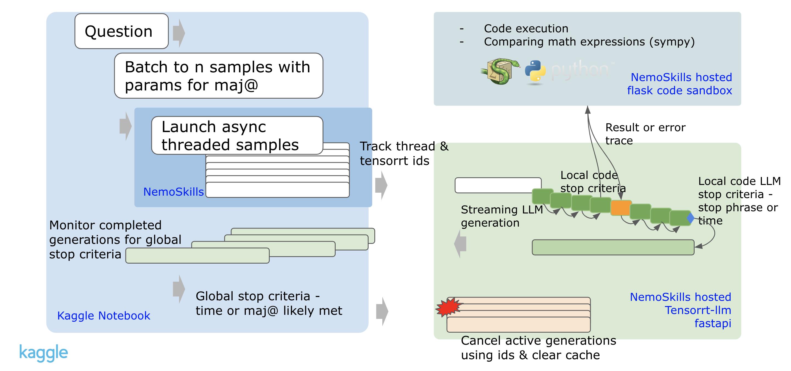

# AI Mathematical Olympiad - Progress Prize 2

> 主题：nlp ｜ 子类：reasoning ｜ 领域：数学推理 ｜ 类别：Featured
> 截止：2025-04-01 ｜ 队伍数：2212 ｜ 机制：代码赛 ｜ 指标：Accuracy（50 题）
> 数据来源：`intel/ai-mathematical-olympiad-progress-prize-2/`（120 条主题索引 + 8 篇 write-up 正文）

## 1. 任务与数据

- **任务形式**：解 50 道 IMO 级数学题，受**模型规模与推理时限**双重约束（本题对效率与正确率同时计分）。
- **与 AIMO3 的差别**：AIMO3 是纯推理工程（不训练），AIMO2 的重点是**训练自己的推理模型**（SFT/DPO + 工具集成推理）。

## 2. 验证方案

| 方案 | 使用者 | 说明 |
| --- | --- | --- |
| 自建 CV 题库 | 1st | 用公开数学数据集做内部评测 |
| CV 与榜分对齐分析 | 1st | 明确记录"公开榜与 CV 长期不一致，但私榜更接近 CV"——**CV 仍是更可靠的信号** |
| 分题型统计 | 多数 | 定位薄弱题型 |

## 3. 方案谱系

| 方案 | 名次 | 关键点 |
| --- | --- | --- |
| 自研 TIR（工具集成推理）模型 + 数据筛选 | 1st | 从 540K 数学解答中筛选构建数据集（基于 OpenMathReasoning 5.5M）；**开源 1.5B/7B/14B/32B 系列**，其中 1.5B 在 AIME 上超过 R1 |
| DeepSeek-14B 的 SFT + 两轮 DPO，多模型集成 | 2nd | 公开榜 34/50（第 1），私榜 31/50（第 2）；同时优化效率与推理表现 |
| 多模型方案 | 4th / 7th / 21st | 多数走"开源基座 + 数学数据微调"路线 |

## 4. 关键技巧

- **数据筛选是核心**：从大规模数学解答中过滤出高质量 CoT/TIR 轨迹。
- **工具集成推理（TIR）**：让模型调用代码执行来验证与计算，是数学任务的标准增强。
- **SFT → DPO 两段式**：先监督微调再偏好优化。
- **小模型也能很强**：经过高质量数据训练，1.5B 模型可在 AIME 上超过大模型——**数据质量 > 参数规模**。
- **效率约束下的推理策略**：多候选、自适应预算。

## 5. 可迁移性评估

- **可直接迁移**：
  - "**筛选高质量推理轨迹 + SFT + 偏好优化**"的通用配方。
  - 工具集成推理（让模型写代码验证）在可验证任务上普遍有效。
  - 当公开榜不可信时，坚持用自建 CV 做决策。
- **需要前提**：
  - 需要数学语料与微调算力（但 1.5B 级的成果说明门槛可降低）。
- **不建议照搬**：
  - 直接使用未筛选的大规模语料（噪声会显著拖累）。

## 6. 对新手的关键启示

1. **数据筛选是推理类比赛的第一杠杆**，不是模型规模。
2. **小模型 + 好数据**可以超过大模型，这在本场有公开证据。
3. **公开榜不可靠时以 CV 为准**（冠军的经验之谈）。
4. 对比 AIMO2 与 AIMO3 可以清楚看到同一赛事的两种范式：训练派 vs 推理工程派。

## 7. 轻读结论（2026-10 补）

**一句话**：离线 LLM 数学竞赛的三角——**R1-Distill-Qwen-14B 基座 × 效率工程 × 测试时策略**；零训练也能进前 3，推理工程上限被严重低估。

- 1st（147 票）：540K 题→3.2M CoT + 15K TIR；Qwen2.5-14B SFT（512×H100/48h）+ **CoT×0.3+TIR×0.7 线性 merge**（maj@16 62.9/66.8→69.1，长度 15834→12489、代码执行 2.73→0.85）；TensorRT-LLM+FP8+ReDrafter（1.8×/65% 接受；210→554 tok/s）；12 路异步 + 流式早停 + 350s+210s 时间缓冲（图 1）。
- 2nd（111 票）：SFT 8 epochs + **DPO 压长度**；lmdeploy+AWQ4+KV8（比 FP16 快 55%）；15 样本（7 CoT+8 code）+ 双层早停 + 时间自适应；公 34→私 31/50。
- 3rd（58 票）：**零训练**；5 分支×4096 → 复制到 10 → ≥6 完成且 >70% 共识即停，否则复制 7 条到 14×4096；vLLM prefix caching；私 30/50。
- 8th（65 票）：单模型 AWQ4 + 单 prompt + 5 attempts；私 28/50；记录"我 Google 过"式幻觉。

**裁决**：基座唯一（R1-14B）；效率换尝试次数；长度控制=可行性；训练非必需（3rd 零训练第 3）；50 题下公榜噪声极大、以自建验证为准。

**悬案**：digest 仅收 2 篇（本地 14 篇，其余未细读）；开源合规争议与官方处置未收录。

## 8. 图表证据

**图 1**（topic 574765）：批量 maj@ 样本 → TensorRT-LLM 异步流式生成 + 代码沙箱 → 全局停止（时间/共识）→ 取消与清缓存。

## 9. 出处

- 讨论区索引：`intel/ai-mathematical-olympiad-progress-prize-2/topics.md`（120 条）
- 已收录 write-up（8 篇）：
  - 1st（147 票）：https://www.kaggle.com/competitions/ai-mathematical-olympiad-progress-prize-2/discussion/574765
  - 2nd（111 票）：https://www.kaggle.com/competitions/ai-mathematical-olympiad-progress-prize-2/discussion/572948
  - 4th（16 票）：https://www.kaggle.com/competitions/ai-mathematical-olympiad-progress-prize-2/discussion/573671
  - 7th（46 票）：https://www.kaggle.com/competitions/ai-mathematical-olympiad-progress-prize-2/discussion/572760
  - 21st（24 票）：https://www.kaggle.com/competitions/ai-mathematical-olympiad-progress-prize-2/discussion/571289
- 轻读全本：`analysis/deep/ai-mathematical-olympiad-progress-prize-2.md`（Tier B 轻读：对照矩阵/裁决/证据分级/悬案 + 1 图证）
