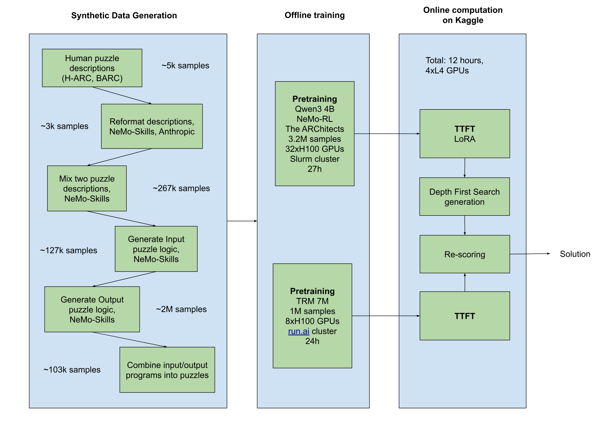
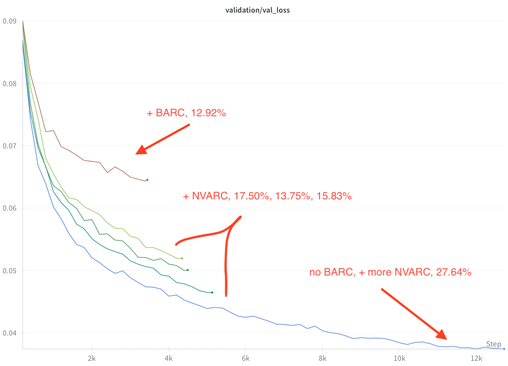

# ARC Prize 2025

> 主题：nlp ｜ 子类：reasoning ｜ 领域：抽象推理 ｜ 类别：Featured
> 截止：2025-11-03 ｜ 队伍数：1455 ｜ 机制：代码赛 ｜ 指标：ARC-AGI-2 隐测试得分（$1M 奖金）
> 数据来源：`intel/arc-prize-2025/`（80 条主题索引 + 6 篇 write-up 正文）

## 1. 任务与数据

- 预测目标：解 ARC-AGI-2 抽象推理题（网格变换），在**隐藏测试集**上评分。
- 数据形态：每题由少量输入-输出网格对给出；**题目本身是测试集的一部分，训练数据极少**。
- 构造陷阱：
  - **泛化是唯一指标**：社区最著名的现象是本场巨大的公/私榜位移。
  - 题目形式与人类直觉差异大，程序合成/搜索类方法与神经网络方法并存。

## 2. 方案谱系

| 方案 | 名次 | 关键点 |
| --- | --- | --- |
| 多阶段合成数据生成 + 改进版 ARChitects 方案 + 改进版 Tiny Recursive Model | NVARC（高票） | 四阶段 SDG 流水线：收集题目描述 → 生成摘要 → 混合两个摘要生成更复杂题目；在 2024 冠军方案上迭代 |
| 沿用 2024 冠军基线（ARChitects） | 5th | **公开榜 344 名 → 私榜第 5 名**，作者强调这正是"泛化能力决定成败"的体现 |

## 3. 关键技巧

- **合成数据生成（SDG）**：ARC 训练样本极少，靠"描述 → 摘要 → 混合生成更复杂题"扩充；
- **站在往届冠军肩膀上**：2024 年的开源方案是本场多数强队的起点；
- **递归小模型**（Tiny Recursive Model）路线：用小型递归结构替代大模型；
- **不要以公开榜判断泛化**：本场公开/私榜位移极端。

## 4. 可迁移性评估

- **可直接迁移**：
  - **合成的"难度递增"生成策略**（混合摘要 → 生成更复杂样本），适用于任何训练数据稀缺的推理任务。
  - 往届冠军方案作为起点是正当且高效的路径。
- 需要前提：需要可本地评测的题目集与合成流水线；

  推理成本高（搜索/程序合成）。
- 不建议照搬：用公开榜筛选方案（本场位移极大）。

## 5. 对新手的关键启示

1. **训练样本极少时，合成数据的"难度阶梯"设计比模型大小重要**。
2. **公开榜与私榜可以完全脱节**——ARC 系列是最极端的例子。
3. **复现并改进上届冠军方案**是这类比赛的常规起点。

## 7. 轻读结论（2026-10 补）

**一句话**：顶级方案的公式已收敛为"**预训练规模 + 测试时自适应 + 候选重打分**"——NVARC 用 LLM 生成 10 万+ 合成谜题（3.2M 样本）做逐题 LoRA + 批量 DFS（公榜 27.64%）；MindsAI&Tufa 用 660M CodeT5 自训 1 亿+ 样本 + TTT/AIRV（8–12× 增益，私榜 3rd 15.42%）；ARChitects 的掩码扩散已知形状可达 30.5%±1%，却因 shape 预测与选错提交落在私榜 16.53%。

- NVARC（651671）：四阶段 SDG（描述 → 混合摘要 → 输入程序 → 输出程序）+ 3.2M 增强样本；Qwen3 4B 全参微调（32×H100×27h）+ 逐题 LoRA r=256 + batch DFS + "频次×几何平均"重打分；TRM 2h 版 2.08% → 选点 7.5% → 赛后 10.0%。
- MindsAI&Tufa（629790）：660M CodeT5（encoder 24 / decoder 16）+ >100M 推理样本；TTT ~45k 步 + AIRV 1 万增强/题；mixup/combine +6.3% top-2；简化版 77M 单 P100 10–60 分钟。
- ARChitects（656966）：LLaDA-8B + soft-masking 递归精化 + Golden Gate RoPE（2D）；shape predictor 85%；公 21.67 / 私 16.53（未选 19.17/19.17）。
- 5th（617939）：2024 冠军底座只改随机种子 19920627 → 公榜 344 → 私榜第 5；种子间 3.33–6.67%（±4 题）。
- 2024 复盘（575595）：手工函数库（3rd 700 行 40 分）、颜色重映射预处理（21st +2 分）、多求解器 mega-ensemble（5th）、19-token 自训 Transformer（13th，31 分）。
- 治理：排队/超时（614325/611119/614436）、隐藏测试单样本（578736）、测试集编辑（573301）。

**裁决**：ARC 范式 = 大规模合成预训练 + 逐题测试时自适应 + 多增强重打分；小样本下选择策略（含种子）与模型同等重要；代码赛必须为排队/超时留冗余。

**悬案**：最终私榜完整名次未确认；652927/615018/614521 未细读；归档图仅 2 张有信息量。

## 8. 图表证据

**图 1**（topic 651671）：合成数据生成（~5k 描述 → ~267k 摘要 → ~127k 输入程序 → ~103k 谜题）→ 离线训练（Qwen3 4B / TRM）→ Kaggle 在线（12h、4×L4）。

**图 2**（topic 651671）：去掉 BARC、增加 NVARC 合成数据后 loss 最低、公榜 27.64%。

## 9. 出处

- 讨论区索引：`intel/arc-prize-2025/topics.md`（80 条）
- 已收录 write-up（6 篇）：
  - NVARC 方案（123 票）：https://www.kaggle.com/competitions/arc-prize-2025/discussion/651671
  - 私榜第 5 / 公开 344（13 票）：https://www.kaggle.com/competitions/arc-prize-2025/discussion/617939
  - 3rd MindsAI & Tufa Labs（16 票）：https://www.kaggle.com/competitions/arc-prize-2025/discussion/629790
  - ARChitects 方案（15 票）：https://www.kaggle.com/competitions/arc-prize-2025/discussion/656966
  - ARC 2024 复盘（49 票）：https://www.kaggle.com/competitions/arc-prize-2025/discussion/575595
  - 公榜第一自述（152 票）：https://www.kaggle.com/competitions/arc-prize-2025/discussion/614436
