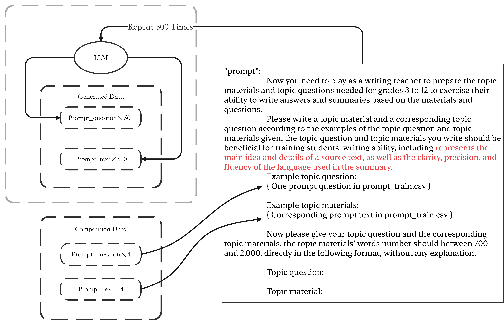
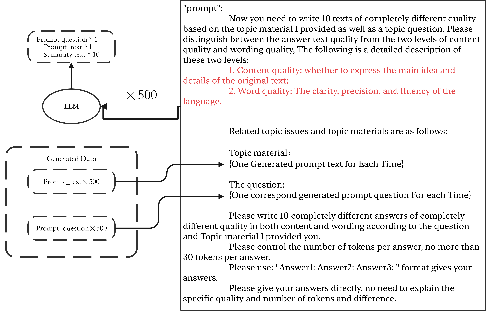

# CommonLit - Evaluate Student Summaries

> 主题：nlp（文本评分/回归）｜ 子类：— ｜ 领域：教育 ｜ 类别：Featured
> 截止：2023-10-11 ｜ 队伍数：2064 ｜ 机制：代码赛 ｜ 指标：Mean Weighted Columnwise RMSE（content + wording，越低越好）
> 数据来源：`intel/commonlit-evaluate-student-summaries/`（120 条主题索引 + 8 篇 write-up 正文；深读升级 2026-10-03，Tier A #46）

## 1. 任务与数据

- 预测目标：给学生摘要按 **content / wording** 两维打分（加权列 RMSE）。
- 数据形态：train 只有 **4 个 prompt**（含材料文本 prompt_text），test 有 **122 个 prompt**；公共榜只占 13% 数据。
- 构造陷阱：
  - **主题分布漂移**（4→122）→ shakeup 剧烈、鲁棒性优先；
  - prompt_text 是否入输入决定"内容覆盖"能否判断；
  - 池化方式（是否只聚焦学生答案）影响巨大；
  - 训练 vs 推理长度不匹配（推理延长涨分）；
  - 离群 prompt（814d6b）使常规 CV 失效。

## 2. 验证方案

| 方案 | 使用者 | 说明 |
| --- | --- | --- |
| groupkfold(prompt_id) | 2nd/3rd/5th/7th | 按 prompt 分组，避免同主题泄漏 |
| 双 CV（含/不含 814d6b） | 9th | 离群 prompt 单独对照；私榜更认可"包含"版 |
| fulltrain×N（不依赖折） | 4th | 压缩 fold 信息、允许更多集成、降 per-prompt 方差 |
| 3 seeds 集成评估 | 9th | 种子方差大，用 3 seed 平均 |
| 只看本地 CV（13% LB 不可信） | 7th | 公榜数据量小、噪声大 |

## 3. 方案谱系

| 方案 | 名次 | 关键点与数字 |
| --- | --- | --- |
| meta pseudo label + LLM 主题扩增 | 1st（59 票，brief） | 4fold deberta-v3-large；LLM 生成 500 主题×10 多质量摘要；**meta-PL 3 轮**；两阶段（PL 2 → train 2–3 epoch）；按长度排序推理（7h vs 9h）；称 head mask+meta-PL 单模型可达 .43+（详细版未发布） |
| Head Mask + PL + 长上下文 | 2nd（142 票） | 输入含 prompt_text；**Head Mask（mean pooling 仅答案 tokens）= 最大单点**；question 增强 10 变体；Feedback 3.0 六维辅助（0.5/0.5 隔步）；PL 使 CV **.4581→.4476**；训练长度 896–1280→1280–2048、推理 1792/2048；5 模型集成 |
| fulltrain×7 + 长推理 | 4th（81 票） | 1 fulltrain ×7 模型（sub2 私 **0.45515**）；推理 850→1500 涨分；prompt attention pooling；ArcFace 38 类辅助 |
| 简单管线 + EMA + 反向纠错增强 | 3rd（43 票） | EMA 必需；差分 LR；CLS+答案 meanpool；反向自动纠错增强 fold3 私 **0.453**；推理 1500；失败：decoder/AWP/FGM/GBT |
| 四段输入 + 冻结 18 层 + LGB | 5th（47 票） | summary+question+title+prompt_text；maxlen 1536；冻结 embedding+18 层；CV .4816→集成 **.4748**；LLM 数据/伪标失败 |
| 双 deberta + LSTM + 4200 推理 | 9th（58 票） | prompt 814d6b 离群→双 CV；3 seeds；SmoothL1/EMA；**推理 token_len 4200**；CV .495、私 .457 |
| 增益表 + LGBM 混合 | 7th | +prompt_text **+0.03**、freeze +0.01、输入混合 +0.01、LGBM +0.005 |
| 离线 pip 工具 | 社区（129 票） | 无网络安装任意 pypi 包的方法（公共品） |

## 4. 关键技巧

- **Head Mask**：mean pooling 只覆盖学生答案 tokens（其他位置权重 0）；对难 prompt 提升最大。
- **prompt_text 必进输入**（+0.03 CV）；材料是内容维度的判据。
- **主题多样性扩增**：LLM 生成新主题材料+问题（500 个）、每主题多质量摘要；question 变体增强（10×）。
- **meta pseudo label / 两阶段**：PL 预训练 → 干净数据精调；PL 解锁更长训练长度与 base 模型。
- **长度工程**：推理长度 > 训练长度（850→1500、1280→2048、4200）。
- **辅助任务**：Feedback 3.0 六维（+0.5 权重隔步）、ArcFace 38 类内容类型。
- **训练技巧**：层wise LR 衰减、冻结底层（8 或 embedding+18）、关 dropout、multisample dropout、EMA（3rd 称必需）。
- **鲁棒集成**：fulltrain×N（4th）；DeBERTa+LGB（Nelder-Mead 权重）；多输入路径混合。

## 5. 可迁移性评估

- 可直接迁移：评分对象感知的池化（head mask）；主题/提示多样性扩增；两阶段+PL；推理长度延长；辅助维度多任务；prompt 分组 CV 与离群 prompt 对照；fulltrain 换方差。
- 需要前提：DeBERTa 级编码器；可生成主题/材料的 LLM（需注意许可）；材料文本可获取。
- 不建议照搬：decoder 模型、AWP/SWA/FGM、LGB stacking（本场）、无协议的 LLM 伪标、只信 13% 公榜。

## 6. 对新手的关键启示

1. 评分类任务先问"模型该看哪段文字"——池化边界要对齐预测对象（本场 head mask）。
2. 训练主题少、测试主题多时，扩主题多样性的收益大于调模型。
3. 推理长度可以大于训练长度，这是零训练成本的涨分点。
4. 伪标签要有协议（教师质量+两阶段），否则无效甚至有害。
5. 分布漂移下用 fulltrain 换方差、用 prompt 分组做验证、用多方案对照处理离群 prompt。

## 7. 深读结论（2026-10 补）

**一句话**：这是一场"主题多样性 + 池化/长度工程"的鲁棒性比赛——模型全是 DeBERTa-v3-large，功夫在数据与输入对齐上。

**跨方案裁决**：

- DeBERTa-v3-large 是唯一主干（decoder/base 都差）。
- prompt_text 必须进输入（7th 量化 +0.03）。
- Head Mask 是最大单点（2nd）；本质是"池化聚焦评分对象"。
- 主题多样性扩增是上限（1st 500 主题+meta-PL；2nd question 增强）；PL 需两阶段协议（5th 的反例）。
- 推理长度延长普遍涨分（4th/2nd/9th）。
- 鲁棒性：fulltrain×N（4th）、离群 prompt 双 CV（9th）、CV 只看训练分布外（7th）。

**数字账精选**：Head Mask 最大单点；PL .4581→.4476；4th 私 0.45515；7th +0.03/+0.01/+0.01/+0.005；5th 集成 .4748；9th 推理 4200/CV .495；1st 500 主题、7h 推理。

**失败学**：decoder 模型、deberta-v3-base+prompt_text、LLM 数据/伪标（5th）、LGB stacking、AWP/SWA/FGM/WD、常数 LR、手工特征/GBT stacking、同 prompt 其他摘要拼接。

**悬案**：1st 详细解法未发布（最大缺口）；Grade gaps/autocorrect license/rotate content 等帖未收录；meta-PL 防噪细节缺失。

## 8. 图表证据

> 路径相对本文件（`notes/nlp/`）：`../../intel/commonlit-evaluate-student-summaries/bodies/<topic>_img/NN.jpg`

**图 1：主题生成（topic 447293）**

- 以 4 个竞赛 prompt 为示例，让 LLM 生成 500 个新 topic question + 700–2000 字材料；
- 主题空间扩增是 meta-PL 的第一步。

**图 2：多质量摘要生成（topic 447293）**

- 每个主题生成 10 条 content/wording 质量各异的摘要（≤30 tokens）；
- 合成数据按两条评分维度设计，为 meta-PL 提供质量梯度。

*（本场归档图片极少：446524 的唯一图片为用户名头像，不内嵌。）*

## 9. 出处

- 讨论区索引：`intel/commonlit-evaluate-student-summaries/topics.md`（120 条）
- 已收录 write-up（8 篇）：
  - 2nd（142 票）：https://www.kaggle.com/competitions/commonlit-evaluate-student-summaries/discussion/446573
  - 离线 pip（129 票）：https://www.kaggle.com/competitions/commonlit-evaluate-student-summaries/discussion/435153
  - 4th（81 票）：https://www.kaggle.com/competitions/commonlit-evaluate-student-summaries/discussion/446524
  - 1st（59 票）：https://www.kaggle.com/competitions/commonlit-evaluate-student-summaries/discussion/447293
  - 9th（58 票）：https://www.kaggle.com/competitions/commonlit-evaluate-student-summaries/discussion/446539
  - 5th（47 票）：https://www.kaggle.com/competitions/commonlit-evaluate-student-summaries/discussion/446584
  - 3rd（43 票）：https://www.kaggle.com/competitions/commonlit-evaluate-student-summaries/discussion/446686
  - 7th：https://www.kaggle.com/competitions/commonlit-evaluate-student-summaries/discussion/446534
- 深读全本：`analysis/deep/commonlit-evaluate-student-summaries.md`（11 组件 + 2 图证）
- 缺口登记：1st 详细版（未发布）、424162、433208、430705、431545、424330、432815、424372 未收录正文
