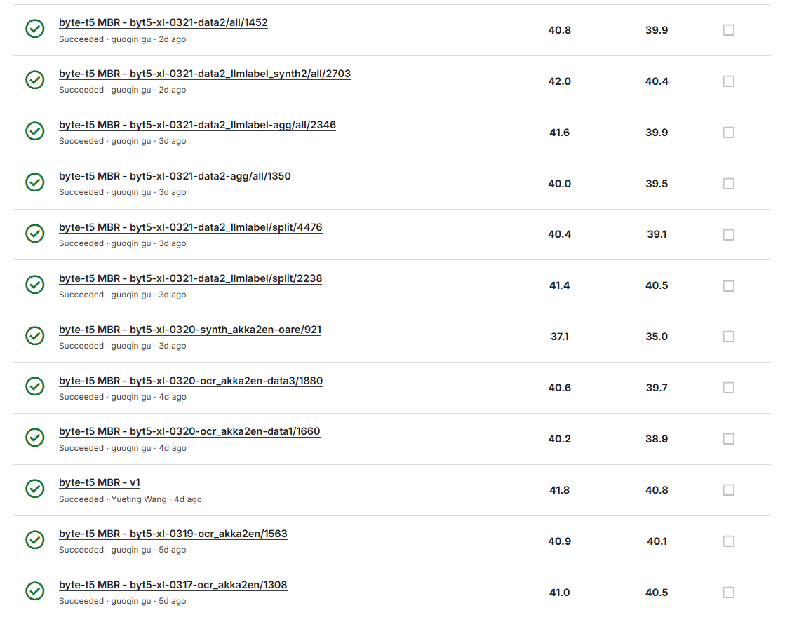
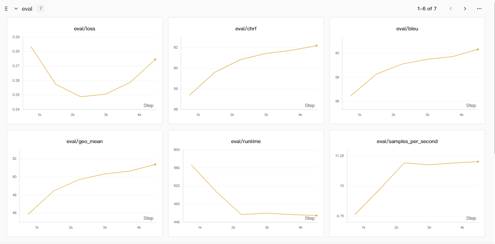
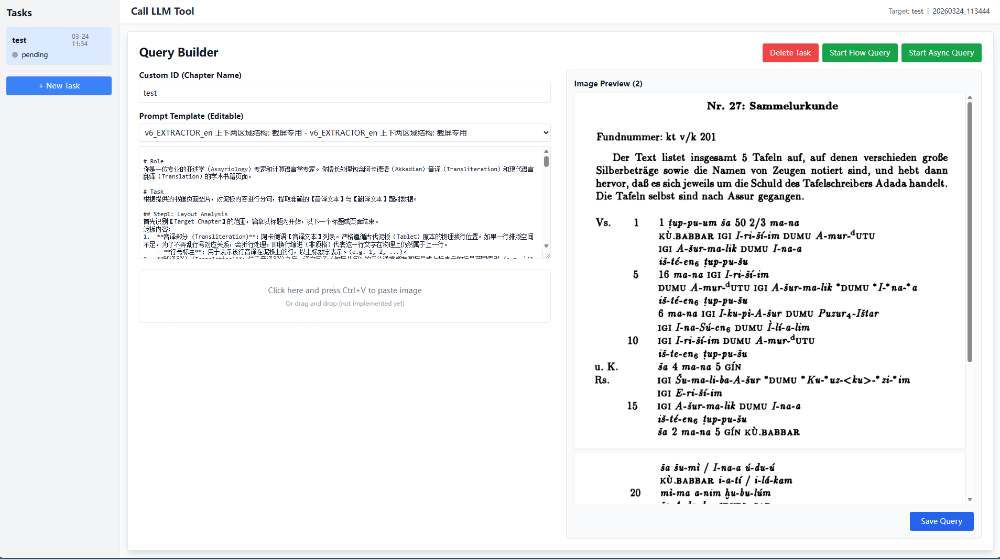
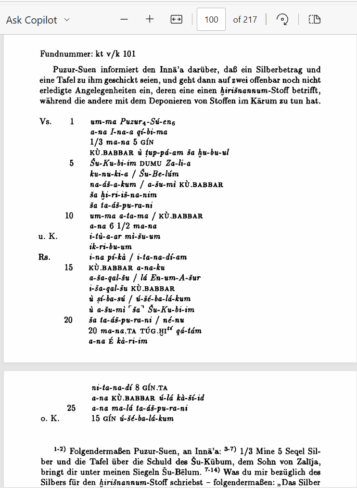
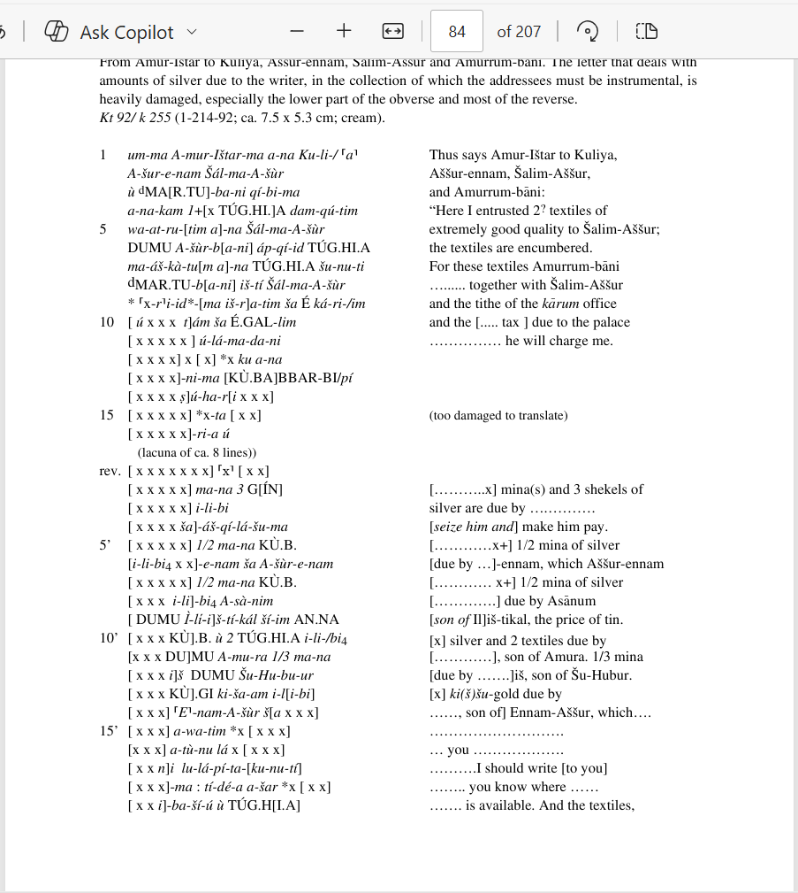
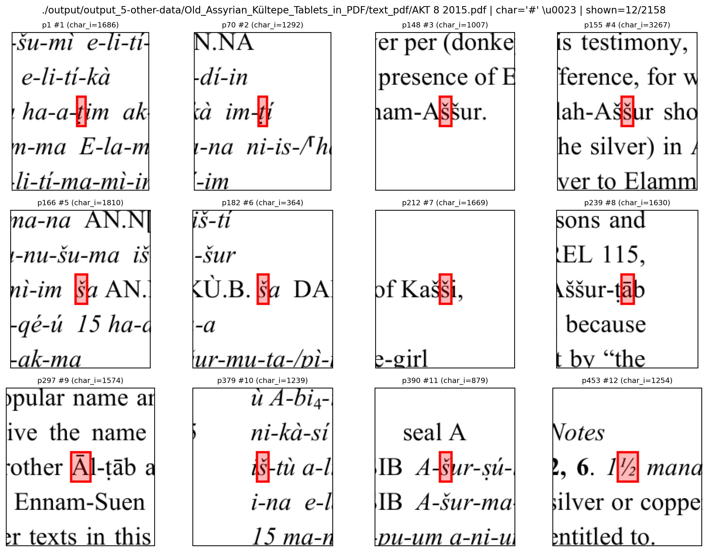

# Deep Past Initiative - Machine Translation

> 主题：nlp（低资源机器翻译）｜ 子类：— ｜ 领域：人文/历史（古亚述楔形文字）｜ 类别：Featured
> 截止：2026-03-23 ｜ 队伍数：2674 ｜ 机制：代码赛 ｜ 指标：DPI BLEU / chrF++
> 数据来源：`intel/deep-past-initiative-machine-translation/`（120 条主题索引 + 8 篇 write-up 正文；深读升级 2026-10-03，Tier A #44）

## 1. 任务与数据

- 任务形式：把古亚述楔形文字的**阿卡德语转写**翻译成英文——极低资源 NMT。
- 数据形态：官方 train.csv ~6,500 文档（整篇英译、**无句级对齐**）、published_texts ~13,456（多数未翻译）、S_meta 句片段（常错位）、大量学术 PDF；规则上倾向只用官方/提供的来源（避免跨时期/方言）。
- 构造陷阱：
  - **句级对齐缺失**是最大瓶颈 → LLM 流水线重建（Breaker/Fixer/Generator）；
  - PDF 版式多样（图像型/文本型/broken_text；跨页/列式）→ OCR 与对齐要分路处理；
  - 转写正字法混乱（sz/š、下标/重音、ḫ/h）→ 必须归一化 + 去重；
  - 公私榜差异大 → 提交选择本身是决策问题。

## 2. 验证方案

| 方案 | 使用者 | 说明 |
| --- | --- | --- |
| eval_loss 选 ckpt（而非 bleu/chrf） | 1st | loss 在 ~2.5–3k step 反弹；chrf/bleu 持续涨（验证集过拟合假象） |
| 固定配置多数据版本对照 | 1st/2nd/6th | 用 data1/2/3、v1–v6 子集对比数据质量收益 |
| 前 500 对当 CV | 8th | 承认 CV 与 LB 无相关，最后不依赖 CV |
| 保留 10% 官方数据 | 15th | 常规 hold-out |
| 与测试一一对应的合成验证 | —（本场未广泛用） | 低资源翻译的验证本身困难 |

## 3. 方案谱系

| 方案 | 名次 | 关键点与数字 |
| --- | --- | --- |
| 弃用 train.csv，重建 data1–3 + llmlabel + synth1/2 | 1st（94 票） | GLM-OCR 布局 + Gemini-3.0-pro 提取；CV 硬样本重抽 740 文档、长度失配重抽 131 文档；byt5-xl×11 + ct2 int8 + MBR；最佳 41.5/43.2（未选）、选中 41.6/42.8、保守 41.2/42.4 |
| 三段 LLM 对齐 + 60 本 PDF 挖掘 | 2nd（42 票） | Breaker 9,378 / Fixer 11,302；外部 60,654 句对/149 源（TR 27k/EN 21.7k/FR 6.4k/DE 5.4k）；byt5-large 原版；run1 41.8/41.0（选中）；run3 42.4/40.4 |
| 15 模型集成 + PDF 三分类 | 6th（54 票） | image/text/broken_text 分路；MBR beam=4；40.7；208m50s/2×T4；失败：上下文提示、词典/名称增强、权重融合、长 maxlen、LLM |
| 2 阶段 SFT + 版式专用流水线 | 8th（25 票） | 350k 噪声数据 3 epoch → 65k 高质量 1 epoch（再多崩）；滑窗（跨页）/VLM（列式）；失败：词典/RAG 伪标、RL |
| CPT→SFT→伪标签 | 10th（21 票） | ByT5-large/XL + MADLAD-400-3B；CPT 3 epoch 文档级；集成 38.5/39.9 |
| Gemma3 伪标 + KD + MBR | 15th（16 票） | 双路 OCR；5×ByT5 + Qwen3 MBR(chrF++ word_order=2)；~9h 推理 |
| 数据扩 4× + byt5-xl | 7th（33 票） | TR→EN 6k、16 本 PDF 6k、切片伪标 18k；~36k 样本；byt5 ≫ LLM 微调 |

## 4. 关键技巧

- **数据构建即模型**：LLM 句对齐（以英文译文为锚、跨页/跨段续接、SOV↔SVO 重排）、迭代纠错（CV 反查硬样本重抽）、多版本提取增强、prefer-EN 去重。
- **正字法归一化**：sz→š、下标 2/3→重音、其他下标→数字、ḫ→h/H、限定符 `(d)→{d}`、苏美尔语展开 → 变体合并 = 免费数据增强。
- **byte-level 主干**：ByT5 对罕见字符/变音符号最稳；base→large→xl 涨分（需干净数据）。
- **训练协议**：两阶段 SFT（宽噪声→窄干净，干净阶段 1 epoch）；CPT→SFT；group_by_length + Adafactor β1=0.9 稳梯度；768 字节文档级 chunk 匹配 max_length。
- **伪标签/KD**：强教师（Gemma/自集成+MBR）生成的软标签有效；形态元数据/词典重建无效。
- **解码与集成**：MBR（多候选一致性 + chrF++/BLEU/Jaccard/长度）；ct2 int8 量化让 11 模型集成塞进 9h。
- **选择与提交**：eval_loss 选 ckpt；按稳健性（多来源）选提交，不追公榜峰值。

## 5. 可迁移性评估

- 可直接迁移：LLM 辅助的语料构建/句对齐/迭代纠错；正字法归一化与去重；byte-level 模型；两阶段 SFT/CPT；MBR；eval_loss 选 ckpt；提交稳健性决策。
- 需要前提：可 OCR 的学术出版物体量；LLM API 或本地大模型；对目标语言的领域理解（数字/专名/限定符锚点）。
- 不建议照搬：从形态元数据生成翻译；逐词词典/名称后处理；RL 微调；文档级长输入；公榜峰值选择。

## 6. 对新手的关键启示

1. 低资源任务先问"数据能否扩"：官方 6.5k 文档是上限，PDF/在线资源是真正的战场。
2. 模型选择看数据形式：罕见字符集用 byte-level（ByT5），不要默认 subword 模型。
3. 归一化与去重是低成本、普适的涨分项；多版本 LLM 提取天然是增强。
4. 高质量数据阶段极易过拟合：1 epoch + eval_loss 选 ckpt。
5. 在榜单噪声大的比赛里，"稳健提交"比"公榜峰值"更值钱（本场 1st/2nd 都有反向教训）。

## 7. 深读结论（2026-10 补）

**一句话**：这是一场"语料工程比赛"——模型几乎是原版 ByT5，分数来自 OCR/对齐/归一化/去重与集成。

**跨方案裁决**：

- 数据质量/规模决定一切（1st 标题、2nd/15th/8th/7th 一致）；模型结构改动无收益。
- ByT5（byte-level）最适合楔形转写（8th：NLLB/mT5 差 1–1.5；7th：其他 T5 差很多）。
- 更大模型在干净数据前提下更好（1st/8th/7th）。
- 伪标/合成数据：强教师有效（10th/15th/7th/1st），规则重建无效（2nd/8th/6th）。
- 训练：两阶段 SFT/CPT、干净阶段 1 epoch、eval_loss 选 ckpt。
- 提交选择：公榜峰值≠私榜最优（1st 最佳提交未选、2nd run3 42.4/40.4）。

**数字账精选**：2nd 60,654 句对/149 源；1st data3 34,146 + llmlabel 21,759；单模型 42.0/40.4；选中提交 41.6/42.8 vs 未选 41.5/43.2；8th Stage1 350k → Stage2 65k/1 epoch；6th 15 模型 40.7。

**失败学**：形态元数据生成翻译、词典/名称增强、自动句对齐、RL（DPO/PPO/GRPO）、LLM 微调不如 byt5、model soup、文档级 maxlen、后处理（LLM/名称）、公榜峰值提交。

**悬案**：3rd 合成数据（684425）未收录；665209/664948/680686/672511/664177/668619/684189 未收录。

## 8. 图表证据

> 路径相对本文件（`notes/nlp/`）：`../../intel/deep-past-initiative-machine-translation/bodies/<topic>_img/NN.png`

**图 1：单模型即金区（topic 684353）**

- 多条 byt5-xl+MBR 提交 40–42/39–40.5（如 42.0/40.4、41.4/40.5）；
- 数据到位后，集成只是最后的稳定增益。

**图 2：过拟合拐点（topic 684353）**

- eval/loss 在 2.5–3k step 触底回升；chrf/bleu 持续上涨；
- 用 loss 选 ckpt，指标持续涨是验证集过拟合假象。

**图 3：数据流水线工程（topic 684353）**

- Query Builder + 书页预览 + 批量 API；
- 本场真正的"模型"是这条数据流水线。

**图 4：跨页对齐（topic 684329）**

- 转写在本页、译文常在下页（8th：≥40% 文档）；
- (prev,cur,next) 三页滑窗才能对齐。

**图 5：列式版式（topic 684329）**

- 左列转写、右列译文同行并列；OCR 易合并两列 → 需 VLM；
- 版式分类是 PDF 流水线前置步骤。

**图 6：OCR 质量审计（topic 684231）**

- AKT 8 文本层把 š 系统性渲染成 §；
- "broken_text" 只能走图像 OCR + 规则修复。

## 9. 出处

- 讨论区索引：`intel/deep-past-initiative-machine-translation/topics.md`（120 条）
- 已收录 write-up（8 篇）：
  - 1st（94 票）：https://www.kaggle.com/competitions/deep-past-initiative-machine-translation/discussion/684353
  - 编译讨论（93 票）：https://www.kaggle.com/competitions/deep-past-initiative-machine-translation/discussion/668402
  - 6th（54 票）：https://www.kaggle.com/competitions/deep-past-initiative-machine-translation/discussion/684231
  - 2nd（42 票）：https://www.kaggle.com/competitions/deep-past-initiative-machine-translation/discussion/684345
  - 7th（33 票）：https://www.kaggle.com/competitions/deep-past-initiative-machine-translation/discussion/684215
  - 8th（25 票）：https://www.kaggle.com/competitions/deep-past-initiative-machine-translation/discussion/684329
  - 10th（21 票）：https://www.kaggle.com/competitions/deep-past-initiative-machine-translation/discussion/684211
  - 15th（16 票）：https://www.kaggle.com/competitions/deep-past-initiative-machine-translation/discussion/684819
- 深读全本：`analysis/deep/deep-past-initiative-machine-translation.md`（11 组件 + 6 图证）
- 缺口登记：665209、684425、664948、680686、672511、664177、668619、684189、678899、663233、663357 未收录正文
