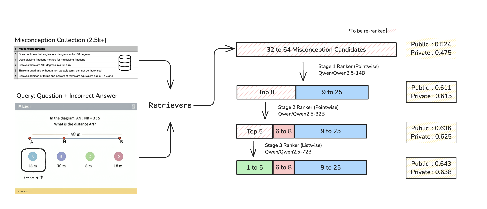
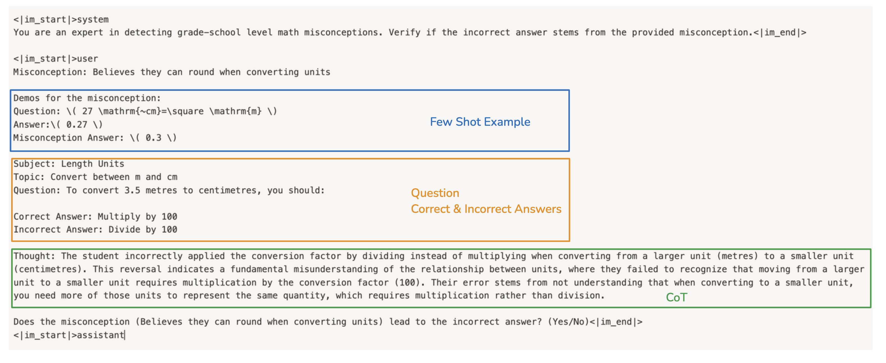
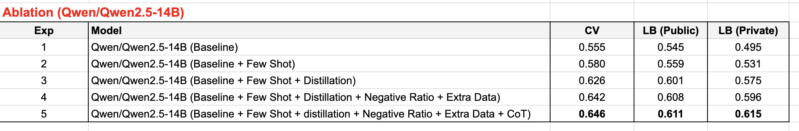
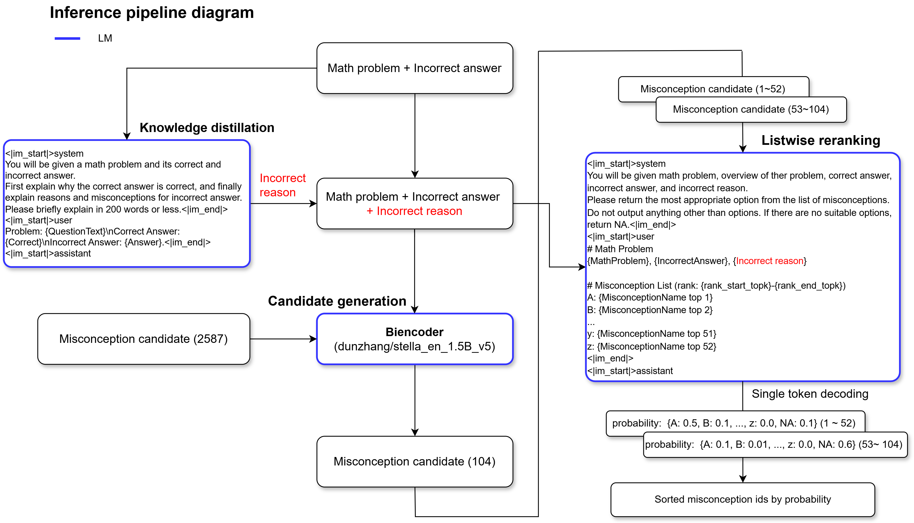

# Eedi - Mining Misconceptions in Mathematics

> 主题：nlp（检索排序/教育诊断）｜ 子类：— ｜ 领域：教育 ｜ 类别：Featured
> 截止：2024-12-12 ｜ 队伍数：1446 ｜ 机制：代码赛 ｜ 指标：MAP@{K}（从 2.5k+ 误区池推荐 top-25）
> 数据来源：`intel/eedi-mining-misconceptions-in-mathematics/`（80 条主题索引 + 6 篇 write-up 正文；深读升级 2026-10-03，Tier A #47）

## 1. 任务与数据

- 预测目标：给诊断性数学题 + 正确答案 + 错误答案，推荐最相关的 **25 个误区**（从 2.5k+ 池中排序）。
- 数据形态：官方训练仅 ~1.8k 题；误区池 2.5k+；**测试含 900+ 训练未见误区与未见 subject**（~685 题）。
- 构造陷阱：
  - 长尾标签空间：未见类别在测试中占多数（探针估计 seen:unseen ≈ 1:3）；
  - 误区间高度相似 → 需要细粒度分辨；
  - LLM 的弱项是反事实推理（"学生为何选错"）→ 需要 CoT 蒸馏；
  - CV 切分选择（QuestionId 太乐观 / SubjectId 太悲观 / ConstructId 刚好）。

## 2. 验证方案

| 方案 | 使用者 | 说明 |
| --- | --- | --- |
| GroupKFold(ConstructId) | 1st | Val/LB 差距最窄，相关到 ~0.62 公榜区间 |
| GroupKFold(SubjectId) | 5th | 让验证出现更多未见误区，逼近测试现实 |
| QuestionId 切分（教训） | 多队 | 同题型泄漏 → 验证分数虚高 |
| LB 探针（单预测） | 3rd | seen-only 0.154 vs unseen-only 0.444 → 估计 unseen 比率 |
| CV recall@25 vs LB | tricks 帖 | 0.882→0.928 时 LB 仅 0.353→0.478（脱钩示例，选型需谨慎） |

## 3. 方案谱系

| 方案 | 名次 | 关键点与数字 |
| --- | --- | --- |
| 四步级联 + 分组合成 + CoT 蒸馏 | 1st（177 票） | retriever（e5-mistral/bge-en-icl/Qwen-14B，top32+动态阈值 0.06）→ 14B pointwise→8 → 32B pointwise→5 → 72B listwise；1.8k+10.6k 合成、4791 误区；消融私榜 .495→.531→.575→.596→**.615**；级联私榜 .475→.615→.625→**.638** |
| 6 LoRA + LB 探针 magic boost | 3rd（63 票） | Qwen-14B embedder + Qwen-32B-AWQ reranker；探针后把 unseen 概率乘 C（top1 中占 75%）→ 公 .590→**.658**、私 .564→**.600**；列表 shuffle → .670/.602 |
| biencoder + 52 单 token listwise | 5th（76 票） | stella-1.5B + KD（Qwen2.5-32B 生成错误推理，+0.04）；top104 分两批 52 字母单 token；GPTQ+vLLM；3 折集成；CV .626/LB .633；成本 ~$350 |
| 3 管线投票集成 | 7th/公 2（59 票） | SFR-Embedding-2_R；Qwen2.5-32B AWQ 的 40 选项/binary/9 选项三种 reranker；rank-sum 投票；boost missing misconception；vLLM prefix cache |
| 1st 摘要版 | 127 票 | 与详版一致：retriever 集合、动态阈值、prefix caching、CoT/伪标/负样本比 24 |
| LLM Recall 训练 tricks | 171 票 | hard negative + 大 batch + LLM 训练参数；CV-LB 脱钩示例 |

## 4. 关键技巧

- **级联**：retriever 优先 recall@32（第一级要广度）；后级 pointwise（14B/32B）提精度、72B listwise 定序；每级保留位数固定（8/5）。
- **动态阈值**：top32 + 与 top1 相似度差 ≤0.06 的额外候选（最多 32）。
- **合成分组生成**：误区共现聚类 → 组内 4–8 参考 MCQ few-shot → Claude 生成新题 → GPT-4o 裁判（0–10 分）过滤。
- **外部误区合并**：字符串归一去重 + 嵌入相似度 0.995（合并）与 0.95（删除）双阈值。
- **CoT 蒸馏**：Claude 生成"学生推理链" → 微调 7B/14B/32B reasoner → reranker 可选读取（50% 训练带 CoT）。
- **KD/伪标**：72B pointwise 教师标合成数据 → 训 14B（+0.044）。
- **单 token logits 排序**：候选=字母单 token（52 或 40/9/2 种），CE 训练、一次前向打分。
- **负样本比**：每正样本 24 负（+合成 2×）；每 batch 每个误区只出现一个 demonstration（防 in-batch 负标签噪声）。
- **量化/推理**：AWQ 任务校准、GPTQ+vLLM、prefix caching、按长度排序、两批 52。
- **unseen 修复**：合成覆盖（稳）或探针乘子（激进，+0.068 公榜但依赖提交探针）。

## 5. 可迁移性评估

- 可直接迁移：级联 + 每级指标分离；长尾类别的合成分组覆盖；LLM-judge 数据过滤；CoT 蒸馏；单 token 打分；CV 切分三角；unseen 分布修复（含合规评估）。
- 需要前提：可用的强 LLM（生成/裁判/推理）、多次提交探针的赛制（若用后处理修复）、vLLM 级部署。
- 不建议照搬：孤立生成合成数据；hard negatives 用于第一级召回；QwQ 直接套用；私有数据/泄漏红利。

## 6. 对新手的关键启示

1. 长尾标签任务先量化"训练未见类别在测试中的占比"（探针或开源发现），再决定合成/后处理策略。
2. 级联排序中每级目标不同：第一级要召回，后级要精度——负样本策略随目标切换。
3. 合成数据要"按语义组 + 参考样本 + 裁判过滤"，否则只会制造近邻混淆。
4. 反事实推理是 LLM 弱项：把强模型的 CoT 蒸馏进小模型是性价比最高的增强之一。
5. 单 token logits 打分把排序转成分类：省解析、可批量、可精确优化。
6. CV 切分是在选择"模拟哪种漂移"，没有唯一正确答案。

## 7. 深读结论（2026-10 补）

**一句话**：这是一场"长尾标签空间"的检索排序赛——模型是 Qwen 系列级联，胜负在合成数据覆盖未见类别与 unseen 分布修复上。

**跨方案裁决**：

- retrieve-rerank 级联 + Qwen2.5 是骨架；每级指标（recall vs map）决定负样本与选型。
- 合成分组生成 + LLM-judge + 去重合并，是覆盖 900+ 未见误区的正解；探针乘子是高风险高收益的后处理（0.590→0.658）。
- CoT 蒸馏逐级增益（+0.044/+0.019），把反事实推理外置为数据。
- 单 token logits 排序（52/40/9/binary）是通用工程范式。
- CV 切分三角（QuestionId 乐观/SubjectId 悲观/ConstructId 刚好）。

**数字账精选**：级联 .475→.638（私）；消融 .495→.615；探针 0.154/0.444、乘子 +0.068 公榜；1.8k+10.6k 数据/4791 误区；CV .626/LB .633（5th）；~$350 成本。

**失败学**：iterative hard mining/cross-device negatives（对 recall 无益）、自训 retriever 降分、concat/average 向量、QwQ、LoRA merge、双向编码器、multi-step rerank、prompt 加参考（5th）、full-data model（7th）。

**悬案**：私有数据泄漏（550619）与 Initial Concerns（533728）未收录；Logits Processors（546978）未收录；探针后处理未被官方处罚的记录；LLM Benchmark（539458）未收录。

## 8. 图表证据

> 路径相对本文件（`notes/nlp/`）：`../../intel/eedi-mining-misconceptions-in-mathematics/bodies/<topic>_img/NN.png`

**图 1：级联管线（topic 551688）**

- retriever 32–64（公 .524/私 .475）→ 14B top8（.611/.615）→ 32B top5（.636/.625）→ 72B（.643/.638）；
- 最终 top-25 = 5 + 3 + 17。

**图 2：pointwise 输入（topic 551688）**

- Few-Shot 示例 + 题目/正误答案 + CoT "Thought" + "是否导致错答？(Yes/No)"；
- 三种技巧共用一个模板。

**图 3：消融链（topic 551688）**

- baseline .495 → +few-shot .531 → +蒸馏 .575 → +负样本比/额外数据 .596 → +CoT .615（私榜）；
- 逐级递增无回退。

**图 4：5th 单 token 排序（topic 551391）**

- KD 生成错误推理 → biencoder 104 候选 → 两批 52 字母选项 → 单 token 概率排序；
- 把排序降维成受限词表分类。

## 9. 出处

- 讨论区索引：`intel/eedi-mining-misconceptions-in-mathematics/topics.md`（80 条）
- 已收录 write-up（6 篇）：
  - 1st 详版（177 票）：https://www.kaggle.com/competitions/eedi-mining-misconceptions-in-mathematics/discussion/551688
  - tricks（171 票）：https://www.kaggle.com/competitions/eedi-mining-misconceptions-in-mathematics/discussion/543519
  - 1st 摘要（127 票）：https://www.kaggle.com/competitions/eedi-mining-misconceptions-in-mathematics/discussion/551402
  - 5th（76 票）：https://www.kaggle.com/competitions/eedi-mining-misconceptions-in-mathematics/discussion/551391
  - 3rd（63 票）：https://www.kaggle.com/competitions/eedi-mining-misconceptions-in-mathematics/discussion/551498
  - 7th（59 票）：https://www.kaggle.com/competitions/eedi-mining-misconceptions-in-mathematics/discussion/551388
- 深读全本：`analysis/deep/eedi-mining-misconceptions-in-mathematics.md`（11 组件 + 4 图证）
- 缺口登记：533764、533728、546978、539458、550619、550223、541222、533790 未收录正文
