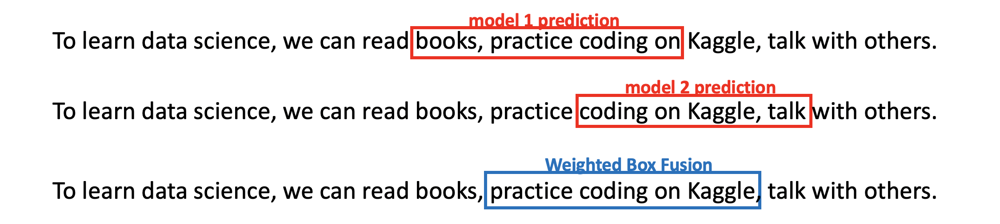
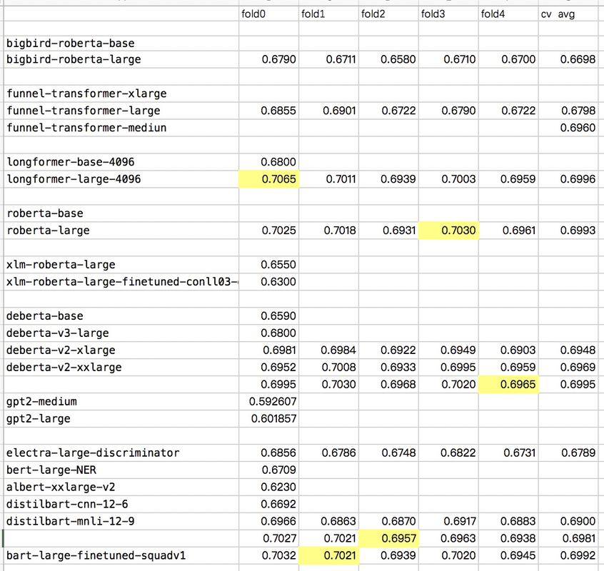
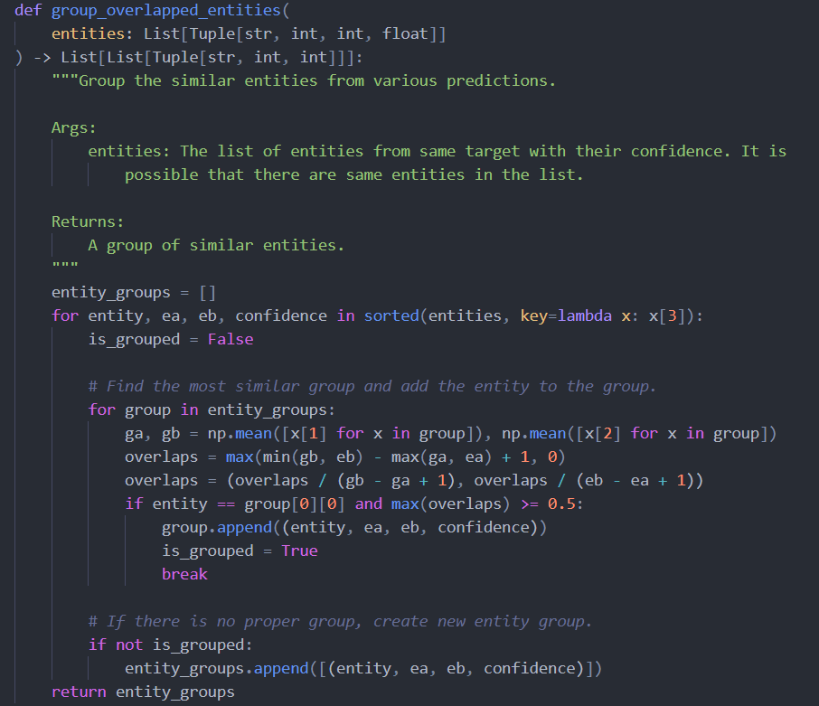
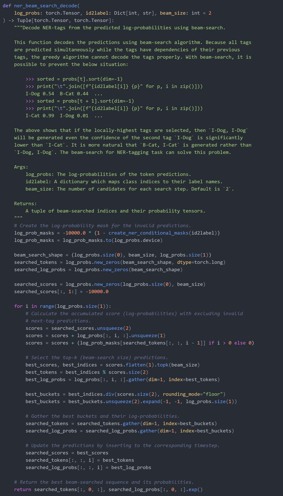
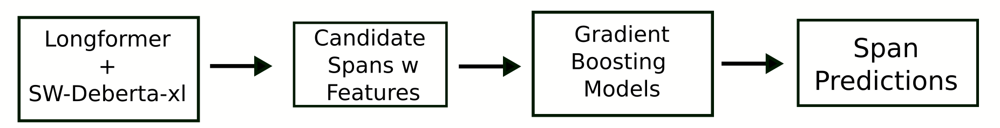

# Feedback Prize - Evaluating Student Writing

> 主题：nlp ｜ 子类：— ｜ 领域：教育 ｜ 类别：Featured
> 截止：2022-03-15 ｜ 队伍数：2058 ｜ 机制：代码赛 ｜ 指标：TextOverlapF-beta（跨度重叠）
> 数据来源：`intel/feedback-prize-2021/`（120 条主题索引 + 8 节正文：1st/2nd/3rd/4th/6th + NER starter + 相关赛事 + 见解帖；另有 9th/10th/11th 等 15 条 write-up 未收录）

## 1. 任务与数据

- **预测目标**：在学生作文中**切分出 7 类论述要素**（论点、证据、结论等）的文本跨度（span），本质是**序列标注 / 跨度抽取**。
- **数据形态**：长文本 + 字符级标注；指标是跨度重叠的 F-beta。
- **构造陷阱**：长文本需要滑动窗口切分；跨度边界对指标影响大（后处理收益高）。
- 指标只要求 **≥50% 重叠**即计对——后处理与融合的可利用空间大（长度平移、允许交叠）。

## 2. 验证方案

| 方案 | 使用者 | 说明 |
| --- | --- | --- |
| 分组 K 折（按文章） | 多队 | 避免同一文章跨折 |
| CV-LB 对齐确认 | 1st / 3rd | 1st 的 CV 0.748 ≈ LB 0.742，一致性良好 |
| 后处理单独验证 | 2nd | 后处理带来的提升单独量化 |

## 3. 方案谱系

| 方案 | 名次 | 关键点 |
| --- | --- | --- |
| token 集成 + **LGB 跨度堆叠**（两级架构） | 1st | stage1 五模型 0.712 → stage2 0.748（+0.036）；170 特征、300 万候选、95% 召回 |
| 10 backbone 大集成 + **WBF 融合** + 后处理 | 2nd | 平均单模 0.700 → WBF 0.741；后处理 ~+0.008 CV；27 模型 8h30m |
| Longformer + 滑窗 DeBERTa-xl + GRU + GBM 堆叠 | 3rd | 滑窗 512/步进 384/取中段 64:448；max_len 2048（再大退化） |
| DeBERTa 家族 + **实体级融合** + beam search | 4th | offset_mapping 0.630 vs word_ids 0.595；\n 保真补丁；实体级融合 +0.002 |
| **YOLO 式跨度检测器**（objectness+回归+分类） | 6th | RoIAlign 聚词级；正样本=首词+最低代价词；NMS；自承 WBF 本地失败 |

## 4. 关键技巧

- **跨领域技术迁移**：Weighted Box Fusion（目标检测）→ 跨度融合（NLP）；实体级 50% 重叠分组（4th）是同一思想的另一实现。
- **两级架构**：token 模型负责局部，跨度级 GBM 负责非局部决策（边界概率、类间竞争、全局布局）——1st 的 +0.036 全在这一步。
- **后处理是主要收益点**：断链修复/类规则（Lead 等至多一个）/长度平移（Evidence<45 词前移 9 词）——直接利用 50% 重叠的指标宽容度。
- **分词器是隐性变量**：offset_mapping 保 \n（+0.035），DeBERTa-v2/v3 快慢分词器吞 \n 需补丁——"模型不行"常是预处理问题。
- **BIO 需要结构化解码**：beam search + 合法转移掩码（greedy 会产出 I-Dog→I-Dog 非法序列）。
- **融合在对象层**（span/实体），token/subword 层不可直接平均（tokenizer 不同构）。

## 5. 深读结论（2026-10 补）

- **两级架构是本场的收敛解**：1st（token 集成→LGB）与 3rd（transformer→GBM 堆叠）独立同构；stage2 值 +0.030~0.036 CV，远超单模改进。
- **融合的公共坐标系 = 任务对象层**：WBF 平均起止（2nd：0.700→0.741）、实体级 50% 分组平均（4th：+0.002）、NMS（6th）都在 span 层；token 层平均会产生双 B/并集/交集等病态。
- **指标即后处理说明书**：50% 重叠容差支撑长度平移与交叠容忍；"合法但激进"的后处理合计 +0.008~0.016。
- **长上下文不是免费收益**：3rd 在 2048 后退化；2nd 的长序列成员 CV 并不突出（bigbird 0.675）。
- **负面清单同样重要**：段落信息、回译、位置权重、overlap 标签、stage2 用 BERT、xxlarge、域不匹配伪标签——全部无效。
- **主题先验是未开采红利**：私榜与训练同 15 个主题、claim/counterclaim 可由位置区分（hengck23），收录方案未充分利用。

## 6. 图表证据

**图 1：WBF 平均起止坐标**（2nd，topic 313389）——`../../intel/feedback-prize-2021/bodies/313389_img/01.png`

*读图*：两模型跨度部分重叠 → 起点/终点分别平均，得到 "practice coding on Kaggle"；对比并集/交集/BIO 平均的病态输出。

**图 2：1st 的单模型 CV 全表**（topic 313177）——`../../intel/feedback-prize-2021/bodies/313177_img/01.png`

*读图*：longformer-large 均 0.6996、roberta-large 均 0.6993、deberta-v2-xlarge 0.6948、xxlarge 0.6969、bigbird-base 0.6698、gpt2-large 0.6019——选的是异质家族而非单族最优。

**图 3：实体级融合的 50% 重叠分组（代码）**（4th，topic 313330）——`../../intel/feedback-prize-2021/bodies/313330_img/03.png`

*读图*：贪心分组，判据=与组均值重叠 ≥0.5（即指标口径本身变成融合规则）。

**图 4：beam search 修复非法 BIO（代码）**（4th）——`../../intel/feedback-prize-2021/bodies/313330_img/02.png`

*读图*：greedy 会选 I-Dog→I-Dog（0.54/0.01），beam 选 B-Cat→I-Cat（0.44/0.99）——合法序列的联合概率更高。

**图 5：3rd 的两级管线**（topic 313235）——`../../intel/feedback-prize-2021/bodies/313235_img/01.png`

*读图*：Longformer + 滑窗 DeBERTa-xl → 候选跨度特征 → GBM → 跨度预测；与 1st 同构。

## 7. 可迁移性评估

- **可直接迁移**：
  - **跨领域借用集成技术**（检测 → NLP 的框/跨度融合）——值得作为通用思路记住。
  - 跨度类任务的后处理（边界、最小长度、重叠消解）。
  - 长文本的滑窗 + 重叠合并范式。
- **需要前提**：
  - 长文本模型需要较长上下文与显存预算。
- **不建议照搬**：
  - 直接套用通用分类模型（跨度任务需要专门的头与后处理）。

## 8. 对新手的关键启示

1. **后处理在跨度任务里经常比换模型更值钱**。
2. **跨领域技术迁移**是 Kaggle 的隐藏红利（检测的融合方法用到 NLP）。
3. 长文本任务先解决"切分与合并"，再谈模型。

## 9. 出处

- 讨论区索引：`intel/feedback-prize-2021/topics.md`（120 条）
- 已收录正文（8 节）：
  - NER starter（Chris Deotte，296 票）：https://www.kaggle.com/competitions/feedback-prize-2021/discussion/295794
  - 1st（282 票）：https://www.kaggle.com/competitions/feedback-prize-2021/discussion/313177
  - 2nd（Chris Deotte 队，203 票）：https://www.kaggle.com/competitions/feedback-prize-2021/discussion/313389
  - 6th（tascj，165 票）：https://www.kaggle.com/competitions/feedback-prize-2021/discussion/313424
  - 4th（Jungwoo Park，149 票）：https://www.kaggle.com/competitions/feedback-prize-2021/discussion/313330
  - 见解帖（hengck23，147 票）：https://www.kaggle.com/competitions/feedback-prize-2021/discussion/308992
  - 3rd（Shujun 队，72 票）：https://www.kaggle.com/competitions/feedback-prize-2021/discussion/313235
  - 相关赛事汇总（Jonathan Besomi，69 票）：https://www.kaggle.com/competitions/feedback-prize-2021/discussion/295193
- 未收录缺口（登记备查）：313201（9th）、313718（10th）、313184（11th）、316071（8th）、313229（55th）、313833（12th）、313242（汇总）等
- 深读全文：`analysis/deep/feedback-prize-2021.md`
  - 4th（149 票）：https://www.kaggle.com/competitions/feedback-prize-2021/discussion/313330
  - 相关赛事方案汇总（69 票）：https://www.kaggle.com/competitions/feedback-prize-2021/discussion/295193
