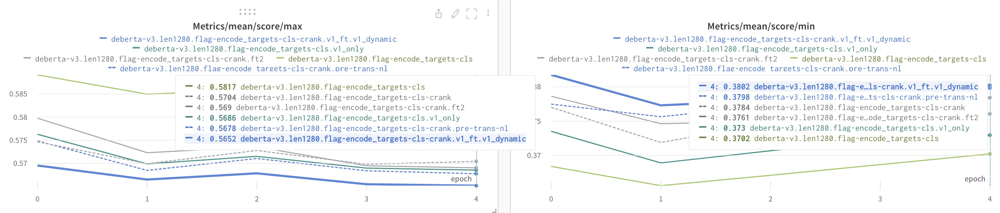
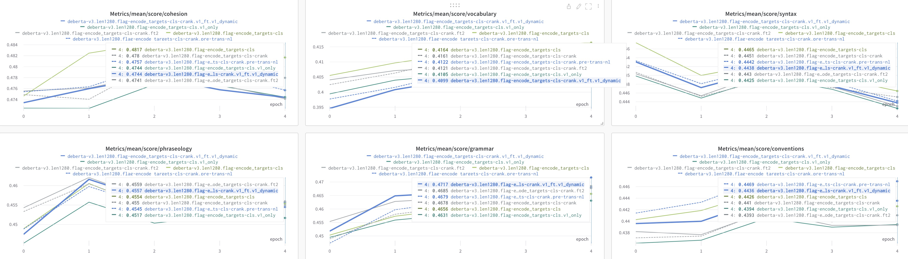
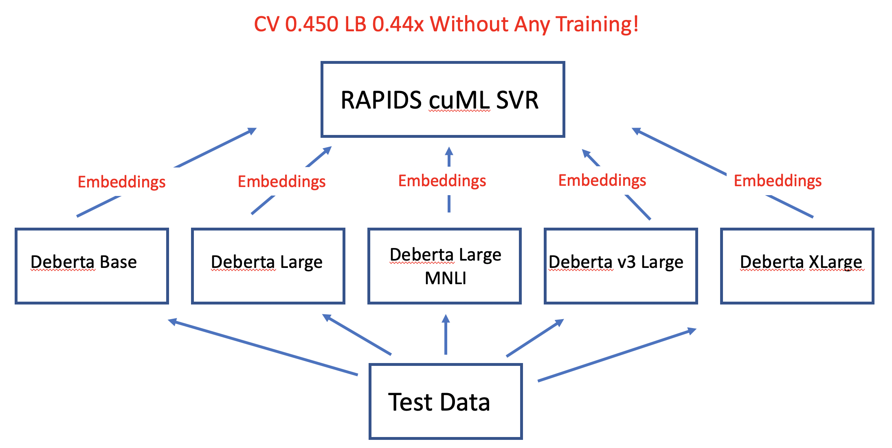

# Feedback Prize - English Language Learning

> 主题：nlp ｜ 子类：— ｜ 领域：教育 ｜ 类别：Featured
> 截止：2022-11-29 ｜ 队伍数：2654 ｜ 机制：代码赛 ｜ 指标：按列加权的 RMSE 均值（6 个维度）
> 数据来源：`intel/feedback-prize-english-language-learning/`（120 条主题索引 + 8 节正文：1st/2nd/3rd/5th + SVR starter + 往届汇总 + 访谈 + 新奖试点；另有 4th/6th/效率 1st 等 32 条 write-up 未收录）

## 1. 任务与数据

- 预测目标：对 ESL 学生作文按 6 个维度打分（衔接、句法、词汇、短语、语法、书写规范），指标是 6 列 RMSE 的均值。
- 数据形态：约 3900 篇作文 + 少量伪标签数据，属于小样本多目标回归。
- 题目特点：多目标之间存在相关性（6 个维度并非独立），且评分本身带主观噪声。

## 2. 验证方案

| 方案 | 使用者 | 说明 |
| --- | --- | --- |
| MultilabelStratifiedKFold | 1st | 多目标分层，匹配 6 个目标的分层需求 |
| 固定 5 折 seed 42 | 2nd | 沿用社区方案，便于横向比较 |
| CV-LB 相关性检验 | 1st | 明确记录 CV 与 LB 近乎完美相关，因此放心用 CV 迭代 |
| **3 种子实验纪律** | 5th | 每个实验跑 3 个唯一种子、只比较均值；均值改善才上 5 折 |

2nd place 的自我警示：用 Optuna 在全体 OOF 上调参、再按 CV 选权重，会导致二次过拟合——他明确指出"我应该在调参时用新的 OOF 而不是同一份"。

## 3. 方案谱系

| 方案 | 名次 | 关键点 |
| --- | --- | --- |
| 多池化 × 多长度 × 多 backbone + 3 嵌入模型 SVR | 1st | Optuna 目标级权重；仅当同时改善 CV 与 LB 才纳入；CV 0.44096 / 私榜 0.433356 |
| 回译预训练 + rank/Pearson 损失 + 伪标签 | 2nd | 仅 deberta-v3 可用；自曝"同一 OOF 调参"过拟合；最佳干净 PB 0.433541 |
| 24 模型爬山集成（含负权重） | 3rd | 单模 0.4470→0.4420；负权重 CV +0.0010 / 私榜 +0.0060；伪标签失败（分布漂移） |
| 多种子 + 预训练式伪标签 + Nelder-Mead 权重 | 5th | 权重限 [1,3]；无约束版本可达私榜 #2（未提交） |
| 冻结嵌入 + RAPIDS cuML SVR（零训练） | SVR starter | CV 0.4505 / LB 0.44x；跨场迁移自 PetFinder |

## 4. 关键技巧

- **多样性比单模型强度更重要**：池化/最大长度/家族/损失风格都能带来集成增益；3rd 的爬山第 2、3 名成员单模并非最优，仍按边际增益入选。
- **爬山法做模型选择与加权**：贪心 + 早停 = 自带正则；负权重能再压 CV（+0.0010）但有 OOF 噪声拟合风险（3rd vs 5th 的相反取舍）。
- **嵌入模型 + SVR 作为廉价异质成员**：零训练 CV 0.4505；1st/3rd 都纳入集成。
- **跨届伪标签只作预训练**：直接混训 → CV 虚涨 0.010、LB 不动（FP1>FP3 分布漂移）；预训练后本域微调则增益稳定（5th/1st）。
- **目标特异性**：逐目标损失权重（3rd）、逐目标 rank loss（2nd，帮硬目标）、逐目标集成权重（全员）。
- **训练/推理长度解耦**：3rd 训练 2048、推理 640；dropout=0、batch=1、clip 10 的组合。
- **调参纪律**：不要在用于选权重的同一份 OOF 上调参（2nd 的教训）；小数据实验用 3 种子均值（5th）。

## 5. 深读结论（2026-10 补）

- **这是融合工程比赛**：单模天花板 ~0.447 vs 冠军 0.441，差距全靠"多样性采集 × 权重搜索 × 伪标签转移"三件事。
- **权重搜索器的选择不是胜负手，验证隔离才是**：Optuna（1st）/爬山（3rd）/Nelder-Mead（5th）都成功；失败的是同一 OOF 二次使用（2nd）。
- **伪标签的两种命运有完整记录**：直接混训 → 分布漂移（FP1 整体高于 FP3，图 2）+ CV 假涨；预训练式 → 稳定增益。
- **"冻结嵌入 + SVR"再次被验证**（与 PetFinder 同构，THEORY L10）：零训练即接近单模上限。
- **爬山前 3 个模型吃掉 60% 增益**（0.4470→0.44405 / 总增益 0.0050），长尾 14 个模型共 ~0.0006——集成规模应边际决策而非堆数量。

## 6. 图表证据

**图 1：爬山曲线（前陡后平）**（3rd，topic 369609）——`../../intel/feedback-prize-english-language-learning/bodies/369609_img/01.png`

*读图*：0.4470（1）→0.44493（2）→0.44405（3）→0.44262（10）→~0.4421（24）；长尾收益极小；第 2、3 名成员单模并非最优——按边际增益入选。

**图 2：FP1 vs FP3 分布漂移（伪标签失败物证）**（3rd）——`../../intel/feedback-prize-english-language-learning/bodies/369609_img/02.png`

*读图*：6 个目标全部 FP1（蓝）整体高于 FP3（橙）——伪标签学到的是更高的评分尺度，解释"CV 涨 0.010 而 LB 不动"。

**图 3：rank 损失的逐目标效果**（2nd，topic 369369）——`../../intel/feedback-prize-english-language-learning/bodies/369369_img/03.png`

*读图*：`score/max`（最难维度）crank 变体 0.5652–0.5704 优于基线 0.5817；`score/min` 互有胜负——rank loss 收益集中在硬目标。

**图 4：逐目标学习曲线**（2nd）——`../../intel/feedback-prize-english-language-learning/bodies/369369_img/02.jpg`

*读图*：回译模型在 vocabulary 面板最好、conventions 未必——增强/损失的作用是目标选择性的。

**图 5：零训练 SVR 管线**（Chris Deotte，topic 351577）——`../../intel/feedback-prize-english-language-learning/bodies/351577_img/01.png`

*读图*：5 个冻结模型抽嵌入 → 拼接 → RAPIDS cuML SVR，无微调 CV 0.450 / LB 0.44x。

## 7. 可迁移性评估

- 可直接迁移：小样本多目标回归的标准配方（多模型多池化 → 爬山法加权 → 检查 CV-LB 相关性）；爬山法融合稳健且可解释；跨届赛事方案复用。
- 需要前提：多张 GPU（1st 训练了大量模型变体）；伪标签需要额外数据源与可信教师模型。
- 不建议照搬：在同一份 OOF 上调参并选权重（过拟合风险，2nd 已明确复盘）。

## 8. 对新手的关键启示

1. 先确认 CV 与 LB 是否一致——本场一致性极好，因此可以放心用 CV 迭代；一致性差就要换策略。
2. 融合的常规做法是爬山法，比手工调权重更稳。
3. 多目标任务要利用目标间的相关性（排序损失、共享主干）。
4. 调参与选权重必须用不同的数据切分，否则会自欺。

## 9. 出处

- 讨论区索引：`intel/feedback-prize-english-language-learning/topics.md`（120 条）
- 已收录正文（8 节）：
  - SVR starter（Chris Deotte，197 票）：https://www.kaggle.com/competitions/feedback-prize-english-language-learning/discussion/351577
  - 3rd（Chris Deotte/Amed/CroDoc，141 票）：https://www.kaggle.com/competitions/feedback-prize-english-language-learning/discussion/369609
  - 1st（Dracarys 队，129 票）：https://www.kaggle.com/competitions/feedback-prize-english-language-learning/discussion/369457
  - 2nd（gezi，112 票）：https://www.kaggle.com/competitions/feedback-prize-english-language-learning/discussion/369369
  - 往届方案汇总（CroDoc，83 票）：https://www.kaggle.com/competitions/feedback-prize-english-language-learning/discussion/348967
  - 5th（Psi，74 票）：https://www.kaggle.com/competitions/feedback-prize-english-language-learning/discussion/369578
  - 访谈索引（Sanyam Bhutani，55 票）：https://www.kaggle.com/competitions/feedback-prize-english-language-learning/discussion/348957
  - 新奖试点（Mark McDonald，53 票）：https://www.kaggle.com/competitions/feedback-prize-english-language-learning/discussion/369307
- 未收录缺口（登记备查）：369621（4th）、369567（6th）、369646（效率 1st）、369440（13th）、369368（单模双种子）等
- 深读全文：`analysis/deep/feedback-prize-english-language-learning.md`
