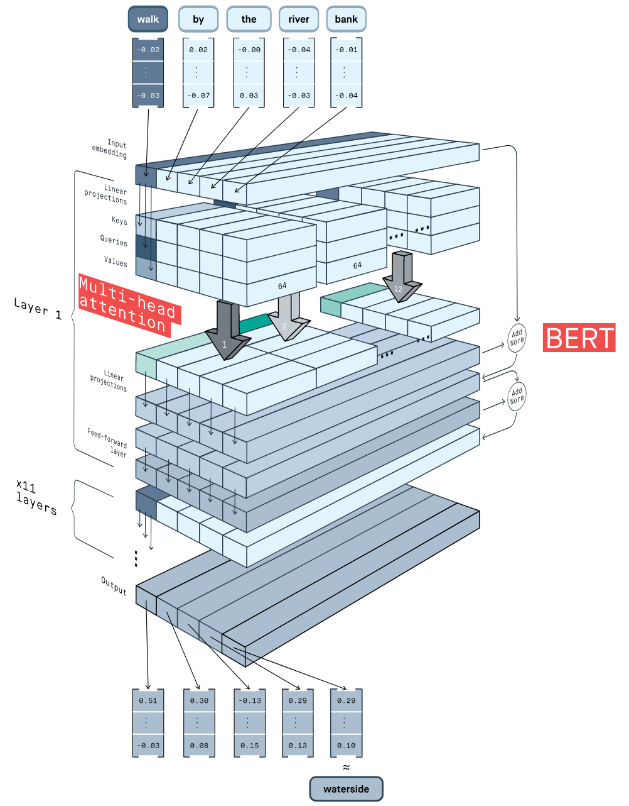

# Jigsaw - Toxic Severity Rating

> 主题：nlp ｜ 子类：— ｜ 领域：内容审核 ｜ 类别：Featured
> 截止：2022-02-07 ｜ 队伍数：2301 ｜ 机制：代码赛 ｜ 指标：与标注者排序的一致性
> 数据来源：`intel/jigsaw-toxic-severity-rating/`（120 条主题索引 + 8 篇 write-up 正文）

## 1. 任务与数据

- **预测目标**：对评论的"毒性严重程度"排序（不是简单二分类，而是排序/相对比较任务）。
- **数据形态**：文本 + 人工标注；标签噪声大（标注者之间本身就不一致），因此**指标定义为"与标注者的一致性"**。
- **评测环境污染（深读核心发现）**：私榜测试集与 Jigsaw 2018 重叠 → 在 Jigsaw18 上训练/蒸馏的模型私榜虚高（验证 ~0.70 vs 私榜 ~0.81，**+0.10 级错位**）；公开榜仅占 5% 权重。7th 事后自白"我们信 CV，但本质是吃了彩票（泄漏受益模型拿到足够权重）"。
- **构造陷阱**：
  - **公开榜参考价值低**（14th 明确指出），必须依赖本地验证。
  - 数据集跨赛事复用普遍（Jigsaw 系列多届），**文本泄漏**（同一文本出现在不同折）是主要风险。

## 2. 验证方案

| 方案 | 使用者 | 说明 |
| --- | --- | --- |
| **Union-Find 分组切分** | 14th | 把内容相关的样本聚成一组，避免同一文本跨折泄漏 |
| 以验证分数为唯一决策依据 | 14th / 1st | "公开榜没用，就最大化验证分"；1st 更激进：**只用验证集拟合组合器权重**（遗传算法），避免把训练集结构带进组合 |
| 多数据库交叉验证 | 14th | 合并历届 Jigsaw 数据后仍需防泄漏 |

## 3. 方案谱系

| 方案 | 名次 | 关键点 |
| --- | --- | --- |
| 15 模型加权**秩平均**（种子：roberta/deberta × Jigsaw18/19/Ruddit） | 1st | 验证集上遗传算法定权；all15 私榜 0.8139 | 
| Detoxify 特征 + tf-idf（46 维）→ **故意选更简单的 10 特征模型** | 3rd | VAL 更低但 RUD 与私榜更好（0.81299 vs 0.80901） |
| Luke-RoBERTa 微调（tito-CV、Margin Ranking Loss）+ Detoxify 标签权重随机搜索 | 4th | 数据集多样性 1/3 + 模型多样性 2/3 |
| 多数据集 toxic-xlm-roberta + 伪标签 | 7th | **伪标签 CV↑ 私榜不动**；union-find GroupKFold |
| RAPIDS 加速的推理方案 | 52nd 银牌 | 工程侧优化 |

## 4. 关键技巧

- **防泄漏的折划分（Union-Find）**：把可能互相重复/近似的文本分到同一折，是文本赛的通用防泄漏手段。
- **多数据集合并**：历届 Jigsaw 数据 + 外部毒性数据集（Ruddit、OffenseEval）显著增强泛化。
- **现成毒性模型作为集成成员**（Detoxify）可以省下大量训练成本。
- **信任 CV**：公开榜差时不要被带偏。
- **但"信 CV"只能防亏、不能保证赢**（7th 的教训）：评测被泄漏污染时，CV 对齐的是"诚实子集"，奖金来自"吃过泄漏的模型"。
- **秩平均与低参数组合器**：1st 的 15 模型秩平均 + GA 线性权重，天然匹配排序指标、抹平校准差异。
- **简单模型在未见数据上常胜**：3rd 用 10 特征模型换泛化；**伪标签在污染环境会放大 CV 虚高**（负结果）。
- **横向索引**：社区整理了"Jigsaw 系列历届全部方案"清单，是跨赛事学习的范例。

## 5. 深读结论（2026-10 补）

- 量化错位：强单模验证 0.699–0.705，私榜 0.79–0.814——**任何"验证+0.10"级别的榜分都先怀疑评测集泄漏**。
- 三条可迁移裁决：① "信 CV"只防亏；② 未见数据上简单 > 复杂（3rd 的对照）；③ 伪标签在泄漏环境不可信（CV↑、私榜平）。
- 反事实：完全避开 Jigsaw18 的"优雅路线"诚实上限 ~0.72，大概率无缘金区——**这是方法论与得分的取舍**。

## 6. 图表证据（BERT 3D 图解）

*图：3D charts 帖（topic 286655，204 票——全场第二高票）用 3D 图讲清 BERT：输入嵌入 → 多头注意力（K/Q/V, 64 维）→ Add&Norm → FFN → ×11 层 → 上下文嵌入。它不产出方案，却是多数参赛者的"基座理解"来源——公共学习资产的又一证据（原帖另有一图 `286655_img/03.png`）。*

## 7. 可迁移性评估

- **可直接迁移**：
  - **Union-Find / 相似度分组做折划分**，防止文本或实体泄漏。
  - 合并同领域历届比赛数据（Kaggle 上极常见）。
  - 排序类任务的评估要用一致性/相关性指标而非准确率。
- **需要前提**：
  - 需要判断样本相似度的手段（文本用 TF-IDF/嵌入均可）。
  - 外部数据的许可与质量。
- **不建议照搬**：
  - 跟踪公开榜（本场公开榜信息量低）。

## 8. 对新手的关键启示

1. **折划分先于建模**：文本赛最常见的自欺就是同一文本跨折泄漏。
2. **同系列历届数据是免费的训练集**，但要用同一套防泄漏策略。
3. **公开榜可能完全没用**——先量化 CV-LB 相关性再决定依据哪个。
4. **善用现成开源模型**作为集成成员，性价比极高。

## 9. 出处

- 讨论区索引：`intel/jigsaw-toxic-severity-rating/topics.md`（120 条）
- 已收录 write-up（8 篇）：
  - 1st（212 票）：https://www.kaggle.com/competitions/jigsaw-toxic-severity-rating/discussion/306274
  - 4th（58 票）：https://www.kaggle.com/competitions/jigsaw-toxic-severity-rating/discussion/306084
  - 14th（64 票）：https://www.kaggle.com/competitions/jigsaw-toxic-severity-rating/discussion/306063
  - 52nd 银牌（57 票）：https://www.kaggle.com/competitions/jigsaw-toxic-severity-rating/discussion/306074
  - Jigsaw 历届全部方案汇总（56 票）：https://www.kaggle.com/competitions/jigsaw-toxic-severity-rating/discussion/286333
