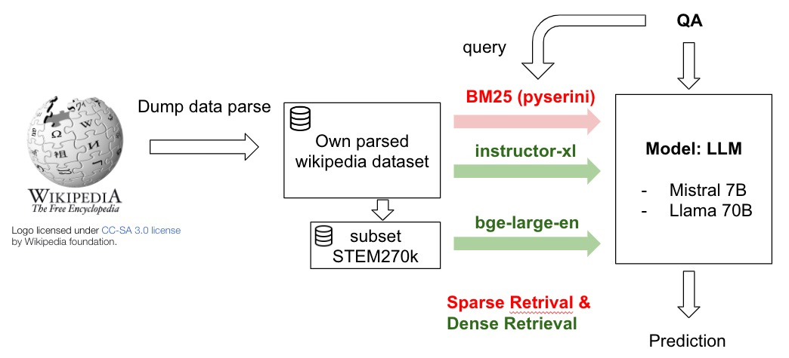
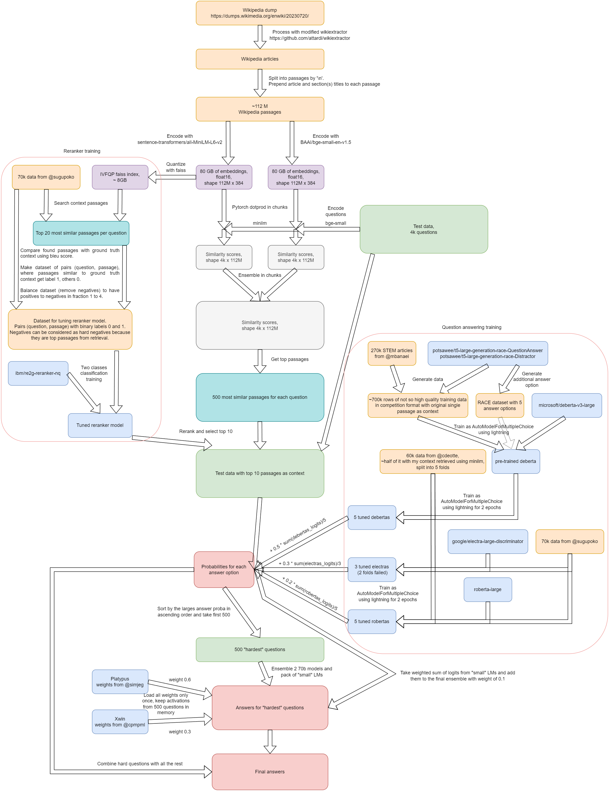
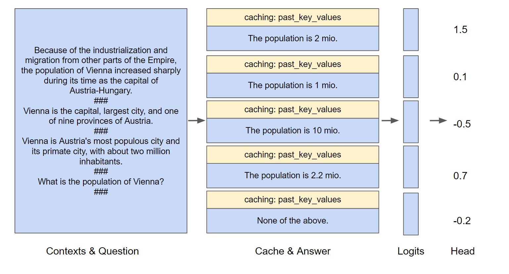
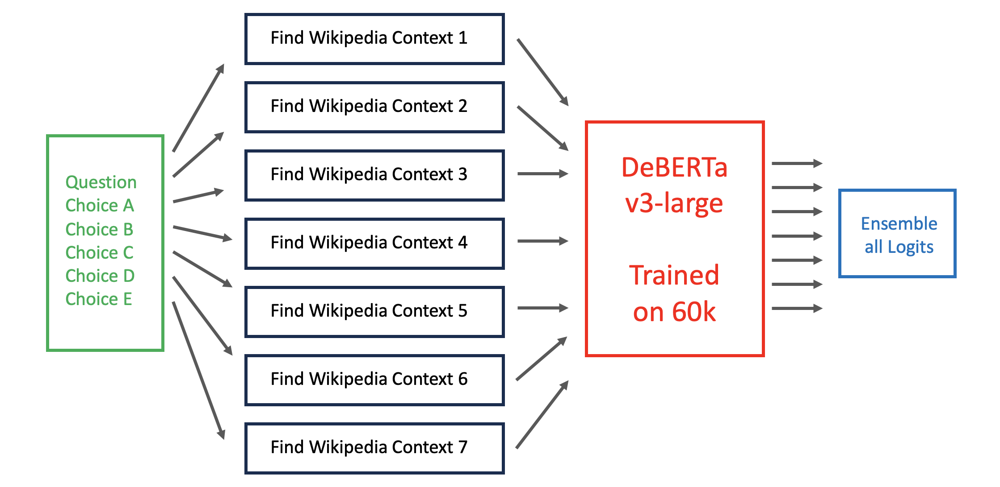
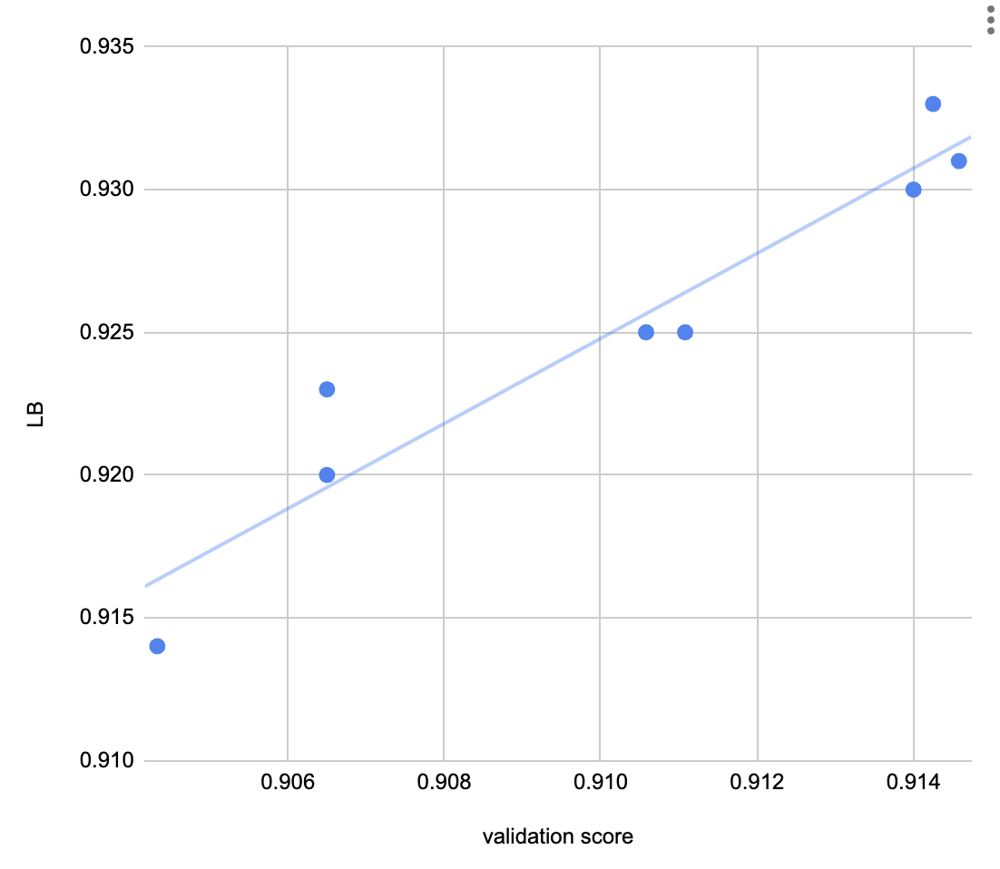

# Kaggle - LLM Science Exam

> 主题：nlp（开放域科学问答/RAG）｜ 子类：— ｜ 领域：科学常识 ｜ 类别：Featured
> 截止：2023-10-XX ｜ 队伍数：2674 ｜ 机制：代码赛 ｜ 指标：MAP@3
> 数据来源：`intel/kaggle-llm-science-exam/`（120 条主题索引 + 8 篇 write-up 正文；深读升级 2026-10-03，Tier A #45）

## 1. 任务与数据

- 预测目标：回答约 4000 道科学多选题（5 选 1，按 MAP@3 评分）。
- 数据形态：官方 train.csv 200 题（含维基上下文提示）；允许外部数据/模型（有专门的使用澄清帖）；社区共享 60k/40k/99k 等增强数据集。
- 构造陷阱：
  - **检索（RAG）是主战场**：答案证据必须先被检索到；
  - 维基语料解析器会丢数字/公式 → 检索硬上限；
  - train.csv 200 题太简单（0.99+）不能当验证；
  - GPT-3.5 生成数据含标注错误 → 理论天花板（0.93→0.94 极难）；
  - 9 小时推理预算 → 必须分诊/量化/缓存。

## 2. 验证方案

| 方案 | 使用者 | 说明 |
| --- | --- | --- |
| 6k STEM 题验证 + 选私榜最高 | 1st | 最后提交同时是最高 CV 与最高私榜 |
| 60k 中抽 2000 题 | 4th | 验证-LB 近似线性（图证） |
| 冻结 3 个集合（200+300+自有 1000） | 5th | 全程不训练这些数据；不合本地的方法不上榜 |
| 270k 数据集留出 | 3rd | 另有 70k 调 reranker |
| train.csv 200 | 多队（教训） | 太简单，0.99+ 无信息 |

## 3. 方案谱系

| 方案 | 名次 | 关键点与数字 |
| --- | --- | --- |
| 多检索 + 7B/13B LLM late fusion | 1st（219/239 票） | 300 组组合筛选；e5/gte/bge 5 embedding；60M chunks 2 卡 GPU 分块相似度；5×7B+1×13B；binary per-option + KV 缓存 + 跨选项平均 logits；**私榜 0.933**（单模 0.932） |
| 双塔检索 + tuned reranker + DeBERTa/70B | 3rd（84 票） | 自改 wikiextractor；112M passages；top500→rerank→top10；消融：reranker +0.015（最大）、LLM +0.012；final 0.9284/0.9286 |
| Elasticsearch 句级检索 + DeBERTa | 4th（72 票） | v3/v5/v7 三种 context（ES 分/编辑距离/语义）；token 512→768→1280；2000 验证与 LB 线性 |
| 自解析 Wiki + BM25/稠密 + 70B 多阶段 | 5th（81 票） | wikitextparser 保留数字；BM25 74M 段落；instructor-xl 300GB→10GB；Llama2-70B 逐层量化 + xformers（6GB）；选项轮转 TTA 拼接；7B 全量→70B 40%→70B 长上下文 5%；私 0.926 |
| 7 条 RAG × DeBERTa 集成 | Top100（73 票） | **RAG 数量 > 模型质量**；GPU 加速（RAPIDS TF-IDF/fp16/2×T4）；sublinear_tf +0.010；QDO 增强；drop-2 提速 |
| max-prob 集成 + TF-IDF 后处理 | 10th（93 票） | 4 类 wiki；滑窗分块；max 概率集成抗过拟合 |
| 60k 数据集 | 社区（282 票） | 公开数据 + Wiki 上下文；单模型 LB 0.830+ |

## 4. 关键技巧

- **检索优先**：多 embedding（e5/gte/bge/instructor）、多分块（256/512/1024 字符）、多 query（Q/choices/Q+choices）；**检索多样性 > 模型多样性**。
- **语料工程**：解析器审计（数字/模板丢失）；cirrussearch 全渲染 dump 重切分；passage 级单阶段检索（两阶段会漏检）。
- **reranker**：用与推理同分布的 (question, passage) pair；预训练热启动（ibm/re2g-reranker-nq）+ hard negatives（原始模型直接上硬负会崩）。
- **LLM 判别设计**：binary per-option 消除位置偏差；past_key_values 缓存 context+question；跨选项平均 logits 辅助；单 epoch BCE + LoRA 全线性层。
- **TTA**：选项轮转 5 次（5th 拼接 5 顺序 + attention mask 复用公共前缀）；choice-permute TTA（Top100）。
- **预算分配**：小模型全量 + 大模型难例（5th 40%/5%；3rd 500 题）；ct2/逐层量化 + xformers 让 70B 可行。
- **集成**：logits 集成/late fusion；max-probability 更抗过拟合（10th）；TF-IDF (4,7)-gram 后处理。
- **验证**：用训练分布外的 2k–6k 集合；冻结 holdout 不训练。

## 5. 可迁移性评估

- 可直接迁移：RAG 检索多样性优先；语料解析与分块工程；reranker 训练配方；binary per-option + 缓存 + TTA；难例分诊；验证集合选择；社区数据先行。
- 需要前提：大体量知识库（Wikipedia）+ 检索基础设施；LLM 推理工程（量化/显存管理）；外部数据合规确认。
- 不建议照搬：单条检索 + 单模型；closed-book 分类；用简单验证集选模型；无 TTA/去偏差设计直接用生成式 LLM。

## 6. 对新手的关键启示

1. 开放域 QA 先把检索做好：多建几条 RAG 管线比多训几个模型值钱。
2. 语料解析器决定召回上限——科学题的数字/公式丢不得。
3. LLM 判别用 binary per-option + KV 缓存，既去位置偏差又省算力。
4. 9 小时预算靠分诊：小模型筛、大模型精处理难例。
5. 验证集必须"够难"（60k 抽 2k/6k），200 题式的 0.99 是陷阱。

## 7. 深读结论（2026-10 补）

**一句话**：这是一场"RAG 质量 × 数据共享 × 推理工程"的竞赛——模型只是链条中的一环。

**跨方案裁决**：

- 检索决定上限（5/6 明说）：加 RAG 的边际收益 > 加模型；reranker tuning 是最大单点（+0.015）。
- 语料解析/分块是隐形主变量（数字/公式丢失）。
- LLM（binary 头）上限更高；DeBERTa+多 RAG 到 0.90–0.93，成本更低——按算力选择。
- 难例分诊（小模型全量+70B 难例）是 9h 下的标准结构。
- 验证要用训练分布外的集合；数据共享抬高下限、标注噪声封顶（0.93→0.94 数周）。
- 选项位置偏差用二进制化 + TTA 解决。

**数字账精选**：1st 0.933（单模 0.932）；3rd 消融 0.894→0.912→0.927（reranker）→0.928；5th 私 0.926（70B 6GB 显存）；Top100 sublinear_tf +0.010、30min 单模 0.900；60k 数据单模 0.830+。

**失败学**：DeBERTa 在 LLM 体系无帮助（1st）、引入其他选项/多类头带来位置偏差、自定义 query/embedding fine-tune（5th）、两阶段检索漏检（3rd）、train.csv 当验证（4th）、OOM 下只堆 RAG 数量（Top100 自省）、license 灰区（3rd）。

**悬案**：数据使用澄清（425681）未收录；零样本 70B+RAG（440620）与 270k STEM 检索（442595）未收录；1st 的两种 head 细节未展开。

## 8. 图表证据

> 路径相对本文件（`notes/nlp/`）：`../../intel/kaggle-llm-science-exam/bodies/<topic>_img/NN.ext`

**图 1：5th 管线（topic 446293）**

- 自解析 Wiki + STEM270k → BM25/instructor-xl/bge-large-en → Mistral-7B/Llama2-70B；
- 稀疏+稠密混合检索的标准结构。

**图 2：3rd 全系统（topic 446358）**

- 112M passages → 双 embedding → top500 → tuned reranker → top10 → DeBERTa/Electra/Roberta 集成 → 500 难例 70B；
- 与消融表（reranker +0.015、LLM +0.012）对应。

**图 3：1st 的推理架构（topic 446422）**

- context+Q 前向一次缓存 past_key_values；5 答案批量复用；
- logits → 分类头 → 每选项概率（去位置偏差 + 省算力）。

**图 4：RAG 集成（topic 446318）**

- question+choices → 7 条检索 → 同一 DeBERTa-v3-large 打分 → logits 集成；
- "RAG 数量 > 模型质量"的图证。

**图 5：验证-LB 相关性（topic 446307）**

- 2000 题验证 0.906–0.914 对应 LB 0.914–0.933；
- 用足够难的公开集合建立可信 CV。

## 9. 出处

- 讨论区索引：`intel/kaggle-llm-science-exam/topics.md`（120 条）
- 已收录 write-up（8 篇）：
  - 60k 数据集（282 票）：https://www.kaggle.com/competitions/kaggle-llm-science-exam/discussion/436383
  - 1st 短（239 票）：https://www.kaggle.com/competitions/kaggle-llm-science-exam/discussion/446240
  - 1st 长（219 票）：https://www.kaggle.com/competitions/kaggle-llm-science-exam/discussion/446422
  - 10th（93 票）：https://www.kaggle.com/competitions/kaggle-llm-science-exam/discussion/446248
  - 3rd（84 票）：https://www.kaggle.com/competitions/kaggle-llm-science-exam/discussion/446358
  - 5th（81 票）：https://www.kaggle.com/competitions/kaggle-llm-science-exam/discussion/446293
  - Top100（73 票）：https://www.kaggle.com/competitions/kaggle-llm-science-exam/discussion/446318
  - 4th（72 票）：https://www.kaggle.com/competitions/kaggle-llm-science-exam/discussion/446307
- 深读全本：`analysis/deep/kaggle-llm-science-exam.md`（11 组件 + 5 图证）
- 缺口登记：440620、442595、426174、440908、424519、431786、424242、435602、444202、425681 未收录正文
