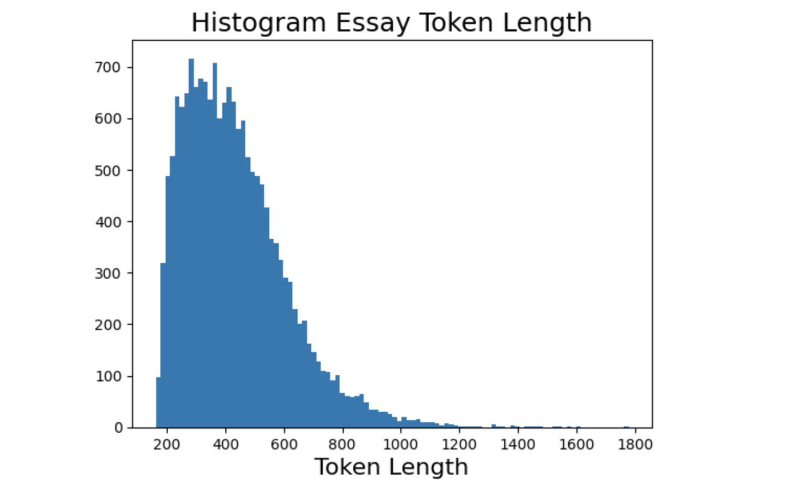
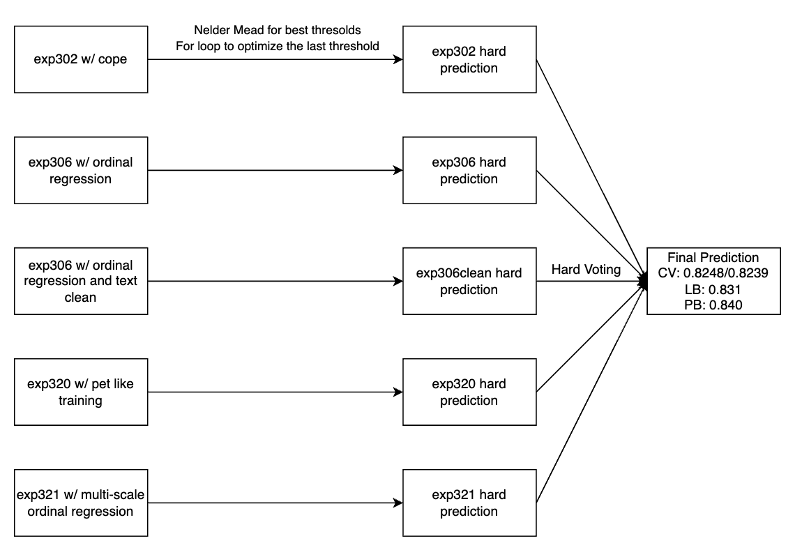

# Learning Agency Lab - Automated Essay Scoring 2.0

> 主题：nlp（文本评分/序数回归）｜ 子类：— ｜ 领域：教育 ｜ 类别：Featured
> 截止：2024-07-02 ｜ 队伍数：2706 ｜ 机制：代码赛 ｜ 指标：QWK（quadratic weighted kappa，1–6 序数）
> 数据来源：`intel/learning-agency-lab-automated-essay-scoring-2/`（120 条主题索引 + 8 篇 write-up 正文；深读升级 2026-10-03，Tier A #49）

## 1. 任务与数据

- 预测目标：给 6–12 年级学生作文打 1–6 分（QWK）。
- 数据形态：17,307 条 = **Persuade 12,875 + Kaggle-only 4,432**；测试仅 5 个主题、几乎只有 Kaggle-only 风格（无 Persuade）。
- 构造陷阱：
  - **两个来源评分标准不兼容**（同 prompt 分布不同；对抗验证 AUC 0.65–0.675）→ 直接混训拟合大源；
  - QWK 阈值化（float→int）是独立大杠杆，但尾部稀疏易过拟合；
  - Kaggle-only 仅 4.5k → 种子方差大；
  - 作文长度长尾到 1800 token（maxlen 512 截断）。

## 2. 验证方案

| 方案 | 使用者 | 说明 |
| --- | --- | --- |
| 两阶段 + B 子集验证 | 1st | prompt_id+score 分层 5 折；CV/公/私相关性改善 |
| A+B 双验证 + B 子集阈值参考 | 2nd | 阈值最终在全量训练集上搜（只在 B 上搜 LB 掉） |
| 非 Kaggle-only 验证 | 3rd | 避免对 Kaggle-only 过拟合 |
| 按测试主题权重验证 | 6th | 5 主题比例加权（探针估计）；persuade 权重 0 |
| 对抗验证（train vs test） | 4th | AUC 0.65–0.675 → 假设测试全 non-Persuade |
| 泄漏探针 | 496906 | 测试与 Persuade 2.0 无匹配 → 无泄漏红利 |

## 3. 方案谱系

| 方案 | 名次 | 关键点与数字 |
| --- | --- | --- |
| 两阶段 + PL + 阈值 + 3-seed | 1st（86 票） | pretrain(old)→finetune(new) **+0.015**；PL 两轮 +0.004–0.007；阈值 Powell+15 起点（1/2≈1.7、5/6≈4.9）；7 模型×3 seed=21 个大模型；按最佳 CV 提交私 **0.841**（多样性提交 0.837/0.838） |
| MLM+两阶段+ordinal+hard voting | 2nd（88/142 票） | MLM 10 epoch；ordinal regression（累积 BCE）；阈值全量搜；5 模型 hard voting：CV .8248/LB .831/私 **0.840**；最佳私 .844 未选中 |
| MLM+两阶段+多头集成 | 3rd | CV .836/公 .832/私 **0.839**；groupkfold(prompt_name) 公榜好私榜崩；Persuade 2.0 未用（license） |
| 源标签+源分类头+45 预测集成 | 4th（95 票） | [A]/[B] 标签；假设测试全 non-Persuade；deberta-large/v3-large/Qwen2-1.5B ×5 折×3 seed；OOF 0.818→**0.827**（阈值）；动态 micro-batch；DeBERTa 提速 15%/30% |
| LB 探针+主题加权+LGBM | 6th | 测试 5 主题比例（35.6/24.6/19.6/12.6/7.6%）；persuade flag；OOF→CDF 给 LGBM；relabeling；私 0.836 |
| DeBERTa 回归 starter | cdeotte（218 票） | 回归>分类；去 dropout；maxlen 1024/1536；加 `\n`/双空格 token；CV .822/LB .800 |
| 更多数据（Persuade 2.0） | 社区（176 票） | 25,996 条中 12,873 重复 → 额外 8,689；辅助列；泄漏探针阴性 |

## 4. 关键技巧

- **来源审计优先**：重复检测 + 对抗验证 + LB 主题探针 → 确认"测试 = Kaggle-only 风格"。
- **两阶段训练**：大源（Persuade）预训练/MLM → 小源（Kaggle-only）微调；不混训。
- **回归而非分类**：连续分数保留阈值自由度；MSE/BCE；ordinal regression（累积 BCE）有效。
- **QWK 阈值优化**：Powell 最小化 1−QWK、15 起点、3 seed；切点 1/2≈1.7、5/6≈4.9；阈值覆盖全量分布；不在小验证集上 post-fit。
- **小样本方差控制**：3-seed 平均一切；只重做 finetune 换 seed；简单平均集成；预计算每模型阈值。
- **PL 分布翻译**：用新数据集成给老数据重新打分（先平均后覆盖）；收益 +0.004–0.007，激进轮有过拟合风险。
- **长度与 token 化**：maxlen 1024/1536；添加 `\n`/双空格 token；prompt 不入输入；回归去 dropout。
- **工程**：动态 micro-batch 拼批；Faster DeBERTa（15%/30%）；45 预测集成。

## 5. 可迁移性评估

- 可直接迁移：多来源识别与两阶段对齐；序数指标"连续预测+阈值优化"；3-seed+简单集成；PL 分布翻译；对抗验证/探针；提交双对冲。
- 需要前提：可识别数据来源（重复/对抗验证）；足够的算力做多种子与集成；测试探测手段（多次提交）。
- 不建议照搬：单阶段混训；分类损失；在 4.5k 上拟合权重+阈值；只用 Kaggle-only 搜阈值；prompt 入输入/回译。

## 6. 对新手的关键启示

1. 拿到训练集先问"它由几个来源组成"——重复检测与对抗验证是标准动作。
2. 来源评分标准不同时，先学表示再适配决策边界（两阶段），不要混训。
3. 序数指标用连续回归 + 优化阈值，而不是硬分类。
4. 小验证集上的二次拟合（权重、阈值）是双重过拟合；简单平均 + 多种子更稳。
5. 提交选择用"最佳 CV + 多样性"双对冲；本场多队的最佳私榜提交都没被选中。

## 7. 深读结论（2026-10 补）

**一句话**：这是一场"识别数据有几种来源、把测试源分布对齐"的比赛——DeBERTa 回归 + 两阶段 + QWK 阈值优化是骨架。

**跨方案裁决**：

- 双源不兼容 + 两阶段是核心（4/4）；直接混训拟合 Persuade 分布。
- QWK 阈值化第二大杠杆（0.818→0.827），但必须多种子/多起点防过拟合。
- 回归 > 分类；ordinal regression 是有效变体；maxlen 1024/1536、去 dropout、加特殊 token。
- 微调仅 4.5k → 3-seed 平均 + 简单平均集成；PL 增益 +0.004–0.007。
- CV（B 子集/主题加权）比 LB 可靠，但提交选择仍含运气成分（多队最佳私榜未选）。
- 额外 Persuade 2.0 数据收益有限（分布错配时加同源数据≈无效）。

**数字账精选**：+0.015（两阶段）；0.818→0.827（阈值）；1st 0.841（最佳 CV 提交）；2nd 0.840（选中）/0.844（未选）；3rd 0.839；6th 私 0.836；starter CV .822/LB .800；作文长度峰值 250–400 token。

**失败学**：classification、GBDT、attention pooling、prompt 入输入、回译、weighted blend、stacking、MoE、ranking loss、AWP、Reina；只在 Kaggle-only 搜阈值（2nd）；数据增强/半监督（6th）；最后 48h 做效率方案（1st）。

**悬案**：6th 的测试主题比例未验证；Persuade 2.0 license 未定；1st 第二轮 PL 的 CV/LB 背离机制未解释；阈值社区共识帖（502279）未收录。

## 8. 图表证据

> 路径相对本文件（`notes/nlp/`）：`../../intel/learning-agency-lab-automated-essay-scoring-2/bodies/<topic>_img/NN.png`

**图 1：作文长度分布（topic 497832）**

- 峰值 250–400 token、长尾到 1800；
- maxlen 512 截断大量内容 → 1024/1536 涨分；也为动态拼批提供依据。

**图 2：2nd 的 5 模型 hard voting（topic 516790）**

- CoPE/ordinal/ordinal+clean/pet-like/multi-scale 五路 → Nelder-Mead 阈值 + 末阈值搜索 → hard voting；
- CV .8248/LB .831/私 .840——阈值与投票是两条独立决策链。

## 9. 出处

- 讨论区索引：`intel/learning-agency-lab-automated-essay-scoring-2/topics.md`（120 条）
- 已收录 write-up（8 篇）：
  - starter（218 票）：https://www.kaggle.com/competitions/learning-agency-lab-automated-essay-scoring-2/discussion/497832
  - 更多数据（176 票）：https://www.kaggle.com/competitions/learning-agency-lab-automated-essay-scoring-2/discussion/496906
  - 4th（95 票）：https://www.kaggle.com/competitions/learning-agency-lab-automated-essay-scoring-2/discussion/516639
  - 2nd 总览（88 票）：https://www.kaggle.com/competitions/learning-agency-lab-automated-essay-scoring-2/discussion/516582
  - 1st（86 票）：https://www.kaggle.com/competitions/learning-agency-lab-automated-essay-scoring-2/discussion/516791
  - 6th：https://www.kaggle.com/competitions/learning-agency-lab-automated-essay-scoring-2/discussion/516814
  - 3rd：https://www.kaggle.com/competitions/learning-agency-lab-automated-essay-scoring-2/discussion/516631
  - 2nd 详版：https://www.kaggle.com/competitions/learning-agency-lab-automated-essay-scoring-2/discussion/516790
- 深读全本：`analysis/deep/learning-agency-lab-automated-essay-scoring-2.md`（11 组件 + 2 图证）
- 缺口登记：502554、494935、499959、502279、498478、491101、493962 未收录正文
