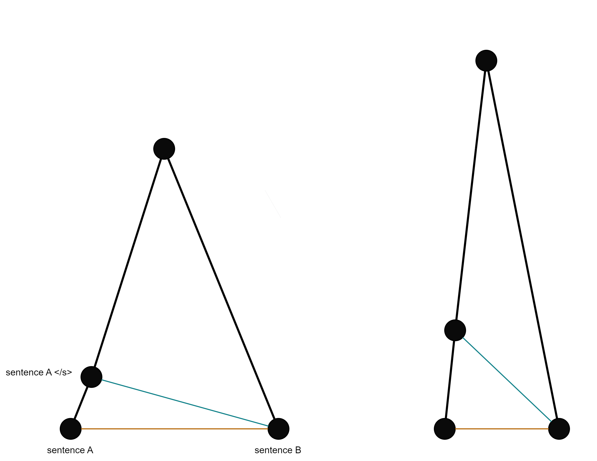
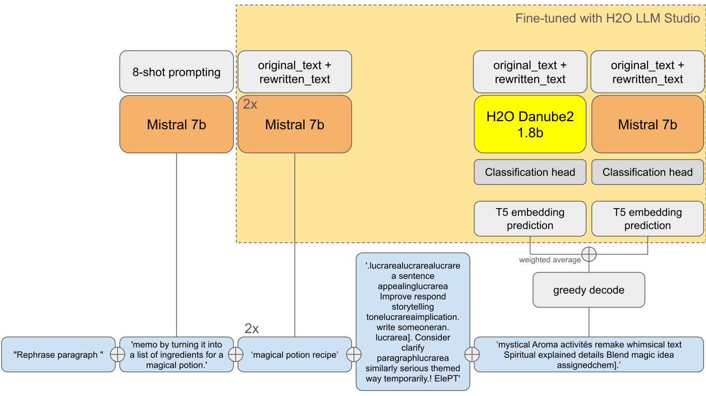

# LLM Prompt Recovery

> 主题：nlp ｜ 子类：— ｜ 领域：生成式 AI ｜ 类别：Featured
> 截止：2024-04-16 ｜ 队伍数：2175 ｜ 机制：代码赛 ｜ 指标：余弦相似度（句向量比对）
> 数据来源：`intel/llm-prompt-recovery/`（120 条主题索引 + 5 节正文：1st/2nd/4th + 经验帖 + 数据集汇总；24 条 write-up 标记中其余未收录）

## 1. 任务与数据

- **任务形式**：给定"原文 + 被改写后的文本"，**反推出当时使用的改写提示词（prompt）**。
- **数据形态**：**官方不提供训练数据**——全部依赖参赛者自行生成合成数据（社区共建了多个数据集）。
- **指标特性**：用句向量模型的余弦相似度评分 → 指标本身对文本长度/特殊 token 极其敏感。
- **核心事实**：评分用 **TF Sentence-T5**；其 TF 版 SentencePiece **不做特殊 token 保护**（`</s>` 被拆成字符），且句向量空间存在 eos"聚焦点"效应——这两点让指标可被明文词元攻击（`lucrarea`）。
- **生态**：社区汇总 15+ 合成数据集（nbroad 2k、宿主补充文本、thedrcat 10k、winddude 70k 等）。

## 2. 验证方案

| 方案 | 使用者 | 说明 |
| --- | --- | --- |
| 合成数据留出验证 | 多数 | 自建数据集切分 |
| 均值 prompt 基线 + 暴力搜索 | 2nd | 先用"平均提示词"作为强基线，再迭代优化 |
| 榜单直接验证 | 4th / 1st | 指标可被显著操纵，导致榜单本身的参考价值下降 |
| 350 样本均值提示词验证集 | 2nd | 均值提示词分与提交分良好相关，最终 CV≈LB |

## 3. 方案谱系

| 方案 | 名次 | 关键点 |
| --- | --- | --- |
| **对抗后缀**（`" 'it 's ' something Think A Human Plucrarea×8"`） | 1st | eos 聚焦点 + TF 字面 tokenize；后缀最多 +0.05；模型本体 ≤0.65 |
| 均值提示词暴力优化 + 嵌入预测 + 贪心解码 + LLM 增量 | 2nd | 3.2 万词元搜索找到 lucrarea（0.65）；嵌入预测 0.75+；解码 −3~4 分；LB 0.68–0.69 |
| **ST5 词元贪心追加** + 均值提示词 0.69 | 4th | `lucrarea` 词源假说；TF vs KerasHub 差异（sentinel token、max len 128）；LORA rank 2–4 |
| 合成数据六问题治理 | 经验帖 | 提示词怪异/生成配置/前缀污染/冗长有害/训练空间≠评测空间/预处理未知 |
| 数据集汇总 | 社区 | 无官方数据下的 15+ 数据集清单 |

## 4. 关键技巧

- **均值 prompt 是强基线**：0.65–0.69（三家独立），改写提示词高度模板化。
- **指标病理学**：eos 聚焦点 + TF 字面 tokenize → `lucrarea` 攻击最多 +0.05（1st/2nd/4th 三方验证）。
- **输出要短**：T5 空间惩罚冗长（冗长预测 0.628 vs 紧凑 0.715）；"短语义核心 + 指标装饰"最优。
- **嵌入预测的代价**：直接预测 768 维嵌入 + 余弦损失可到 0.75+，但解码回文本损失 3–4 分。
- **合成数据规程**：宿主同款模型（gemma-instruct-7b-quant）+ 贪心采样 + 模板匹配 + 质量过滤；提示词模板 1–2k × 文本 10–20k。
- **社区共建数据集**：无官方数据时的主要资源。

## 5. 深读结论（2026-10 补）

- **本场是"指标套利"的教科书**：名次由对 ST5/TF 实现漏洞的利用程度决定（攻击 +0.05 > 全部建模努力）；模型本体都 ≤0.65。
- **漏洞需要版本级理解**：HF 版保护特殊 token（`</s>`→eos，聚焦效应使余弦趋近 0.9）；TF 版字面拆解 → 词表中嵌入最近的明文词元 `lucrarea` 成为"平民 eos"。
- **诚实管线仍有价值**：2nd 的"嵌入预测+解码"证明无攻击时也能到 0.68–0.69；但解码损失（−3~4 分）是连续→离散的固有代价。
- **合成数据六问题**（经验帖）是无官方数据赛的通用清单：怪异提示词、生成配置错配、前缀污染、冗长、空间错位、预处理未知。
- **均值基线 0.65+**：在"提示词定型"的任务里，先量化均值再投入模型。

## 6. 图表证据

**图 1：eos 聚焦点几何**（1st，topic 494343）——`../../intel/llm-prompt-recovery/bodies/494343_img/01.png`

*读图*：左边 A+`</s>`→B 绿线 < A→B 橙线（提分）；右边两句已近时聚焦反噬——后缀攻击的原理图。

**图 2：2nd 的完整管线**（topic 494497）——`../../intel/llm-prompt-recovery/bodies/494497_img/01.png`

*读图*：8-shot/2×Mistral + H2O-Danube2/Mistral 嵌入预测 → 加权平均 → 贪心解码 → 与均值提示词/魔药配方/优化串拼接。

## 7. 可迁移性评估

- **可直接迁移**：
  - **均值/模板基线**在生成类任务中意外地强，先量化它再决定投入。
  - 使用句向量做指标时，**必须检查指标对长度与特殊 token 的敏感性**。
  - 无官方数据时，合成数据的**质量控制**比数量更重要。
- **需要前提**：
  - 对抗式后缀依赖具体指标实现（换指标即失效），属于比赛特有手段。
  - 分词器攻击依赖特定模型版本的缺陷（ST5 的多语言词元残留）。
- **不建议照搬**：
  - 把指标攻击当作通用技术积累——它只对特定实现有效，且常引发争议。

## 8. 对新手的关键启示

1. **无数据比赛 = 数据构造比赛**：本场的胜负在合成数据质量与指标理解之间。
2. **指标实现细节值得读源码**：1st 与 4th 都是通过理解句向量/分词器的具体行为拿到名次。
3. **但要清楚区分"技术能力"与"指标套利"**：后者不可迁移，也不总被社区认可。
4. **均值基线先跑一遍**，它往往比你想象的强。

## 9. 出处

- 讨论区索引：`intel/llm-prompt-recovery/topics.md`（120 条）
- 已收录正文（5 节）：
  - 1st 对抗攻击（Khoi Nguyen，243 票）：https://www.kaggle.com/competitions/llm-prompt-recovery/discussion/494343
  - 数据集汇总（Kishan Vavdara，191 票）：https://www.kaggle.com/competitions/llm-prompt-recovery/discussion/481811
  - 2nd（Team Danube，107 票）：https://www.kaggle.com/competitions/llm-prompt-recovery/discussion/494497
  - 经验帖（Darien Schettler，105 票）：https://www.kaggle.com/competitions/llm-prompt-recovery/discussion/483916
  - 4th ST5 攻击（59 票）：https://www.kaggle.com/competitions/llm-prompt-recovery/discussion/494362
- 未收录缺口（登记备查）：24 条 write-up 标记中的其余条目（含 3rd）
- 深读全文：`analysis/deep/llm-prompt-recovery.md`
