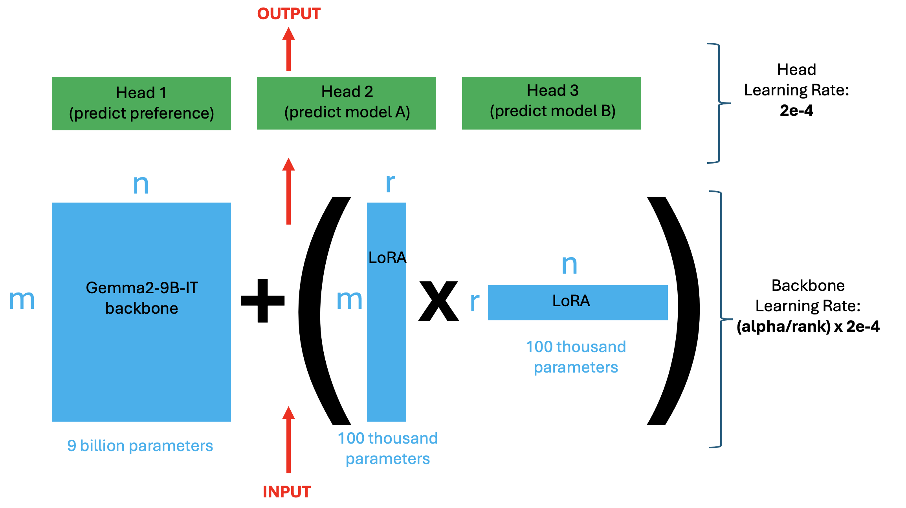
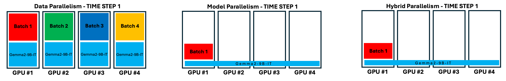

# LMSYS - Chatbot Arena Human Preference Predictions

> 主题：nlp ｜ 子类：— ｜ 领域：LLM 评测 ｜ 类别：Research
> 截止：2024-08-12 ｜ 队伍数：1849 ｜ 机制：代码赛 ｜ 指标：对数损失（偏好概率）
> 数据来源：`intel/lmsys-chatbot-arena/`（80 条主题索引 + 6 篇正文：16th/1st/2nd/3rd/5th/9th；另有 4th/13th/18th 等 11 条 write-up 未收录）

## 1. 任务与数据

- 预测目标：给定用户提问与两个模型的回答，预测人类更偏好哪一个（输出概率，按对数损失评分）。
- 数据形态：三方对话（prompt / response_a / response_b）+ 人类投票结果；**A/B 顺序与长度存在偏差**。
- 构造陷阱：
  - 序列长（多轮 + 双回答）→ 截断策略关键；
  - 人类偏好带噪声与位置偏差；
  - 推理成本高（要跑多个大模型）。
  - **本场发生数据泄漏事件**（测试与公开语料重叠），官方赛后重评；终局私榜数字（0.96898/0.9859/0.9828）与公开阶段（0.86–0.89）**不同口径**，不可直接比较。

## 2. 方案谱系

| 方案 | 名次 | 关键点 |
| --- | --- | --- |
| 70B/72B 教师 logits 蒸馏 → 9B 学生 | 1st | "Distill is all you need"：5 折教师软标签；5 折 LoRA 直接平均；GPTQ 8bit + TTA |
| 全参数微调 + 240k 伪标签 + full swap | 2nd | 唯一不用 LoRA 的路线；full swap 同一 optimizer.step +0.003；varlen 无 padding 工程 |
| 奖励模型起点 + 500k+ 软标签 | 3rd | FsfairX-Gemma2-RM / RLHFlow 起点；关 softcapping +0.002；PL 打断 CV/LB 相关性 |
| 无 PL 无蒸馏：UltraFeedback 奖励预训练 + 双模型融合 | 5th | 反例路线：奖励预训练最多 +~0.020（口径存疑）；正序/交换序两模型 |
| gemma2 + chat-1m 伪标签（~45k） | 9th | 8bit 推理；左截断；按 token 区间条件推理省时间 |
| LoRA/QLoRA 系统调参与公共 notebook 阶梯 | 16th | alpha 补偿 backbone LR 的配方；11 步 LB 0.941→0.885；左截断最大单步之一 |

## 3. 关键技巧

- **reward/pair-preference 模型起点 > chat 模型起点**（4/6 家独立采用；5th 用 UltraFeedback 二分类预训练验证机制）。
- **A/B 交换必做**：TTA +0.003~0.015；训练期 full swap 需同一 optimizer.step 累积原样本与交换样本梯度才稳定（2nd）。
- **左截断**（保留最近轮次）在多轮对话上是最廉价的大单步（16th 0.890→0.885；9th 同款）。
- **8-bit 推理 > 4-bit**：分数不降且更快（16th/9th/5th/3rd 四家一致）——分类 logit 对量化噪声更敏感。
- **蒸馏/伪标签一轮到位**（PL 第二轮无增量），且泄漏存在时收益可疑（3rd 的 CV/LB 断裂）。
- **推理工程**：varlen 无 padding（2nd）、按长度动态批、双 GPU 分工、8k 上下文预算。

## 4. 深读结论（2026-10 补）

- **分差来自"起点 + 教师信号 + 对称性"**，而不是模型结构：全员都是 9B 级序列分类头；差异集中在 reward 起点、70B 教师/PL 规模、A/B 交换实现。
- **蒸馏可 8 倍压缩不丢精度**：1st 的 9B 学生逐折 CV 0.858–0.876，对 70B 教师 0.869–0.881——压缩可行性依赖"教师同源任务"。
- **无 PL 路线也能第 5**（5th）：PL/蒸馏约值 +0.006~0.015，非必需；当起点已是强奖励模型时，优先把数据与对称性做干净。
- **量化位数是分类任务的隐蔽旋钮**：8-bit 又快又准（反直觉但四家一致）；4-bit 只在显存是死约束时用。
- **泄漏时代的评测纪律**：PL 在重叠子集上的优势既不进 CV 也不保证进私榜；官方重评后的终局数字须与过程中数字隔离引用。

## 5. 图表证据

**图 1：LoRA 结构与双学习率（16th 帖）**（topic 527596）——`../../intel/lmsys-chatbot-arena/bodies/527596_img/01.png`

*读图*：9B backbone 冻结 + LoRA（各 ~10 万参数）；Head LR 2e-4，Backbone LR=(alpha/rank)×2e-4；三头（preference/model A/model B）。

**图 2：三种多 GPU 并行（16th 帖 GIF）**（topic 527596）——`../../intel/lmsys-chatbot-arena/bodies/527596_img/02.gif`

*读图*：数据并行 / 模型并行 / 混合并行；HuggingFace trainer 仅支持前两种，Axolotl/DeepSpeed 支持混合。

## 6. 可迁移性评估

- **可直接迁移**：
  - LoRA/QLoRA 微调流程与推理成本管理；
  - 人类偏好数据的噪声处理与概率校准；
  - 跨赛事技能积累（同一作者连续在 4 场 LLM 赛中复用经验）。
- 需要前提：大模型微调环境与 GPU 预算。
- 不建议照搬：忽略位置偏差（A/B 顺序）直接训练。

## 7. 对新手的关键启示

1. **大模型微调的学习曲线是渐进的**（7B → 72B，16th 的路径值得参考）。
2. **偏好预测要输出校准概率**，不是二元判断。
3. 与 WSDM Chatbot Arena 对照：同一类任务的两届比赛，方法演进可对比。

## 8. 出处

- 讨论区索引：`intel/lmsys-chatbot-arena/topics.md`（80 条）
- 已收录 write-up（6 篇）：
  - 16th（Chris Deotte，205 票）：https://www.kaggle.com/competitions/lmsys-chatbot-arena/discussion/527596
  - 1st（sayoulala，196 票）：https://www.kaggle.com/competitions/lmsys-chatbot-arena/discussion/527629
  - 2nd（tascj，107 票）：https://www.kaggle.com/competitions/lmsys-chatbot-arena/discussion/527685
  - 3rd（Mark Tenenholtz & Raja，59 票）：https://www.kaggle.com/competitions/lmsys-chatbot-arena/discussion/527766
  - 5th（Team Danube，59 票）：https://www.kaggle.com/competitions/lmsys-chatbot-arena/discussion/527669
  - 9th（Ebi，39 票）：https://www.kaggle.com/competitions/lmsys-chatbot-arena/discussion/527704
- 未收录缺口（登记备查）：527595（18th）、527627（21st）、528288（19th）、529067（4th）、527591（26th）、527938（156th）、540876（13th）等
- 深读全文：`analysis/deep/lmsys-chatbot-arena.md`
