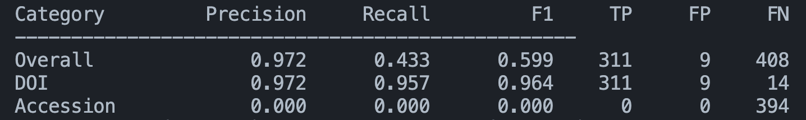
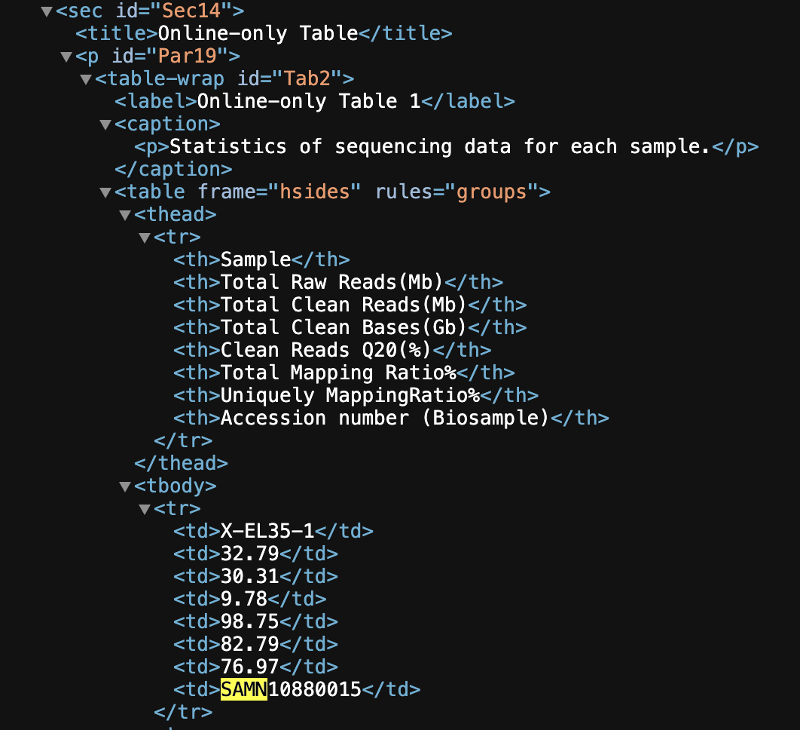

# Make Data Count - Finding Data References

> 主题：nlp ｜ 子类：document-ai ｜ 领域：科研元数据 ｜ 类别：Research
> 截止：2025-09-09 ｜ 队伍数：1282 ｜ 机制：代码赛 ｜ 指标：数据集引用检测 + 类型分类
> 数据来源：`intel/make-data-count-finding-data-references/`（80 条主题索引 + 6 篇 write-up 正文）

## 1. 任务与数据

- 预测目标：在科研论文中**检测数据集的提及**（两种形式：DOI 链接与 accession ID），并判断其类型（Primary / Secondary）。
- 数据形态：学术全文 + 实体标注（数据集引用）。
- 构造陷阱：
  - **两种引用形式差异大**（DOI 是 URL 模式，accession ID 是各数据库的编号规则）；
  - 长文档 + 实体稀疏；
  - 类型分类需要上下文语义（该数据集是本文产生还是复用）。

## 2. 方案特征

| 类型 | 说明 |
| --- | --- |
| 两阶段方案 | 先做**引用检测**（是否提及数据集），再做**类型分类**（Primary/Secondary） |
| 规则 + 模型结合 | DOI/accession 的模式规整，可用正则先召回，再由模型判定与消歧 |

## 3. 关键技巧

- **任务分解**：检测与分类分开（各自的特征与阈值不同）。
- **规则召回 + 模型判定**（结构化模式用规则，语义判断用模型）。
- **长文档切分与实体边界**处理。

## 4. 可迁移性评估

- **可直接迁移**：
  - 实体抽取任务的"检测 → 分类"两阶段；
  - 规则（模式匹配）与模型的分工；
  - 长文档中的稀疏实体处理。
- 需要前提：文档解析与 NER 技术栈。
- 不建议照搬：端到端一把抓（两类引用的特征差异太大）。

## 5. 对新手的关键启示

1. **同一"实体"的多种形式要分别处理**（DOI vs accession ID）。
2. **规则与模型不是对立的**：结构化部分交规则，语义部分交模型。
3. 与 PII Detection、AI4Code 对照：**文档实体类任务的标准套路 = 分解 + 规则兜底**。

## 6. 轻读结论（2026-10 补）

**一句话**：先逆推标注产线再动手——标签由 **MDC 数据引用语料 + Europe PMC NER + DataCite 映射**生成，复用同源上游语料即可拿到近 100% 召回（2nd 的 DOI 阶段 1 F1 **0.964**）；自研 NER/正则是典型时间陷阱（1st/4th 明确复盘）。

- 1st（61 票）：DOI=元数据 CatBoost（标题/作者相似度，OOF 0.87）；accession=Qwen2.5-Coder-32B 0-shot + 家族多数票；有 DOI 的文章不再出 ACC；最终 pub 0.890 / priv 0.797，全流程 29 分钟。
- 2nd（29 票）：DCC v2 + DataCite dump；剔除 Missing 仓库、只留文中出现者；**online-only table 规则 +0.003/+0.004**；纯规则+启发式即 0.869/0.739（无模型也能金）。
- 4th：tool-calling agent 从 Europe PMC 合成标签预热 Qwen 再微调；每篇 mention 上限 24；EMA；家族直判加速。
- 9th：accession 用"deposit/submit 动词 + 嵌入相似度 0.667"规则（覆盖 95% 正例）；区间写法的 id 全删；DOI 走 Qwen 四步。

**裁决**：候选抽取靠"复现上游管线 + 文中存在性过滤"，类型分类才是建模问题；DOI 与 accession 必须走不同管线；按文章分组验证、剔除稀疏标注文章。

**悬案**：3rd/6th–8th 方案缺失；官方标签质量（社区测 F1 仅 0.446）无官方回应；家族白名单的量化选择过程缺失。

## 7. 图表证据

**图 1**（topic 606786）：DOI 阶段 1 验证表——P 0.972 / R 0.957 / **F1 0.964**，证明"上游语料 + 文中存在性过滤"已近上限。

**图 2**（topic 606786）：XML 中 "Online-only Table" 含 SAMN 编号——对应 25 个假阳性；据此加规则 +0.003 pub / +0.004 priv。

## 8. 出处

- 讨论区索引：`intel/make-data-count-finding-data-references/topics.md`（80 条）
- 已收录 write-up（6 篇）：
  - 1st（61 票）：https://www.kaggle.com/competitions/make-data-count-finding-data-references/discussion/606853
  - 2nd（29 票）：https://www.kaggle.com/competitions/make-data-count-finding-data-references/discussion/606786
  - 5th（46 票）：https://www.kaggle.com/competitions/make-data-count-finding-data-references/discussion/606769
  - 4th：https://www.kaggle.com/competitions/make-data-count-finding-data-references/discussion/606921
  - 9th：https://www.kaggle.com/competitions/make-data-count-finding-data-references/discussion/606743
  - 手工重标数据（标签质量）：https://www.kaggle.com/competitions/make-data-count-finding-data-references/discussion/586075
- 轻读全本：`analysis/deep/make-data-count-finding-data-references.md`（Tier B 轻读：对照矩阵/裁决/证据分级/悬案 + 2 图证）
