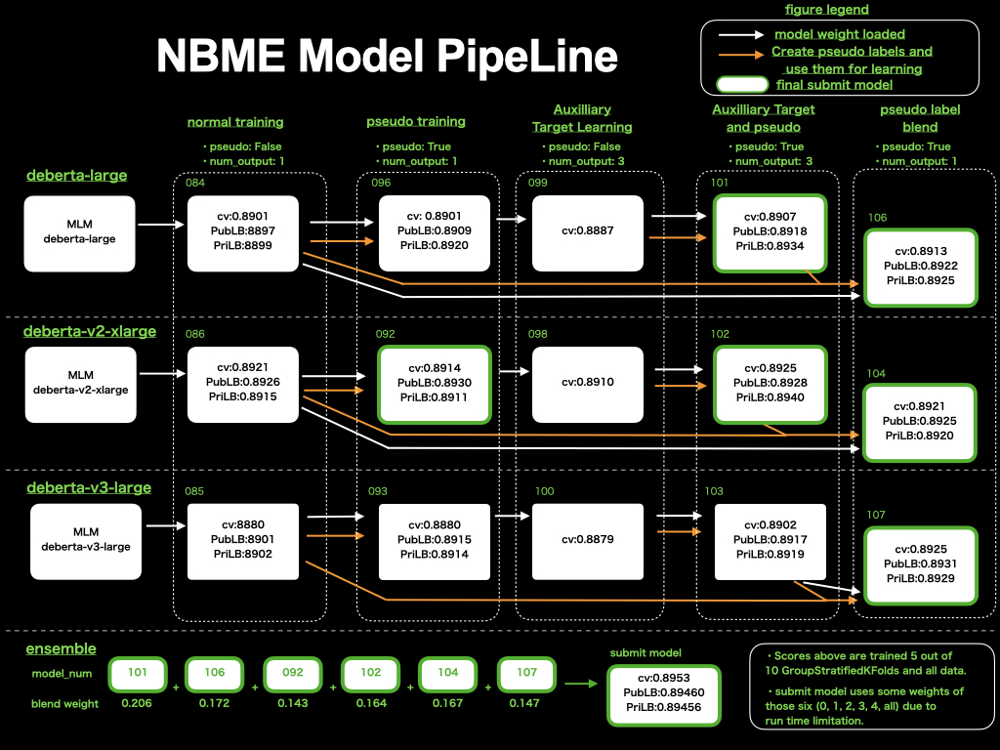

# NBME - Score Clinical Patient Notes

> 主题：nlp ｜ 子类：— ｜ 领域：医疗文本 ｜ 类别：Featured
> 截止：2022-XX-XX ｜ 队伍数：1500+ ｜ 机制：代码赛 ｜ 指标：微平均 F1（跨度抽取）
> 数据来源：`intel/nbme-score-clinical-patient-notes/`（80 条主题索引 + 6 篇 write-up 正文）

## 1. 任务与数据

- 预测目标：在临床病历文本中**抽取出对应"病例特征"的关键短语**（token 分类 / 跨度抽取）。
- 数据形态：**无标注数据是有标注数据的 10 倍**——2nd 明确说"这是本场最有意思的地方"，为半监督方法提供了空间。
- 构造陷阱：
  - **标注不一致**（2nd 与 4th 都指出注释质量参差）；
  - 不同病例（case_num）的跨度分布差异大 → 需要**分病例阈值**。

## 2. 方案谱系

| 方案 | 名次 | 关键点 |
| --- | --- | --- |
| 1st 方案 | 1st | 见讨论区 |
| 半监督 + 无标注数据利用 | 2nd | 强调 10 倍无标注数据是核心资源；指出标注不一致问题 |
| Meta Pseudo Labels + 知识蒸馏 | 3rd | 用元伪标签与蒸馏提升小样本表现 |
| 4 个 token 分类模型集成 + 分病例阈值 + 后处理 | 4th | DeBERTa-v3-large 4 折、MLM(0.15) 中间预训练、SmoothFocalLoss、两轮伪标签 |

## 3. 关键技巧

- **无标注数据是主要杠杆**：MLM 中间预训练 + 多轮伪标签（4th 用了两轮）。
- **分病例（case_num）设定阈值**：不同病例的最优阈值不同，统一阈值会损失分数。
- **后处理**：跨度合并、边界修正。
- **损失函数**：SmoothFocalLoss 处理类别不平衡。
- **面对噪声标注**：用伪标签与集成降低单点标注错误的影响。

## 4. 可迁移性评估

- **可直接迁移**：
  - **无标注数据 ≫ 有标注数据时，半监督是首要方向**（MLM + 伪标签）。
  - **按子群分别设阈值**（分病例/分机构/分设备）。
  - 跨度任务的后处理（合并、边界）。
- 需要前提：MLM 中间训练与伪标签需要额外算力；

  需要按子群统计样本量。
- 不建议照搬：全局统一阈值。

## 5. 对新手的关键启示

1. **先看有/无标注数据的比例**：比例悬殊时，半监督的收益通常大于换模型。
2. **阈值要分群设**（本场按病例，其他场景可按机构/品类）。
3. 与 PII Detection、Feedback 系列对照：**长文本/跨度任务的后处理是必备环节**。

## 6. 轻读结论（2026-10 补）

**一句话**：医疗文本 span 抽取——**DeBERTa 家族 + 任务 MLM + 软伪标 + AWP + 逐 case 阈值/空格后处理**；核心洞察是"模仿标注者的不一致，而不是修正它"。

- 1st（128 票）：6 个 DeBERTa 集成；每模型 MLM+伪标（90% 伪标/10% 真标、软标签）+AWP（+0.002）+去句增广+start/end 辅助通道；10 折 **GroupStratifiedKFold**；集成权重 0.206/0.172/0.143/0.164/0.167/0.147 → 私 0.8946（图 1）。
- 2nd（174 票）：标注者漏标重复出现 → 序列依赖；全小写、缩写归一；**tokenizer 边界分析 + 空格后处理**。
- 4th（126 票）：4 模型 + 逐 case_num 阈值 + PP；2–4 轮伪标；最好私榜是 3 token+1 char 集成但未选中。
- 3rd：Meta Pseudo Labels + KD、I/B/E 多标签、SWA、字符级混合、特征时长过滤。

**裁决**：半监督是入场券；噪声标注顺着建模；PP 必须；CV 按患者/病例分组；软标签优于硬标签。

**失败学**：句子 shuffle、label smoothing、clip_grad_norm（1st）。

**悬案**：5th–19th 未收录；Tokenization Analysis（127 票）未入库。

## 7. 图表证据

**图 1**（topic 323095）：3 骨干 × 4 阶段 → pseudo label blend，含集成权重与最终 CV/公私分数。

## 8. 出处

- 讨论区索引：`intel/nbme-score-clinical-patient-notes/topics.md`（80 条）
- 已收录 write-up（6 篇）：
  - 1st（128 票）：https://www.kaggle.com/competitions/nbme-score-clinical-patient-notes/discussion/323095
  - 2nd（174 票）：https://www.kaggle.com/competitions/nbme-score-clinical-patient-notes/discussion/323085
  - 3rd（72 票）：https://www.kaggle.com/competitions/nbme-score-clinical-patient-notes/discussion/322832
  - 4th（126 票）：https://www.kaggle.com/competitions/nbme-score-clinical-patient-notes/discussion/322799
  - 20th（73 票）：https://www.kaggle.com/competitions/nbme-score-clinical-patient-notes/discussion/323094
- 轻读全本：`analysis/deep/nbme-score-clinical-patient-notes.md`（Tier B 轻读：对照矩阵/裁决/证据分级/悬案 + 1 图证）
