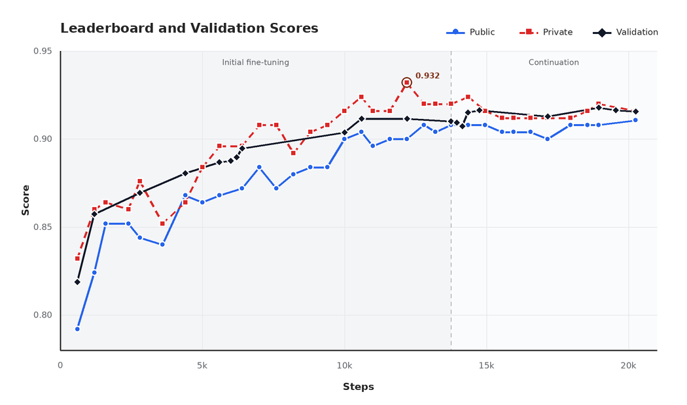
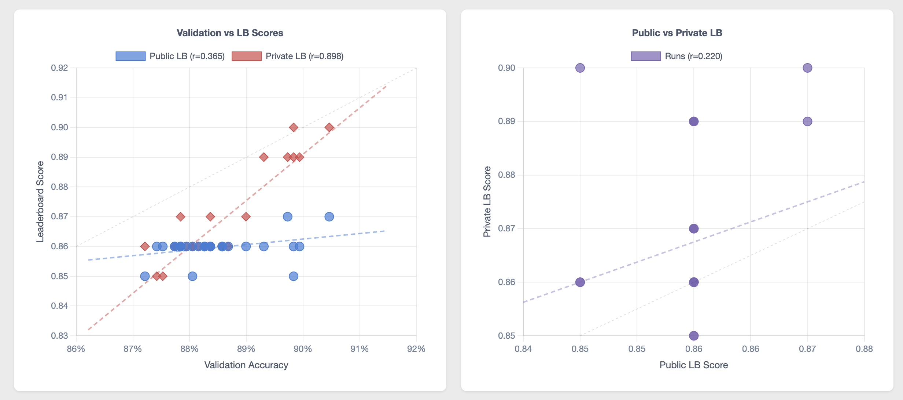
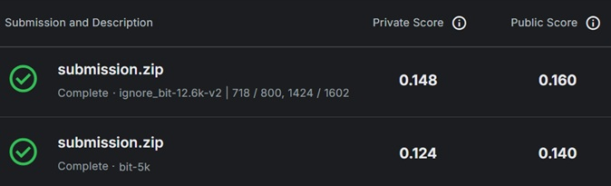
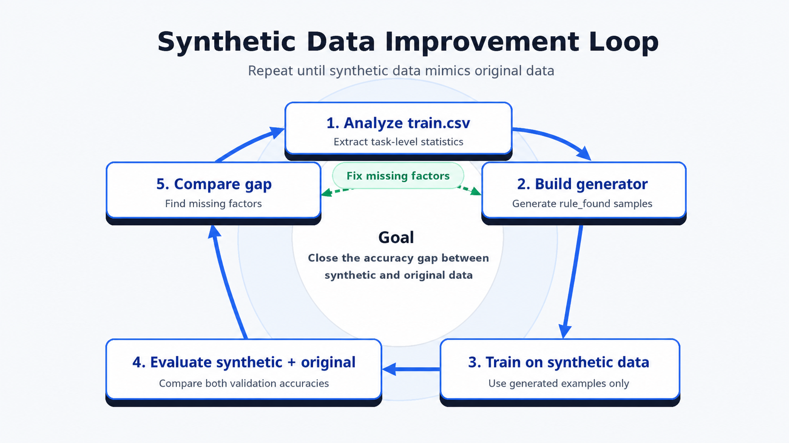

# NVIDIA - Nemotron Model Reasoning Challenge

> 主题：nlp（推理/CoT 蒸馏）｜ 子类：reasoning ｜ 领域：推理 ｜ 类别：Featured
> 截止：2026-06-15 ｜ 队伍数：4185 ｜ 机制：标准赛 ｜ 指标：NVIDIA Nemotron Metric（答案解出率；数值容差 1e-2）
> 数据来源：`intel/nvidia-nemotron-model-reasoning-challenge/`（120 条主题索引 + 8 篇 write-up 正文 + 进度奖正文；深读升级 2026-10-03，Tier A #48）

## 1. 任务与数据

- 预测目标：提升 **Nemotron-3-Nano-30B**（30B MoE，3B 激活）的推理——每题给若干输入-输出示例，推断隐藏变换并应用到 query。
- 机制：只能提交 **rank≤32 的 LoRA**；评测 vLLM、temp=0、max_tokens=**7680**、答案在 `\boxed{}`；**评测时不能运行程序**——所有计算必须在 CoT 里。
- 数据：9 类 9,500 题（bit 1602/cipher 1576/cryptarithm 823/equation 732/gravity 1597/numeral 1576/unit 1594）。
- 构造陷阱：
  - 长尾类别：bit+crypt 最difficult，头部差距集中于此；
  - CoT 必须在 token 预算内"可展开"；
  - 训练框架与提交格式的 LoRA 映射差异（SVD/专家/格式）；
  - 测试集小、public LB 有 0.86 墙、私榜波动大 → 验证纪律决定名次。

## 2. 验证方案

| 方案 | 使用者 | 说明 |
| --- | --- | --- |
| 10% 分层 holdout（954 题） | 3rd | validation↔private r=0.898、↔public r=0.365 |
| 合成数据 + train 全量验证 | 2nd | 自己生成全部训练数据，用 train.csv 当验证 |
| 逐域 LB 探针（dummy 其他域） | 公 2/私 6 | 其他域输出 `I will ignore this problem` → 纯单域信号 |
| 950 holdout + 按 validation 选提交 | 10th | 公 0.860/私 0.880 优于按公榜选 0.872/0.852 |
| 15% 划分 + LB 平均 | 1st | public 波动大，同一 checkpoint 多次提交取平均 |

## 3. 方案谱系

| 方案 | 名次 | 关键点与数字 |
| --- | --- | --- |
| 进度奖：确定性 CoT + min-logprob 目标 | huikang（241 票） | CoT 六原则；目标解出率 87.7%→实测 85%；只 SFT；成本 ~$282；Tinker 适配器转换（SVD 损失 25%） |
| 签名目录 + DFS | 1st（140 票） | cryptarithm **4205 签名目录**+DFS → 公 0.89/私 0.908；bit HEX 压缩+修复+extra training → **公 0.91/私 0.920**（未选 0.932）；890M+590M tokens |
| 简单 CE + bit 深度 | 2nd | bit 合成 0.9906 vs LoRA 0.9732；Tinker→Megatron bit **0.81→0.89**；57.6k 例/EP=4/per-expert LoRA |
| 两阶段（记忆→执行） | 3rd | 同数据 12K：直接 12/17 vs 两阶段 **16/17**（私 0.888→0.900）；stage1 记忆 drills |
| 纯确定性老师 | 10th | oracle 覆盖 90.6% → 模型≈oracle；公 0.860/私 0.880；排除失败轨迹降分 |
| 确定性求解器→可学习轨迹 | 18th | trace 原则：短/局部/无隐藏计算；最大错误=无本地验证；合成数据被 public 误导放弃 |
| 不改 reasoner | 88th | reasoner 87.8%——目标"别丢可解题"；合成数据改进闭环 |
| bit 字符串匹配+回溯 | 7th | bit >96%；**单 bit tokenization + dynamic loss masking** |

## 4. 关键技巧

- **确定性求解器生成 CoT + 标准 LoRA SFT**（全员）；评测 temp=0 → 策略已知时 SFT 足够，RL 无必要。
- **CoT 设计六原则**：deterministic / simple（每步尽可能小）/ coverage（覆盖稀有操作）/ within-limit / tokenization-aware / generalizable。
- **min-logprob 目标**：最大化轨迹最弱 token 的 logprob（阈值 ~0.69），保证贪心复现。
- **记忆 vs 计算**：不可展开的搜索 → 背有限中间结构（4205 签名目录、bit 模板/规则表），再用 DFS/一致性检查执行。
- **token 预算工程**：HEX 列压缩、单 bit token、避免重复计算交换律、只搜索必要规则。
- **训练-服务对齐**：LoRA 格式（专家融合、gate/x SVD、key 前缀、QKV 交错）要端到端验证；Tinker SVD 损失吃掉 ~0.08 bit 精度。
- **小测试集纪律**：分层 holdout、逐域 dummy 探针、按 validation 选提交；public LB 0.86 墙不可信。
- **失败/猜测模式保留**：guess 类题没有唯一解，训练"信息不足时按先验下注"。
- **两阶段（可选）**：stage1 记忆模式（drills）→ stage2 学执行；对 cryptarithm 有效。

## 5. 可迁移性评估

- 可直接迁移：确定性求解器+CoT 蒸馏；CoT 六原则；记忆/计算边界；min-logprob 检查；token 预算工程；训练-服务对齐审计；小测试集验证纪律与域探针。
- 需要前提：任务可由代码求解；评测禁止执行程序；输出可控制在 token 预算内；可训练 LoRA 的基座。
- 不建议照搬：RL/大模型蒸馏（策略已知时）、复杂损失/课程/LoRA merge、跳过本地验证。

## 6. 对新手的关键启示

1. 先写出能 100% 解题的确定性程序，再考虑"怎么把它翻译成模型能模仿的轨迹"。
2. CoT 的目标是"可被贪心复现的最弱 token 也稳"，而不是展示解法；用逐 token logprob 找脆弱点。
3. 不可能逐步展开的搜索，让模型背"有限中间结构"（目录/模板），再执行小步骤。
4. LoRA 的训练格式与部署格式必须一致；转换损失会悄悄吃掉分数。
5. 小测试集里 public LB 可能几乎随机；建本地验证、用域探针、按 validation 选提交。

## 7. 深读结论（2026-10 补）

**一句话**：这是一场"用代码写出最优策略、再把它蒸馏进小模型"的比赛——简单 SFT + 精心设计的 CoT 打败了 RL、复杂损失与更大模型蒸馏。

**跨方案裁决**：

- 全员主路线：确定性求解器 → CoT → SFT；标准 CE 足够（2nd/10th 的对照）。
- CoT 可学习性 > 求解器正确性（18th/10th/88th/huikang）。
- 记忆 vs 计算：不背答案，但背可复用中间结构（4205 签名目录；3rd 的两阶段）。
- 训练-服务对齐即分数（Tinker SVD 0.81→0.89；QKV bug）。
- 验证纪律：validation↔private r=0.898 vs public r=0.365；按 validation 选提交。
- 长尾类别（bit/crypt）决定名次；先修覆盖率再修可学习性。

**数字账精选**：1st 4205 签名/0.91/0.920/未选 0.932；2nd bit 0.9906 vs 0.9732、后端 0.81→0.89；3rd 12/17 vs 16/17、私 0.888→0.900；10th oracle 90.6%、公 0.860/私 0.880；进度奖 85%、~$282、7680 token。

**失败学**：focal/reweight/multi-stage（2nd）；curriculum/两阶段/3× priority/排除失败轨迹/LoRA merge/seed soup（10th）；Tinker SVD/QKV bug（infra）；无本地验证与合成数据过早放弃（18th）；crypt 覆盖不足（多数队）。

**悬案**："Answers To Everything 100% Solve Rate"（688461）未收录；97.2% gold-conditioned solver（698293）与数据幻觉质疑（684192）未收录；bit 详解（690307）未收录。

## 8. 图表证据

> 路径相对本文件（`notes/nlp/`）：`../../intel/nvidia-nemotron-model-reasoning-challenge/bodies/<topic>_img/NN.ext`

**图 1：1st 的分数曲线（topic 709231）**

- Public/Private/Validation 随步数上升；未选中的私榜峰 **0.932**；
- public 低于 private 且更平——选提交要靠 validation。

**图 2：验证相关性（topic 709136）**

- Validation↔Private r=0.898、↔Public r=0.365；Public↔Private r=0.220；
- 本地验证是唯一可靠信号。

**图 3：域探针（topic 709120）**

- 其他域 dummy、只让 bit 域真做（0.148/0.160 vs 对照 0.124/0.140）；
- 小测试集下把 public LB 变成单域测量仪。

**图 4：合成数据闭环（topic 708539）**

- 分析→生成→训练→对比→修缺失因子，循环直到合成分布逼近真实；
- 合成题生成是收敛过程，而非一次性工作。

## 9. 出处

- 讨论区索引：`intel/nvidia-nemotron-model-reasoning-challenge/topics.md`（120 条）
- 已收录 write-up（8 篇 + 进度奖）：
  - 进度奖（huikang，241 票）：https://www.kaggle.com/competitions/nvidia-nemotron-model-reasoning-challenge/discussion/689915
  - 1st（140 票）：https://www.kaggle.com/competitions/nvidia-nemotron-model-reasoning-challenge/discussion/709231
  - 2nd：https://www.kaggle.com/competitions/nvidia-nemotron-model-reasoning-challenge/discussion/711703
  - 3rd：https://www.kaggle.com/competitions/nvidia-nemotron-model-reasoning-challenge/discussion/709136
  - 18th：https://www.kaggle.com/competitions/nvidia-nemotron-model-reasoning-challenge/discussion/715330
  - 10th：https://www.kaggle.com/competitions/nvidia-nemotron-model-reasoning-challenge/discussion/708535
  - 公 2/私 6：https://www.kaggle.com/competitions/nvidia-nemotron-model-reasoning-challenge/discussion/709120
  - 88th：https://www.kaggle.com/competitions/nvidia-nemotron-model-reasoning-challenge/discussion/708539
  - 7th：https://www.kaggle.com/competitions/nvidia-nemotron-model-reasoning-challenge/discussion/712395
- 深读全本：`analysis/deep/nvidia-nemotron-model-reasoning-challenge.md`（11 组件 + 4 图证）
- 缺口登记：690307、688461、684212、690161、684283、681745、698293、684192 未收录正文
