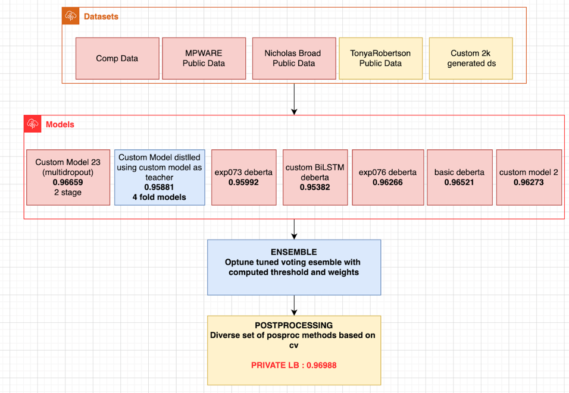

# PII Detection - Removal from Educational Data

> 主题：nlp（NER/PII 检测）｜ 子类：— ｜ 领域：教育（隐私合规）｜ 类别：Featured
> 截止：2024-04-23 ｜ 队伍数：2048 ｜ 机制：代码赛 ｜ 指标：TLAL F-beta（token 级，13 类 PII，偏向召回）
> 数据来源：`intel/pii-detection-removal-from-educational-data/`（120 条主题索引 + 8 篇 write-up 正文；深读升级 2026-10-03，Tier A #50，Batch 5 收官）

## 1. 任务与数据

- 预测目标：在学生写作文本中检测 13 类 PII（NAME_STUDENT/EMAIL/PHONE/ID/STREET/USERNAME/URL_PERSONAL 等），token 分类。
- 数据形态：数千级带 token 级标注的文本；**13 类长尾 PII**；指标 F-beta 偏向召回（漏检代价高）。
- 构造陷阱：
  - 真实文本中稀有 PII 类别样本极少 → 必须合成；
  - token↔spacy 对齐（空白/Unicode/换行）易错且静默掉分；
  - B-/I- 是标注约定而非数据 → 学习它们浪费容量；
  - 长文本训练/推理长度需要分开设计；stride 训练有害。

## 2. 验证方案

| 方案 | 使用者 | 说明 |
| --- | --- | --- |
| 5 折按文档 %4 / 分层 PII 有无 | 1st/4th | OOF 只在竞赛数据上算；避免过拟合 |
| 4 折 + 分层 | 4th | 多标签分层失败；文档 %4 方差大 |
| 全量训练 + 外数据权重 | 2nd/5th | nbroad 数据权重 0.5；外部数据作增强 |
| OOF 错误分析驱动后处理 | 1st/9th | 后处理规则全部来自 OOF 错误模式 |

## 3. 方案谱系

| 方案 | 名次 | 关键点与数字 |
| --- | --- | --- |
| 多源数据 + 多架构 Deberta + Optuna 投票 + 后处理 | 1st（99 票） | 5 数据源；multi-dropout/BiLSTM/KD（+0.005–0.01）；maxlen 1600–2048；o_weight 0.05；7 组 10 模型 Optuna 权重；私 **0.96988** |
| 预切分子串 + 7 类 + 后处理 | 2nd（57 票） | is_split_into_words；去 B-/I-；6×deberta-v3-large（512/1024/2048、stride 32）；nbroad 权重 0.5；名称传播/换行修复/O 缩放 0.02–0.03 |
| Llama3-70B 合成数据 + 10 Deberta | 4th | **自产 ~4,600 样本（Llama3 最佳）；单模型 > 最佳集成**；focal loss + BiLSTM/GRU；训练 1280 → 推理 4000/stride 1024；[SPACE]+unidecode |
| 12 模型 maxlen 多样 + 简单投票 | 5th | 成员 128/512/1536；私榜偏好长 maxlen；O:非O=1:10；位置特征/EMA/冻结首 epoch；简单投票最优 |
| v2-xlarge LoRA + v3-large + 规则后处理 | 9th（68 票） | 字符级映射对齐不同 tokenizer；手动修正 ~30 处标签；每 epoch 轮换姓名 |
| 三阶段级联 + 蒸馏 | 效率方案 | RNN 过滤→mini-attn→v3-xsmall：**0.955 / 8 分钟** |
| 外部数据影响 / Mixtral 数据 | 社区（169/134 票） | 三套数据各自强提升；Mixtral 2,355 篇 **0.854→0.888** |

## 4. 关键技巧

- **合成数据管线**：persona（姓名/年龄/职业/性格）+ 场景 prompt + Faker 注入合法 PII 格式 + 假阳性样本改写（导师名/虚构角色/冠词引导）。
- **标签简化**：去掉 B-/I-（规则重建）；空白 token 被 tokenizer 忽略 → 默认 O；`\n` 强制 STREET_ADDRESS。
- **长度策略**：训练 512–2048 定表示；推理 2048–4096 + stride 32/1024 定覆盖；**stride 训练有害**。
- **稀有类加权**：o_weight 0.05 / 非 O×5–10 / focal loss——匹配 F-beta 召回方向。
- **后处理清单**：逐标签阈值；NAME_STUDENT 标题化/禁数字；文档级同名传播；PHONE≥9 位→ID；`\n` 修复；URL/EMAIL 格式校验；称谓词（dr/mr）剔除；B 修复。
- **集成**：简单投票（5th）或 Optuna 权重投票（1st，7 组 10 模型）；多架构/多长度/多数据提供多样性。
- **工程细节**：AMP 推理提速；[SPACE] 替换 `.isspace()` 串；unidecode 归一；save_safetensors=False 防 BiLSTM NaN；动态 micro-batch。
- **效率**：级联 + 蒸馏（0.955/8min），适合生产部署。

## 5. 可迁移性评估

- 可直接迁移：定向合成数据（长尾标签）；标签语义简化 + 规则重建；训练/推理长度分离；O 降权/focal；规则后处理清单；对齐回归测试；效率级联蒸馏。
- 需要前提：PII 格式可由 Faker 模拟；token 级标注对齐可得；可用的社区/自产外部数据。
- 不建议照搬：只用真实数据硬训；训练端 stride/超长；单标签模型；把 B-/I- 当数据特征学。

## 6. 对新手的关键启示

1. 长尾标签空间先做"定向合成"，把稀有类样本配额补足——本场社区数据直接把公榜从 0.854 推到 0.888。
2. 标签里的"约定信息"（B-/I-、格式）交给规则，模型只学语义分类。
3. 训练长度与推理长度分开调：推理端加长/重叠是低风险涨分。
4. 后处理规则从 OOF 错误模式里长出来，收益常大于加模型。
5. 分词对齐是大坑：选定策略 + 写测试，别让静默错位吞分数。

## 7. 深读结论（2026-10 补）

**一句话**：这是一场"合成数据 + 对齐细节 + 规则后处理"的 PII 检测赛——DeBERTa 是标配，数据与规则工程决定名次。

**跨方案裁决**：

- 外部/合成数据是主杠杆（4th 单数据模型 > 最佳集成；Mixtral 数据 +0.034）。
- 去 B-/I-、只学 7 类 + 规则重建是共识简化。
- 训练长度定表示、推理长度+stride 定覆盖；stride 训练有害。
- 规则后处理是分数关键（逐标签阈值/文档传播/格式约束）。
- 稀有类加权全队同向（F-beta 召回）。
- 集成：常态简单投票；数据质量跃迁时单模型可反超。

**数字账精选**：外数据 0.854→0.888；1st 私 0.96988（KD +0.005–0.01）；5th 成员私 0.960–0.967；4th 训练 1280→推理 4000/stride 1024（stride 限 0.967）；效率 0.955/8min。

**失败学**：MLM 预训练/冻结层/stride/CausalLM/Longformer/单标签模型/测试伪标（1st）；二阶段 FP 模型/AWP/标签平滑/GRU（5th）；Longformer/Gemma/预训练/BERT-XGB 后处理（4th）；对齐调试耗时（9th）。

**悬案**：473011 截断帖未收录；H2O LLM NER 路线（481135）未收录；1st 后处理各规则的独立消融未给；4th 的 Llama3 数据完整对照缺失。

## 8. 图表证据

> 路径相对本文件（`notes/nlp/`）：`../../intel/pii-detection-removal-from-educational-data/bodies/<topic>_img/NN.png`

**图 1：1st 的三段式总览（topic 497374）**

- 数据侧 5 来源（Comp/MPWARE/Nicholas Broad/TonyaRobertson/自产 2k）；
- 模型侧 6 类 Deberta（multi-dropout 0.96659、KD 0.95881、BiLSTM 0.95382 等）→ **Optuna 权重投票 → 多方法后处理 → 私榜 0.96988**。

*（本场归档图片仅此 1 张可用。）*

## 9. 出处

- 讨论区索引：`intel/pii-detection-removal-from-educational-data/topics.md`（120 条）
- 已收录 write-up（8 篇）：
  - 外部数据影响（169 票）：https://www.kaggle.com/competitions/pii-detection-removal-from-educational-data/discussion/473139
  - Mixtral 数据（134 票）：https://www.kaggle.com/competitions/pii-detection-removal-from-educational-data/discussion/472221
  - 1st（99 票）：https://www.kaggle.com/competitions/pii-detection-removal-from-educational-data/discussion/497374
  - 4th：https://www.kaggle.com/competitions/pii-detection-removal-from-educational-data/discussion/497367
  - 2nd（57 票）：https://www.kaggle.com/competitions/pii-detection-removal-from-educational-data/discussion/497352
  - 5th：https://www.kaggle.com/competitions/pii-detection-removal-from-educational-data/discussion/497306
  - 9th（68 票）：https://www.kaggle.com/competitions/pii-detection-removal-from-educational-data/discussion/497177
  - 效率方案：https://www.kaggle.com/competitions/pii-detection-removal-from-educational-data/discussion/497185
- 深读全本：`analysis/deep/pii-detection-removal-from-educational-data.md`（11 组件 + 1 图证）
- 缺口登记：473011、469493、470921、481135、470978、479971、478911 未收录正文
